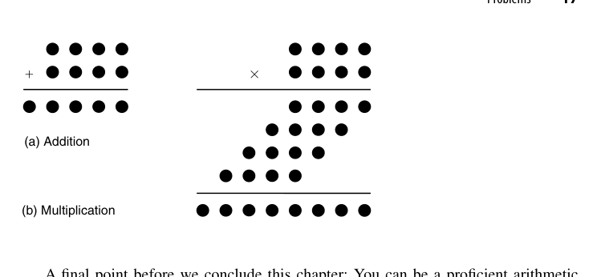

# 第1章 数与算术（Numbers and Arithmetic）

## 本章导读

这一章回答一个看似幼稚、实则深刻的问题：**计算机里的"数"到底是什么？** 我们从小习惯的十进制纸笔算术，到了硅片上必须重新发明一遍——用比特编码、用逻辑门实现、在有限的面积与延迟预算内完成。本章是全书的地图：它告诉你为什么计算机算术（Computer Arithmetic）是一门独立的学科，而不是"把小学算术写成 Verilog"那么简单。

## 1.1 什么是计算机算术？（What is Computer Arithmetic?）

计算机算术研究的是**算术运算的算法与硬件实现之间的映射关系**。同样一个加法，可以是一串行波进位的全加器（慢但省面积），也可以是一棵并行前缀树（快但贵）——数学上完全等价，物理上判若云泥。

换句话说，这一学科的输入是"要算什么"，输出是"用什么电路算、要花多少钱、多久能算完"。它横跨三个层次：最上层是**数的表示**（第 2-4 章），中间层是**运算算法**（第 5-16 章加减乘除开方），最下层是**实现技术**（第 25-28 章流水、低功耗、可重构）。三个层次相互牵制：换了表示，算法就要重写；换了算法，电路结构与时序就得跟着变。

::: {.callout-important title="工程视角"}
做芯片的人常说"算法即结构，结构即性能"。一个算术部件的延迟、面积、功耗，本质上由你选择的**算法**决定，逻辑综合工具能做的优化只是锦上添花。这就是本书反复出现的主线：**先选算法，再谈实现**。
:::

评价一个算术部件，业内有三个公认的度量口径，本书后文会反复拿来比较各种方案：

- **延迟（latency）**：从输入有效到输出有效的时间。早期文献用"门级延迟数"计量，现代设计更常用 FO4（一个反相器驱动四个相同反相器的延迟）或直接的 ps/ns。
- **面积/成本（cost）**：晶体管数、标准单元数，或版图意义上的 $\lambda^2$ 面积。规则性（regularity）往往比纯粹的单元数量更决定实际面积，因为布线拥塞会吃掉大量硅片。
- **功耗/能耗（power/energy）**：动态功耗 $\propto C V^2 f$，算术部件的功耗大头往往不是有用的计算，而是**毛刺（glitch）**与冗余翻转（第 26 章会专门讨论）。

三者构成一个不可能三角：想延迟低就得并行铺硬件，面积和功耗跟着涨；想面积小就串行复用，延迟又上去了。**所有算术设计，本质上都是在这个三角里挑一个点。**

几个贯穿全书的核心矛盾在本章就已埋下伏笔：

- **延迟 vs. 面积**：串行（bit-serial）方案用 1 位硬件反复算 $k$ 次；并行方案一次铺开 $k$ 位硬件。这是算术电路设计的第一性权衡。
- **规则性 vs. 性能**：行波进位加法器（ripple-carry adder）结构极其规整、版图友好，但进位链是它的阿喀琉斯之踵。
- **精确性 vs. 成本**：浮点运算的舍入（rounding）让"正确"本身变成一种需要精心设计的行为。

## 1.2 动机实例（Motivating Examples）

原书用几个著名的工程事故说明"算术出错，代价惨重"。这些都是业界公开的经典案例：

- **Pentium FDIV 缺陷（1994）**：Intel 早期 Pentium 处理器的浮点除法查找表中有 5 个条目漏填，导致特定操作数下除法结果精度受损，最终 Intel 召回处理器，损失约 4.75 亿美元。它直接催生了形式验证（formal verification）在算术单元验证中的大规模应用。
- **Ariane 5 首飞爆炸（1996）**：火箭惯性参考系统将 64 位浮点速度值转换为 16 位有符号整数时发生溢出（overflow），控制计算机崩溃，火箭升空 37 秒后解体。**数制转换与表示范围**不是细枝末节，是性命攸关。
- **爱国者导弹时钟漂移（1991）**：内部时钟用 0.1 秒的近似二进制小数累加计时，连续运行约 100 小时后累计误差约 0.34 秒，导致拦截窗口计算错误。**有限精度表示的舍入误差会随时间累积**——这是第 19 章误差分析要系统处理的问题。

把这三个案例放在一起看，会发现它们恰好是三类**不同性质**的错误，而不是同一个错误的三种说法：

1. **实现错误**（Pentium）：算法正确、规格正确，只是硬件里的常数表填错了。这类问题靠**形式验证与穷举/定向测试**来抓，也促使业界把 SRT 除法表之类"手写常数"纳入严格的等价性检查流程。
2. **范围错误**（Ariane 5）：数据本身没错，错在把大动态范围的量搬进了窄容器。这是**表示与接口规格**问题——那段转换代码在 Ariane 4 上永远不会溢出，换到更快的 Ariane 5 上就爆了。复用代码时"物理量变了但位宽没变"是极常见的坑。
3. **累积误差**（爱国者）：每一步的舍入都微不足道，但 $10^6$ 步之后就不可忽略。这是**数值分析的范畴**，需要在算法设计阶段就给出误差界，而不是事后调精度。

::: {.callout-tip title="解读"}
这三个事故恰好对应本书的三大主题：**验证**（实现要对）、**表示**（范围与编码要匹配）、**误差**（有限精度的数学性质要心里有数）。读后续章节时不妨时常回想这三个例子。
:::

工程上的一条硬经验：**算术部件的 bug 不会因为"概率很低"而消失**。一个 64 位乘法器的输入空间是 $2^{128}$，随机仿真能覆盖的比例小到荒谬；而 Pentium 那 5 个坏条目，触发概率同样低到几乎测不出来，却真实存在。所以算术验证必须靠**结构化的方法**（分块等价性检查、形式化证明、代数性质的定向激励），而不是靠堆随机测试。

## 1.3 数及其编码（Numbers and Their Encodings）

一个数（number）是抽象的数学对象；它在机器里的比特串只是它的一种**编码（encoding）**。同一个数 25，可以编码为：

| 编码方式 | 比特串 | 说明 |
|---|---|---|
| 二进制原码 | `00011001` | 标准的 positional 编码 |
| BCD（8421 码） | `0010 0101` | 每位十进制数字独立编码，金融系统常用 |
| 独热码（one-hot） | 25 位中只有 1 位为 1 | 极端冗余，状态机编码里能看到它的影子 |

编码的代价会在运算电路里连本带利地还回来。以 BCD 为例：两个 BCD 数字相加，若 4 位二进制和大于 9，就必须**加 6 修正**并产生十进制进位：

$$
\text{若 } s_4 > 9:\quad s \leftarrow s + 6,\quad c_{out} \leftarrow 1
$$

原因在于 4 位二进制的进位发生在 16，而十进制需要它在 10 发生，两者相差 6。于是 BCD 加法器 = 二进制加法器 + 一个"和 > 9"检测电路 + 一个加 6 的多路选择器。对比之下，纯二进制加法器没有这一级修正。**这就是"编码决定运算电路"最直观的注脚。**

::: {.callout-note title="关键概念"}
**编码与运算电路是成对出现的**。选了 BCD 编码，加法器就要处理"逢十进一"的修正逻辑；选了二进制，修正逻辑消失但人机接口要做进制转换。**没有免费的编码**——你省下的每一处硬件，都在别处以复杂度还回来。
:::

同样的道理也适用于**定点小数**：把一个 $k$ 位编码解释为"整数"还是"分数"，硬件完全一样，只是小数点的**约定位置**不同。定点乘法中，两个 $k$ 位小数相乘得到 $2k$ 位结果，其中低 $k$ 位是"多余精度"，通常需要截断或舍入（第 17 章）。硬件不变，语义变了——这也是"数是什么由约定决定"的体现。

原书 Fig. 1.2 用同一组 4 位编码展示了四种完全不同的解释：无符号整数 $[0,15]$、原码有符号整数 $[-7,+7]$（含 $\pm 0$）、3 位整数 + 1 位小数的定点格式（$0$ 到 $7.5$，步长 $0.5$）、以及有符号分数（原码 $[-0.875,+0.875]$，2 的补码 $[-1,+0.875]$）。**同样的 16 个码字，换个解释就是四个不同的数系**——读硬件文档时，先问"这个字段按什么解释"永远是第一步。

## 1.4 定基位置数制（Fixed-Radix Positional Number Systems）

一个 $k$ 位整数、基数（radix）为 $r$ 的位置数制写作：

$$
x = \sum_{i=0}^{k-1} x_i \cdot r^i, \qquad x_i \in \{0, 1, \dots, r-1\}
$$

二进制（$r=2$）统治数字硬件的原因很物理：两个稳定状态（高低电平）最容易可靠制造与区分。但"基数"这个概念远不止二进制：

- **八进制/十六进制**：本质上是二进制的"压缩书写"，3 位/4 位二进制一组，方便人读，不改变硬件本质。
- **十进制硬件**：IBM Power 系列处理器内置了十进制浮点运算单元（DFP），就是为了金融场景"0.1 元不能被二进制精确表示"这类痛点。
- 负基数（negative radix，如 $r=-2$）在数学上自洽且有趣，但工程上没有优势，了解即可。

那么"最优基数"是多少？这是一个可以量化的问题。设要表示的最大数为 $M$，所需位数 $k = \log_r M$；若每一位数字的硬件复杂度大致正比于数字集合的大小 $r$，则总成本

$$
C(r) \propto k\,r = r\log_r M = \frac{r}{\ln r}\,\ln M
$$

对 $r$ 求导：

$$
\frac{d}{dr}\left(\frac{r}{\ln r}\right) = \frac{\ln r - 1}{(\ln r)^2} = 0 \;\Longrightarrow\; r = e \approx 2.718
$$

也就是说，**从纯成本角度，基数取 $e$ 附近最划算，实际就是 2 或 3**（$r/\ln r$ 在 $r=2$ 与 $r=4$ 处都是 2.885，在 $r=3$ 处是 2.731，三者差别不到 6%）。这解释了为什么基数 2 稳坐主流、基数 4 在高基乘法/除法里同样常见（第 10、14 章），而更大的基数（8、16）只在"每次迭代要吞掉更多位"的串行算法里才划算。

::: {.callout-note title="别把结论用过头"}
上面的 $r=e$ 结论建立在"每位成本 $\propto r$"这个很粗的假设上。真实 VLSI 里还要算布线、管脚、时序收敛，所以实践中基数的选择往往由**算法结构**（比如 Booth 重编码天然适配基数 4）而非这条渐近公式决定。公式的价值在于告诉你：不要指望靠提高基数获得数量级的收益。
:::

## 1.5 进制转换（Number Radix Conversion）

进制转换是每次"人机交互"都要做的事。两类基本方法：

**除基取余法（用于整数， radix $r$ → 目标基数 $R$）**：反复用新基数 $R$ 去除，余数从低位到高位依次给出新表示的各位。例如十进制转二进制，就是不断除 2 取余。

**乘基取整法（用于小数）**：反复用 $R$ 去乘小数部分，整数部分从高位到低位依次给出。

举一个本书后面还会遇到的例子——把 $(0.1)_{10}$ 转成二进制：

$$
0.1\times2 = \mathbf{0}.2,\quad 0.2\times2 = \mathbf{0}.4,\quad 0.4\times2 = \mathbf{0}.8,\quad 0.8\times2 = \mathbf{1}.6,\quad 0.6\times2 = \mathbf{1}.2,\ \dots
$$

得到的比特序列是 $0,0,0,1,1,0,0,1,1,\dots$，即

$$
(0.1)_{10} = (0.000\overline{1100})_2
$$

**它永远不会终止**。因为 $0.1 = 1/10 = 1/(2\times5)$，分母含因子 5，而二进制小数只能精确表示分母为 $2^k$ 的分数。一般判据是：

$$
\text{有限十进制小数 } \frac{a}{10^m} \text{ 能被有限二进制表示} \iff \frac{a}{10^m}\cdot 2^{k} \in \mathbb{Z} \text{ 对某个 } k \iff 5^m \mid a
$$

::: {.callout-warning title="工程陷阱"}
**大多数有限十进制小数不能被有限二进制精确表示**（0.1 是最著名的例子）。这意味着进制转换对小数而言通常是**有损的**。做金融、计量相关硬件时，这个性质必须在系统规格阶段就讲清楚，否则就是下一个 Ariane。
:::

硬件上，定点数的进制转换可以用**移位-累加**结构实现：把目标基数 $R$ 的幂次权重预先存好，逐位累加即可，本质是一个小型的乘加阵列。更紧凑的做法是把它写成 Horner（秦九韶）形式，从最高位开始递推：

$$
x = ((\cdots((x_{k-1})\cdot r + x_{k-2})\cdot r + \cdots)\cdot r + x_0)
$$

每步一个"乘 $r$ + 加一位"，正好对应一个移位-加法单元，$k$ 步完成。反过来，当两个基数互为整数次幂时（2 ↔ 8 ↔ 16），转换退化成**纯重分组**，零硬件成本——这就是十六进制只是"书写便利"的原因。

## 1.6 数表示的分类（Classes of Number Representations）

本书把数的表示方法组织成一个分类空间，后续章节逐一展开：

| 类别 | 代表 | 解决的问题 | 代价 |
|---|---|---|---|
| 原码（signed-magnitude） | 第 2 章 | 直观、乘除符号处理简单 | 加法不统一、有 $\pm 0$ |
| 补码（complement） | 第 2 章 | 加减法统一、硬件最简 | 范围不对称、取负可能溢出 |
| 冗余数系（redundant） | 第 3 章 | 消除进位传播，$O(1)$ 加法 | 编码浪费、比较/转换复杂 |
| 剩余数系（RNS） | 第 4 章 | 大数运算通道化、天然并行 | 比较/除法/溢出检测困难 |

这个分类不是任意罗列，而是沿着一条明确的线索推进：**从"一个数一个码"走向"一个数多个码"**。原码和补码都是一一映射（除了 $\pm 0$ 这个小瑕疵），冗余数系和 RNS 则是有意引入多对一映射，用编码空间的浪费换取运算的并行性。理解这一点，后面两章的"怪异"设计就有了统一的解释。

为了在后续章节里直观描述"哪些位参与哪些运算"，本书全程使用**点记号（dot notation）**：用一个圆点表示一个比特（或一个数位），按权重排成阵列，纵向表示不同操作数。原书 Fig. 1.4 给出了基本约定；第 2 章会引入空心点表示负权重位（negabit），第 3 章再扩展到双位、单位等记号。**点记号是本书的"电路图语言"**，读懂它，后面所有乘法阵列、压缩树的图就都能一眼看懂。

::: {.callout-note title="本章小结"}
计算机算术的一切设计都可以追溯到两个选择：**用什么编码表示数**，**用什么算法实现运算**。本章建立了这两个维度的基本词汇表。第 2-4 章把"表示"这个维度讲透，第 5 章起进入"运算"。
:::

## 原书插图

![图 1.2 同一组 4 位编码的四种解释：无符号二进制 $[0,15]$、4 位原码 $[-7,+7]$（含 $\pm0$）、3 位整数加 1 位小数的定点格式（$0$ 到 $7.5$，步长 $0.5$）、有符号分数（原码 $[-0.875,+0.875]$，2 的补码 $[-1,+0.875]$）](images/ch01/fig01_02.png){fig-align="center" width="85%"}

{fig-align="center" width="85%"}
