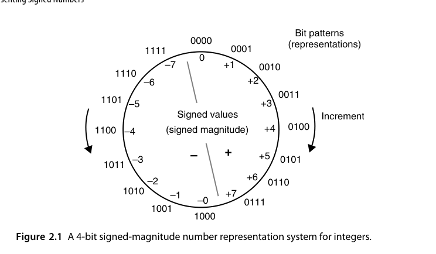
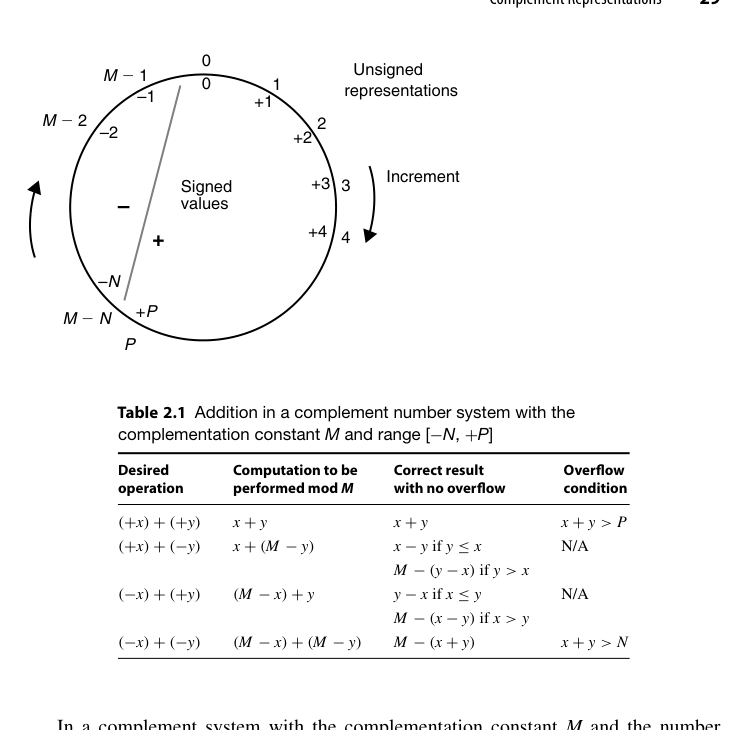
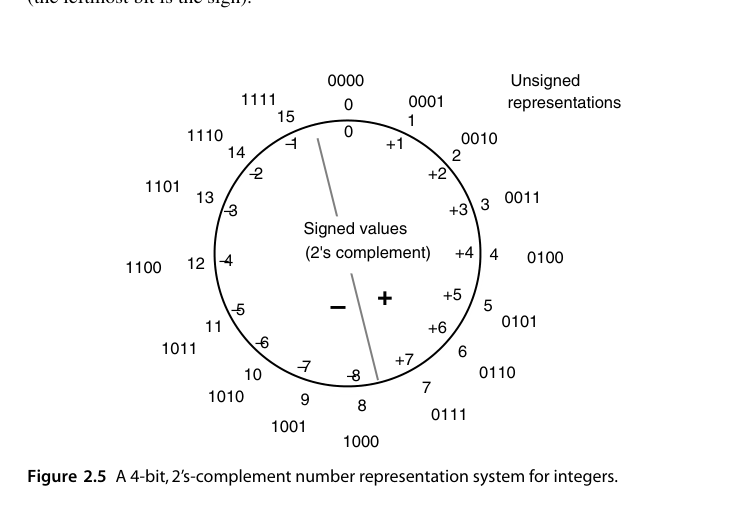
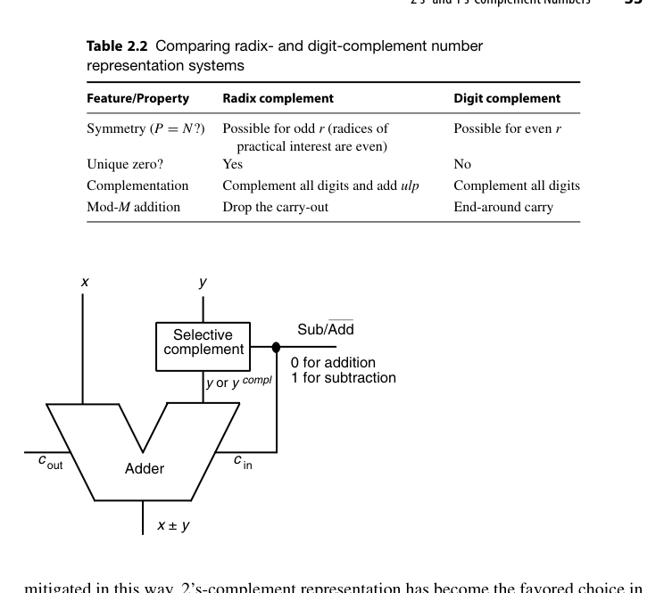
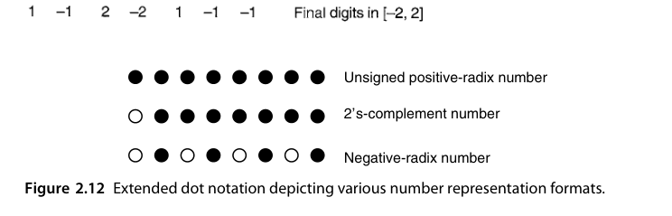
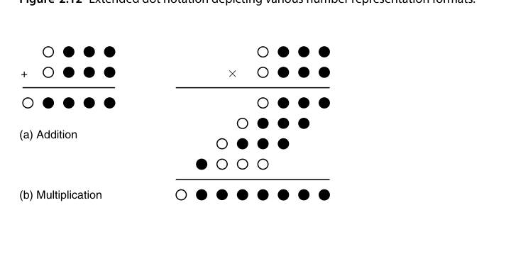
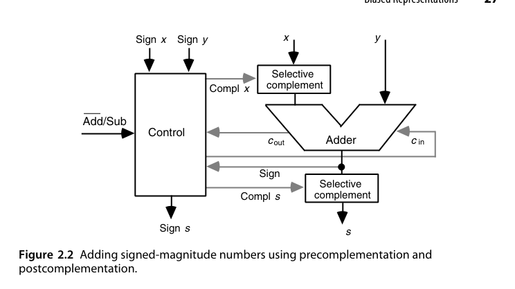
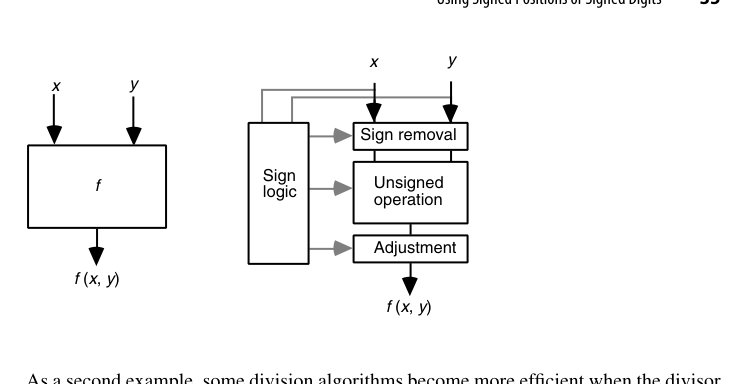

# 第2章 有符号数的表示（Representing Signed Numbers）

## 本章导读

无符号数是"天然"的——比特串就是数值。但一旦要表示负数，就必须做一个**编码约定**。本章对比四种约定：原码、偏置码、补码（1's/2's complement），并引出"带符号数位"的思想（这是第 3 章冗余数系的入口）。**2 的补码（2's complement）之所以一统天下，靠的不是数学美感，而是它让减法器彻底消失**：加法器一套硬件通吃加减。

## 2.1 原码表示（Signed-Magnitude Representation）

最高位做符号位（0 正 1 负），其余位表示绝对值。$k$ 位原码的表示范围是 $[-(2^{k-1}-1),\ +(2^{k-1}-1)]$。

{fig-align="center" width="85%"}

优点：取负只需翻转符号位；乘法/除法的符号处理是天然的"同号得正"。

缺点（硬件工程师的噩梦）：

- **存在两个零**：$+0$ 与 $-0$ 是不同编码，比较逻辑要特判；
- **加减法不统一**：`a + b` 的实际操作取决于两数符号的组合，硬件上要先比较绝对值大小、决定做加还是做减、再定结果符号——一套控制状态机换来一堆关键路径延迟。

原码加法的完整流程通常写成"**预补码 → 无符号运算 → 后补码**"三步（图 2.2）：先把负数操作数按模 $2^{k-1}$ 取补，变成"补码化的幅值"；然后当作无符号数相加；最后根据两数符号决定结果是否要再取补、符号位取什么。这三步看着绕，本质上是**把符号信息从数据通路里剥离出来，交给一条独立的符号逻辑处理**——而这条符号逻辑要在加法结果出来之后才能定夺，正好压在关键路径末端。

::: {.callout-note title="工程视角"}
原码并没有被淘汰——**IEEE 754 浮点数的有效数（significand）部分就是原码表示**。浮点加减法里那套"对阶→比较→加减→规格化"的复杂流程，很大程度上就是在为原码表示还债（见第 18 章）。
:::

一个常被忽略的细节：原码的 $\pm 0$ 不只是"浪费一个码字"。在浮点里，$+0$ 与 $-0$ 是**语义不同**的两个值（$1/0^+ = +\infty$，$1/0^- = -\infty$），IEEE 754 特意规定了它们 equality 成立但符号位不同。所以"两个零"在某些场景下是特性而非缺陷——判断它到底是开销还是收益，要看上层语义。

## 2.2 偏置表示（Biased Representations）

给所有数统一加上一个偏置常数（bias）$B$，把有符号区间平移到无符号区间：

$$
x_{\text{code}} = x + B
$$

典型取 $B = 2^{k-1}$（称为 excess-$2^{k-1}$ 码）。偏置码的一个漂亮性质：**按无符号数比较编码的大小，就等价于比较有符号真值的大小**——比较器免费用无符号的。

![图 2.3 用偏置 8 把区间 $[-8,+7]$ 内的有符号整数编码为 $0\sim15$ 的无符号值](images/ch02/fig02_03.png){fig-align="center" width="85%"}

以 $k=4$、$B=8$ 为例，编码表是 $-8\!\to\!0000$、$-1\!\to\!0111$、$0\!\to\!1000$、$+7\!\to\!1111$。注意这里的符号约定与直觉**相反**：最高位为 0 表示负、为 1 表示非负。这不影响比较器（平移不改变序关系），但会让"看最高位判正负"的直觉失效，读 RTL 时容易踩坑。

$B$ 取 $2^{k-1}$ 还是 $2^{k-1}-1$，是一个小但真实的取舍：

- $B = 2^{k-1}$：最小值对应全 0 码，最大值对应全 1 码，**范围严格不对称**（负数比正数多一个）；
- $B = 2^{k-1}-1$：范围**几乎对称**，且"最高位为 0 表示负"的边界正好落在 0 附近。

::: {.callout-tip title="在哪见过它"}
IEEE 754 的**阶码（exponent）字段就是偏置码**：单精度 bias = 127，双精度 bias = 1023。这样阶码比较可以用普通无符号比较器完成，浮点排序电路因此大大简化。
:::

IEEE 754 还额外规定：阶码全 0 与全 1 被保留给**非规格化数（subnormal）**与 $\pm\infty$/NaN，不参与正常偏置解释。也就是说，实际可用的阶码区间是 $[1, 254]$（单精度），对应真值 $[-126, 127]$。这是"用码字换特殊语义"的典型手法——**每保留一个特殊码字，就少一个可表示的正常值**，规格设计时必须算清楚这笔账。

## 2.3 补码表示（Complement Representations）

补码的核心思想：在模 $M$ 的算术系统里，用 $M - x$ 扮演 $-x$ 的角色。因为

$$
a - b \equiv a + (M - b) \pmod{M}
$$

减法就变成了加法。对 $k$ 位硬件，模 $M = 2^k$ 是"免费"的——寄存器溢出自然丢弃高位，等价于自动取模。这就是**2 的补码（2's complement）**。

{fig-align="center" width="85%"}

这个思想对任意基数都成立。基数 $r$、$k$ 位时有两种补码：

- **基补（radix complement，$r$'s complement）**：$x^\ast = r^k - x$；
- **减基补（diminished radix complement，$(r-1)$'s complement）**：$x^\ast = (r^k - 1) - x$。

二者的关系是 $r\text{'s} = (r-1)\text{'s} + 1$。放到二进制上：1 的补码就是按位取反（因为 $2^k-1$ 是全 1，减去 $x$ 等价于逐位取反），2 的补码则是"取反加 1"。放到十进制上：4 位数的 9 的补码是逐位用 $9$ 减，10 的补码再加 1，例如 $-1234$ 的 10 的补码是 $10000-1234 = 8766$。

若取 $M = 2^k - 1$，得到**1 的补码（1's complement）**：按位取反即可取负，实现更简单，但同样有两个零，且加法后要"循环进位（end-around carry）"修正——把最高位的进位加回到最低位。这个修正让进位链形成一个环，时序上很尴尬，现代整数 ALU 基本不用它。

::: {.callout-note title="为什么循环进位这么讨厌"}
循环进位把进位链首尾相接，意味着**没有任何一个时刻可以说"进位传播已经结束"**：最高位产生的进位还要绕回最低位再算一遍。对同步设计，这等于把最坏路径从 $k$ 级变成 $k+1$ 级还要加一级反馈；对异步的进位完成检测（5.4 节），环形结构更是直接破坏"单调收敛"的前提。1 的补码换来的是"取负少一个加 1"，代价却是整条进位链的时序可控性——这笔交易不划算。
:::

## 2.4 2 的补码与 1 的补码（2's- and 1's-Complement Numbers）

2 的补码的关键性质（$k$ 位，最高位权重为 $-2^{k-1}$）：

$$
x = -x_{k-1}\cdot 2^{k-1} + \sum_{i=0}^{k-2} x_i \cdot 2^i
$$

{fig-align="center" width="85%"}

**取负规则**：按位取反再加 1。硬件上是"反相器 + 加法器进位置 1"，而一个加法器本来就有 $c_{in}$ 端口——所以 **加减法器可以共享同一个加法器**：做减法时把 $b$ 取反、$c_{in}$ 置 1。这就是 2 的补码统一天下的直接原因。

{fig-align="center" width="85%"}

对应的 RTL 几乎不需要额外资源，只是一排 XOR 门加一个把 `sub` 接到 $c_{in}$ 的连线：

```systemverilog
module add_sub #(parameter int N = 8) (
    input  logic [N-1:0] a, b,
    input  logic         sub,   // 1 = 减法
    output logic [N-1:0] s,
    output logic         cout
);
    logic [N-1:0] b_eff = b ^ {N{sub}};   // sub=1 时取反
    assign {cout, s} = a + b_eff + sub;   // sub=1 时等价于 +1
endmodule
```

**符号扩展（sign extension）**：位宽扩展时把符号位向左复制即可，数值不变。这个性质在 RTL 里每天都在用：

```systemverilog
logic [7:0]  a;
logic [15:0] b;
assign b = {{8{a[7]}}, a};   // 有符号扩展
// 或更稳妥地：b = 16'(signed'(a));
```

**范围不对称**：$k$ 位 2 的补码范围 $[-2^{k-1},\ 2^{k-1}-1]$。最小值没有对应的正数——对 $-2^{k-1}$ 取负会**溢出（overflow）**。这是定点软件里经典的 corner case（`abs(INT_MIN)` 未定义行为的硬件根源）。以 $k=4$ 为例，$(-8)_{10} = 1000_2$，取反加 1 后仍是 $1000_2$，即 $-(-8) = -8$。**取负运算在最小值处不是对合的**，这在写 RTL 时必须显式处理（饱和取负、加宽一位、或在上层禁止该输入）。

**溢出判据**（第 5 章会再次用到）：

$$
\text{Overflow} = c_k \oplus c_{k-1} = \overline{x_{k-1}}\,\overline{y_{k-1}}\,s_{k-1} + x_{k-1} y_{k-1} \overline{s_{k-1}}
$$

即：两个同号数相加得到异号结果，才是溢出；异号相加永不溢出。

![图 2.6 4 位 1 的补码整数表示系统：全 1 码表示 $-0$，范围退化为 $[-7,+7]$](images/ch02/fig02_06.png){fig-align="center" width="85%"}

1 的补码在同一张 4 位编码表上的差别只有一处：全 1 码 $1111$ 表示 $-0$ 而不是 $-1$，因此范围退化为 $[-7, +7]$ 且有两个零。除此之外，它的取负（纯取反）比 2 的补码少一次加 1，但代价是 2.3 节说的循环进位。

::: {.callout-tip title="快速自检"}
判断补码溢出最快的心算法：**看两个操作数的符号与结果的符号**。$+7 + +1$ 在 4 位下得到 $1000 = -8$，两个正数加出负数，溢出；而 $-8 + +7 = -1$ 无论从哪个角度看都没问题。所谓 $c_k \oplus c_{k-1}$，只是这个直观判据在电路上的等价写法。
:::

## 2.5 直接与间接有符号运算（Direct and Indirect Signed Arithmetic）

- **直接法（direct）**：运算电路直接消化符号编码——2 的补码加法器就是典型，符号位与其余位一视同仁地进位。
- **间接法（indirect）**：先把操作数转成无符号（或分离符号），做完幅值运算，再按规则拼回符号——原码运算属于此类。

间接法看着麻烦，但在乘除法里反而常见：先把符号异或出来，幅值用无符号阵列算，最后再根据符号决定是否取补。**Booth 重编码（第 10 章）之前的朴素有符号乘法就是这么干的**。

三种编码下"符号移除（sign removal）"与"结果调整（adjustment）"两步的代价并不相同：原码只需拆出符号位，几乎零成本；偏置码两步都要做加法/减法；补码两步都是**选择性取补**（根据符号位决定是否取反加 1）。所以"间接法"的开销与所选编码强相关——这也是评价一个表示法时要连带着看"配套运算贵不贵"的原因。

更进一步说，间接法的思想不止于处理符号，它是**操作数预处理**这一通用手法的特例。计算 $\sin x$ 时，先用 $\sin(-x) = -\sin x$、$\sin(\pi - x) = \sin x$ 把自变量折进 $[0, \pi/2]$（第 22 章 CORDIC 正是这么做的）；做除法时，先把除数和被除数同乘一个比例因子把除数拉到接近 1 的区间（第 15、16 章）。共同套路是：**花一点预处理，把运算核心放进一个更好算、更好收敛的区间**。

## 2.6 带符号位与带符号数字（Using Signed Positions or Signed Digits）

2 的补码可以理解为"最高位权重为负"的位置数制——这是**带符号位置（signed position）**。顺着这个思路再进一步：如果允许**每一位数字**都带符号呢？例如数位集合取 $\{-1, 0, +1\}$（常记作 $\{\bar{1}, 0, 1\}$），一个数就有了无穷多种合法编码（$1 = 1 = 1\bar{1} = \bar{1}11\cdots$ 风格的不同写法）。

形式化地，用一个符号向量 $\lambda = (\lambda_{k-1}, \dots, \lambda_0)$、$\lambda_i \in \{-1, +1\}$ 指定每个位置的权重符号：

$$
(x_{k-1}\dots x_0)_{r,\lambda} = \sum_{i=0}^{k-1} \lambda_i\, x_i\, r^i
$$

这个框架把三种看似无关的数系统一了：$\lambda$ 全为 $+1$ 是普通正基数；仅最高位为 $-1$ 是 2 的补码；$\lambda$ 交替取 $\pm 1$ 则得到**负基数（negative radix）**表示。也就是说，2 的补码并非什么特殊技巧，只是"符号向量"这个更大空间里的一个点。

图 2.10 给出的例子是基数 4、数位集合 $[-1, 2]$：把标准数位 $3$ 改写成 $-1 + 4$（后者成为向左传播的进位 1），反复进行直到没有 3 剩下。它仍是**非冗余**的（恰好 4 个数位值），所以转换过程本质上是一次进位传播，最坏要扫完全部数位。

而图 2.11 的基数 4、数位集合 $[-2, 2]$ 则是**冗余**的：把 $3$ 写成 $-1+4$、把 $2$ 写成 $-2+4$，产生的进位 1 一定能被高位一个 $\le 1$ 的数位吸收掉，因此**转换过程无进位传播**（反向转换则仍是从低到高串行的）。这一对比正是第 3 章的主题：冗余带来的"吸收余量"，把串行过程变成了并行过程。

![图 2.11 把标准基数 4 整数转换为非标准数位集 $[-2,2]$ 的基数 4 整数：进位被高位吸收，转换无进位传播](images/ch02/fig02_11.png){fig-align="center" width="85%"}

一般地，任何包含 0 的连续整数区间 $[-\alpha, \beta]$（只要区间内至少有 $r$ 个值）都可以作为基数 $r$ 的数位集合。若恰好有 $r$ 个值，表示是**非冗余**的、每个值唯一编码；若超过 $r$ 个，则冗余度（redundancy index）为

$$
\rho = \alpha + \beta + 1 - r
$$

$\rho \ge 1$ 就意味着有些数有多种写法。第 3 章会证明：$\rho$ 越大，无进位加法的实现越宽松，但**每个数位要占的比特也越多**（存储与布线成本上升）。这就是冗余数系的全部账本。

为了在图上区分正负权重，本书把点记号扩展成**扩展点记号**：实心点表示正权重位（posibit），空心点表示负权重位（negabit）。

{fig-align="center" width="85%"}

{fig-align="center" width="85%"}

::: {.callout-important title="承上启下"}
这种**带符号数字（signed-digit）表示**就是第 3 章冗余数系（redundant number system）的核心。冗余带来的自由度，换来的是**加法不需要等待进位传播**——这是所有高速算术部件（乘法器的部分积压缩、SRT 除法的商数字选择）的共同秘密武器。
:::

## 本章小结

- 2 的补码让加减共用一套加法器，是整数硬件的事实标准；记住取负 = 取反 + 1、符号扩展、溢出判据三件套。
- 原码活在浮点数里，偏置码活在浮点阶码里——老编码在特定生态位仍有优势。
- 1 的补码只剩历史意义和教学价值（循环进位在时序上是灾难）。
- "数位可以带符号"这个想法，是通往高速算术的大门。

## 原书插图

{fig-align="center" width="85%"}

{fig-align="center" width="85%"}

![图 2.10 把标准基数 4 整数（数位集 $[0,3]$）转换为非标准数位集 $[-1,2]$ 的基数 4 整数](images/ch02/fig02_10.png){fig-align="center" width="85%"}
