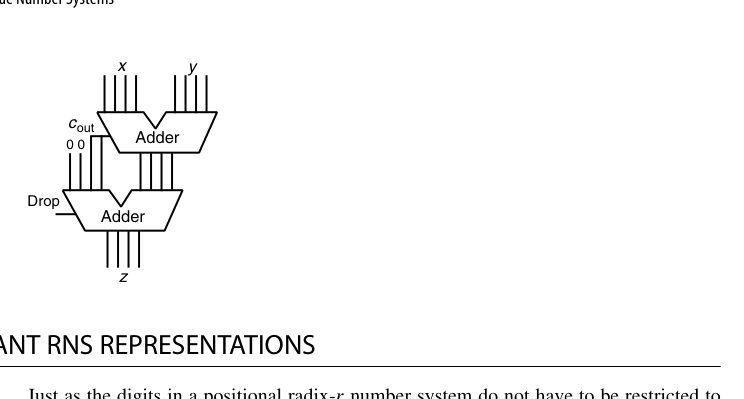
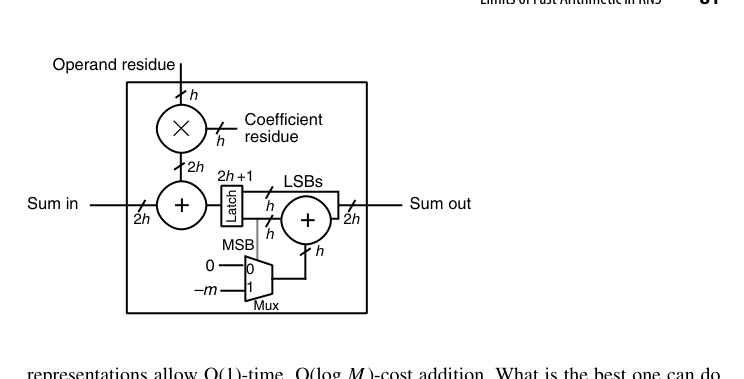
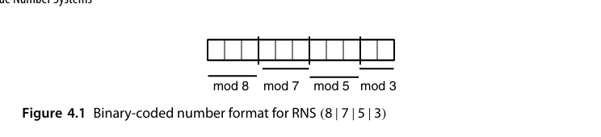
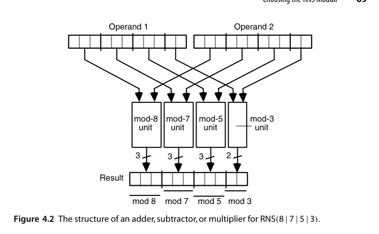

# 第4章 剩余数系（Residue Number Systems）

## 本章导读

剩余数系（Residue Number System, RNS）是数表示里最"离经叛道"的一支：它不记录一个数本身，而是记录它对一组**两两互素模数（moduli）**的余数。这样做的回报是惊人的——**加、减、乘完全没有跨通道进位**，每个模数通道独立并行工作。代价同样惊人：比较大小、除法、溢出检测、符号判断全部变得极其困难。RNS 在 DSP、密码学（大数模乘）、容错计算里有一席之地，本章讲清它的能力与边界。

## 4.1 RNS 表示与算术（RNS Representation and Arithmetic）

中国剩余定理（Chinese Remainder Theorem, CRT）是 RNS 的数学基石：设模数 $m_1, m_2, \dots, m_n$ 两两互素，$M = \prod m_i$，则区间 $[0, M)$ 内的任意整数 $x$ 与余数向量

$$
x \;\longleftrightarrow\; \big(x \bmod m_1,\; x \bmod m_2,\; \dots,\; x \bmod m_n\big)
$$

一一对应。

运算规则漂亮得不像话：

$$
x \odot y \;\longleftrightarrow\; \big((x_1 \odot y_1) \bmod m_1,\; \dots,\; (x_n \odot y_n) \bmod m_n\big), \quad \odot \in \{+, -, \times\}
$$

每个通道只需一个小的模 $m_i$ 运算器，通道之间零交互。**进位链在系统层面被连根拔掉**——这是比冗余数系更彻底的并行化。

以本书反复使用的 $\mathrm{RNS}(8\,|\,7\,|\,5\,|\,3)$ 为例：动态范围 $M = 8\times7\times5\times3 = 840$，每个余数分别为 3、3、3、2 位，共 11 比特。取 $x = 48$、$y = 45$，有

$$
48 \leftrightarrow (0\,|\,6\,|\,3\,|\,0)_{\mathrm{RNS}},\qquad 45 \leftrightarrow (5\,|\,3\,|\,0\,|\,0)_{\mathrm{RNS}}
$$

它们的和、差、积可以**逐通道**、完全并行地算出，例如

$$
x + y \leftrightarrow (0+5 \bmod 8,\; 6+3 \bmod 7,\; 3+0 \bmod 5,\; 0+0 \bmod 3) = (5\,|\,2\,|\,3\,|\,0)_{\mathrm{RNS}}
$$

每个通道只是 2-3 比特的模加法器，最深也只有两级门——**与整个系统的字长无关**。

若要用 RNS 表示有符号数，只需把动态范围 $[0, M)$ 划分成 $[0, P]$ 与 $[M-N, M)$（即负数区），满足 $M = N + P + 1$。至于"某个余数向量到底落在正数区还是负数区"，正是 4.4 节要处理的难题。

::: {.callout-note title="解读"}
把 RNS 想象成"分头行动、各管一摊"：大数运算被切成若干互不干扰的小数运算。瓶颈从"进位传播"转移到"编解码"——进出 RNS 域的转换（4.3 节）成为系统的主要开销。
:::

## 4.2 模数的选择（Choosing the RNS Moduli）

选模数是 RNS 设计的核心艺术，目标有两个：通道硬件简单、动态范围够用。工程上的宠儿是**低成本模数集合**：

$$
\{2^k,\; 2^k - 1,\; 2^{k-1} - 1\}
$$

- 模 $2^k$：取低 $k$ 位，零成本；
- 模 $2^k - 1$：利用 $2^k \equiv 1 \pmod{2^k - 1}$，把高位折回低位相加（循环进位），只需一个加法器加一次折叠修正；
- 模 $2^{k-1}-1$：同理，$2^{k-1} \equiv 1$。

例如 $\{32, 31, 15\}$（$k=5$）三通道 RNS，动态范围 $M = 32 \times 31 \times 15 = 14880$，约 13.9 位，每个通道都是小加法器级别的成本。

低成本模数能成体系，靠的是一条简单的数论事实：

$$
\gcd(2^a - 1,\; 2^b - 1) = 1 \iff \gcd(a, b) = 1
$$

于是任取一组两两互素的指数 $a_{k-2} > \dots > a_1 > a_0$，就可以构造出

$$
\mathrm{RNS}\big(2^{a_{k-2}} \,\big|\, 2^{a_{k-2}}\!-\!1 \,\big|\, \dots \,\big|\, 2^{a_1}\!-\!1 \,\big|\, 2^{a_0}\!-\!1\big)
$$

其中最宽余数是 $a_{k-2}$ 位；为了在给定余数宽度下最大化动态范围，偶数模数应尽可能取大。

::: {.callout-tip title="工程经验"}
模 $2^k - 1$ 的折叠修正（"折半相加、再折半"）与 1 的补码加法的循环进位是同一个数学结构。做 FPGA/ASIC 的模运算单元时，这是使用频率最高的技巧之一。
:::

照这个方法为"覆盖 $[0, 100000]$"选模数，过程是这样的：

$$
\begin{aligned}
\mathrm{RNS}(2^3\,|\,2^3\!-\!1\,|\,2^2\!-\!1) &\to M = 168\\
\mathrm{RNS}(2^4\,|\,2^4\!-\!1\,|\,2^3\!-\!1) &\to M = 1680\\
\mathrm{RNS}(2^5\,|\,2^5\!-\!1\,|\,2^3\!-\!1\,|\,2^2\!-\!1) &\to M = 20832\\
\mathrm{RNS}(2^5\,|\,2^5\!-\!1\,|\,2^4\!-\!1\,|\,2^3\!-\!1) &\to M = 104160
\end{aligned}
$$

最后一行 $\mathrm{RNS}(32\,|\,31\,|\,15\,|\,7)$ 达标。注意一旦把指数 4 加进来，指数 2 就必须剔除——因为 $\gcd(4,2)\neq 1$，从而 $2^4-1$ 与 $2^2-1$ 不互素。

该系统每个数占 $5+5+4+3 = 17$ 比特，动态范围 104160（约 16.7 位），**表示效率接近 100%，一个比特都没浪费**。一般地，低成本 RNS 的表示效率可证明优于 50%，即最多浪费 1 比特。

作为对照，不限制模数形式时可以选 $\mathrm{RNS}(15\,|\,13\,|\,11\,|\,23\,|\,7)$，18 比特、$M = 120120$。两者都够用，后者通道更多更窄、前者通道更少更宽但算术单元更简单。**实践中几乎总是选后者**——通道硬件的简洁性比省一两个比特重要得多。

## 4.3 数的编码与解码（Encoding and Decoding of Numbers）

**编码（二进制 → RNS）**：对输入数逐块取模。把 $k$ 位输入按权重 $2^i \bmod m_j$ 加权求和再取模即可；权重表可以预存，编码器是一个小乘加阵列。

直接做除法取模太慢，实际做法是预存 $\langle 2^j \rangle_{m_i}$ 并利用

$$
\big\langle (y_{k-1}\dots y_1 y_0)_2 \big\rangle_{m_i}
= \Big\langle \langle 2^{k-1} y_{k-1}\rangle_{m_i} + \dots + \langle 2 y_1\rangle_{m_i} + \langle y_0\rangle_{m_i} \Big\rangle_{m_i}
$$

即"把置位比特对应的权重常数模加起来"。例：把 $y = (1010\,0100)_2 = 164$ 编入 $\mathrm{RNS}(8\,|\,7\,|\,5\,|\,3)$。模 8 的余数直接取低 3 位得 $4$；又 $y = 2^7 + 2^5 + 2^2$，查表得

$$
x_2 = \langle 2+4+4\rangle_7 = 3,\quad x_1 = \langle 3+2+4\rangle_5 = 4,\quad x_0 = \langle 2+2+1\rangle_3 = 2
$$

所以 $164 \leftrightarrow (4\,|\,3\,|\,4\,|\,2)_{\mathrm{RNS}}$。整个编码只需若干次**小模数加法**，无需任何除法器。若想再快一倍，可把输入看成基数 4 的数，预存 $\langle 4^i\rangle$、$\langle 2\cdot4^i\rangle$、$\langle 3\cdot4^i\rangle$，用 $k/2$ 次模加完成。

{fig-align="center" width="85%"}

**解码（RNS → 二进制）**有两条路线：

1. **CRT 直接法**：$x = \big(\sum_j a_j\, M_j\, x_j\big) \bmod M$，其中 $M_j = M/m_j$，$a_j$ 是 $M_j$ 对 $m_j$ 的逆元（可预计算）。问题是这是**大数运算**——$M$ 可能很大，解码器本身又变成了一个宽位运算部件，多少有点讽刺；
2. **混合基数转换（Mixed-Radix Conversion, MRC）**：逐通道"剥离"余数，每次只做小模数减法与小常数乘法，把 $x$ 表示成混合基数形式 $x = z_0 + m_1(z_1 + m_2(z_2 + \cdots))$。硬件更省，但是**顺序**过程，延迟随通道数线性增长。

MRC 的剥离过程值得细看。混合基数系统 $\mathrm{MRS}(8\,|\,7\,|\,5\,|\,3)$ 的位权依次是 $7\!\times\!5\!\times\!3 = 105$、$5\!\times\!3 = 15$、$3$、$1$。由定义 $z_0 = x_0$；把 $z_0$ 从 RNS 表示里减掉后，所得数必能被 $m_0$ 整除，除以 $m_0$ 就"消掉一个模数"，问题规模减一。除以 $m_0$ 在 RNS 里只需**乘 $m_0$ 的各通道逆元**，例如 $3$ 对 8、7、5 的逆元分别是 3、5、2：

$$
\frac{(0\,|\,6\,|\,3\,|\,0)_{\mathrm{RNS}}}{3}
= (0\,|\,6\,|\,3\,|\,0)_{\mathrm{RNS}} \times (3\,|\,5\,|\,2\,|\,-)_{\mathrm{RNS}}
= (0\,|\,2\,|\,1\,|\,-)_{\mathrm{RNS}}
$$

反复"减一位、除一个模数"，依次剥出 $z_1 = 1$、$z_2 = 3$、$z_3 = 0$，最终

$$
(0\,|\,6\,|\,3\,|\,0)_{\mathrm{RNS}} = (0\,|\,3\,|\,1\,|\,0)_{\mathrm{MRS}} = 3\times15 + 1\times3 = 48
$$

CRT 直接法的另一面是"位权常数"视角：对 $\mathrm{RNS}(8\,|\,7\,|\,5\,|\,3)$，四个单位向量的值是 $105$、$120$、$336$、$280$，于是

$$
(3\,|\,2\,|\,4\,|\,2)_{\mathrm{RNS}} = \big\langle 3\!\times\!105 + 2\!\times\!120 + 4\!\times\!336 + 2\!\times\!280 \big\rangle_{840} = 779
$$

若要避免乘法，可以把 $\big\langle M_i \langle \alpha_i x_i\rangle_{m_i}\big\rangle_M$ 对全部 $(i, x_i)$ 预存成表，总容量 $\sum_i m_i$ 个字，解码退化为**查表 + 模 $M$ 加法**。这是一条非常实用的工程路径：表很小（本例 8+7+5+3 = 23 项），却把解码变成了全加器的事。

::: {.callout-note title="解码路径怎么选"}
MRC 是**串行**的（$k$ 轮剥离），CRT 是**并行**的但要一次宽位模 $M$ 加法；查表 + 模加则在面积与速度之间取了折中。典型选择是：通道数少、追求吞吐时用 CRT + 查表；通道数多、面积紧张时用 MRC。**解码从来不是免费的**——它是评估一个 RNS 方案时必须先算的账。
:::

## 4.4 困难的 RNS 算术（Difficult RNS Arithmetic Operations）

RNS 的"困难清单"，本质上都是因为**余数向量丢失了全局量级信息**：

- **大小比较 / 符号检测**：两个余数向量看不出谁大谁小，必须先解码（或部分解码）；
- **溢出检测**：结果超出 $[0, M)$ 就"回绕"了，而回绕与否同样无法从余数直接看出；
- **除法与缩放（scaling）**：除以非模数常数没有通道级算法；除以模数本身（缩放）尚可用乘逆元实现；
- **模 $M$ 约简**：中间结果超出动态范围后的归约同样昂贵。

这四件事其实是**同一件事**。若用动态范围 $M$ 的 RNS 表示 $[0, P]$ 与 $[M-N, M)$ 两段（$M = N+P+1$），那么"判符号"就是"与 $P$ 比较"，而溢出检测又可以由操作数符号与结果符号推出。所以只需解决**幅值比较**与**一般除法**两个问题。

比较的最实用手段是**近似 CRT 解码**：把定理 4.1 两边除以 $M$，得到缩放值

$$
\frac{x}{M} = \left\langle \sum_{i=0}^{k-1} m_i^{-1}\,\big\langle \alpha_i x_i \big\rangle_{m_i} \right\rangle_1 \;\in\; [0, 1)
$$

这里的加法是**模 1 加法**（只留小数部分，进位直接丢弃），比模 $M$ 加法简单得多；每一项又都可以对全部 $(i, x_i)$ 预存成表。仍取前例：

$$
\frac{x}{M} \approx \langle .0000 + .8571 + .2000 + .0000\rangle_1 = .0571,\qquad
\frac{y}{M} \approx \langle .6250 + .4286 + .0000 + .0000\rangle_1 = .0536
$$

于是 $x = 48 > y = 45$，且结论可靠。误差分析很干净：若每个表项的最大误差为 $\varepsilon$，则缩放值的误差不超过 $k\varepsilon$。本例表项保留 4 位小数，$\varepsilon = 0.00005$，$k\varepsilon = 0.0002$，远小于两个数 0.0035 的差距。

::: {.callout-tip title="两级解码策略"}
近似 CRT 的价值在于**快**。工程上常见做法是先跑一次快速的近似解码，若两个数的缩放值差距大于误差界 $2k\varepsilon$ 就直接下结论；否则再退回精确解码（MRC 或 CRT）复核。这样绝大多数比较只花查表 + 模 1 加法的代价。
:::

更有意思的是，很多算法**根本不需要精确比较**，只需要一个三值判定 $x<y$ / $x\approx y$ / $x>y$。SRT 除法（第 14 章）正是如此：它根据部分余数 $s$ 的符号从冗余商数位集 $\{-1,0,1\}$ 里挑一位，而"符号"本来就允许一定的模糊——只要 $s$ 离 0 足够远，选 $-1$ 还是 $+1$ 都不会错。**算法对不精确的容忍度，正好把 RNS 的短板补上了**；这也是 RNS 除法唯一走得通的路子。

::: {.callout-warning title="设计含义"}
RNS 系统的设计哲学是：**尽量让算法只含加减乘**，把比较、除法、缩放赶到算法流程的边界（最好整个任务只做一次）。FIR 滤波、FFT、矩阵乘法、RSA/ECC 的模乘内核都是天然适配；凡是控制流依赖数据大小比较的算法，RNS 都很痛苦。
:::

## 4.5 冗余 RNS 表示（Redundant RNS Representations）

把第 3 章的冗余思想叠进 RNS：增加一个或多个**冗余模数（redundant moduli）**，使合法状态构成余数空间的一个子集。用途：

- **错误检测**：若某通道出错，余数向量大概率落在合法子集之外——这是第 27 章容错算术的重要工具；
- **扩大有效动态范围**，给中间结果"留出头部空间"，缓解 4.4 节的溢出问题。

另一种更常用的做法是**放宽每个余数自身的数位集**：不必把模 $m_i$ 的余数限制在 $[0, m_i-1]$，而可以允许它取 $[0, \beta_i]$（$\beta_i \ge m_i$），这就是**伪余数（pseudoresidue）**。

以模 13 为例，正常余数需要 4 位表示 $[0,12]$（浪费了 3 个码字）。若允许伪余数取 $[0,15]$，则 $13, 14, 15$ 分别等价于 $0, 1, 2$——这三个值有了两种表示，系统因此**冗余**。好处是运算可以彻底绕开"比较 + 条件减"的约简：把一个普通余数 $x$ 与一个伪余数 $y$ 相加时，直接用一个 4 位二进制加法器；若进位 $c_{out}=0$ 就照单全收，若 $c_{out}=1$ 则丢弃这个值 16 的进位并**加 3**（因为 $16 - 13 = 3$）。图 4.3（见 4.3 节）就是这个单元的完整结构：**一次加法 + 一次条件加常数**，比"加法 + 比较 + 减法"省了一整级。

伪余数还可以直接加倍宽度：让本来只需 $h$ 位的模 $m$ 余数住进 $2h$ 位的容器。这对**乘累加（multiply-accumulate）**特别划算——两个 $h$ 位余数相乘得 $2h$ 位积，直接加到 $2h$ 位的累加和上；累加结果超过 $2^h m$ 时才减一次 $2^h m$ 完成约简。

{fig-align="center" width="85%"}

这里的设计哲学与第 3 章一脉相承：**约简（相当于冗余域的转换）是最贵的一步，那就把它推迟到最后一刻**。中间的所有乘法和加法都留在"宽松"的伪余数域里跑，每步只需一个普通加法器加一个多路选择器。脉动阵列式的 FIR 滤波器、RSA 的模乘内核大量使用这个结构。

::: {.callout-note title="伪余数的代价"}
伪余数带来的冗余不是免费的：码字变多了，**相等性判断与错误检测就变复杂**；同时每个通道要多占比特、多布线。不过由于冗余是有意引入的（第 27 章），这份复杂度往往正是检错能力本身的来源——**一份开销买两样东西**。
:::

## 4.6 RNS 快速算术的极限（Limits of Fast Arithmetic in RNS）

理论上 RNS 通道延迟 $O(\log \log M)$ 级别（小模数加法），看似完胜普通二进制的 $O(\log M)$。但原书冷静地指出：

1. **编解码开销**摊薄了优势——除非一次进入 RNS 域后做大量运算；
2. **工艺无关性存疑**：在 VLSI 里，布线规则性与模块复用往往比渐近复杂度更决定最终速度，高度规整的二进制前缀加法器（第 6 章）实践中极难被 RNS 击败；
3. RNS 的甜区是**天然模运算的算法**（密码学、多项式/NTT 运算）与**容错**场景。

把渐近结论讲精确一些，是这一节最有价值的部分。若为了让模数尽量小而取最小的素数作模数，三条数论事实给出了边界：

- 第 $i$ 个素数 $p_i \sim i\ln i$；
- $[1, n]$ 内素数个数 $\sim n/\ln n$；
- $[1, n]$ 内所有素数之积 $\sim e^n$。

由此可得定理：**任意 $k$ 位二进制数可用 $O(k/\log k)$ 个模数表示，且最大模数只需 $O(\log k)$ 位**。证明思路是：若需要的最大素数为 $n$，由 $e^n \approx 2^k$ 得 $n < k$，再由素数计数定理得模数个数为 $O(n/\log n) = O(k/\log k)$。

结论是 RNS 加法可以做到

$$
\text{时间 } O(\log\log\log M),\qquad \text{成本 } O(\log M)
$$

对比一下三种表示的理论极限：普通二进制位置数制是 $O(\log\log M)$ 时间、$O(\log M)$ 成本；冗余表示是 $O(1)$ 时间、$O(\log M)$ 成本；RNS 是 $O(\log\log\log M)$ 时间、$O(\log M)$ 成本。

也就是说：**三者的成本渐近相同，RNS 的时间介于两者之间——它比二进制快，却比不上冗余表示**。若再限定只能用低成本模数 $2^a$、$2^a-1$，则由"前 $i$ 个素数之和 $\sim O(i^2\ln i)$"可得需要 $O(\sqrt{k/\log k})$ 个模数、最大模数 $O(\sqrt{k\log k})$ 位，渐近上还要再差一些。

::: {.callout-important title="别被渐近复杂度骗了"}
$O(\log\log\log M)$ 在 $M = 2^{64}$ 时不过是个位数级别的门延迟，看上去极美。但真实芯片里，**编解码的开销、通道间布线的不匹配、以及控制逻辑**往往占据主导。RNS 真正胜出的场合从来不是"加法更快"，而是"算法本身就是模运算"——RSA/ECC、NTT、LWE 这类密码学内核，模数天然存在，编解码的账也就不用付了。
:::

## 本章小结

- RNS：用 CRT 把大数拆成独立小通道，加减乘无进位、全并行。
- 低成本模数 $\{2^k, 2^k-1, 2^{k-1}-1\}$ 是工程首选。
- 编解码（尤其解码）是主要开销；CRT 直接法与 MRC 各有取舍。
- 比较/符号/溢出/除法困难 → 适用面限于"重加减乘、轻判断"的算法。
- 与冗余数系合体可检错，是容错计算的利器。

## 原书插图

{fig-align="center" width="85%"}

{fig-align="center" width="85%"}
