# 第5章 基本加法与计数（Basic Addition and Counting）

## 本章导读

加法是所有算术的原子操作——减法靠补码变成加法，乘法是重复的加法，除法是重复的条件减法。本章从最基本的半加器（half adder, HA）、全加器（full adder, FA）讲起，搭建行波进位加法器（ripple-carry adder），分析进位传播的延迟本质，并介绍进位完成检测、计数器与 Manchester 进位链。第 6、7 章的所有"快速加法器"，都可以理解为对本章进位链问题的不同回应。

## 5.1 位串行与行波进位加法器（Bit-Serial and Ripple-Carry Adders）

**半加器（HA）**：两个比特相加，$s = x \oplus y$，$c_{out} = xy$。它只占一个 AND 门加一个 XOR 门，但如果手头只有 NOR 或只有 NAND，也可以很划算地实现——用两个 NOR 门加一个反相器就能搭出 HA，用 NAND 门实现时得到的则是**反相的进位输出**，正好可以直接喂给下一级同样用 NAND 实现的结构。原书 Fig. 5.1 给出了这三种实现。**同一个布尔函数在不同工艺库里的最优实现可以完全不同**，这是算术部件设计里最基础的一条经验。

**全加器（FA）**：三个比特（含进位输入）相加：

$$
s = x \oplus y \oplus c_{in}, \qquad c_{out} = xy + (x \oplus y)c_{in}
$$

写成展开形式更容易看出它的两个"身份"：$s$ 是三输入的**奇校验（odd parity）**函数，$c_{out}$ 是三输入的**多数（majority）**函数 $xy \lor x c_{in} \lor y c_{in}$。这个视角在第 8 章的多操作数加法里会反复用到。

全加器的另一种读法（第 8 章视角）：它是一个 **3:2 压缩器（3:2 compressor）**——把 3 个同权重的比特压缩成 2 个比特（和位与进位）。

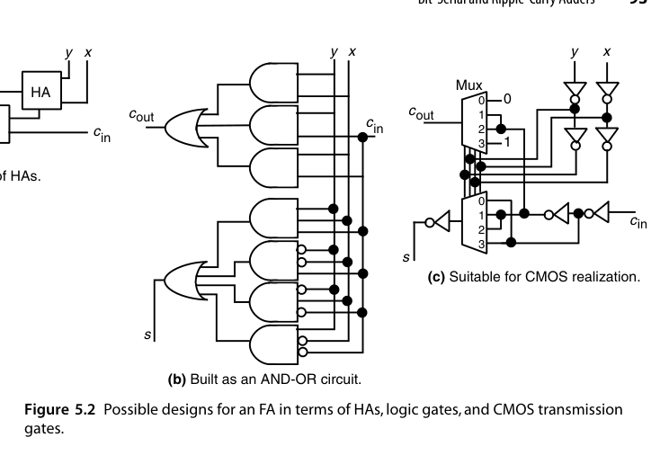{fig-align="center" width="85%"}

三种 FA 实现的取舍很典型：图 5.2a 最规整、最容易验证，但进位要经过两级 HA；图 5.2b 是标准的二级 AND-OR（或 NAND-NAND），延迟最短但晶体管尺寸较大；图 5.2c 是 CMOS 传输门逻辑的经典设计——用 $c_{in}$ 同时作为两个 4 选 1 多路器的选择端，$x,y$ 的四种组合直接选出 $s$ 与 $c_{out}$ 应有的常量，**进位路径上只有一个传输门**，因此特别适合做位宽较宽的行波进位链。由于 FA 是算术电路里复用次数最多的单元，工业界为它积累了大量针对具体工艺优化过的定制版图。

**行波进位加法器（ripple-carry adder）**：$k$ 个 FA 首尾相接，进位从最低位逐级"涟漪"到最高位。结构最规整、面积最小、版图最友好，但最坏延迟：

$$
T_{\text{ripple}} = T_{FA}(x,y \to c_{out}) + (k-2)\,T_{FA}(c_{in} \to c_{out}) + T_{FA}(c_{in} \to s)
$$

**延迟随位宽线性增长**——32 位就是 32 级 FA 的进位链，这是它被高速设计抛弃的原因。粗略地说 $T_{\text{ripple}} \approx k\,T_{FA}$。

**位串行加法器（bit-serial adder）**：另一个极端——只用 1 个 FA，操作数存在移位寄存器里，每拍移入一对比特，进位存在 1 位锁存器中。$k$ 位加法要 $k$ 拍，但硬件只有常数大小。在对吞吐要求低、引脚/面积极其敏感的场合（如某些传感器前端）仍有价值。

注意位串行加法器的总延迟也是 $O(k)$，但**比例系数比行波进位大得多**——它每拍都要付一次触发器建立/保持与时钟开销。所以位串行赢在面积（1 个 FA vs. $k$ 个 FA），行波进位赢在延迟，**两者不是"同一条曲线上的两个点"，而是两个不同的设计点**。

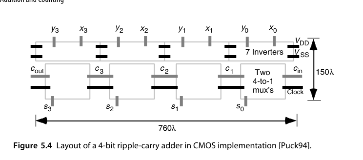{fig-align="center" width="85%"}

图 5.4 给出的是用图 5.2c 的传输门 FA 直接拼出的 4 位版图。它的价值在于说明**规则性的实际收益**：4 个完全相同的单元横向平铺，进位链是相邻单元间的短直线，没有任何跨越布线，版图面积几乎就等于单元面积之和。这就是为什么即使在有了超前进位之后，行波进位仍然活在"位宽不大、对面积敏感"的角落里。

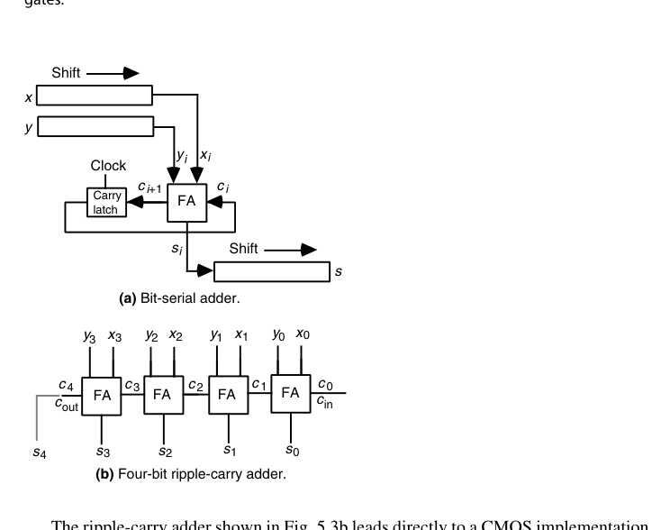{fig-align="center" width="85%"}

**加法器还是一块万能积木**。一个带 $c_{in}$、两个 $k$ 位操作数输入、$c_{out}$ 与 $k$ 位和输出的二进制加法器，可以用来合成各种非算术逻辑函数。例如 $f = w \lor xyz$ 可以这样接：第 0 位放 $(x, y)$，得 $c_1 = xy$；第 1 位放 $(0, z)$，得 $c_2 = z\cdot xy = xyz$；第 2 位放 $(1, w)$，得

$$
c_3 = 1\cdot w \lor (1 \oplus w)\,c_2 = w \lor \bar{w}\,xyz = w \lor xyz
$$

第 3 位放 $(0, 1)$，则 $c_4 = c_3 = f$、$s_3 = \bar{c}_3 = \bar{f}$。于是**一次加法同时给出 $f$ 与其反**。

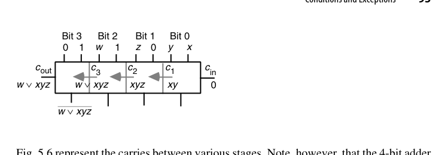{fig-align="center" width="85%"}

这个技巧的原理是：加法器的进位链本身就是一条"与-或"链，$g_i$ 提供与项、$p_i$ 提供传播，两者组合足以覆盖许多多变量逻辑函数。而且**该加法器不必是行波进位结构**——任何进位语义正确的加法器（超前进位、前缀结构）都能得到同样的输出。在 FPGA 上，硬加法器（进位链专用布线）常常是实现宽与/或逻辑最快的资源，这条路子至今仍在用。

### RTL 实践：`rtl/ch5_1_ripple_carry_adder`

参数化行波进位加法器，用 `generate` 把 $N$ 个全加器串成进位链：

```systemverilog
module full_adder (
    input  logic a, b, cin,
    output logic s, cout
);
    assign s    = a ^ b ^ cin;
    assign cout = (a & b) | ((a ^ b) & cin);
endmodule

module ripple_carry_adder #(parameter int N = 8) (
    input  logic [N-1:0] a, b,
    input  logic         cin,
    output logic [N-1:0] s,
    output logic         cout
);
    logic [N:0] c;
    assign c[0] = cin;
    assign cout = c[N];
    genvar i;
    generate
        for (i = 0; i < N; i++) begin : g_fa
            full_adder fa (.a(a[i]), .b(b[i]), .cin(c[i]),
                           .s(s[i]), .cout(c[i+1]));
        end
    endgenerate
endmodule
```

testbench 用无符号黄金模型 `a + b + cin` 比对，定向用例覆盖全 0/全 1/交替进位，外加随机回归。运行：

```bash
cd rtl/ch5_1_ripple_carry_adder
bash run_iverilog.sh    # 或 bash run_verilator.sh
```

## 5.2 条件码与异常（Conditions and Exceptions）

ALU 的加法器除了给出和，还要产出条件码（condition codes）：

- **进位输出（carry-out, $c_{out}$）**：无符号加法的溢出标志，也是无符号减法"无借位"的标志；
- **溢出（overflow）**：2 的补码溢出，判据 $\text{overflow} = c_k \oplus c_{k-1}$（见第 2 章）；
- **零标志（zero）**：和的各位全 0——一个 $k$ 输入 NOR；
- **符号标志（sign/negative）**：和的最高位。

对**无符号**加法而言，$c_{out}$ 与"溢出"是同一件事，符号标志则毫无意义；对 **2 的补码**加法而言，$c_{out}$ 本身不代表溢出，真正的判据是"两个同号数相加得到异号结果"：

$$
\text{Overflow}_{2\text{'s-compl}} = x_{k-1}y_{k-1}\bar{s}_{k-1} \lor \bar{x}_{k-1}\bar{y}_{k-1}s_{k-1} = c_k \oplus c_{k-1}
$$

由于同一套加法器常常既要服务无符号又要服务有符号运算，$c_{out}$ 通常也一并输出，由软件按数据类型取用。

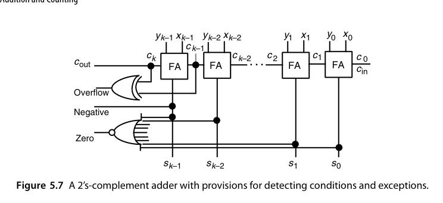{fig-align="center" width="85%"}

有两个实现细节值得注意。其一，**零检测的那个 $k$ 输入 NOR 门在物理上不存在**——门电路的扇入通常限制在 4-8，实际要用一棵 OR 树加一个反相器来实现，因此零标志的延迟是 $O(\log k)$ 而不是 $O(1)$，在宽位 ALU 里可能反过来成为关键路径。其二，溢出检测需要 $c_k$ 与 $c_{k-1}$，也就是**最坏路径的终点**，所以它天然是"免费"的，不额外增加延迟。

溢出之后的行为也是一个设计选择。默认行为是**回绕（wrap）**：无符号和超出 $k$ 位时，输出是正确和减去 $2^k$ 的值。但很多应用更需要**饱和（saturate）**：图像像素的亮度加过头应该钳到最大值，而不是回绕成一个接近 0 的数（那样会在画面上产生黑点）。饱和加法器的实现极为简单——在普通加法器输出处加一个多路器，选择端接溢出信号，溢出时输出全 1（无符号）或正/负最大值（有符号）。**饱和是有序性（ordering）友好的，回绕则不是**。

::: {.callout-note title="工程细节"}
注意**无符号溢出与有符号溢出是两套判据**，同一次加法可以同时置位两个标志，由软件按数据类型取用。这也是为什么处理器 FLAGS 寄存器里 CF 和 OF 是分开的两个位。
:::

## 5.3 进位传播分析（Analysis of Carry Propagation）

进位链何时最长？引入两个在后续章节反复出现的信号：

- **生成（generate）**：$g_i = x_i y_i$ —— 本位自己产生进位；
- **传播（propagate）**：$p_i = x_i \oplus y_i$（或 $x_i + y_i$，两种定义各有用途）—— 本位把进位传下去。

进位递推：$c_{i+1} = g_i + p_i c_i$。

定义**进位链长度**为：从进位产生的位置起，到进位最终被吸收（annihilate）的位置为止，中间经过的数位个数。长度为 0 表示根本没有进位，长度为 1 表示进位在下一级就被吸收。决定加法器延迟的是**最长那条链**。

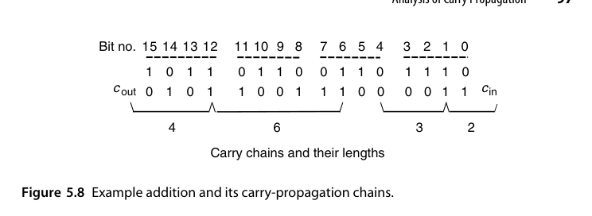{fig-align="center" width="85%"}

对随机操作数，每个位位置上三种事件的概率是

$$
P(\text{生成}) = \tfrac{1}{4}\;(x_i y_i = 11),\quad
P(\text{吸收}) = \tfrac{1}{4}\;(x_i y_i = 00),\quad
P(\text{传播}) = \tfrac{1}{2}\;(x_i \neq y_i)
$$

一个在第 $i$ 位产生的进位，传播到第 $j-1$ 位并在第 $j$ 位停下（$j>i$）的概率是 $2^{-(j-1-i)}\times\frac{1}{2} = 2^{-(j-i)}$。于是从位置 $i$ 出发的进位链的**期望长度**为

$$
\sum_{j=i+1}^{k-1}(j-i)\,2^{-(j-i)} + (k-i)\,2^{-(k-1-i)} = 2 - 2^{-(k-i-1)}
$$

（最后一项不乘 $\frac12$，是因为进位在第 $k$ 位必然停止。）当 $i \ll k$ 时，这个值约等于 **2**——也就是说，平均而言一条进位链只有两位长，而不是直觉上的 $k$ 位。

但延迟取决于**最长**链，而最长链的平均长度是

$$
\lambda = \sum_{h\ge 1} h\big[\eta_k(h) - \eta_k(h+1)\big] = \sum_{h=1}^{k} \eta_k(h) \;<\; \log_2 k
$$

其中 $\eta_k(h)$ 是"最长链长度 $\ge h$"的概率。证明思路是递推：$\eta_k(h) \le \eta_{k-1}(h) + 2^{-(h+1)}$（第二项 = 生成概率 $\frac14$ × 连续传播 $h-2$ 级并在最后一级停下的概率 $2^{-(h-1)}$），累加得 $\eta_k(h) \le (k-h+1)2^{-(h+1)}$；再把求和拆成前 $\lfloor\log_2 k\rfloor - 1$ 项（每项上界取 1）与剩余项（用上面的几何上界），即得 $\lambda < \log_2 k$。这个结果最早由 Burks、Goldstine 与 von Neumann 在他们定义存储程序计算机结构的经典报告中给出；实验数据表明 $\log_2(1.25k)$ 是更贴合的估计。

**平均 vs. 最坏**：随机操作数下，进位链的平均长度只有 $O(\log k)$ 级——远低于最坏情况的 $k$。这给两类设计留出空间：异步的进位完成检测（5.4 节）赌平均情况；同步设计则必须按最坏情况设计时钟，于是有第 6、7 章的加速结构。

::: {.callout-tip title="这个结论怎么用"}
$\log_2 k$ 与 $k$ 的差距，是所有"快速加法"技术的动机来源。64 位加法的最坏进位链是 64 级，而平均只有约 6 级——**十倍的差距**。要么把时钟周期按 6 级定（异步自定时，5.4 节），要么想办法把最坏情况从 64 级压到 6 级（第 6、7 章）。两条路的终点相同，代价不同。
:::

## 5.4 进位完成检测（Carry-Completion Detection）

想法：给每位增加"进位已确定"的信号——一旦所有位的进位都确定（无论是 0 还是 1），加法就完成了。实现上需要双轨（dual-rail）编码进位信号：$(c, \bar{c})$ 用两根线表示"0/1/未确定"三态。

具体地，进入第 $i$ 级的进位用二轨码 $(b_i, c_i)$ 表示：

$$
(b_i, c_i) = (0,0)\ \text{未确定},\qquad (0,1)\ \text{进位为 1},\qquad (1,0)\ \text{进位为 0}
$$

两个 1 会产生进位 1 向左传，**两个 0 同样会"产生"一个进位 0** 向左传——这正是普通行波进位加法器做不到的事（它只能传 1，不能传 0）。初始时所有进位都是 $(0,0)$；随后凡满足 $x_i = y_i$ 的位置立刻做出判定，把 $(b_{i+1}, c_{i+1}) = (\bar{x}_i\bar{y}_i,\ x_i y_i)$ 注入进位链：两个 1 注入"进位 1"，两个 0 注入"进位 0"。当所有进位都变成 $(0,1)$ 或 $(1,0)$ 时，传播结束。

每位的完成信号是 $d_i = b_i \lor c_i$，全部相与即得 `alldone`。

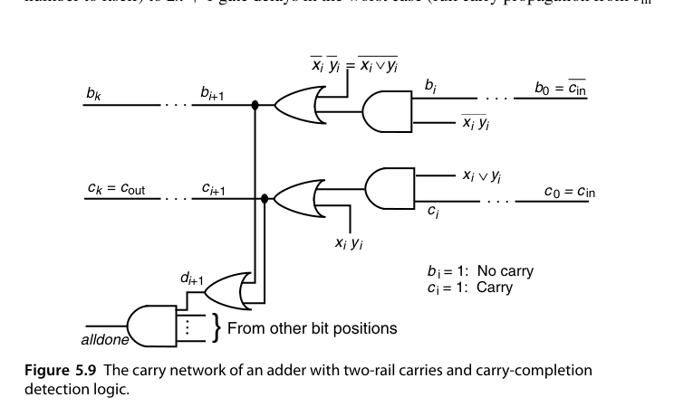{fig-align="center" width="85%"}

延迟上，最好情况（把一个数加到它自己，或者说所有位立即判定）只需 **1 个门延迟**；最坏情况（进位从 $c_{in}$ 一路传到 $c_{out}$）是 $2k+1$ 个门延迟；**平均约 $2\log_2 k + 1$**。注意和位与完成检测是重叠进行的，所以 $s_i$ 的计算不计入上述延迟。

设计上有两个坑必须避开。其一是**冒险（hazard）**：`alldone` 可能在进位尚未真正稳定时被虚假置位。可靠的做法是把所有进位初始化为 0（清空输入位）并**同时**施加全部输入数据。其二是 `alldone` 本身是一个 $k$ 输入与门，实际要用与树实现，带来 $O(\log k)$ 的额外延迟——所以严格说总延迟是 $O(\log k) + O(\log k)$，仍是对数量级，而非 $O(\log^2 k)$。

这是**自定时（self-timed）/异步设计**的经典案例：平均延迟接近进位链的真实长度（对随机数据约 $\log_2 k$ 级），无需时钟。代价是约一倍的进位网络面积和复杂的握手。在同步一统江湖的今天，它主要活在教科书和低功耗研究里。

## 5.5 加常数：计数器（Addition of a Constant: Counters）

加法的一个特化场景：**一个操作数是常数**。此时 FA 退化为 HA 级别的逻辑：

- 加 1 → **增量器（incrementer）/上行计数器**：$c_{i+1} = c_i x_i$ 型递推，硬件约为普通加法器的一半；
- 加减 1 可切换 → **可逆计数器（up/down counter）**；
- 除以常数的"模 $m$ 计数器"：达到 $m-1$ 归零，只需一个比较/译码逻辑。

一般地，设常数 $y = (y_{k-1}\dots y_1\,1)_2$（末位为 1，即 $y$ 为奇数）。若 $y$ 是偶数，可以把 $x$ 的最低若干位原样保留——因为 $x + y_{\text{odd}}2^h$ 的低 $h$ 位不受影响——于是**只需处理奇数常数**，不失一般性。此时

$$
s_0 = x_0 \oplus 1 = \bar{x}_0,\qquad c_1 = x_0\cdot 1 = x_0
$$

其余 $k-1$ 位交给一个 $(k-1)$ 位行波进位链，其 $c_{in} = x_0$，每一格依 $y_i$ 是 0 还是 1 而退化为一个 HA 或一个"改进的 HA"。**硬件大约是普通加法器的一半**——这就是"加常数"的全部红利来源。

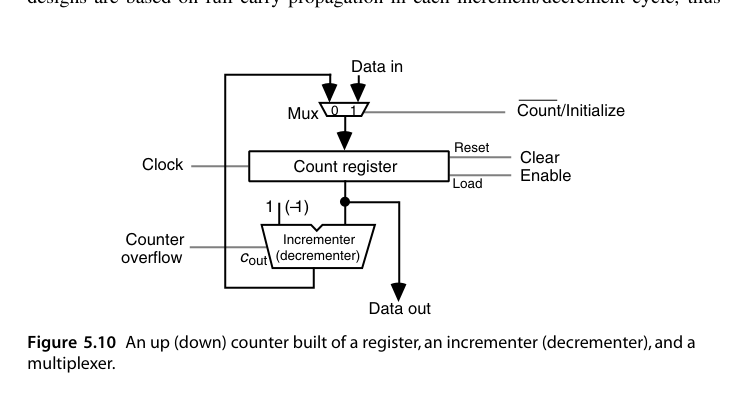{fig-align="center" width="85%"}

图 5.10 是最常见的同步计数器结构：寄存器保存当前计数值，增量器每拍算 $x+1$，多路器在"计数"与"加载初值"之间切换。把它改成可逆计数器只需把增量器换成增量/减量器并加一根控制信号。

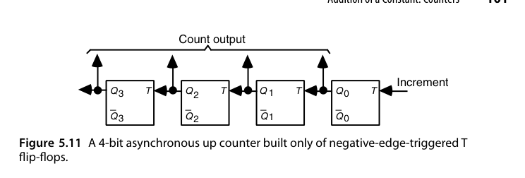{fig-align="center" width="85%"}

图 5.11 则走另一条路：用级联的 T（翻转）触发器做**异步**计数器。每个输入脉冲翻转最低位，最低位每次 1→0 翻转下一位，依此类推。由于进位（翻转传播）不必在一个时钟周期内走完，**下一个输入脉冲可以在进位尚未传到最高位之前就被接受**——这是典型的"靠数据而非靠时钟决定完成"的思路，代价是读出计数值时必须等待所有级稳定（毛刺问题）。

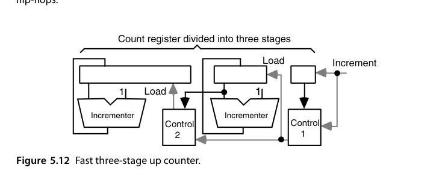{fig-align="center" width="85%"}

图 5.12 是一种很实用的加速技巧：把计数寄存器分成三段，低位段最窄因而最快，高位段最宽但只在低位段溢出时才需要更新——**而这次更新可以由一个慢速增量器提前算好，需要时直接加载**。这样计数器的最高工作频率由最窄的那一段决定。同样的思路也能推广到可逆计数器（在高位段里保存旧值以支持借位）。

还有两条备选路线值得一提：一是**用冗余格式保存计数值**，使增量/减量成为常数时间操作（代价是读出时要做一次转换）；二是当输入脉冲频率实在太高时，在前面加一个**预分频器（prescaler）**，先降频再计数——代价是计数值变成近似的。

::: {.callout-note title="计数器的隐藏难点"}
计数器看着简单，却是少数几个"**位宽可以任意大、而频率要求又极高**"的部件（比如 64 位性能计数器、时间数字转换器）。它的关键路径是一条最长进位链，所以第 6、7 章的快速加法技术在这里全都有用武之地。别把它当玩具电路。
:::

### RTL 实践：`rtl/ch5_5_updown_counter`

参数化可逆计数器（带同步使能与加载），验证脚本同前。计数器虽小，却是时序控制、地址生成、分频的基本积木。

## 5.6 Manchester 进位链与加法器（Manchester Carry Chains and Adders）

Manchester 进位链用**传输门/预充电**实现进位递推 $c_{i+1} = g_i + p_i c_i$：每位只需"生成开关"与"传播开关"两个管子，进位信号沿开关链传播，级延迟远低于 CMOS 门级 FA。它说明了一个重要思想：

先补上三个标准信号的定义（对二进制）：

$$
g_i = x_i y_i,\qquad p_i = x_i \oplus y_i,\qquad a_i = \bar{x}_i\bar{y}_i
$$

其中 $a_i$ 是**吸收（annihilate/kill）**信号。三者有且仅有一个为 1。对一般基数 $r$，判据是 $g_i=1 \iff x_i+y_i \ge r$，$p_i=1 \iff x_i+y_i = r-1$，$a_i=1 \iff x_i+y_i < r-1$——**进位网络的设计完全不依赖具体基数与编码**，这是它能被第 6、7 章反复复用的原因。

还可以定义"传递（transfer）"信号 $t_i = g_i \lor p_i = \bar{a}_i = x_i \lor y_i$，于是

$$
c_{i+1} = g_i \lor c_i p_i = g_i \lor c_i(g_i \lor p_i) = g_i \lor c_i t_i
$$

由于 $t_i$ 是**或**而 $p_i$ 是**异或**，在多数工艺里 $t_i$ 更快，因此这个变形往往能给出略快的加法器。本书后文统一用 $c_{i+1} = g_i \lor c_i p_i$ 的形式（更直观），但心里要记住 $p_i$ 大多时候可以换成 $t_i$。

Manchester 链的每一位由三个受 $p_i, g_i, a_i$ 控制的开关组成：$a_i=1$ 时把 $c_{i+1}$ 接到 0，$g_i=1$ 时接到 1，$p_i=1$ 时接到 $c_i$。在 CMOS 实现里，时钟为低时各 $c$ 节点**预充电**；时钟变高后，若 $g_i$ 有效则把 $c_{i+1}$ 拉低（有效）。这里有个关键约束：为了防止 $g_i$ 反向影响 $c_i$，$p_i$ 必须用**异或**而不是或来实现——恰好求和本来就需要 $x_i \oplus y_i$，所以这个约束不增加成本。

总延迟由三部分组成：形成开关控制信号的时间、开关建立时间、以及最坏情况下穿过 $k$ 个开关的传播延迟。前两项是常数，第三项在最好的情况下线性于 $k$；但在现代 CMOS 里，$k$ 个串联传输管的 RC 效应使延迟大致按 $k^2$ 增长。所以 Manchester 链**只适合做短链（一般不超过 8 位）**，作为各种快速加法方案里的积木块，而不是独立承担宽位加法。

::: {.callout-important title="解读"}
**进位递推是加法器的全部瓶颈，和位本身是"赠品"**。一旦进位已知，$s_i = p_i \oplus c_i$ 只是一级 XOR。所有快速加法器技术（第 6、7 章）的本质，都是想办法把 $c_i$ 们更快地算出来。
:::

把这个观点画成结构图，就得到了加法器的**通用形式**：顶部一排 AND 与 XOR 生成 $g_i$、$p_i$，底部一排 XOR 由 $s_i = p_i \oplus c_i$ 得到和位，**中间那个"进位网络"是唯一的设计变量**。

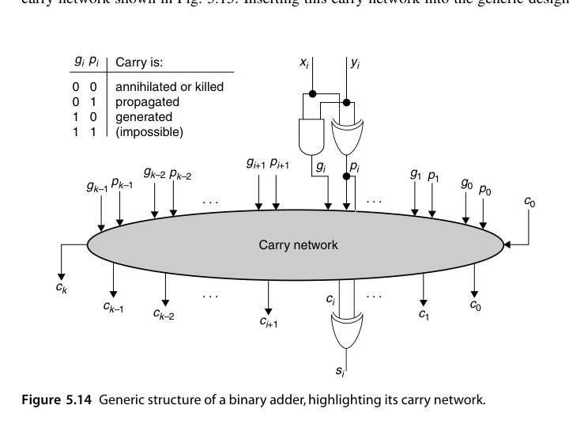{fig-align="center" width="85%"}

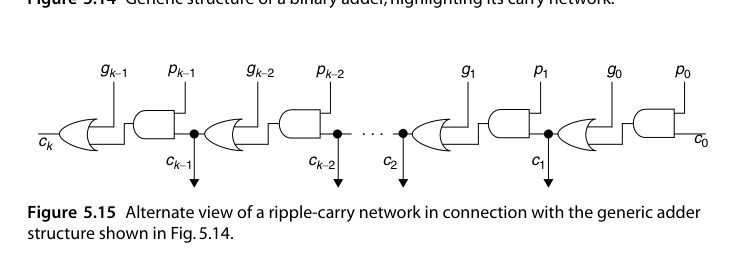{fig-align="center" width="85%"}

有了这张图，后续章节的讨论就可以极大简化：**所有加法器共享相同的 $g/p$ 生成级与求和级，只需比较各自的进位网络在延迟与成本上的差别**。第 6 章的超前进位与并行前缀、第 7 章的进位跳过与进位选择，本质上都是往图 5.14 那个椭圆里塞进不同的网络。

## 本章小结

- FA = 3:2 压缩器；行波进位 = $O(k)$ 延迟、最小面积；位串行 = 常数面积、$k$ 拍。
- 条件码：CF（无符号溢出）与 OF（有符号溢出）分开。
- 进位递推 $c_{i+1} = g_i + p_i c_i$ 是全书加法器章节的"万有公式"。
- 计数器是"加常数"的退化加法器，硬件减半。

## 原书插图

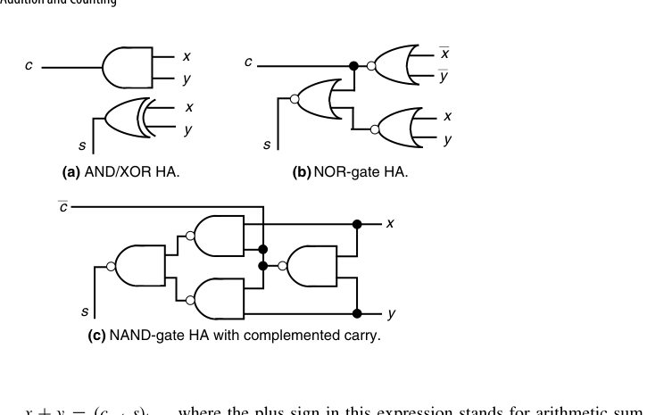{fig-align="center" width="85%"}

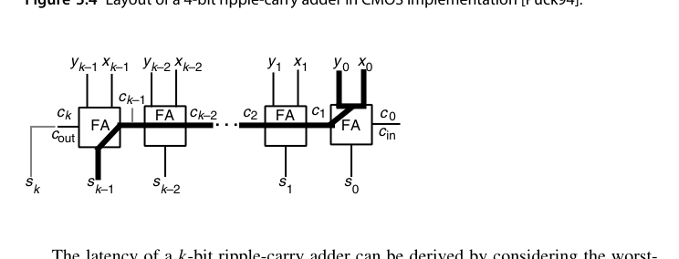{fig-align="center" width="85%"}

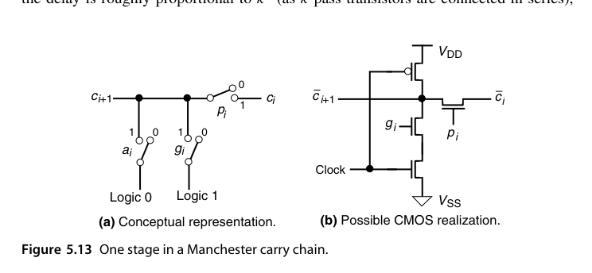{fig-align="center" width="85%"}
