# 第7章 快速加法器的变体（Variations in Fast Adders）

## 本章导读

第 6 章用前缀网络"正面强攻"进位链；本章是"侧翼包抄"：进位跳过（carry-skip）、进位选择（carry-select）、条件和（conditional-sum）三类结构，思想都是**赌/并行化进位的两种可能**，把串行等待变成并行计算加一次选择。它们结构直观、版图友好，至今仍是中等性能设计里的高性价比选择，也常与前缀网络混搭出混合结构。

## 7.1 简单进位跳过加法器（Simple Carry-Skip Adders）

观察：若一组内所有位的传播信号 $p_i$ 都为 1，则组输入进位会**直接穿过**这一组。于是给每个行波组配一个 AND 门算组传播 $P = \prod p_i$，再加一个旁路 mux：

$$
c_{\text{out}} = G_{\text{组}} + P_{\text{组}} \cdot c_{\text{in}}
$$

进位在组内仍行波，但遇到"全传播"组时可以**跳过（skip）**整组，硬件只多了每组的 AND 与旁路 mux。这个式子与 CLA 的块合并式长相酷似但并非一回事：跳加器的 $G_{\text{组}}$ 不是组合逻辑算出来的，而是行波链末端自然送出的进位——旁路 mux 只在"行波结果尚未到达"时提供一条快车道，两条路径殊途同归。也因此跳加器不需要 $(g, p)$ 信号的显式汇总逻辑，这是它比 CLA 省硬件的根本原因。

最坏路径不只有"低位生成、高位吸收"一种形态：进位也可能在**中间块**生成——此时它只需行波完本块的剩余位就开始跳过，路径反而更短；也可能全程无人生成（比如加法无进位），那时进位链根本不参与关键路径。跳加器的延迟分析因此永远是"对所有可能的生成-吸收对取 max"，教科书里的公式只是其中最远的那一对。

先算一笔具体的账。以 16 位、4 个 4 位块为例（图 7.1），假设**跳一级 mux 的延迟等于走一级行波**：最坏路径是"进位在第 0 级生成 → 在第 0 块内行波到第 3 级 → 进 mux → 跳过中间两个块 → 在最后一块内从第 12 级行波到第 15 级"，共 9 级传播（18 个门级），而纯行波要 16 级（32 个门级），几乎减半。

构造一组真实数据把这条最坏路径踩出来：$x = (0101\,0110\,1010\,0111)_2$、$y = (0010\,1001\,0101\,1001)_2$。逐块看：第 0 块内 $g_0 = 1$（第 0 位两个 1）、其余三位全传播，进位在第 0 位生成后行波三级送出 $c_4 = 1$；第 1、2 块的八位两两互异（$p$ 全 1），旁路 mux 直接把进位"快递"过去；第 3 块前三位传播、最高位 $p = g = 0$ 把进位吸收。和为 $(1000\,0000\,0000\,0000)_2 = 2^{15}$，恰好 $22183 + 10585$。整个计算里进位走完了"3 级行波 + 1 级 mux + 2 级跳过 + 3 级行波"共 9 级——教科书式的最坏情形在现实中就是"低块生成、中块全传播、高块吸收"的组合，并不罕见。

推广到 $k$ 位、固定块宽 $b$ 的情形，同一条最坏路径给出

$$
T_{\text{fixed-skip-add}} = \underbrace{(b-1)}_{\text{块 0 内行波}} + \underbrace{1}_{\text{mux}} + \underbrace{(k/b-2)}_{\text{跨越中间的块}} + \underbrace{(b-1)}_{\text{末块内行波}}
\;\approx\; 2b + \frac{k}{b} - 3 \ \text{级}
$$

对 $b$ 求导取极值：$2 - k/b^2 = 0 \Rightarrow b_{opt} = \sqrt{k/2}$，代回得 $T_{opt} = 2\sqrt{2k} - 3$。例如 $k = 32$ 时 $b_{opt} = 4$、延迟 13 级（26 门级），而 32 位行波进位加法器约要 $2.5$ 倍的时间。

这个结果的物理读法值得停留一秒：$2b$ 与 $k/b$ 两项分别来自"块内行波"与"跨块跳过"，最优解出现在两者相等处——这又是算术电路里反复出现的**路径均衡（path balancing）**原则：让候选的关键路径一样长，谁也无法再单独压缩。把 32 位的账代进去验算一遍：$b = 4$，$2 \times 4 + 32/4 - 3 = 13$ 级；若错取 $b = 8$，则 $16 + 4 - 3 = 17$ 级，块内行波立刻成为瓶颈。

不过固定块宽并不是最优。注意：在第 1 块就被生成或被吸收的进位，**跨过的块数更少**，因此它所在的块可以允许更多级行波而不拖慢整体。这就是**变长组宽（variable-size blocks）**的由来。设共 $t$ 个块、自右向左宽度为 $b_0, \ldots, b_{t-1}$，比较图 7.2 中的三条进位路径即可得出规律。

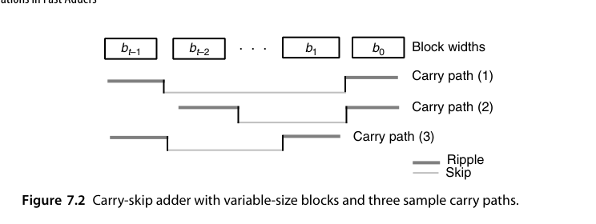{fig-align="center" width="85%"}

路径 (2) 比路径 (1) 少跨一次跳过，因此倒数第二块可以比最后一块宽 1 位；同理比较路径 (1) 与 (3) 可知第 1 块可以比第 0 块宽 1 位。在 $b_0 = b_{t-1} = b$ 且 $t$ 为偶数的假设下，最优块宽序列为 $b,\; b+1,\; \ldots,\; b+t/2-1,\; b+t/2-1,\; \ldots,\; b+1,\; b$（中间两块最宽，两端最窄，呈"纺锤形"）。两个假设都值得交代一句：$b_0 = b_{t-1}$ 的合法性来自总延迟只依赖 $b_0 + b_{t-1}$ 之和而非各自取值（生成端与吸收端在路径上对称）；$t$ 为偶数只是为了书写方便，奇数时结论基本不变。由总位数约束 $2[b + (b+1) + \cdots + (b + t/2 - 1)] = t(b + t/4 - 1/2) = k$ 解出 $b = k/t - t/4 + 1/2$，延迟为

$$
T_{\text{var-skip-add}} = 2(b-1) + 1 + (t-2) = \frac{2k}{t} + \frac{t}{2} - 2
$$

再对 $t$ 取极值：$t_{opt} = 2\sqrt{k}$，代回得 $T_{opt} \approx 2\sqrt{k} - 2$。与固定块宽的 $2\sqrt{2k} - 3$ 相比，改善因子为 $\sqrt{2}$；代价是块的个数多了 $\sqrt{2}$ 倍（此时 $b$ 取 1）。

::: {.callout-warning title="模型的边界"}
以上推导全都建立在"行波延迟与跳过延迟相等、且块内行波延迟与块宽成正比"这两个假设上。它们只在特定工艺下成立：例如在 CMOS 曼彻斯特进位链里，块内行波延迟随块宽**平方**增长。假设一改，最优解就完全不同——这也是为什么"最优组宽"在工程上永远要拿目标工艺重新算一遍，而不能直接照抄教科书公式。
:::

::: {.callout-important title="FPGA 上的反常识"}
在 FPGA 上，carry-skip 通常是个**伪优化**：厂商的专用进位链（如 Xilinx 的 CARRY4/CARRY8）已经用硬连线把行波做到极快，用通用逻辑实现的跳过旁路反而比进位链本身慢，还额外消耗 LUT 与布线资源。教科书的最优组宽分析默认 ASIC 门级环境；换到 FPGA，最优策略往往退化成"把整条进位链交给原语、别再自作聪明"。这再次印证 7.1 节那条原则：最优解是工艺的函数。
:::

::: {.callout-note title="直觉"}
最坏情况是"每个组都生成进位、且每个组都要等上一个组"——跳过逻辑此时帮不上忙；但只要组内行波与组间跳过的路径平衡，平均与最坏延迟都显著优于纯行波。组宽选择（定宽 vs. 变宽）是 skip 加法器的主要设计变量。
:::

### RTL 实践：`rtl/ch7_1_carry_skip_adder`

```systemverilog
module carry_skip_adder #(parameter int N = 16, parameter int G = 4) (
    input  logic [N-1:0] a, b,
    input  logic         cin,
    output logic [N-1:0] s,
    output logic         cout
);
    localparam int NG = N / G;          // 组数
    logic [NG:0] c;                     // 组间进位
    assign c[0] = cin;
    assign cout = c[NG];
    genvar gi;
    generate
        for (gi = 0; gi < NG; gi++) begin : g_group
            logic [G:0]   cc;           // 组内行波进位
            logic [G-1:0] p;
            logic         pgroup;
            assign cc[0] = c[gi];
            for (genvar i = 0; i < G; i++) begin : g_bit
                assign p[i]   = a[gi*G+i] ^ b[gi*G+i];
                assign s[gi*G+i] = p[i] ^ cc[i];
                assign cc[i+1] = (a[gi*G+i] & b[gi*G+i]) | (p[i] & cc[i]);
            end
            assign pgroup = &p;                       // 组传播
            assign c[gi+1] = cc[G] | (pgroup & c[gi]); // 跳过逻辑
        end
    endgenerate
endmodule
```

## 7.2 多级进位跳过加法器（Multilevel Carry-Skip Adders）

单级进位跳过加法器可以抽象成下图这样的通用形态：每个块内部行波，块与块之间由一级跳过逻辑（图中 $S_1$）旁路。记号约定先说明：$S_1$ 框表示"组传播 AND + 旁路 mux"这一对组合，它有两个输入（行波链末端进位与组输入进位）和一个输出；后面出现的 $S_2$ 则是二级跳过，控制信号由相邻若干 $S_1$ 的组传播信号再取 AND 得到。把这种示意图当"电路简谱"来读——只看跳过层级、不看块内细节——是分析多级结构的前提。

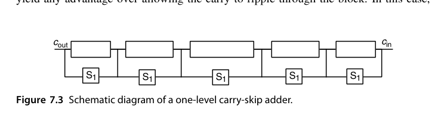{fig-align="center" width="85%"}

在此基础上再放宽一步——允许进位**一次跨过多个块**，就得到多级跳过：二级跳过的控制信号就是若干个一级跳过信号的 AND。若单级方案里跨过三个块要 3 个时间单位，加了二级跳过逻辑后只需 1 个。

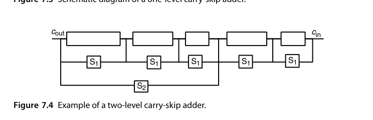{fig-align="center" width="85%"}

一个实用的剪枝技巧：如果最左（或最右）端的块很短，让进位"跳过它"未必比"直接行波穿过它"更快（别忘了产生跳过控制信号本身也要时间）。这时把低效的跳过电路删掉，结构反而更干净。在"行波延迟 = 跳过延迟"的假设下，只有 1 位（可能还有 2 位）宽的块值得这么处理。这条规则背后是跳加器设计的一条普遍原则：**每一级跳过逻辑都要"挣回"自己的使能延迟**——控制信号 $S_2$ 是一级跳过信号的 AND，本身就晚于被它旁路的某些路径，给短块配旁路等于花钱买慢。

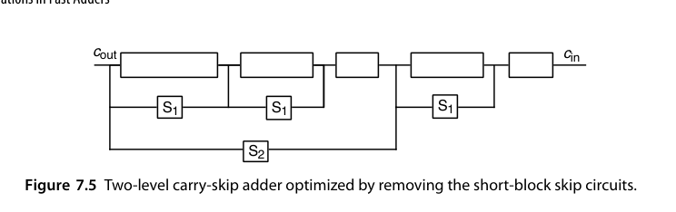{fig-align="center" width="85%"}

下面两个例子说明这套时序分析该怎么用。假设以下操作各占 1 个时间单位：生成 $g_i, p_i$、由第 $i-1$ 级跳过信号生成第 $i$ 级跳过信号、一级行波、一级跳过、以及进位已知后计算和位。

**例 7.1：总延迟不超过 8 个单位时，单级能做出多宽的加法器？** 设各块宽度为 $b_i$，图 7.6 上标注了各信号稳定的时刻（$c_{in}$ 在时刻 0 有效）。右端的块宽受"输出时刻"约束，左端的块宽受"输入可用时刻"约束；第 0 块因为要接纳 $c_{in}$，宽度还要再减 1。把其中两块的账算细：块 1 的输出要在时刻 3 就位，$g, p$ 产生用掉 1 个单位，块内还能行波 2 级，故 $b_1 = 3$；块 4 的输入进位要到时刻 5 才就绪（之前被低位的行波与跳过占用），留给它行波的时间只有 $8 - 5 = 3$ 个单位，同样 $b_4 \le 3$。最终得到 $1+3+4+4+3+2+1 = 18$ 位。

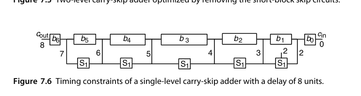{fig-align="center" width="85%"}

**例 7.2：同样预算下二级能做多宽？** 关键是引入"产出/吸纳"这一对时延参数，记作 $\{\beta, \alpha\}$：$\beta$ 是该块必须给出进位输出的最晚时刻，$\alpha$ 是该块吃掉一个迟到进位而不超时的宽容量。给定 $\{\beta,\alpha\}$，一级子块数为 $\gamma = \min(\beta-1, \alpha)$，第 $i$ 个子块宽度为 $b_i = \min(\beta-\gamma+i+1,\; \alpha-i)$。逐块分析：

| 二级块 | $\{\beta,\alpha\}$ | 子块数 | 子块宽度 | 总宽 |
|---|---|---|---|---|
| A | {3, 8} | 2 | 1, 3 | 4 |
| B | {4, 5} | 3 | 2, 3, 3 | 8 |
| C | {5, 4} | 4 | 2, 3, 2, 1 | 8 |
| D | {6, 3} | 3 | 3, 2, 1 | 6 |
| E | {7, 2} | 2 | 2, 1 | 3 |
| F | {8, 1} | 1 | 1 | 1 |

合计 30 位——同样 8 个时间单位的预算，二级跳过把 18 位扩展到了 30 位。

拿块 C 把公式验证一遍：$\{\beta, \alpha\} = \{5, 4\}$，子块数 $\gamma = \min(\beta - 1, \alpha) = \min(4, 4) = 4$，第 $i$ 个子块宽 $b_i = \min(\beta - \gamma + i + 1,\; \alpha - i) = \min(2 + i,\; 4 - i)$，代入 $i = 0, 1, 2, 3$ 得 $2, 3, 2, 1$，合计 8 位，与表中一致。公式的直觉是：最左子块受"输出时刻 $\beta$"限制（前面留了 $\gamma - i - 1$ 次跳过的余量），最右子块受"吸纳容量 $\alpha$"限制（迟到的进位还得在块内行波完），两个约束的较小者决定每个子块的宽度——纺锤形的块宽分布就这样自然涌现。

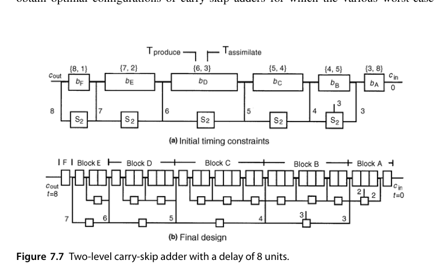{fig-align="center" width="85%"}

继续加第三级、第四级会怎样？形式化地做下去，$t$ 级跳过可以把同样延迟预算下的字宽推向 $O(8^t)$ 量级的增长（例 7.1 与 7.2 之间就是 18 → 30 的一步），但每一级新增的使能逻辑都在给所有下级跳过信号"加税"。实践中的甜区停在 2-3 级：再往上，控制信号的延迟与布线复杂度吃掉收益，而且结构的不规则性让版图与验证成本陡增——这又与 6.2 节"lookahead 级数并非越多越好"的结论平行。

当工艺参数变复杂（曼彻斯特链的平方延迟、不同层的 mux 延迟不同等等），解析最优解往往不存在，这时改用**动态规划**在给定的延迟函数下搜索最优配置。其通用模型把 $b$ 位全加器块的延迟拆成三部分：内部进位传播延迟 $I(b)$、进位生成延迟 $G(b)$、进位吸纳延迟 $A(b)$，再为每一跳过层级 $h$ 定义跳过延迟 $S_h(b)$ 与使能延迟 $E_h(b)$。前面那些分析不过是 $I(b) = b-1$、$G(b) = A(b) = b$、$S_h(b) = 1$、$E_h(b) = h+1$ 的一个特例（即 Turrini 模型）。动态规划的状态转移思路与例 7.2 完全同构：从左到右扫描，对每个"已覆盖位数 + 当前进位就绪时刻"的状态记录最优前缀配置——问题的最优子结构来自"进位链是单向的"，低位的最优选择与高位无关。Chan 等人的工作证明，在这个通用模型下连变宽 CLA 的最优块宽也能用同一框架求解——跳过与超前，在优化器眼里是同一张图上的两条边权。

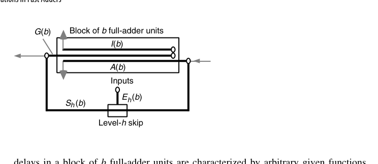{fig-align="center" width="85%"}

它与前缀网络的差距在于：渐近延迟可做到 $O(k^{1/t})$（$t$ 为层次数），但随层数增加，跳过逻辑本身也成了负载，加上布线不规则带来的版图开销——理论很美，落地要权衡。对比第 6 章前缀网络的 $O(\log k)$，多级跳过在渐近上终究差一档；但跳加器的卖点从来不是渐近，而是**中等字长下的极低常数因子与结构规整性**：32 位以内，一个两级变宽跳加器的实际延迟与前缀加法器的差距，常常小到不值得付出前缀网络的布线代价。

把多级跳加器的设计流程沉淀成可复用的四步，供实际项目参考：

1. **定延迟模型**：按目标工艺标定块内行波、跳过、使能的延迟函数（$I, G, A, S_h, E_h$），曼彻斯特链要特别标定平方项；
2. **定级数**：从 1 级开始，用例 7.1/7.2 的方法算可达字宽，不够再加一级——通常 2 级封顶；
3. **定块宽**：变宽优先，纺锤形分布，用解析公式或动态规划求解；
4. **做剪枝**：删去短块上"挣不回使能延迟"的跳过电路，再复核一遍关键路径。

## 7.3 进位选择加法器（Carry-Select Adders）

思想一句话：**每组同时算两份和（假设进位输入为 0 和为 1），等真实进位到达后用 mux 二选一**。

最经典的单级形式（图 7.9）是用**三个 $k/2$ 位加法器**搭一个 $k$ 位加法器：低半部分用一个 $k/2$ 位加法器直接算出；高半部分用**两个** $k/2$ 位加法器，分别按 $c_{k/2} = 0$ 与 $c_{k/2} = 1$ 两个剧本算好和与进位输出；等真正的 $c_{k/2}$ 到达，再用一个 $k/2+1$ 位宽的选择器二选一。以单位 2:1 mux 的代价与延迟为单位，它的代价与延迟是

$$
C_{\text{select-add}}(k) = 3C_{add}(k/2) + k/2 + 1,\qquad
T_{\text{select-add}}(k) = T_{add}(k/2) + 1
$$

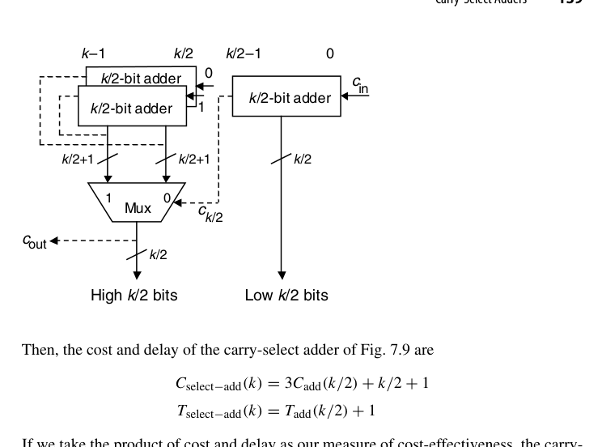{fig-align="center" width="85%"}

用"代价 $\times$ 延迟"作为性价比指标，select 方案优于"直接把成分加法器做宽"当且仅当

$$
\big[3C_{add}(k/2) + k/2 + 1\big]\big[T_{add}(k/2) + 1\big] < C_{add}(k)\,T_{add}(k)
$$

代入行波加法器的 $C_{add}(k) = \alpha k$、$T_{add}(k) = \tau k$，取 $\tau = \alpha/2 > 1$ 化简：左端主导项是 $3\alpha(k/2) \cdot \tau(k/2) = \frac{3}{4}\alpha\tau k^2$，加上低阶修正后与右端 $\alpha\tau k^2$ 比较，可得临界条件 $k > 16/(\alpha-1)$。也就是说 $\alpha = 4,\ \tau = 2$ 这类典型取值下（临界 $k \approx 5.3$），carry-select 几乎总是优于纯行波。这个推导范式本身比结论更重要：**"3 个半宽加法器 + mux"与"1 个全宽加法器"的比价方法可以套到任何成分加法器上**——把 CLA 的 $C, T$ 代入同一不等式，就能判断"CLA + select 混合"在什么字长开始反超纯 CLA。

两个进阶技巧值得记住（第一条尤其值得展开）：

- **高位那对加法器不必各做各的**。若成分是 CLA，两个版本的 $g_i, p_i$ 完全相同（只有最低位的 $c_{in}$ 注入不同），进位网络可以大面积共享，性价比还能再高一截。共享的具体做法：位级与块级的 $(g, p)$ 只算一份；前缀网络里凡是"依赖块输入进位"的项都按 $c_{k/2} = 0$ 的版本算，再把每个进位的两个候选写成 $c_{i+1}^{(0)} = g_{[k/2,i]}$ 与 $c_{i+1}^{(1)} = g_{[k/2,i]} + p_{[k/2,i]} = t_{[k/2,i]}$——后者只是前者再 OR 一个已经算好的块传播信号。于是每个进位多付的只是一个或门加一个 mux，而非一整个加法器。
- **组宽允许不等**。图 7.9 完全可以画成"一个 $a$ 位 + 两个 $b$ 位 = 一个 $(a+b)$ 位"，用 $c_a$ 去选高 $b$ 位。当选择信号的到达时刻与和位的到达时刻不一致时，非等宽分组才是合理的——这与 skip 加法器"越靠后的块可以越宽"的直觉同源。

叠第二级就得到**二级进位选择**（图 7.10）：每个 $k/4$ 位块（最右块除外）都算两种版本，第一层三个宽度为 $k/4+1$ 的 mux 把它们并成 $k/2$ 位块的结果，第二层一个 $k/2+1$ 位宽的 mux 收尾。信号路由值得细看：最低块直接算出 $c_{k/4}$，用它为第一层第一个 mux 做选择；选中后的 $k/2$ 位块结果自带进位输出，再为第二个第一层 mux 做选择——**选择信号像接力棒一样在 mux 链上传**，每一棒只晚一级 mux 延迟。最上方横跨位 $k/2$ 到 $3k/4-1$ 的那对加法器，其进位输出同样要按 $c_{k/2}$ 的两种假设各备一份，供第二层 mux 定夺。把它与二级 CLA（图 6.4，但改用 2 位 lookahead 生成器）对比很有启发意义：图 7.10 的数据流是**自上而下单向**的，流水线切分比"先下行汇总 $(g,p)$、再上行分发进位"的 CLA 自然得多。

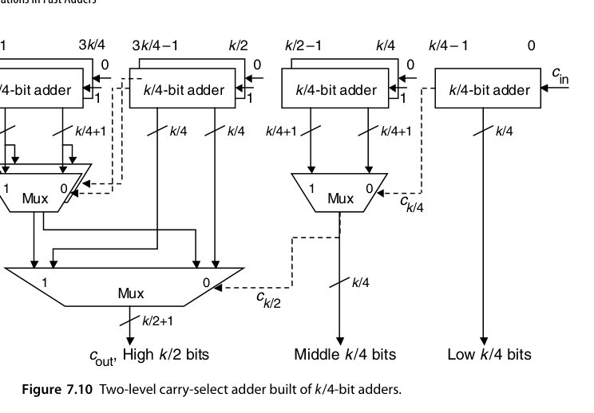{fig-align="center" width="85%"}

这里还有一个漂亮的联系。如果图 7.9 里我们只关心**进位**、不关心和位（最后用 $k$ 个 XOR 一次性生成），那么高位的那对加法器就退化成一个采用 $(g, t)$ 而非 $(g, p)$ 信号对的并行前缀网络——因为 $c_{i+1}$ 在 $c_{k/2}=0$ 时是 $g_{[k/2,i]}$，在 $c_{k/2}=1$ 时是 $t_{[k/2,i]} = g_{[k/2,i]} + p_{[k/2,i]}$。整个结构与图 6.7 的 Ladner-Fischer 网络几乎同构，连"$c_{k/2}$ 要扇出去驱动 $k/2+1$ 个选择器"这个高扇出毛病都一模一样。

这个同构关系给了一个重要的设计启示：**carry-select 与前缀网络不是竞争对手，而是同一结构的两种读法**。mux 的选择端对应前缀网络里的"$c_{in}$ 注入点"，mux 的数据端对应 $(g, t)$ 候选对。读论文时遇到"select-style prefix adder"之类的说法，说的就是把图 7.9 按前缀方式重画一遍——结构不变，只是分析视角从"赌两种进位"换成了"算两种前缀"。

组内两个加法器完全并行，组间延迟只剩**每级一个 mux**。$k$ 位均分 $k/t$ 组时，延迟 ≈ 组内行波 $t$ 级 + $(k/t)$ 级 mux；取 $t = \sqrt{k}$ 得 $O(\sqrt{k})$。代价是加法器几乎翻倍（每组两份）加 mux 树。用 16 位均分 4 组走一遍延迟账：组内 4 级行波，$c_4$ 在约第 5 级就绪（含 $g,p$ 产生），之后 $c_8, c_{12}, c_{16}$ 各晚一级 mux，和位在对应选择信号到达后再晚一级——总延迟约 9 级，与同字长单级跳加器相当，但结构更规整、且天然适配"各组独立流水"的划分。

**渐进组宽（linearly increasing group size）**：让组宽逐级 +1（因为越靠后的组，其选择进位到达越晚，组内可以多算一位而"不吃亏"），在相同资源下把延迟再压低一截——这是 carry-select 教科书级的优化细节。以 16 位为例，等宽 4-4-4-4 与渐进 2-3-4-5（组宽按"选择信号到达时刻"递增）对比：后者的最后一组可以在 $c_{11}$ 就绪前多算 1 位行波，总延迟省出一级；组宽序列的通用规则是 $b_j \approx b_0 + j$，与 7.1 节变宽跳加器的纺锤形同源、但单调——因为 select 的选择信号单向传播，没有"从右端也长出来"的对称约束。把逐级细分推到极致（最小的块只有 1 位），就得到 7.4 节的条件和加法器。

### RTL 实践：`rtl/ch7_3_carry_select_adder`

```systemverilog
module carry_select_adder #(parameter int N = 16, parameter int G = 4) (
    input  logic [N-1:0] a, b,
    input  logic         cin,
    output logic [N-1:0] s,
    output logic         cout
);
    localparam int NG = N / G;
    logic [NG:0] c;
    assign c[0] = cin;
    assign cout = c[NG];
    genvar gi;
    generate
        for (gi = 0; gi < NG; gi++) begin : g_group
            logic [G-1:0] s0, s1;
            logic         c0, c1;
            assign {c0, s0} = {1'b0, a[gi*G +: G]} + {1'b0, b[gi*G +: G]};
            assign {c1, s1} = {1'b0, a[gi*G +: G]} + {1'b0, b[gi*G +: G]} + 1'b1;
            assign s[gi*G +: G] = c[gi] ? s1 : s0;
            assign c[gi+1]      = c[gi] ? c1 : c0;
        end
    endgenerate
endmodule
```

## 7.4 条件和加法器（Conditional-Sum Adder）

把 carry-select 的"两份都算、进位来选择"递归到底：先逐位算"若进位 0/若进位 1"两种 (sum, carry)，再两两合并成 2 位组、4 位组……每合并一次，候选数量减半、位宽加倍。$\log_2 k$ 级后得到最终结果。历史上这正是最早的对数时间加法器方案之一（Sklansky，1960 年）——比 Ladner-Fischer 的前缀框架早了二十年；今天回头看，它与前缀加法器的差别只是"冗余信息保存在 mux 数据端"还是"保存在 $(g,p)$ 信号对里"。命名上顺带澄清：文献里的"Sklansky 加法器"通常指他同年提出的另一种前缀结构（逐级倍增覆盖距离的前缀图），而非条件和加法器本身——同一作者的两项工作在后世的称呼里走了两条路，引用时注意区分。

最顶上那一层长什么样？图 7.11 给出了单个位位置的候选生成器：它同时算出 $c_i = 0$ 与 $c_i = 1$ 两种情形下的和位 $s_i$ 与进位输出 $c_{i+1}$。注意这里并不需要真正的加法器——两个 XOR 加若干与或门即可，成本极低。

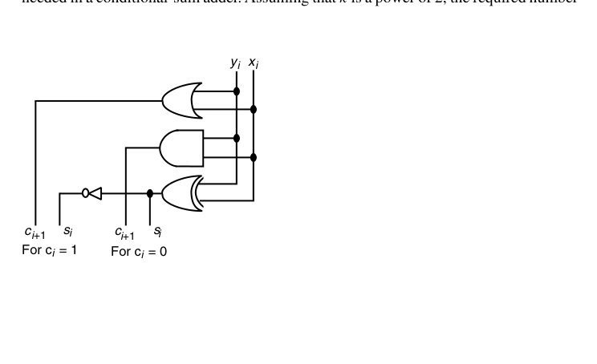{fig-align="center" width="85%"}

以 1 位 2:1 mux 的代价与延迟为单位、记顶层单元的代价与延迟为 $C(1)$、$T(1)$，则 $k$ 位条件和加法器满足

$$
C(k) \approx 2C(k/2) + k + 2 \approx k(\log_2 k + 2) + k\,C(1),\qquad
T(k) = T(k/2) + 1 = \log_2 k + T(1)
$$

代价递推中的 $k+2$ 是"把两个 $k/2$ 位结果合成一个 $k$ 位结果所需的 1 位 mux 数"的上界。精确计数（设 $k$ 为 2 的幂）为

$$
(k/2 + 1) + 3(k/4 + 1) + 7(k/8 + 1) + \cdots + (k-1)\cdot 2 = (k-1)(\log_2 k + 1)
$$

逐项读这张账单：最底层（合并两个 $k/2$ 位块）需要 $k/2 + 1$ 个 1 位 mux（$k/2$ 个和位加 1 个进位输出）；它的下一层有 3 个这样的"块合并点"——想想图 7.10 的三组第一层 mux，每组 $k/4 + 1$ 个；再下一层 7 个合并点、每组 $k/8 + 1$ 个……一般项是"$(2^j - 1)$ 个合并点 $\times$ 每组 $(k/2^j + 1)$ 个 mux"。把 $j$ 从 1 加到 $\log_2 k$，整理后就是右端的闭式。

总代价即 $(k-1)(\log_2 k + 1) + k\,C(1)$。换句话说：**代价是 $O(k\log k)$ 个选择器**——这正是它比 CLA/前缀网络昂贵的根源，也解释了为什么它在 VLSI 实践中逐渐让位于前缀结构。代入 $k = 16$ 感受一下量级：$T(16) = 4 + T(1)$（位级之后 4 级 mux），$C(16) = 15 \times 5 + 16\,C(1) = 75 + 16\,C(1)$ 个 1 位选择器——延迟确实漂亮，但 75 个 mux 的布线面积与底层选择信号的扇出，在同等延迟的前缀网络面前毫无招架之力。

用一个 4 位小例子把流程走一遍（沿用 6.1 节的数据 $x = 1011$、$y = 0111$、$c_{in} = 0$，正确答案 $18 = 10010_2$）。第 0 层逐位生成两种候选：

| 位 | $c_i = 0$ 时的 $(s_i, c_{i+1})$ | $c_i = 1$ 时的 $(s_i, c_{i+1})$ |
|---|---|---|
| 0 | (0, 1) | (1, 1) |
| 1 | (0, 1) | (1, 1) |
| 2 | (1, 0) | (0, 1) |
| 3 | (1, 0) | (0, 1) |

第 1 层合并相邻位：以块 $[1:0]$ 为例，$c_0 = 0$ 时第 0 位给出 $(s_0, c_1) = (0, 1)$，第 1 位在 $c_1 = 1$ 下给出 $s_1 = 1$，故候选为 $(s_1 s_0) = 10$、块进位输出 1；同理 $c_0 = 1$ 时为 $11$、进位输出 1。由于实际 $c_{in} = 0$，低位两位的和确定为 $10$，且向高位块的进位为 1。第 2 层对块 $[3:2]$ 套用同样的规则处理 $c_2 = 1$ 的情形，得到 $(s_3 s_2) = 00$、进位输出 1。最终 $s = 0010$、$c_{out} = 1$，两层选择即告完成——**与 CLA 同为 $\log_2 k$ 级**。

把这个过程投影到原书表 7.2 那样的 16 位全景表上，规律一目了然：**每多一层，"和与进位已确定"的块宽翻一倍**——第 1 层后每 2 位块定案，第 2 层后每 4 位块定案，第 $j$ 层后每 $2^j$ 位块定案。已知块像滚雪球一样从右向左吞并未知区域，$\log_2 k$ 层后整个字长定案。这张表也是手工验证条件和加法器设计时最顺手的工具。

- **延迟**：位级 1 层 + $\log_2 k$ 级 mux → 与 CLA 同阶，$O(\log k)$；
- **代价**：$O(k\log k)$ 个 1 位选择器，且 mux 树的扇出/布线不规则（越靠近底层的 mux 越宽），VLSI 实践中不如前缀网络受欢迎。

### RTL 实践：`rtl/ch7_4_conditional_sum_adder`

递归式 generate 实现：第 0 层逐位生成两组候选，之后每层用低半部分的进位输出选择高半部分的候选。

一个自检技巧：把整个流程按 $c_{in} = 1$ 重做一遍，只有第 0 层的候选生成逻辑变化（$x_i, y_i, 1$ 的全加器代替 $x_i, y_i, 0$），以上各层完全不动——因为上层看到的只是"两个候选"，对 $c_{in}$ 的取值无感知。这种"参数只影响叶子"的性质是递归结构的典型红利，testbench 里用极少的针对性用例就能覆盖全部内部节点。

## 7.5 混合设计与优化（Hybrid Designs and Optimizations）

真实高性能加法器几乎都是**混血儿**。先给一张"哪些纯种之间容易杂交"的经验地图：

- **CLA × select**：最主流的组合，两个方向都常见——select 解决字长尴尬（下文 32 位例子），CLA 给 select 的成分加法器提速；
- **CLA × 行波**：牺牲一点速度换模块化与可复用性（图 7.13 的 48 位例子）；
- **条件和 × CLA**：条件和管块内、CLA 管块间，专治条件和的高扇出（MU5）；
- **skip × 任意**：skip 逻辑几乎可以作为"外挂"叠加到任何行波型成分上；
- **稀疏前缀 × 小组行波/CLA**：前缀树只算每 4 或 8 位一个的稀疏进位，组内自理——当代高性能加法器的事实标准。

两个方向的组合顺序含义不同，值得区分：「A/B」（如 carry-lookahead/carry-select）表示上层用 A 产生的信号去选择 B 算出的候选；「B + A 级联」则是简单串联。读文献时先看清楚组合方向，再评估延迟账。

- **CLA + carry-select**：组内 CLA、组间选择（或反之），兼顾关键路径与面积；
- **前缀网络只算"稀疏进位"**（如每 4 位一个进位），组内用行波/小 CLA——稀疏树（sparse tree）是工业界常见手法，省下一半前缀节点；
- **进位增量（carry-increment）结构**：先算无进位和，进位到达后用增量器修正——把"选择"换成"增量"，逻辑更省。

为什么必须混？一个字长恰好能说明问题：用 4 位 lookahead 块时，16 位（两级）与 64 位（三级）都能搭得干净利落（图 6.4），而 32 位却要两级 lookahead 还不够、得再加一层——**它比 64 位加法器快不了多少**。这时"两个 16 位 CLA + 一级 carry-select 把宽度翻倍"往往是更好的答案：低 16 位照常走 CLA，高 16 位的两个版本与低位并行计算，等 $c_{16}$ 出来只多付一级 mux——延迟几乎等于 16 位 CLA 加一级，而不是 64 位 CLA 的 13 级。字长与块的常用粒度不匹配时，混合结构总能补上这个缺口。

反过来组合同样常见，图 7.12 就是一个 CLA + carry-select 的例子：每个小块基于曼彻斯特进位链（既能提供 $(g, p)$ 给上层的 lookahead 进位生成器，也能在块进位到达后算出块内进位与和位），上层 lookahead 生成器的输出再去控制每个块的选择器。它的精妙之处在于**时间上的重叠**：只要块的 $(g, p)$ 出得够快，lookahead 网络里的信号传播可以与小块内部的进位传播完全并行。第六章图 6.13 那张网络正是为这种混合方案设计的——8 位 MCC 块算完的时刻，恰好也是 $c_{24}, c_{32}, \ldots, c_{56}$ 这些稀疏进位可用的时刻，于是总延迟只比 lookahead 网络本身多两个逻辑级。

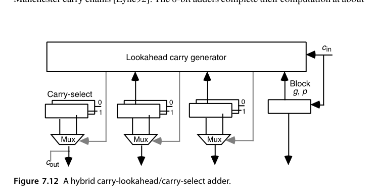{fig-align="center" width="85%"}

另一种常见的组合是与一个更低级的结构混：图 7.13 给出一个 48 位的行波/超前进位混合加法器——三个 16 位 CLA 块串联，块间进位纯行波，但最右块的 $(g, p)$ 信号送进一个带进位输出的 4 位 lookahead 生成器，把 $c_{16}$ 的等待时间藏进块内计算里。它比纯 CLA 慢一些，但结构极其规整、模块化程度高（每 16 位就是一个可复用的 16 位 CLA 块），在调试成本、版图复用与验证工作量上的收益常常压过那点速度损失。这种"性能让位于工程效率"的取舍在 IP 核与 SoC 集成场景里尤其常见：一个参数化、可复用、验证充分的 16 位 CLA 软核，远比一个为 48 位专门优化的裸结构值钱。

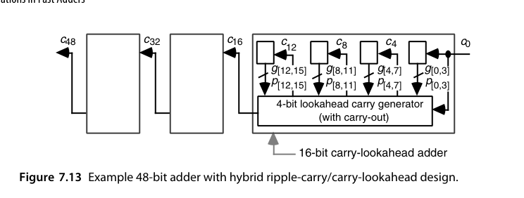{fig-align="center" width="85%"}

条件和加法器也有一个典型的混合用法值得点名：它对宽字长最大的软肋是**底层 mux 控制信号的高扇出**（参考图 7.10，越靠下的选择信号要驱动越多的 mux）。曼彻斯特大学 MU5 计算机的解法是"小块条件和 + 块间超前进位"——条件和只做到小组内部，组间进位交给 CLA 网络，扇出问题随之化解。

真实产品里混得比这还狠。Compaq/DEC Alpha 21064 的 64 位加法器同时用了**四种**机制：最底层是 8 位曼彻斯特进位链；第二层用超前进位算出和的低 32 位；高 32 位则用条件和的思想算出两个版本；最后用进位选择挑出正确结果。这种"看菜下饭"的组合在工程上才是常态。

变宽分块的思想也能反哺 CLA：固定 4 位块的多级 lookahead 只是分析的默认解，Nigaglioni 与 Swartzlander 的"可变生成树（variable spanning tree）"加法器证明，按各块的输入到达时刻与扇出负担调整块宽（慢路径上的块做小、快路径上的块做大），还能在纯 CLA 框架内再榨出一级左右的延迟。这与图 7.14 的到达时刻优化是同一枚硬币的两面。

最后提醒一个常被教科书忽略的自由度：**操作数各比特并不总是同时到达的**。图 7.14 展示了树形乘法器中最终快速加法器的典型输入到达时刻曲线——低位的下一个操作数比特早就稳定了，而中段某些位要等到压缩树的更深层才可用。把这个"到达时刻剖面"喂给加法器设计者，就可以针对性地调整各块的宽度与结构（对早到的位让它多干活），从而压低整体延迟。同理，即使对纯 CLA 而言，等宽分块也可能不如按工艺与目标延迟重新优化过的变宽分块。这类"知道信号何时来"的优化有一个正式的名称——**到达时刻感知（arrival-time aware）设计**：Oklobdzija 等人的乘法器综合方法正是把部分积压缩树的输出剖面作为最终加法器的输入约束，联合求解两级结构；其结果往往是非对称、不等宽、肉眼看着"不美"但实测更快的网络。对读者而言，带走的原则是：等宽、对称只是分析的便利，不是设计的目标。

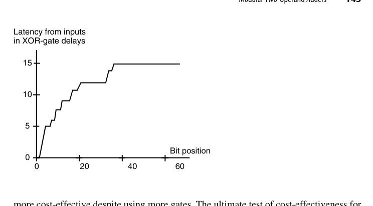{fig-align="center" width="85%"}

::: {.callout-tip title="工程视角"}
选型的真正输入是**设计约束**（时钟周期、面积/功耗预算、工艺节点的线与门延迟比），而不是教科书上的渐近复杂度。32 位以内、频率不极端时，综合工具用行为级 `+` 自动推断的结构往往已足够好；手写前缀/混合结构的意义在 64 位以上或 GHz 级设计。
:::

carry-select 还有一个隐蔽优势在本章没有展开：**它是流水化最自然的快速加法器**。单向数据流意味着在任何组边界划一刀插入流水寄存器，都不产生反馈环；对比之下，多级 CLA 的"先汇总后分发"结构里，进位分发层天然带有从网络深处回到各块的扇出，流水切分点要精挑细选。在深度流水的向量/AI 处理器里，这个差异会直接左右加法器拓扑的取舍。

## 7.6 模运算的两操作数加法器（Modular Two-Operand Adders）

模 $m$ 加法：$(x + y) \bmod m$。套路：先算 $x + y$，若 $\ge m$ 则减 $m$。硬件上是"一个加法器 + 一个减法器（或加 $2^k - m$ 的加法器）+ 一个选择"。先把三类模数的处理成本总览如下，细节随后展开：

| 模数 | 处理方法 | 额外硬件 | 额外延迟 |
|---|---|---|---|
| $2^k$ | 截断进位输出 | 无 | 0 |
| $2^k - 1$ | 循环进位（end-around carry） | 一根反馈线 | ≈1 级 |
| $2^k + 1$ | 减 1 编码 + 反相循环进位 | 反馈反相器 + 零标志逻辑 | ≈1 级 |
| 一般 $m$ | 并行算 $x+y$ 与 $x+y-m$ 后选择 | 1 个 CSA + 1 个加法器 + mux | 1 级 CSA + 1 级 mux |

应用场景先交代两句，因为它们是这类加法器存在的全部理由：**剩余数系（RNS，第 4 章）**的每个通道就是一个模 $m_i$ 的算术单元，通道越多、模加越快，整个 RNS 的优势越大；**密码学**里 RSA 与椭圆曲线的模乘可以分解为模加与条件移位，模加器的延迟直接决定吞吐。这两个场景的共同点是"模数固定、操作数海量"——为固定 $m$ 专门优化是完全合理的投资。

- 模 $2^k$：免费（截断）；
- 模 $2^k - 1$：循环进位（end-around carry）——把 $c_{out}$ 加回最低位，一个加法器加一级修正；值得提醒的是循环进位与 CLA 的微妙关系：把 $c_{out}$ 接回 $c_{in}$ 在组合逻辑里会形成一条"假环路"，必须借前缀网络的 $(G_{[0,k-1]}, P_{[0,k-1]})$ 打破——当 $P_{[0,k-1]} = 1$ 时环路退化为 $c_{out} = c_{in}$，需要单独处理，这正是 1 的补码 CLA 设计里著名的细节坑；
- 一般 $m$：两加法器 + mux；若操作数已知 $< m$，可做**三操作数预计算** $x + y - m$ 与 $x + y$ 并行，按符号位选择，等价于 carry-select 的思想。

还有一种特殊模数值得点名：$m = 2^k + 1$。它需要用 $k+1$ 位表示 $2^k+1$ 个剩余类，因此编码方式有商量余地，其中**减 1 编码（diminished-1 encoding）**最为巧妙：零值用一个专门的标志位表示（其余 $k$ 位全 0），非零值 $x$ 则清掉标志位、低 $k$ 位存 $x-1$。

以 $m = 17$ 为例（$k = 4$，操作数取值 $[0,16]$）。设 $x \ne 0$、$y \ne 0$ 且 $x + y \ne 17$：当 $x+y \le 17$ 时输出应为 $x+y-1$，当 $x+y \ge 18$ 时输出应为 $x+y-18$。两种情况改写为

$$
(x-1) + (y-1) + 1 \;\;(\text{当 }(x-1)+(y-1) \le 15),
\qquad
(x-1) + (y-1) - 16 \;\;(\text{当 }(x-1)+(y-1) \ge 16)
$$

结论呼之欲出：**把两个减 1 表示直接相加，并使用"反相循环进位"（令 $c_{in} = \bar{c}_{out}$）**。$c_{out} = 0$ 时相当于加 1（补回减 1 编码欠下的那个 1），$c_{out} = 1$ 时直接丢弃进位即等价于减 16，两种情形都对。零标志与 $x+y = 17$ 这两个边界条件需要额外的少量判决逻辑来处理。

代个数验证：$x = 9$、$y = 12$，$x + y = 21 \equiv 4 \pmod{17}$。减 1 编码下 $x \to 8$、$y \to 11$；$8 + 11 = 19$，$c_{out} = 1$，反相后 $c_{in} = 0$，丢弃进位得 $19 - 16 = 3$，正是 $4 - 1$ 的减 1 表示。再试不绕回的一支：$x = 3$、$y = 5$，$3 + 5 = 8$；编码 $2 + 4 = 6$，$c_{out} = 0$、$c_{in} = 1$，得 $6 + 1 = 7 = 8 - 1$。两条路径共用同一个加法器，模运算的全部代价只是一根反相的反馈线。

对一般模数 $m$，朴素做法是"比较 $x+y$ 与 $m$，必要时减 $m$"，但比较与随后的减法在最坏情况下都要完整进位传播，延迟往往不可接受。工业做法是把选择提前：**并行算出 $x+y$ 与 $x+y-m$，用后者的符号位选择**。由于 $-m$ 是常数，可以先用一级进位保存加法器把它并入，几乎不增加关键路径。

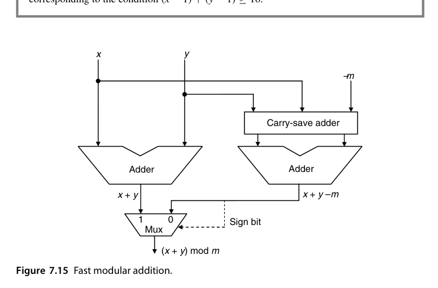{fig-align="center" width="85%"}

这条路径上只多了"一级 CSA + 一级 mux"，远好于"加法 → 比较 → 减法"的三段式。这正是第 4 章 RNS 通道里的基本单元，也是密码学模乘累加器的日常。

模 $2^k - 1$ 的循环进位还有一个与条件和思想相通的替代实现，值得对比：不拉回 $c_{out}$，而是**并行算出 $x + y$ 与 $x + y + 1$，用 $c_{out}$ 二选一**——把"加 1"挪进候选空间，关键路径上只剩一级 mux。这与图 7.15 对一般模数的做法完全同构：模加法的设计空间本质上就是"反馈修正"与"候选选择"两个家族，与第 7.3-7.4 节的分野一脉相承。

把本章三类"侧翼"方案与第 6 章的"正面"方案放在一起对账（$k$ 位、门级模型）：

| 方案 | 渐近延迟 | 硬件代价 | 结构规整性 | 典型甜区 |
|---|---|---|---|---|
| 多级 CLA / 前缀 | $O(\log k)$ | $O(k)$ ~ $O(k\log k)$ | 中-高 | 64 位以上、高频 |
| 进位跳过（变宽） | $O(\sqrt{k})$（多级 $O(k^{1/t})$） | $O(k)$，增量极小 | 高 | 32 位以内、中频 |
| 进位选择（变宽组） | $O(\sqrt{k})$ | ≈2 倍加法器 + mux | 高 | 各档字长、流水友好 |
| 条件和 | $O(\log k)$ | $O(k\log k)$ 个 mux | 低（mux 树不规则） | 教学价值 > 实用 |
| 混合结构 | 视组合 | 视组合 | 可定制 | 工业界默认答案 |

## 本章小结

- skip：组内行波 + 全传播跳过；定宽组 $b_{opt}=\sqrt{k/2}$、延迟 $2\sqrt{2k}-3$，变宽组 $t_{opt}=2\sqrt{k}$、延迟 $2\sqrt{k}-2$（再快一个 $\sqrt{2}$）；
- select：双份计算 + mux 选择，$O(\sqrt{k})$（变宽组更优），面积翻倍；高位两个加法器若用 CLA 可共享进位网络；
- conditional-sum：select 递归到底，$O(\log k)$ 延迟但 $O(k\log k)$ 个选择器，布线不规则；
- 混合与稀疏结构是工业常态（字长不"整"时尤其如此）；设计还可以利用各比特不同的到达时刻剖面；
- 模加法是"加法 + 条件修正"，与 carry-select 同源；$2^k$ 免费、$2^k-1$ 用循环进位、$2^k+1$ 用减 1 编码，一般 $m$ 则并行算 $x+y$ 与 $x+y-m$ 后按符号选择。

## 原书插图

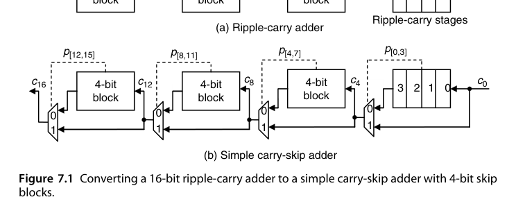{fig-align="center" width="85%"}

{fig-align="center" width="85%"}
