# 第8章 多操作数加法（Multioperand Addition）

## 本章导读

乘法（第 9-11 章）的本质是"把 $n$ 个部分积加起来"。如果每加一个操作数都等一次完整进位传播，$n$ 个数相加就是 $n-1$ 次 $O(\log k)$ 延迟——太慢。本章的答案是第 3 章预告过的**进位保存（carry-save）**思想：用压缩树（counter/compressor tree）先把 $n$ 个操作数"压"成 2 个，最后只做一次完整加法。Wallace 树、Dadda 树是压缩树的两座高峰，也是一切现代乘法器的发动机。

## 8.1 用两操作数加法器实现（Using Two-Operand Adders）

多操作数加法不是凭空讨论的——乘法与向量内积都直接归结为它：乘法里 $k$ 个部分积 $x_i a$ 要相加，内积里各分量乘积 $p^{(j)} = x^{(j)}y^{(j)}$ 要相加，均值滤波这类求平均操作同理。本章约定 $n$ 个操作数都是宽度为 $k$ 的无符号整数、最低位对齐（有符号情形留到 8.5 节）。

分析这类问题，**点记法（dot notation）**是最省笔墨的图形语言：一个点代表一个单位比特权重，某一列上点的个数就是该位待处理的比特数。后面所有压缩树图都用这种语言。

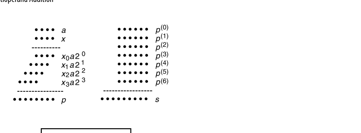{fig-align="center" width="85%"}

最直白的实现是把 $n$ 个数逐个喂给同一个两操作数加法器（图 8.2）：每拍送入一个操作数，另一个输入来自部分和寄存器。由于最终结果最大可达 $n(2^k-1)$，部分和寄存器要 $\lceil \log_2(n2^k-n+1) \rceil \approx k + \log_2 n$ 位宽。用对数时间的快速加法器时

$$
T_{\text{serial-multi-add}} = O\big(n\log(k + \log n)\big) = O(n\log k + n\log\log n)
$$

固定 $k$ 时它随 $n$ **超线性**增长——这是最要命的地方。

串行方案可以流水化。若加法器做成 4 级流水，用三个加法器就能达到"每拍吞吐一个操作数"（图 8.3）：每级之后都有锁存器，图上的 Delay 模块只表示一个空操作加一级锁存。这里有个必须记住的教训：**流水改善的是吞吐，而不是延迟**——从第一个输入到最后一个输出的总延迟在任意固定流水级数 $h$ 下都没有渐近改善。

图 8.3 的数据流值得追踪一遍。设当前拍输入为 $x^{(i)}$：加法器 A 吃 $x^{(i)}$ 与 $x^{(i-1)}$，其四级锁存里分别存着 $x^{(i-1)}+x^{(i-2)}$、$x^{(i-2)}+x^{(i-3)}$、$x^{(i-3)}+x^{(i-4)}$、$x^{(i-4)}+x^{(i-5)}$——A 每拍"退休"一对相邻输入之和；A 的输出与 Delay 链推后一拍的前序结果一起进加法器 B，B 每拍退休"四个连续输入之和"；B 再与更长的延迟链配合进加法器 C，C 每拍退休"八个连续输入之和"。三条流水线错峰衔接，恰好凑出每拍消化一个新操作数的稳态。代价是三倍加法器硬件加一堆锁存器——吞吐的账和延迟的账要分开算。

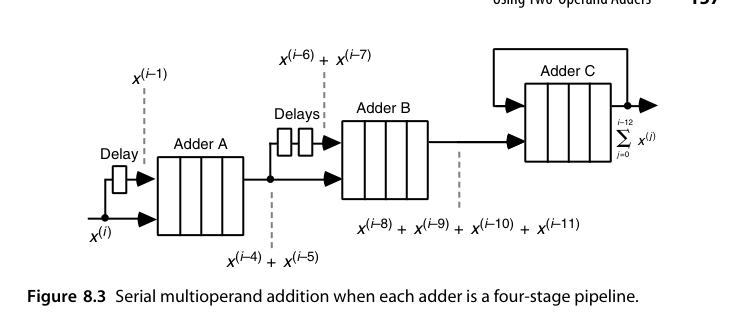{fig-align="center" width="85%"}

要提速只能树形化，把 $n-1$ 个加法器配成平衡二叉树：

- **串行链**：延迟 $(n-1) \times T_{add}$，硬件 $n-1$ 个加法器；
- **平衡树**：树高 $\lceil \log_2 n \rceil$，但各层加法器的字宽从 $k$ 一路涨到 $k + \lceil \log_2 n\rceil - 1$。图 8.4 的七数例子把这个宽度梯度标得很清楚：最底层四个 $k$ 位加法器，次层两个 $k+1$ 位，再往上 $k+2$ 位，树根 $k+3$ 位——每一层最多只长 1 位，因为两个 $w$ 位数之和至多是 $w+1$ 位。这个"每层 +1"的缓慢增长正是后面逐层延迟可以错位重叠的前提。

若树里用的是对数时间快速加法器，把各层的延迟加起来得

$$
T_{\text{tree-fast-multi-add}} = O\big(\log k + \log(k+1) + \cdots + \log(k+\lceil\log_2 n\rceil-1)\big)
= O(\log n \log k + \log n \log\log n)
$$

第二步等号的证明只需分两种情形放缩：当 $\log_2 n \le k$，每一项 $\log(k+j) \le \log(2k) = \log k + 1$，求和即 $O(\log n \log k)$；当 $\log_2 n > k$，把求和按 $\log(k+j) \le \log(2\log_2 n) = O(\log\log n)$ 放缩，得 $O(\log n \log\log n)$——两种情形都被右端覆盖。

出人意料的是，**把树里的快速加法器换成最朴素的行波进位加法器反而更快**（甚至比位串行加法器好不了多少的局面下，行波树仍是最优选择之一）：

$$
T_{\text{tree-ripple-multi-add}} = O(k + \log n)
$$

图 8.5 解释了原因：第 $i+1$ 层的加法器根本不必等第 $i$ 层完成完整进位传播，只需在其**一个 FA 延迟**之后就可以从最低位开始算——每层的进位传播比前一层滞后恰好 1 个时间单位。于是除最后一层需要完整的行波时间外，其余各层只贡献常数开销。这是"整体性能取决于数据流能否重叠，而不取决于单个部件有多快"的一个范例。

把三种方案放在 $(n, k)$ 平面上看取舍：$n$ 大 $k$ 小（如大量短操作数累加）时，串行/流水方案的 $O(n\log k)$ 里 $\log k$ 是常数，未必输给树；$k$ 大 $n$ 小（如高精度乘法的少数几个部分积）时，树形方案优势巨大；而行波树 $O(k + \log n)$ 与快速加法器树 $O(\log n \log k)$ 的交界，大致在 $k \approx \log n \log k$ 处——实践中这个交叉点出现得比直觉更早，因为行波树的常数因子小得多。

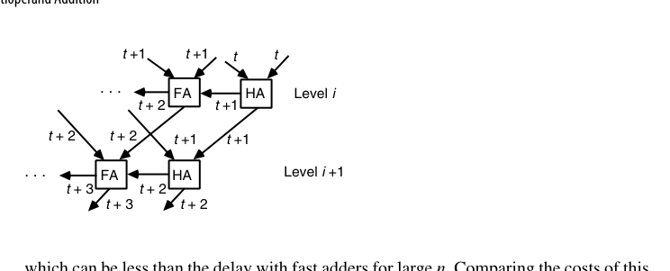{fig-align="center" width="85%"}

那么理论下限在哪？整个网络要消化 $kn$ 个输入比特，用常数扇入的逻辑门实现时，任何方案的延迟都不可能低于 $O(\log(kn)) = O(\log k + \log n)$。这个下界是可以达到的——靠的就是下一节的进位保存加法器。

注意每次加法都伴随一次**完整进位传播**。$n$ 稍大就不可接受——16 个操作数要摊上 4 级完整 CLA。能不能让中间过程**不做完整加法**？可以，这就是 CSA。本质上这是一次表示法的转换：把"非冗余的二进制和"换成"冗余的（和, 进位）双轨表示"，用第 3 章讲过的冗余数系红利——加法常数延迟——换掉每次归约的进位传播；冗余的代价（双倍存储、末次转换）只在最后结一次账。

最后补充一句：图 8.2、图 8.3 这两种串行结构对**任何**满足结合律的二元算子 $\otimes$ 都成立，只要把加法器换成对应的运算单元——比如求 $n$ 个数的最小值、或者把它们连乘起来。串行前缀结构的普适性由此可见。

::: {.callout-tip title="工程视角"}
FPGA 上多操作数累加的最优形态与 ASIC 又不一样：DSP 块（如 DSP48）内部就是"乘法器 + 三输入加法器 + 累加寄存器"并支持级联，一串 DSP 背靠背就是图 8.2 的硬化版本。写 RTL 时用 `acc <= acc + a*b` 让工具推断 DSP 级联链，几乎总是胜过手工搭 CSA 树——专用硬化资源再次改写教科书里的最优解。
:::

## 8.2 进位保存加法器（Carry-Save Adders, CSA）

先看清 CSA 是怎么"变"出来的。通常我们把一排全加器看成"把两个数变成一个和"的行波进位加法器；但只要**在进位链上剪一刀**，让进位不再横向传播、而是作为输出存下来并左移一位，同一排全加器就变成了"把三个数变成两个数"的电路。

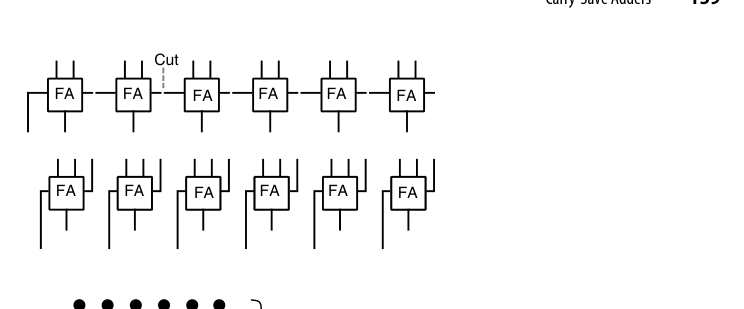{fig-align="center" width="85%"}

用点记法表达同一关系更清楚（图 8.7）：左侧是 CPA，右侧是 CSA——后者也常被称为 **(3; 2) 计数器**或三到二缩减电路。换个角度，它本质是一次基数变换：把同一位位置上的 3 个比特（数字集 $[0,3]$）压成 2 个比特（数字集 $[0,2]$），权重总和不变。

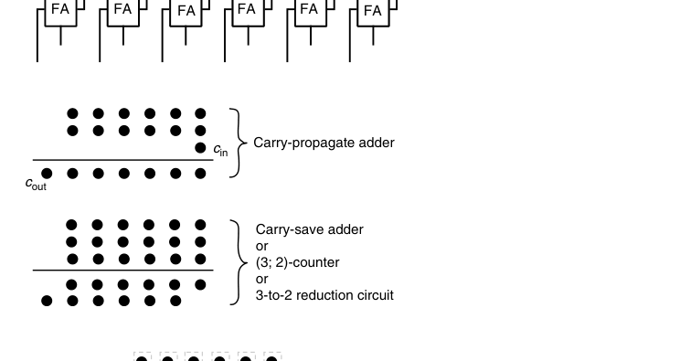{fig-align="center" width="85%"}

点记法还配有一套约定（图 8.8）：任何被同一个 FA 吃掉的三个点用虚线框圈起来，FA 的和输出与进位输出之间用一条斜线相连；如果某处只有两个点，则用的是半加器，斜线中间再加一道横线以示区别。后面所有压缩树图都遵守这套约定。

一个 $k$ 位 CSA 就是 $k$ 个独立的全加器：三个 $k$ 位输入 $x, y, z$，输出"和"串 $s$ 与"进位"串 $c$（左移一位对齐），满足

$$
x + y + z = s + 2c
$$

命名上容易混淆，先厘清三个同义说法：进位保存加法器（CSA）强调"进位不传播、留到以后"的行为；(3; 2)-计数器强调"输入 3 比特、输出 2 比特"的计数功能；3:2 压缩器（compressor）强调"操作数个数从 3 压到 2"的归约角色——三者指同一个电路（一排独立 FA），只是观察角度不同。文献里还有"伪加法器（pseudo-adder）"的旧称，见到不必困惑。

**关键：没有任何进位传播**——每位都是独立 FA，延迟恒定 1 级 FA，与字长无关。CSA 把 3 个数"压缩"成 2 个数（这就是 3:2 压缩器名字的由来），要得到真正的和，最后还需一次完整加法 $s + 2c$（称为**最终加法器 / CPA, carry-propagate adder**）。

一个数值例子把这个恒等式钉牢。取 $x = 13 = 001101$、$y = 11 = 001011$、$z = 7 = 000111$：

$$
\begin{aligned}
s &= x \oplus y \oplus z = 000001\\
c' &= \text{Maj}(x, y, z) = 001111 \quad\Longrightarrow\quad 2c' = 011110
\end{aligned}
$$

$s + 2c' = 000001 + 011110 = 011111 = 31 = 13 + 11 + 7$。注意逐位求和与逐位多数表决各自独立进行——同一列的三个比特"当场结清"，绝不向邻居讨债，这就是 CSA 常数延迟的全部秘密。

$n$ 个操作数相加：用 $n-2$ 级 CSA 把 $n$ 个数压成 2 个，再 1 次 CPA。总延迟 $(n-2)\,T_{FA} + T_{CPA}$——中间全部 $O(1)$！

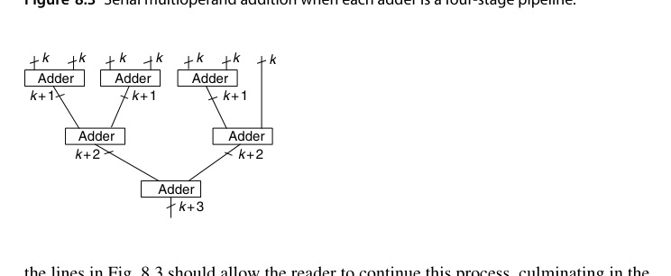{fig-align="center" width="85%"}

严格地写，$n$ 个数相加用 CSA 树压缩的代价与延迟是

$$
C_{\text{carry-save-multi-add}} = (n-2)\,C_{CSA} + C_{CPA},\qquad
T_{\text{carry-save-multi-add}} = O(\underbrace{\text{树高}}_{O(\log n)} + T_{CPA}) = O(\log n + \log k)
$$

各级 CSA 的宽度虽略有差异，但都接近 $k$ 位；最终 CPA 的宽度至多 $k + \log_2 n$。这正好达到 8.1 节提到的 $O(\log(kn))$ 下界。代价公式里 $(n-2)$ 这个系数也值得读：每并入一个新操作数恰好消耗一个 CSA（3 进 2 出，净减 1），从 $n$ 个数减到 2 个数正好 $n-2$ 次——CSA 树的总成本与树的形状无关，Wallace 与 Dadda 之争只影响**宽度分布与延迟**，不影响元件总数的大头。

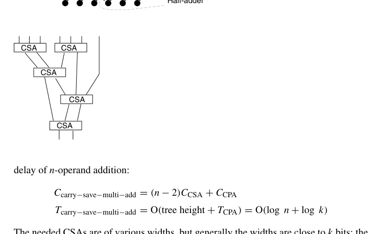{fig-align="center" width="85%"}

图 8.9 的拓扑值得数一遍：七个输入先分成 3+3+1，两个 CSA 各把三数压成两数，得到 $2+2+1 = 5$ 个中间量；下一级一个 CSA 吃掉其中 3 个、余下 2 个，得 $2+2 = 4$；再一级 CSA 吃 3 留 1 得 3；最后一级 CSA 得 2。共 5 个 CSA（$= n - 2$），四级深度。对照图 8.10 的点记法版本，两者是同一棵树的两张照片——一个画"数"，一个画"位"。

看一个具体例子：把七个 6 位数相加（图 8.10）。初始时第 0 到第 5 位各有 7 个点，每列先用两个 FA 吃掉 6 个点（本列留下 2 个和点、左侧一列加 2 个进位点），剩下的 1 个点原样保留；如此逐级推进，直到没有任何一列的点数超过 2，最后交给一个 7 位 CPA。总代价为 **7 位加法器 + 28 个 FA + 1 个 HA**。

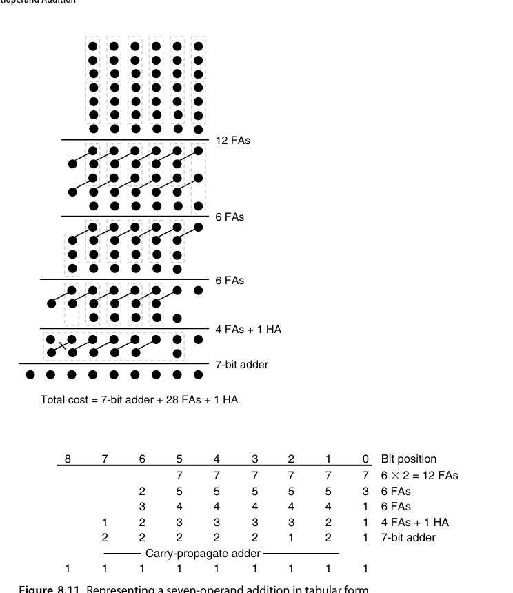{fig-align="center" width="85%"}

同一过程还可以写成更紧凑的**表格形式**（图 8.11）：每个格子记录对应位位置上剩余的点数，从最低位开始逐列处理——每凑够 3 个点就用一个 FA（本列留 1 个点、左邻列加 1 个点），直到没有任何一列超过 2 个点为止。表格形式的真正价值在于它可以机械地自动化：写乘法器综合脚本时，程序就是照着这张表逐列决定"放几个 FA、进位送到哪一列"。

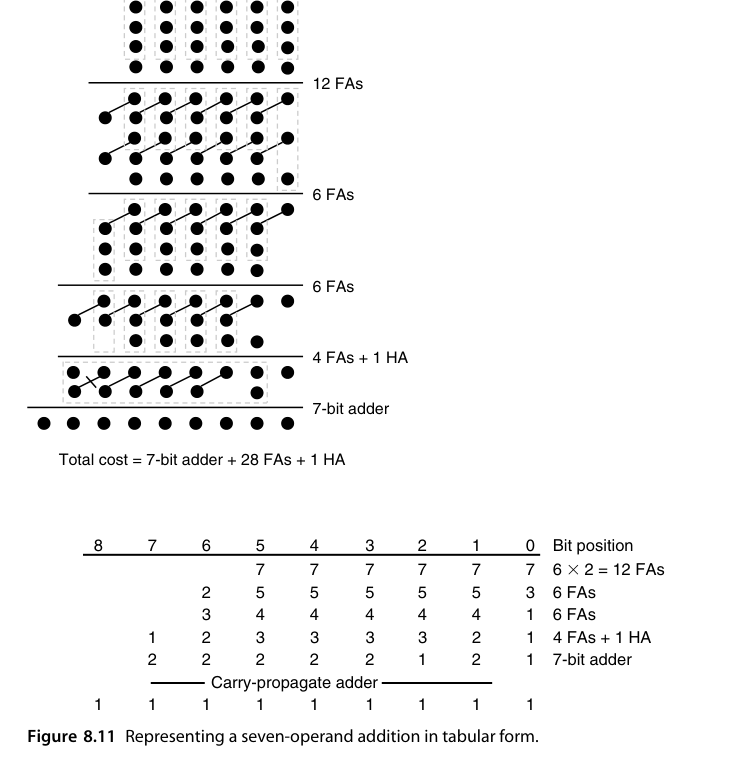{fig-align="center" width="85%"}

还有一处值得留意：随着操作数不断合入，"部分和"的数值确实在变大，但**各级 CSA 的字宽几乎保持不变**（图 8.12）——只是每条连线所携带的位区间整体上在缓慢左移。这也说明某些位的 FA 可以省略：图 8.12 中最下面那个 CSA 可以只做 $k-1$ 位宽，让位位置 1 的两根线直接穿过去，代价是最终 CPA 变成 $k+1$ 位宽。**压缩树与最终加法器宽度之间存在可以直接交换的折中空间**。

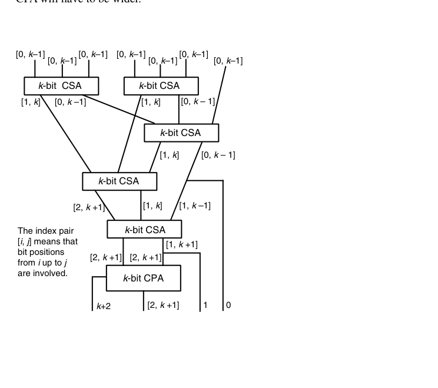{fig-align="center" width="85%"}

若操作数逐个到来（比如必须从存储器里读出），用一个 CSA 串行累加即可（图 8.13）：和寄存器与进位寄存器分别保存两路结果，最后统一过一次 CPA。代价是 CSA 与最终 CPA 都要相应加宽——因为进位寄存器每拍左移，$n$ 拍之后冗余和的展布比单个操作数宽约 $\log_2 n$ 位。与 8.1 节的串行方案对比，账本完全翻转了：那里每拍要一次完整进位传播，这里每拍只有一级 FA——**把 $n$ 次 $O(\log k)$ 换成 $n$ 次 $O(1)$ 加一次 $O(\log k)$**。这正是"延迟归约（deferred carry assimilation）"思想在时序形态下的样子。

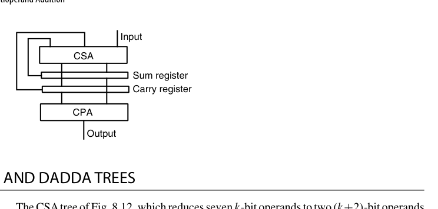{fig-align="center" width="85%"}

最后一个省钱技巧：CPA 自带进位输入端，可以免费吸收一个点。因此有意在低端留下 3 个点（用 HA 顶替 FA），往往能省掉元件——原书图 8.15 的例子最终只用了 26 个 FA + 3 个 HA。是否划算，取决于 FA/HA 与"更宽的 CPA"之间的相对成本。这一技巧与前面"多留一个点换窄 CPA"的折中放在一起看，就勾勒出压缩树设计的最后一层自由度：**压缩的终点不是"每列恰好 2 点"，而是"交给 CPA 的那两行点阵，恰好能用最便宜的 CPA 收掉"**。

把同一个七数例子的三种策略并排对账，可以作为本节的小型总结：Wallace 与 Dadda 都是 28 FA + 1 HA + 7 位 CPA（本例中二者殊途同归）；借 CPA 进位输入的变体是 26 FA + 3 HA + 7 位 CPA；若再在第 1 列多放一个 HA，CPA 还能窄到 6 位。没有绝对最优——只有给定"FA、HA、CPA 每一位"的相对价格表之后才有最优，这正是压缩树综合器每次流片前都要重跑一遍的原因。

### RTL 实践：`rtl/ch8_2_carry_save_adder`

```systemverilog
module carry_save_adder #(parameter int N = 8) (
    input  logic [N-1:0] x, y, z,
    output logic [N-1:0] s,   // 伪和
    output logic [N-1:0] c    // 进位（左移一位对齐，c[0]=0）
);
    logic [N-1:0] cout_bit;
    genvar i;
    generate
        for (i = 0; i < N; i++) begin : g_fa
            assign s[i]       = x[i] ^ y[i] ^ z[i];
            assign cout_bit[i] = (x[i] & y[i]) | (x[i] & z[i]) | (y[i] & z[i]);
        end
    endgenerate
    assign c = {cout_bit[N-2:0], 1'b0};   // 左移一位对齐权重
    // 恒等式：x + y + z == s + c（c 已含移位）
endmodule
```

> 完整可运行版本见 `rtl/ch8_2_carry_save_adder/carry_save_adder.sv`，同目录附 4 操作数压缩树示例。

## 8.3 Wallace 树与 Dadda 树（Wallace and Dadda Trees）

$n$ 级串行 CSA 的延迟仍随 $n$ 线性增长。**树形化**才是正道。先给 Wallace 树一个正式画像：$n$ 输入的 Wallace 树把 $k$ 位输入压成两个 $(k + \log_2 n - 1)$ 位的数——输出宽度的增长就是树高乘以"每级最多 +1 位"的积累，与两操作数加法器树的宽度梯度一脉相承。

- **Wallace 树 [@wallace1964]**：每级把操作数三三分组，每组一个 CSA，同级所有 CSA 并行。每级操作数减少为 $2/3$，$\log_{3/2}(n/2)$ 级后只剩 2 个数。贪心策略是"尽早压缩"，树高最小，但同层 CSA 数量/连线不规则；输出宽度的账目也顺手验证：$n = 7$ 时输出为两个 $(k + \log_2 7 - 1) \approx (k+2)$ 位数，与图 8.12 标注的 $[0, k+1]$（共 $k+2$ 位）恰好吻合；
- **Dadda 树 [@dadda1965]**：策略相反——"能不压就不压"，每级只压缩到下一个 $3:2$ 序列值（…, 4, 6, 9, 13, 19, 28, …）。结果：**树高与 Wallace 相同，但使用的 FA/HA 总数最少**，结构也更规则。

拿一个更大的例子感受差距的规模：$n = 28$ 个操作数（恰好等于 $n(7)$）。Dadda 序列是 $28 \to 19 \to 13 \to 9 \to 6 \to 4 \to 3 \to 2$，七级，每级只在"超出下一档"的列放压缩器；Wallace 则是每级一律乘 $2/3$ 取整。两种策略的树高都是 7，但 Dadda 的 FA/HA 总数明显更少——操作数越多，"能不压就不压"省下的压缩器越可观。

严格地说，每个 CSA 把操作数数目乘上 $2/3$，因此 $n$ 输入压缩树的最小树高满足递推

$$
h(n) = 1 + h(\lceil 2n/3\rceil)
$$

去掉向上取整即得下界 $h(n) \ge \log_{1.5}(n/2)$（仅在 $n = 2, 3$ 时取等号）。反过来问"高度为 $h$ 的树最多能吃多少个操作数"更有用：

$$
n(h) = \lfloor 3\,n(h-1)/2\rfloor
$$

忽略向下取整得 $n(h) \le 2(3/2)^h$，同样易于证明另一侧的下界 $n(h) > 2(3/2)^{h-1}$。两个方向的递推其实是同一枚硬币：$h(n)$ 从输入端往输出端数"至少要几级"，$n(h)$ 从输出端往输入端数"最多能喂几个"——设计时查后者、分析时算前者。递推里的取整不可忽略：正是 $\lfloor 3n/2 \rfloor$ 在奇数处的"损耗"让表格值（4, 6, 9, 13, …）偏离纯几何序列 $2(3/2)^h$（4, 6, 9, 13.5, …），Dadda 策略的规则化正受益于这些整数断点。下面这张表就是 Dadda 树的罗盘：

| $h$ | 0 | 1 | 2 | 3 | 4 | 5 | 6 | 7 | 8 | 9 | 10 | 11 | 12 |
|---|---|---|---|---|---|---|---|---|---|---|---|---|---|
| $n(h)$ | 2 | 3 | 4 | 6 | 9 | 13 | 19 | 28 | 42 | 63 | 94 | 141 | 211 |

读法举例：高度 3 的树最多处理 6 个操作数，高度 4 最多 9 个。因此若当前手上有 7～9 个操作数，它们**注定**要用 4 级——既然如此，把它们压到 6 个之后就没有进一步压缩的意义了。这几乎就是 Dadda 策略的全部动机。随手核验两个表项：$n(3) = \lfloor 3 \times 4/2 \rfloor = 6$、$n(4) = \lfloor 3 \times 6/2 \rfloor = 9$、$n(5) = \lfloor 3 \times 9/2 \rfloor = 13$（9 是奇数，取整损耗 0.5 在这里第一次出现）。表还可以继续往下推：$n(13) = 316$、$n(20) = 5395$，32 位乘法器 radix-4 Booth 后的 16～17 个部分积落在 $h = 6$ 这一档（$n(5) = 13$ 不够，$n(6) = 19$ 够用）——这也是 32×32 Booth 乘法器压缩树教科书式地画 6 级的原因。

两种策略的列级操作规则可以写得很机械。**Wallace**：某列有 $m$ 个点，立刻放 $\lfloor m/3 \rfloor$ 个 FA（余 2 点时用 1 个 HA 也在允许之列），让每列尽快变矮，最终 CPA 尽可能短；**Dadda**：先查表确定本级的目标行数（下一个 $n(h)$ 值），只在"不压就超目标"的列放压缩器，能留则留。两者都是逐列独立的贪心，差别仅在触发压缩的时机。

用同一个七数例子演示 Dadda 的做法（图 8.14）：一开始 7 行点，目标直接压到表中的下一个值 6，只需 6 个 FA；接着目标压到 4，用 11 个 FA；如此逐级逼近。有意思的是在这个例子里，Wallace 与 Dadda 的最终元件数与 CPA 宽度完全相同（都是 7 位加法器 + 28 个 FA + 1 个 HA）——差别只是某一级"先干活"还是"后干活"。只有当操作数个数远大于表中相邻两个值的间隔时，两者在省元件上的差距才会明显体现。

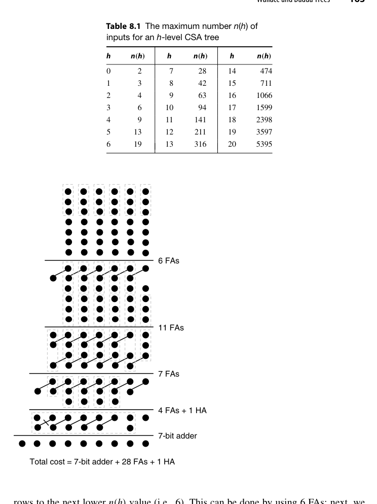{fig-align="center" width="85%"}

Dadda 之所以行得通，是因为**快速加法器的延迟并不是字宽的平滑函数**：一个超前进位加法器在 17 位到 32 位之间很可能延迟相同。既然 CPA 的延迟对输入宽度有如此大的"惰性"，压缩树就没有必要为了缩短最终 CPA 的宽度而努力，只要把行数压到下一个 $n(h)$ 即可。把这条原则翻译成设计口诀：**压缩树的优化目标不是"压得快"，而是"压着 CPA 的延迟台阶走"**——CPA 延迟的台阶位置（16、32、64 位这些 CLA 级数跳变点）反过来决定了压缩树每一级该留多少点。

::: {.callout-note title="解读"}
两者树高相同、Wallace 用更多压缩器换更早的中间规整，Dadda 用最少压缩器达到同一高度。实践中 Dadda 更常见（省面积），配合现代综合器的"按需插入压缩器"策略，界限已模糊。理解要点：**压缩树高度由 $3/2$ 递推决定，与具体贪心策略无关**。
:::

::: {.callout-tip title="工程视角"}
现代乘法器综合流程里，Wallace/Dadda 更像"思考框架"而非"施工图纸"：综合器以 Dadda 的行数序列为骨架，但每个位置放 FA、HA 还是 4:2 压缩器、甚至把若干列交给 LUT 映射，都按目标库的单元延迟表动态决定。手写压缩树代码时，按 Dadda 行数组织 generate 结构，仍是可读性与可验证性最好的写法——工具保留你给的拓扑，同时自由替换每个压缩单元的实现。
:::

### RTL 实践：`rtl/ch8_3_wallace_tree`

8 个 8 位操作数的 Wallace 压缩树：第 1 级 8→(2×2)+2=6？不——标准做法 8 = 3+3+2：两个 CSA 把 6 个压成 4，余 2 个直传，共 6 个；第 2 级 6 = 3+3 → 4；第 3 级 4=3+1 → 3；第 4 级 3 → 2；最后 CPA。testbench 用 SystemVerilog 循环求和做黄金模型。

## 8.4 并行计数器与压缩器（Parallel Counters and Compressors）

3:2 压缩器（FA）只是起点。一般化的 **$(n; k)$ 计数器**：数 $n$ 个输入比特里 1 的个数，用 $k = \lceil \log_2(n+1) \rceil$ 个比特输出。几种常用计数器的定位：

| 计数器 | 功能 | 等效压缩比 | 典型用途 |
|---|---|---|---|
| (3; 2)（即 FA） | 3 比特 → 2 比特 | 1.5 | 一切压缩树的基础 |
| (7; 3) | 7 比特 → 3 比特 | ≈2.3 | 中等规模乘法器压缩树 |
| (10; 4)（图 8.16） | 10 比特 → 4 比特 | 2.5 | 10 数 → 4 数压缩 |
| (15; 4) | 15 比特 → 4 比特 | 3.75 | 大规模点阵的高效收缩 |

例如：

- **(7;3) 计数器**：7 比特 → 3 比特，比"两级 FA 树"更省。一个参照设计是 4 个 FA 加若干 HA 的组合——7 个输入先经两个 FA 各吃 3 个，产出的中间比特与剩余输入再归并；关键指标是它的输入-输出延迟比两级 FA 树低，因为部分输出比特只需一级 FA 深度；
- **4:2 压缩器**：实际摄入 4 个同权重比特 + 1 个级联进位，产出 2 个比特 + 1 个级联进位——是乘法器压缩树最常用的现代构件（见第 11 章），关键优势是**横向级联进位只走一级 mux 逻辑，不形成纵向进位链**。

图 8.16 给出一个 10 输入并行计数器（**(10; 4)-计数器**）的点记法与门级实现：内部由若干 FA/HA 组成，末尾再用一个 3 位行波进位加法器收尾。把这样一排 $(10;4)$-计数器按位并列，就能一次把 10 个二进制数压成 4 个。点记法上它与 (3;2)-计数器的差别只在斜线穿过的点数——(10;4) 的每条输出斜线串起 4 个点。

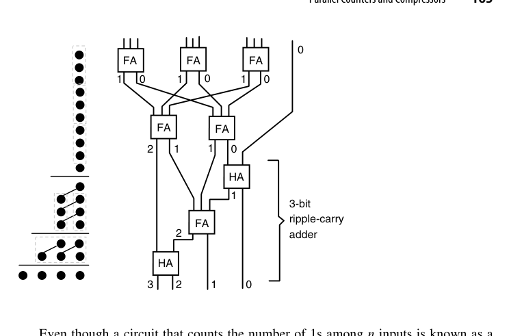{fig-align="center" width="85%"}

两点澄清避免误读。其一，"并行计数器"并不是时序计数器的直接推广：时序计数器每拍把一个计数信号累加进状态；若真要做"一次收 $n$ 个计数信号、累加进寄存器"的电路，那叫**累积并行计数器（accumulative parallel counter）**，由并行增量器加寄存器构成。它的一个漂亮应用是**汉明重量比较器**：判断向量中 1 的个数是否达到阈值 $\theta$，或者两个向量谁的 1 更多——前者把阈值作为计数器初值的补载入，后者把两个向量的比特分别以正、负权重喂给同一个累积计数器，最后只看符号位。其二，计数信号也可以带符号，对应加/减计数的推广。

顺着这条思路还能推广到**跨列的广义并行计数器**：输入点不必都在同一列，输出也可以分布在多列，只要总权重守恒。记法 $(n_{h-1}, \ldots, n_1, n_0; k)$ 表示各输入列分别有 $n_j$ 个点、输出是一个 $k$ 位数，其可行的充要条件是

$$
\sum_j n_j 2^j \le 2^k - 1
$$

即输出所能表示的最大值必须覆盖输入的最大可能加权和。验证几个例子：(4,4;4)-计数器把四个 2 位数化成一个 4 位数——左端 $4 \times 2 + 4 = 12 \le 15$；(5,5;4)-计数器把五个 2 位数压成 4 位（图 8.17）——$5 \times 2 + 5 = 15 \le 15$，顶格可行；各列点数也不必相等，(4,6;4) 的 $4 \times 2 + 6 = 14 \le 15$ 同样合法。最反直觉的一个例子：一个普通的 4 位二进制加法器（含进位输入与进位输出）本身就是一个 (2,2,2,3;5)-计数器——四个输入列各有 2 个操作数位，最低列加上进位输入共 3 点，加权和 $2\cdot8 + 2\cdot4 + 2\cdot2 + 3\cdot1 = 31 = 2^5 - 1$，恰好顶格由 5 位输出（4 个和位加进位输出）表示。**加法器只是广义计数器的一个特例**——这个视角把第 5-7 章与本章统一到了同一个构件族里。

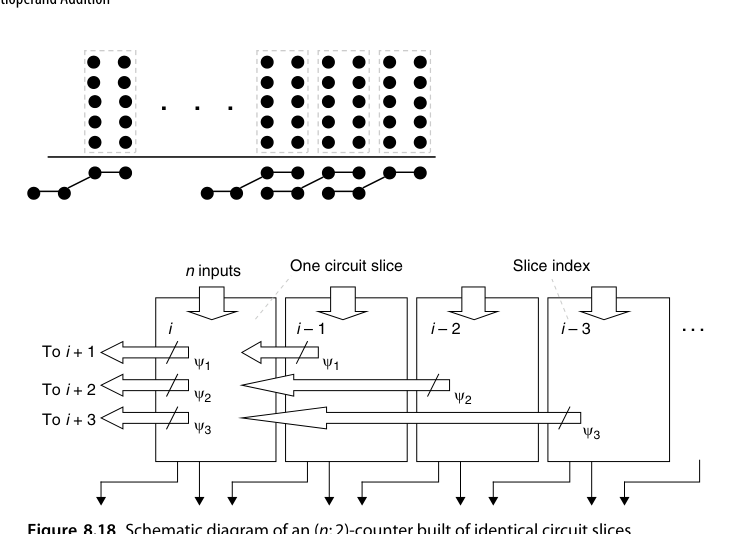{fig-align="center" width="85%"}

在 CSA 树里我们真正想要的终究是"把 $n$ 个数压成 2 个数"，因此工程上常说 $(n;2)$-计数器（哪怕 $n > 3$ 字面上说不通）。严格讲这个名字指的是**一个位片（slice）**：把它复制 $k$ 份、横向互连起来，整体就实现 $n \to 2$ 的压缩。第 $i$ 个位片接收本位的 $n$ 个输入比特，外加来自低位方向各位片的若干转移比特（记 $\psi_j$ 为从第 $i$ 片流到第 $i+j$ 片的位数），输出本位的 2 个比特并向左送出新的转移比特。

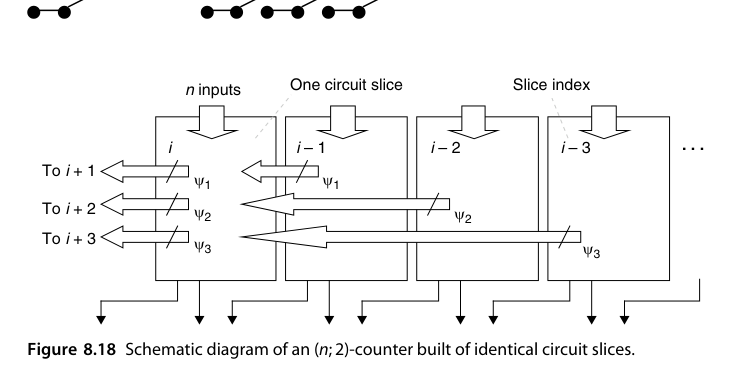{fig-align="center" width="85%"}

为保证转移过程收敛，$\psi_j$ 必须满足一条基本不等式

$$
n + \psi_1 + \psi_2 + \psi_3 + \cdots \;\le\; 3 + 2\psi_1 + 4\psi_2 + 8\psi_3 + \cdots
$$

右端的 3 是两个输出比特能表示的最大值（即 $2^2-1$）。把这条不等式当预算表来读：左端第 $j$ 项权重是 $2^0$（从低位流入的转移比特在本位只值 1），右端送出的转移比特则带着各自的权重 $2^j$ 记账。验证两个例子：$n = 7$ 时取 $\psi_1 = \psi_2 = 1$，左端 $7 + 1 + 1 = 9 \le 3 + 2 + 4 = 9$，恰好顶格构成 $(7;2)$-计数器；$n = 4$ 时只需 $\psi_1 = 1$，$4 + 1 = 5 \le 3 + 2 = 5$，同样顶格——这就是第 11 章要细讲的 **4:2 压缩器**。

"顶格"不是巧合而是设计目标：转移比特是最贵的资源（它们横穿位片边界、决定级联延迟），预算正好用完意味着没有一寸转移能力被浪费。反过来说，若不等式留下富余，说明还可以往位片里多塞输入点，或者把某个 $\psi_j$ 降档省钱。设计这类位片有一条经验法则：**转移信号要尽可能靠近输出端引入**，否则它们会在位片内部层层穿行，把本该 $O(1)$ 的延迟重新拖成行波——4:2 压缩器的经典实现之所以用"两级 XOR 加一级 mux"的拓扑，就是为了让横向进位 $c_{out}$ 只由本片的中间信号决定、与 $c_{in}$ 无关，级联链上永远没有纵向等待。

::: {.callout-tip title="工程视角"}
综合工具对 `(7;3)`、4:2 这类构件的映射质量（尤其 FPGA 的 6-LUT）常常出人意料地好。手写压缩树时要意识到：RTL 里写的 `+` 在现代综合器眼中会被自动重构成压缩器树——手写结构的意义在于**控制结构规整性与流水级划分**。
:::

## 8.5 多个有符号数相加（Adding Multiple Signed Numbers)

2 的补码操作数直接进压缩树有一个坑：**符号扩展**。把 $k$ 位补码扩展到 $k + \log_2 n$ 位再压缩，会让压缩树高位全是符号位复制品，浪费硬件。不过在下结论之前先看清楚代价。若把 $k$ 位补码符号扩展 $s$ 位（比如 $s = \log_2 n$），表面上压缩树的高位会被 $n$ 份符号位填满；但这些扩展位完全相同——**输入相同的那些 FA 做的是同一件事**，完全可以合并成一个。以三个操作数为例（原书图 8.19a，符号位 $x_{k-1}, y_{k-1}, z_{k-1}$ 各自向右复制 5 份铺满扩展区），原本需要 6 个接收同样 $(x_{k-1}, y_{k-1}, z_{k-1})$ 的 FA，实际只需 1 个即可，其和输出同样复制使用、进位输出也共享。这样一来，CSA 的宽度只增加了微不足道的一点——"符号扩展很贵"在第一层意义上是个伪命题。

经典对策有两类：

- **符号位修正法**：把每个操作数的符号位取反并加一个修正常数，使树内全部按无符号处理，最后统一补偿。以 2 的补码恒等式 $-x_{k-1}2^{k-1} + \sum x_i 2^i$ 出发，把 $-x_{k-1}2^{k-1}$ 改写为 $2^{k-1} - x_{k-1}2^{k-1} - 2^{k-1}$……推导的最终形态就是下面的第二类方法，所以两类方法在数学上是同一份推导的两种记账方式；
- **负权重位直接进树**：让符号位以负权重参与压缩，配合常数修正项。

第二类方法的具体做法值得写下来，因为它在 Booth 部分积压缩里天天用到。以权重观点看，符号位的权重是 $-2^{k-1}$，于是可以写 $-x_{k-1} \Rightarrow 1 - x_{k-1} = \bar{x}_{k-1}$，即**把符号位取反并在同列补一个 $-1$** 来抵消多出来的那个 1。接下来反复套用两条规则：

1. 同一列的两个 $-1$ 合并为高一列的一个 $-1$（因为 $-2^j - 2^j = -2^{j+1}$）；
2. 单独一个 $-1$ 变成"本列的 1 + 高一列的 $-1$"（因为 $-2^j = 2^j - 2^{j+1}$）。

以三个操作数为例：三个符号位取反后在符号列插入三个 $-1$；按规则 2 换成符号列的 1 与列 $k$ 的两个 $-1$；再按规则 1 把两个 $-1$ 合成列 $k+1$ 的一个 $-1$；再按规则 2 变成列 $k+1$ 的 1 与列 $k+2$ 的 $-1$……最终所有 $-1$ 从最左端"溢出"，而在 $k$ 位以上的模 $2^{k+s}$ 算术中，溢出的那一位无关紧要。整个过程只增加了几个反相器和少量 HA，比铺满一整片符号扩展位便宜得多。

乘法器的有符号 Booth 部分积压缩（第 11 章）用的正是这类技巧。

把两条规则用比特级小例子固化一下。设三个 4 位补码数相加（$k = 4$，和用 6 位容纳），符号位 $x_3, y_3, z_3$ 的权重都是 $-8$。按 $-x_3 \Rightarrow \bar{x}_3$ 改写后，第 3 列多出三个 $-1$：先按规则 2 把单独一个 $-1$ 换成"第 3 列的 $+1$ 与第 4 列的 $-1$"，此时第 4 列共两个 $-1$；再按规则 1 把它们合成第 5 列的一个 $-1$（$-16 - 16 = -32$）；第 5 列已是结果的最左列，再按规则 2 换成"第 5 列的 $+1$ 与第 6 列的 $-1$"，后者在模 $2^6$ 算术里直接蒸发。净效果：三个符号位取反、第 3 列和第 5 列各补一个常数 1。账目核验：取反贡献 $+3 \times 8 = 24$，两个常数 1 贡献 $8 + 32 = 40$，合计 $64 \equiv 0 \pmod{2^6}$——与原表达式严格同余，而整个过程没有一位符号扩展。

## 8.6 模多操作数加法器（Modular Multioperand Adders）

模 $m$ 的多操作数加法，若照"先求完整和、再约简"两步走，往往代价过高。更好的办法是**把约简穿插进压缩过程本身**——每级压缩后（甚至每列）就地做模 $m$ 修正，让中间结果始终保持在 $[0, m)$ 范围内，字宽因此不再增长。

和第 7 章的两操作数情形一样，三种特殊模数处理起来最省事（图 8.20）：

- $m = 2^k$：直接丢弃第 $k$ 列及以上的任何比特——所有 CSA 都不必延伸到位置 $k-1$ 之外；
- $m = 2^k - 1$：第 $k$ 列产生的比特重新插回第 0 列，即**循环进位（end-around carry）**。由于第 0 列本来就有一个空位，这个回插不增加任何延迟；
- $m = 2^k + 1$：配合减 1 编码，用**反相循环进位**（把 $c_{out}$ 取反后接回 $c_{in}$，见 7.6 节例 7.3），把三个减 1 输入压成两个减 1 输出。

这三种情况的共同点是：**整个模加树不需要任何额外的减法器或比较器**，代价几乎为零。

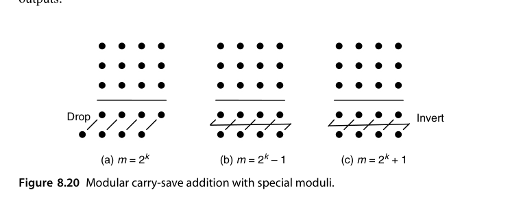{fig-align="center" width="85%"}

对一般模数 $m$，技巧之一是找一个小整数 $h$ 使 $2^h \equiv 1 \pmod m$，然后用 $h$ 位的**伪剩余（pseudoresidue）**做树形压缩：中间结果允许取 $[0, 2^h)$ 内的任意值，只要第 $h$ 列溢出的比特按循环进位回送到第 0 列即可保持同余。等全部压到两个数以后，再最后一次带循环进位相加并做最终约简。伪剩余是"冗余表示"思想在模算术里的镜像：不追求每一步都落在规范剩余类 $[0, m)$ 里，只维护一个**同余**于真值、但表示宽松得多的中间量，把昂贵的规范化推迟到最后一刻——与 CSA 把进位传播推迟到 CPA 是同一个哲学。Piestrak 的系统工作把这类"剩余生成器（residue generator）"设计成了标准构件：给定 $m$ 与输入格式，直接查表式地生成对应的 CSA 阵列，而不必每次手工推导回绕规则。

以 $m = 21$ 为例：$2^6 = 64 \equiv 1 \pmod{21}$，于是可以全程用 6 位伪剩余。也就是说，六个 $[0, 20]$ 内的输入进入任意压缩树后，中间值允许在 $[0, 63]$ 内自由生长，只需要求"第 6 列长出的比特回送到第 0 列"——这在同余意义下严格成立，因为 $64 = 3 \times 21 + 1$。全部压成两个 6 位数之后，再做一次带循环进位的加法，最后对 $[0, 63]$ 内的结果做一次常规模 21 约简（至多减两次 21）。

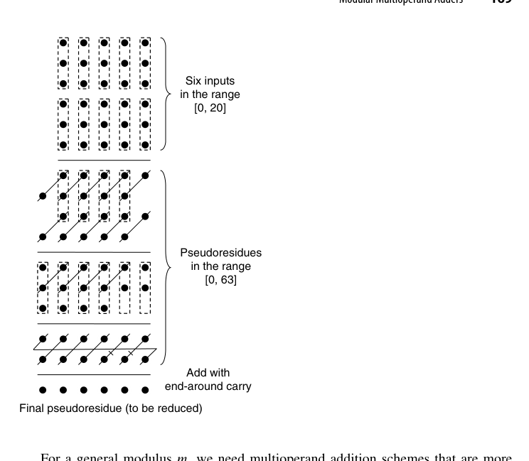{fig-align="center" width="85%"}

这正是密码学模乘器、以及第 4 章 RNS 通道里的标准手法：把"昂贵的比较 + 条件减法"换成"免费的位回绕"。工程上挑模数时，$2^h \equiv \pm 1 \pmod m$ 是否对小的 $h$ 成立，往往直接决定一个 RNS 通道的造价——这也是 Mersenne 数与 Fermat 数模数在密码硬件里受宠的原因。

把 8.1-8.2 节的五条技术路线汇总对账（$n$ 个 $k$ 位操作数）：

| 方案 | 延迟 | 代价 | 关键洞察 |
|---|---|---|---|
| 串行累加 | $O(n\log k)$ | 1 个加法器 | 固定 $k$ 时随 $n$ 超线性，最差 |
| 流水串行 | 同上（吞吐 1/拍） | 3 个加法器 + 锁存 | 只提吞吐，不降延迟 |
| 快速加法器树 | $O(\log n\log k)$ | $n-1$ 个快速加法器 | 部件快 ≠ 整体快 |
| 行波加法器树 | $O(k + \log n)$ | $n-1$ 个行波加法器 | 层间进位错位重叠 |
| CSA 树 + CPA | $O(\log n + \log k)$ | $n-2$ 个 CSA + 1 个 CPA | 达到理论下界 |

## 本章小结

- CSA = 逐位 FA 阵列，$O(1)$ 把 3 数压成 2 数；$n$ 数相加 = 压缩树 + 1 次 CPA，达到 $O(\log n + \log k)$ 的理论下界。
- 用两操作数加法器时：串行 $O(n\log k)$、流水只提吞吐、快点树反而 $O(\log n\log k)$、行波树 $O(k+\log n)$——部件快慢不等于整体快慢。
- Wallace 早压、Dadda 省压，树高同为 $O(\log_{3/2} n)$；$n(h) = \lfloor 3n(h-1)/2\rfloor$ 是设计罗盘。
- $(n;k)$ 计数器、广义并行计数器与 $(n;2)$ 位片（含 4:2 压缩器）是更高效的现代构件。
- 有符号操作数进树要处理符号扩展：同输入位可共享 FA，或用"取反 + 补 $-1$"的负权重技巧。
- 模乘加专长：$2^k$ 丢弃、$2^k-1$ 循环进位、$2^k+1$ 反相循环进位，一般模数可用伪剩余——**把昂贵的"比较 + 条件减法"换成免费的位回绕**。

## 原书插图

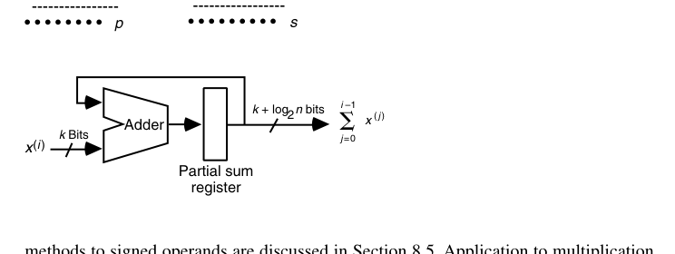{fig-align="center" width="85%"}

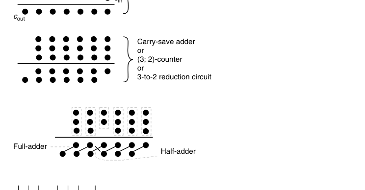{fig-align="center" width="85%"}

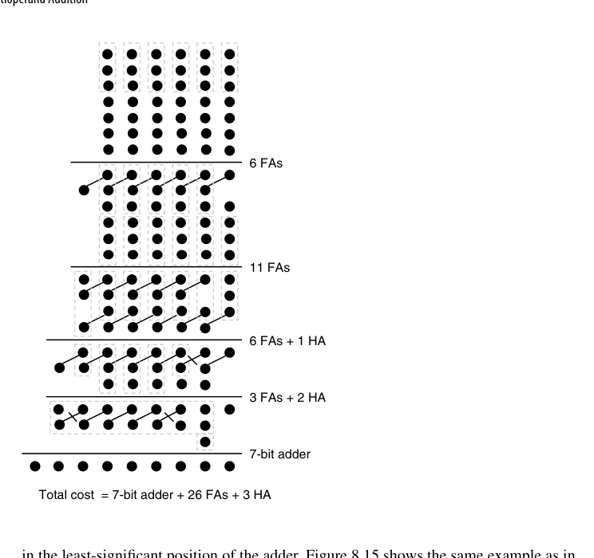{fig-align="center" width="85%"}
