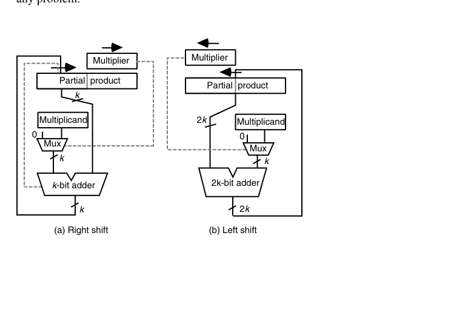
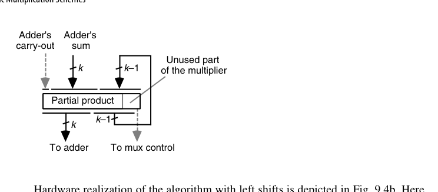
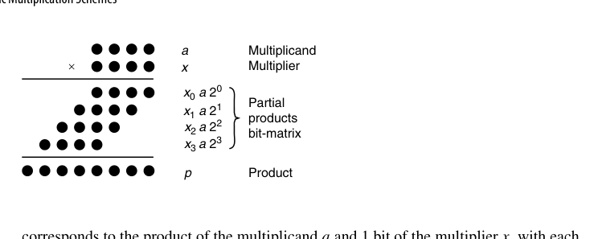
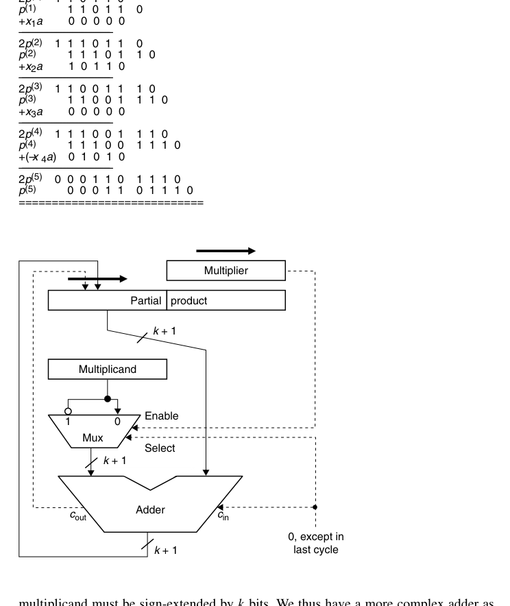

# 第9章 基本乘法方案（Basic Multiplication Schemes）

## 本章导读

乘法 = 生成部分积 + 部分积求和。第 8 章已经解决了"求和"（压缩树 + CPA），本章解决"生成与累加"的基本形态：移位-加的时序乘法器、有符号数乘法、乘常数。理解本章后，第 10 章（高基数/Booth）与第 11 章（树形/阵列）就是自然的性能升级路线。

## 9.1 移位/加乘法算法（Shift/Add Multiplication Algorithms）

先统一记号：被乘数（multiplicand）$a$、乘数（multiplier）$x$、乘积（product）$p = a \times x$。由于 $x_j \in \{0,1\}$，每一项 $x_j a$ 要么是 0，要么是被乘数 $a$ 的一个移位版本——**二进制乘法因此直接归结为第 8 章的多操作数加法**。用点记法看最为直观（原书图 9.1）：每一行是被乘数与乘数某一位的按位与，四个部分积（partial product）构成一个点阵，剩下的工作只是把它们加起来。

纸笔乘法的机械版：$z = x \cdot y = \sum_{i=0}^{k-1} y_i \cdot (x \ll i)$。逐位考察乘数 $y$ 的每一位：为 1 则把被乘数（移位对齐后）加入累加器，为 0 则只移位。$k$ 位乘法需 $k$ 次迭代。

与其每拍把部分积左移对齐，不如**每拍把累积的部分积右移一位**去对齐下一个部分积。这就是**右移算法**：

$$
p^{(j+1)} = \big(p^{(j)} + x_j\,a\,2^k\big)\,2^{-1},\qquad p^{(0)} = 0,\quad p^{(k)} = p
$$

其中因子 $2^k$ 用来抵消后续 $k$ 次右移（硬件实现就是让 $a$ 与双宽寄存器的**高半部分**对齐相加）。看一个 4 位的具体例子：$a = (1010)_2 = 10$，$x = (1011)_2 = 11$：

| 迭代 $j$ | $x_j$ | 加项 $x_j a 2^4$ | 累加并右移后 $p^{(j+1)}$ |
|---|---|---|---|
| 0 | 1 | 160 | $(0+160)/2 = 80$ |
| 1 | 1 | 160 | $(80+160)/2 = 120$ |
| 2 | 0 | 0 | $120/2 = 60$ |
| 3 | 1 | 160 | $(60+160)/2 = 110$ |

结果 $p^{(4)} = 110 = (0110\,1110)_2$，正是 $10 \times 11$。

同一个点阵图（图 9.1，见章末）对**非二进制**也成立，只是基数 $r > 2$ 时数字 $x_j$ 不再是 0/1，部分积 $x_j a$ 需要额外计算、且每个部分积比 $a$ 宽一位——这正是第 10 章高基数乘法要面对的"难倍数"问题的源头。

反过来若从高位往低位累加，则得到**左移算法**：

$$
p^{(j+1)} = 2p^{(j)} + x_{k-j-1}\,a \quad\Longrightarrow\quad p^{(k)} = a\,x + p^{(0)}2^k
$$

同一组数据用左移算法走一遍（$a = 10$、$x = 11$）：$p^{(0)} = 0$；考察 $x_3 = 1$，$2p^{(0)} + a = 10$；考察 $x_2 = 0$，$2p^{(1)} = 20$；考察 $x_1 = 1$，$2p^{(2)} + a = 50$；考察 $x_0 = 1$，$2p^{(3)} + a = 110$。结果相同，但注意中间量一路增长，加法器必须全程承受双宽操作数。

两种算法都是 $k$ 次加、$k$ 次移位，但**左移算法的加法是 $2k$ 位宽**（低 $k$ 位产生的进位可能影响高 $k$ 位），而右移算法只需 $k$ 位加法（进位移出到寄存器最高位即可）。这一条决定了硬件实现一边倒地选择右移。把两种算法的差异并排存档，后文会反复引用：

| 对比项 | 右移算法 | 左移算法 |
|---|---|---|
| 递推 | $p^{(j+1)} = (p^{(j)} + x_j a 2^k) 2^{-1}$ | $p^{(j+1)} = 2p^{(j)} + x_{k-j-1} a$ |
| 考察乘数位顺序 | 低位 → 高位 | 高位 → 低位 |
| 加法器宽度 | $k$ 位 | $2k$ 位（实为 $k$ 位加法器 + $k$ 位增量器） |
| 寄存器共享对象 | 乘数与部分积低半 | 乘数与部分积高半 |
| 有符号扩展成本 | 逐拍渐进，加法器 +1 位即可 | 每拍全宽扩展，加法器再宽 $k$ 位 |
| 控制位保存 | 无需（寄存器拍末加载） | 需临时触发器（拍头移位） |

顺带一个有用的推广：由 $p^{(k)} = ax + p^{(0)}2^{-k}$ 可见，只要把累加器初值从 0 改成 $y\,2^k$，电路算出的就是 $ax + y$。**乘加（multiply-accumulate）几乎免费**，这在 DSP 累加器与矩阵乘流水线里是极其重要的性质。左移算法对应的对偶结论是 $p^{(k)} = ax + p^{(0)}2^k$——初值改为 $y\,2^{-k}$ 同样得到 $ax + y$。两个方向的免费乘加都成立，只是右移版本的初始化更简单（直接装入高半部分即可）。

硬件复用的经典技巧：**乘数寄存器与部分积累加器共用移位路径**——累加器每拍右移一位，空出的低位正好逐位存下乘积，乘数寄存器也随之右移，最低位即是当前要考察的 $y_i$。这套"右移串联"结构让 $k$ 位乘法只需约 $2k$ 位寄存器 + 一个 $k$ 位加法器。复用的数学依据是一条不变量：每拍结束，"已确定的乘积位数"恰好多 1、"未处理的乘数位数"恰好少 1，两者之和恒为 $2k$——双宽寄存器从头到尾没有一寸闲置。

{fig-align="center" width="85%"}

## 9.2 程序化乘法（Programmed Multiplication）

在没有乘法指令的年代，乘法由软件循环实现：移位、测位、条件加。寄存器分工先交代清楚：`Ra` 存被乘数、`Rx` 存乘数、`Rp`/`Rq` 拼成 $2k$ 位部分积（高/低半）、`Rc` 是迭代计数器、`R0` 恒为 0。初始化把 `Rp`、`Rq` 清零、`Rc` 置 $k$；循环体极短，一共五条有效指令，按如下次序重复 $k$ 遍：

1. `shift Rx right 1`——乘数右移一位，最低位落入进位标志；
2. `branch no_add if carry = 0`——该位为 0 则跳过加法；
3. `add Ra to Rp`——把被乘数加到部分积的高半寄存器；
4. `rotate Rp right 1` / `rotate Rq right 1`——带进位右移，把加法器的进位补进最高位；
5. `decr Rc` + `branch m_loop if Rc ≠ 0`——计数并回跳。

记乘数二进制表示中 1 的个数（汉明重量）为 $w$，则整个程序的指令数为 $6k + w + 3$，介于 $6k+3$ 与 $7k+3$ 之间：每圈固定 6 条（移位、分支、两次 rotate、计数、回跳），`add` 只在乘数位为 1 时执行故加 $w$，循环外的初始化与存结果共 3 条。对 32 位操作数而言，**平均每次乘法要执行 200 多条指令**。即便处理器提供"多位移位 + 条件加"之类的复合指令，主循环也少不了 32 条。这也是为什么数值密集型应用毫无例外都需要硬件乘法器。

值得注意的微结构差异：微程序控制的处理器用的微例行程序（microroutine）与这个循环几乎同构，只是微指令自带并行性与条件分支，主循环体可以压到 6 条微指令以下，再省去取指译码开销，因此比机器语言版本快得多——但仍比不上硬连线实现。

这解释了早期指令集里"移位""位测试"指令的重要地位，也说明**硬件乘法器本质上是把这个循环固化成状态机**。即使在现代，微控制器（如 Cortex-M0）仍有用短指令序列实现乘法的例子——面积与速度的永恒权衡。

## 9.3 基本硬件乘法器（Basic Hardware Multipliers）

时序乘法器的数据通路：部分积寄存器（$2k$ 位）+ 加法器 + 被乘数寄存器 + 控制状态机。每拍：看乘数最低位决定是否加被乘数，然后整体右移。$k$ 拍完成，吞吐 $1/k$ 条乘法/拍。加法与移位的时序安排有三个档次：分两拍执行（最慢、控制最简单）；同一拍内分两个子节拍（加法器的进位输出需要临时锁存）；以及下面要讲的"一次操作同时完成"——三个档次对应着时钟频率与硬件细节的权衡。

几个实现细节值得点出来：

- **加法与移位不必分两拍**：把加法器第 $i$ 位的和输出接到部分积寄存器的第 $k+i-1$ 位、把进位输出接到第 $2k-1$ 位，就能用一次操作同时完成"加"和"右移"，无需额外的临时寄存器保存进位。
- **那个 mux 可以换成 $k$ 个与门**：乘数位 $x_i$ 直接作为与门的使能，实现"$x_i = 0$ 时送 0"。有符号乘法需要送 $\{a, \bar a, 0\}$ 三选一时，才需要一个带使能的二路选择器。mux 也可以从加法器输入侧挪到**输出侧**（对部分积与"部分积加被乘数"二选一）——功能等价，但加法器输入恒定后时序更干净，只是 mux 的输入从一个变成了两个全宽总线，哪个划算取决于库里与门与 mux 的相对成本。
- **寄存器共享**：每拍多一点部分积、少一位未处理的乘数，两者之和恒为 $2k$ 位——这正是双宽寄存器能同时装下二者的原因。

{fig-align="center" width="85%"}

由于寄存器是在每个周期**末尾**才加载的，本拍用来做控制的那一位（最低位）即便在加载时发生变化也不会影响本拍的判断——这个时序细节是寄存器共享得以成立的前提。

左移版本的硬件（图 9.4b）可以对照着看：寄存器改为左移，当前考察的乘数位出现在 x 寄存器的**左端**；加法器名义上是 $2k$ 位，但低 $k$ 位其实只是路过（被加数低 $k$ 位恒为 0），实际是一个 $k$ 位加法器加一个 $k$ 位增量器。寄存器共享同样可行——这次换成乘数与部分积的**高半部分**共用一个寄存器。有一个容易踩坑的差别：双宽寄存器在每拍**开头**就要左移，因此本拍的控制位必须先用一个小触发器暂存起来，否则移位之后它就不见了。加上 9.4 节将看到的有符号情形下的劣势，左移方案在工程上基本没有出场机会。

控制部分（图 9.4 中未画出）只是一个计数器加简单的初始化/终止检测电路：用第 5 章的积木就能搭出来。

::: {.callout-note title="解读"}
时序乘法器的控制逻辑是"计数器 + 条件加"——第 5 章的积木直接复用。把它与第 25 章流水线对照看很有意思：同一个算法，串行、并行、流水三种形态对应三种面积/吞吐点。
:::

## 9.4 有符号数乘法（Multiplication of Signed Numbers）

2 的补码乘法有三种处理路线，先把全景摆出来再逐条展开：

| 路线 | 核心思想 | 额外开销 | 适用场景 |
|---|---|---|---|
| 间接法 | 取绝对值乘，符号异或补回 | 最多 2 次取补（2 的补码取补含进位传播） | 符号-幅值、1 的补码 |
| 直接法（末拍减法） | 补码直接进移位-加电路，最后一拍减 $x_{k-1}a$ | 控制多一个分支 + 加法器宽 1 位 | 时序乘法器 |
| Baugh-Wooley | 负权位展开成取反 + 修正常数 | 若干反相器 + 常数点 | 并行阵列（第 11 章） |
| Booth 重编码 | 乘数转带符号数字集 | 重编码逻辑 + 三态选择 | 现代主流（第 10 章） |

1. **间接法**：取绝对值相乘，符号异或后补回——多两次取补的开销；
2. **Baugh-Wooley 法**：把补码拆成"负权最高位 + 正权低位"，展开后发现只需对部分积做少量取反并加修正常数，即可直接用无符号阵列——第 11 章阵列乘法器的标准做法；
3. **Booth 重编码**（第 10 章）：把乘数重编码为带符号数字，统一处理正负——现代主流。

先把间接法说透，因为它决定了"什么时候值得绕路"。对**符号-幅值（signed-magnitude）**数，乘法几乎免费：数值部分直接按无符号乘，符号位单独 XOR。对 **1 的补码**，取补是按位取反（一级并行逻辑、无进位传播），间接法的开销可以接受。对 **2 的补码**，取补 = 取反 + 1，那个 +1 是一次完整的进位传播；一来一回两次取补，最坏情况等于多做了两次加法——这时直接法（下面两种）才显示出价值。

间接法对 1 的补码还算划算，对 2 的补码则得不偿失（两次取补都是带进位传播的完整运算）。好在**2 的补码可以直接进移位-加电路**，只需注意符号位的负权重：

- **被乘数为负**时毫无问题：每一项 $x_j a$ 都是补码数，只要加法时做符号扩展，累加就自动正确；
- **乘数为负**时，符号位 $x_{k-1}$ 的权重是 $-2^{k-1}$，因此**最后一拍要减去 $x_{k-1}a$ 而不是加上它**。硬件上这一步等于"取被乘数的反码并送进位输入 1"。

举两个例子（5 位补码）：$a = (10110)_{2's} = -10$ 配 $x = (01011) = +11$，右移算法逐拍做符号扩展，最终得到 $(11\,1001\,0010)_{2's} = -110$；再令 $x = (10101) = -11$，前四拍照旧、**最后一拍加的是 $-x_4 a = +10 = (01010)$**，最终得到 $(00\,0110\,1110)_{2's} = +110$，两例都正确。原书图 9.8 就是把图 9.4a 的结构加上"最后一拍做减法"这一分支后得到的补码乘法器——控制逻辑只复杂了一点点。

顺带一提：在有符号场合**左移算法更不吃香**——因为每拍都要对被乘数做符号扩展，$k$ 位的加法器还得再宽 $k$ 位；而右移算法的符号扩展是逐拍渐进的，加法器只需宽 1 位。

::: {.callout-tip title="直觉"}
Baugh-Wooley 的核心洞察：负权位 $-x_{k-1}2^{k-1}$ 展开后产生的"负部分积"，可以通过恒等式 $-a = \bar{a} + 1$（按位取反加 1）转化为正部分积加修正项。阵列里多出的只是几个反相器和常数 1——非常划算的交易。
:::

最后把第三条路线（Booth）的地基打牢，因为第 10 章会反复用到它。Booth 的原始动机是"跳过 0 位的加法"：在图 9.4 这种数据通路里，加法永远横在路径上，跳过它并不能省时间；但在**异步实现**或**（微）程序实现**里，"只移位"比"加完再移"快得多——1951 年 Booth 提出这个方案时，面对的正是这样的机器。由此也带来一个历史印记：早期 Booth 乘法器的延迟是**数据相关**的（乘数里 1 越少越快），这与现代同步设计追求恒定延迟的取向相反，今天的 Booth 重编码早已不再是"跳过加法"，而是"统一部分积集合"的编码工具。二进制乘法里遇到一串连续的 1，本来要逐个加好几次，不如利用恒等式

$$
2^j + 2^{j-1} + \cdots + 2^{i+1} + 2^i = 2^{j+1} - 2^i
$$

把它换成"在 1 串的最低端减一次、在串的左邻位加一次"。连续 1 越长，省得越多。这本质上是把数字集 $[0,1]$ 换成 $[-1, 1]$ 的一次**数字集转换（digit-set conversion）**。基数 2 的重编码规则只依赖相邻两位：

| $x_i$ | $x_{i-1}$ | $y_i$ | 含义 |
|---|---|---|---|
| 0 | 0 | $0$ | 没有遇到 1 串 |
| 0 | 1 | $+1$ | 1 串的结束 |
| 1 | 0 | $-1$ | 1 串的开始 |
| 1 | 1 | $0$ | 1 串的延续 |

由于只看 $x_i$ 与 $x_{i-1}$，重编码可以在从右往左扫描的过程中**边扫边用**，直接决定本拍是加、减还是跳过。看一个 16 位的例子（记 $\bar{1} = -1$，最高位的括号表示"扩展位"）：

$$
\begin{aligned}
x &= 1\,0\,0\,1\;\; 1\,1\,0\,1\;\; 1\,0\,1\,0\;\; 1\,1\,1\,0 \\
y &= (1)\;\bar{1}\,0\,1\,0\;\; 0\,\bar{1}\,1\,0\;\; \bar{1}\,1\,\bar{1}\,1\;\; 0\,0\,\bar{1}\,0
\end{aligned}
$$

这个例子本身并没有减少加法次数（每步仍要一次加/减/空操作），但它澄清了两个要点：其一，若把 $x$ 当**无符号**数看，重编码结果必须向左扩展 1 位才能保值（即上式最左边那个 $(1)$）；其二，若 $x$ 是 **2 的补码**数，则恰恰**不做**这个扩展才是对的——因为补码符号位本来就是负权重的，忽略那个最高位的重编码数字反而正确处理了负数。这两点在第 10 章讲 radix-4 改进 Booth 重编码时会再次出现。

用 Booth 重编码把前面 $(-10) \times (-11)$ 的乘法重做一遍（原书图 9.9）：$x = (10101)$ 从右往左按 $(x_i, x_{i-1})$ 扫描，得 $y = (\bar{1}\,1\,\bar{1}\,1\,\bar{1})$，验证：$-16 + 8 - 4 + 2 - 1 = -11$。五拍的操作序列是"减、加、减、加、减"：

| 拍 $j$ | $y_j$ | 操作（6 位补码，$a = 110110$） | 右移后高半 | 已落定的乘积低位 |
|---|---|---|---|---|
| 0 | $-1$ | $000000 + 001010 = 001010$ | $000101$ | $0$ |
| 1 | $+1$ | $000101 + 110110 = 111011$ | $111101$ | $10$ |
| 2 | $-1$ | $111101 + 001010 = 000111$ | $000011$ | $110$ |
| 3 | $+1$ | $000011 + 110110 = 111001$ | $111100$ | $1110$ |
| 4 | $-1$ | $111100 + 001010 = 000110$ | $000011$ | $01110$ |

拼出 $p^{(5)} = (000011\,01110)_2 = +110$，与前面"最后一拍做减法"的结果一致。注意对比：Booth 方案把符号处理**均匀地摊到每一拍**（加、减或跳过由重编码数字决定），不再需要"最后一拍特殊处理"的分支——控制更规整，这正是硬件工程师喜欢它的原因之一。

把图 9.8 的补码乘法器改造成 Booth 乘法器几乎不费力：在乘数寄存器右侧加一个触发器，保存每拍移出的 $x_{i-1}$；再加一个两输入两输出的组合电路，按上表产生 $y_i$。一种方便的表示是两个比特——"非零"（接选择器的使能端）与"负"（接选择器的选择端，同时接到加法器的进位输入以完成 +1）。

基数 2 的 Booth 重编码在现代电路里并不直接使用，但它为 radix-4 版本铺平了道路。

## 9.5 乘常数（Multiplication by Constants)

乘常数是乘法器退化的重要场景（滤波器系数、地址计算、模运算）。别小看"地址计算"这一项：行主序存放的 $m \times n$ 数组，元素 $A_{i,j}$ 的偏移是 $n \cdot i + j$——每次数组访问都是一次乘常数。这类**隐式乘法**在程序里的密度远超源码中显式写出的 `*`，编译器对它们的优化水平直接影响整体性能。

- **移位-加分解**：$x \times 13 = x \times (8+4+1) = (x \ll 3) + (x \ll 2) + x$；
- **含减法**：$x \times 15 = (x \ll 4) - x$——利用连续的 1 段，这就是"规范带符号数字（CSD）"编码的思想：把常数编码为 $\{0, \pm 1\}$ 的数字串，**非零位最少**；
- **CSD 性质**：任意常数都有唯一 CSD 编码，平均非零位密度约 1/3（普通二进制为 1/2）——乘常数平均省 1/3 的加法。

用记号 $R_i$ 表示"已算出 $i$ 倍乘数"的中间量（例如 $R_{65}$ 表示 $65a$），可以把这类分解写成一串极短的寄存器操作。例如乘以 $113 = (1110001)_2$：

1. $R_2 \leftarrow R_1 \ \text{shift-left}\ 1$（= $2a$）
2. $R_3 \leftarrow R_2 + R_1$
3. $R_6 \leftarrow R_3 \ \text{shift-left}\ 1$
4. $R_7 \leftarrow R_6 + R_1$
5. $R_{112} \leftarrow R_7 \ \text{shift-left}\ 4$
6. $R_{113} \leftarrow R_{112} + R_1$

全程只需要**两个物理寄存器**：一个存被乘数 $a$，一个存最新的中间结果（因为旧值不再需要，可以就地覆盖）。用二进制表示直接写开的朴素做法，所需操作数是"移位 $\lfloor\log_2 c\rfloor$ 次 + 加法 $\text{popcount}(c)-1$ 次"；CSD 把后半部分再降到约 $\frac{1}{3}\log_2 c$ 次。

若处理器提供"移位并加"复合指令，上面的序列还能再压缩成三条：$R_3 \leftarrow R_1 \ll 1 + R_1$，$R_7 \leftarrow R_3 \ll 1 + R_1$，$R_{113} \leftarrow R_7 \ll 4 + R_1$。有趣的是一个常数的二进制位型与"移位/移位并加"指令序列一一对应——113 去掉最高位后是 $110001$，恰好对应"s&a, s&a, shift, shift, shift, s&a"。

允许减法之后，**因数分解**成了另一件利器。例如 $119 = 7 \times 17 = (8-1)(16+1)$：

1. $R_7 \leftarrow R_1 \ll 3 - R_1$
2. $R_{119} \leftarrow R_7 \ll 4 + R_7$

两条复合指令收工——因为 $R_{112} = R_7 \ll 4$ 与 $R_{112} + R_7$ 可以合并。一般规律是：形如 $2^b \pm 1$ 的因子直接翻译成"一次移位加一次加/减"，所以常数若能分解出这类因子，序列就特别短。

这套描述有两种落地方式：**软件**里就是一段指令序列（编译器对 `x * 113` 的优化结果正是如此）；**硬件**里这些"寄存器"其实就是连接加法器的一束束连线——多个常数乘同一个变量时，公共中间量（如上面的 $R_3$、$R_7$）可以在不同常数之间共享，这是"多常数乘法（MCM）"的核心。

MCM 的共享效应用一对常数就能看清：分别算 $23x$ 与 $81x$。各自独立优化（允许移位-加复合指令）：$23x = ((2x+x)\!\ll\!2) + (4x+x)$ 需 3 条，$81x = ((4x+x)\!\ll\!4) + x$ 也需 3 条，共 6 条；但若先算 $9x = (2x+x)\!\ll\!1 + (2x+x)$（2 条），则 $23x = (9x\!\ll\!1) + 5x$、$81x = (9x\!\ll\!3) + 9x$，加上 $5x$ 共 5 条收工。常数越多，共享中间量的收益越大——FIR 滤波器几十个系数共用一个数据通路时，MCM 优化能砍掉近半加法器。

::: {.callout-important title="工程价值"}
FIR 滤波器、FFT 旋转因子、颜色空间转换里的"乘加网络"，本质都是 CSD/移位-加优化问题。综合工具对 `x * 13'd13` 会自动做这类变换，但多个常数乘同一个变量时（多常数乘法 MCM），共享子表达式的优化仍需设计者把关。
:::

两点边界值得知道。其一，**最优乘常数序列的合成是 NP 完全问题**——小常数可以靠试凑，19 位以内的常数已被穷举出最优解，更大的常数只能依赖启发式工具。其二，编译器的强度削减（strength reduction）优化对含乘常数的循环收益显著：公开资料显示典型程序约有 20% 的改进，个别程序可达 60%。这也是为什么"乘法指令存在"并不等于"应该使用乘法指令"——即便有硬件乘法器，乘常数往往还是移位-加更快。

## 9.6 快速乘法器预览（Preview of Fast Multipliers)

**乘法加速只有三个着力点**，对应后面三章：

1. **减少部分积个数**：高基数扫描、Booth 重编码（第 10 章）——$k$ 个部分积降到 $k/2$ 甚至 $k/3$。加速成立的条件是"处理 $j$ 位乘数并累加"的耗时小于"处理 1 位"的 $j$ 倍，第 10 章将看到 Booth 重编码正是维持这个不等式的关键；
2. **加快部分积累加**：压缩树（第 8 章）替代逐次 CPA（第 11 章）——把"每加一个部分积等一次进位传播"换成"全部压完再传播一次"，树形与阵列两种形态对应不同的版图哲学；
3. **特殊结构**：分治、位串行、平方专用、乘加融合（第 12 章）——当成本、引脚或特殊运算模式成为主约束时的非常规解。

这三条路并不互斥：现代浮点乘法器通常三条全占（radix-4 Booth + 压缩树 + 乘加融合），差别只在每条路上走多远。

## RTL 实践：`rtl/ch9_1_shift_add_multiplier`

9.1/9.3 节的时序乘法器直接落成 RTL：累加器高 $N$ 位与乘数寄存器串联右移，每拍看乘数最低位决定是否加被乘数，$N$ 拍完成：

```systemverilog
wire [N:0] addend = acc[0] ? {1'b0, mcand} : {N+1{1'b0}};
wire [N:0] sum    = {1'b0, acc[2*N-1:N]} + addend;
// 每拍：acc <= {sum, acc[N-1:1]}  （条件加 + 整体右移）
```

设计要点：

- **寄存器复用**：乘数放在累加器低半部分，右移时空出的高位正好被部分积占据——$2N$ 位移位寄存器一物两用；
- 控制仅需一个计数器与 busy 标志，是"计数器 + 条件加"（第 5 章积木）的直接组合；
- testbench 用 `wait(done)` 握手，与黄金模型 `a*b` 做 500 组随机比对。

```bash
cd rtl/ch9_1_shift_add_multiplier
bash run_iverilog.sh    # 或 bash run_verilator.sh
```

## 本章小结

- 乘法 = 部分积生成 + 求和；右移移位-加方案 $k$ 拍、一个 $k$ 位加法器，还能免费带一个乘加项。
- 程序化乘法约 $6k+w+3$ 条指令——生产率差距是硬件乘法器存在的理由。
- 有符号乘法三条路：间接（适合 1 的补码）、Baugh-Wooley（阵列友好）、Booth（现代主流）；补码直接进 RTL只需在最后一拍做减法。
- 乘常数用移位-加/CSD，非零位最少是优化目标；$2^b \pm 1$ 型因子可直接翻译；多常数乘法要共享中间结果。

## 原书插图

{fig-align="center" width="85%"}

{fig-align="center" width="85%"}
