# 第10章 高基数乘法器（High-Radix Multipliers）

## 本章导读

第 9 章的乘法器每拍处理乘数 1 位（基数 2），$k$ 位要 $k$ 拍。高基数乘法器每拍扫描多位：基数 4 扫 2 位、基数 8 扫 3 位……迭代次数等比减少。但扫描多位意味着需要被乘数的更多倍数（$3a, 5a, 7a$ 这些"难倍数"），**Booth 重编码（Booth recoding）**正是化解这一矛盾的关键——它是现代乘法器无可争议的标准配置。本章沿"基数 4 → 改进 Booth → 与 CSA 配合 → 更高基数 → 多拍复用"的路线，把高基数乘法器的设计空间完整走一遍。

## 10.1 基数 4 乘法（Radix-4 Multiplication）

先把第 9 章的两条递推推广到一般基数 $r$。右移算法变为

$$
p^{(j+1)} = \big(p^{(j)} + x_j\,a\,r^k\big)\,r^{-1},\qquad p^{(0)} = 0,\quad p^{(k)} = p
$$

左移算法变为 $p^{(j+1)} = r\,p^{(j)} + x_{k-j-1}\,a$。注意乘以 $r$ 或 $r^{-1}$ 仍然只是"移一位"——只不过现在移的是一个 radix-$r$ 数字而非一个比特。因此**高基数乘法与基数 2 乘法的唯一差别，在于部分积项 $x_j a$ 的生成变复杂了**：$x_j$ 不再非 0 即 1。

具体到基数 4：把 $k$ 位二进制乘数看成 $\lceil k/2 \rceil$ 位 radix-4 数，每拍考察两位 $(x_{i+1}x_i)_{\text{two}}$，需要 $0a, 1a, 2a, 3a$ 四种倍数。前三者免费（$2a$ 就是左移一位），唯独 $3a = 2a + a$ 需要一次真正的加法——这就是"难倍数（hard multiple）"问题。围绕它有三种经典解法。

**解法一：开局预计算 $3a$。** 在乘法正式开始前用一拍算出 $3a$ 存入寄存器，之后主循环里用一个四选一 mux 在 $0, a, 2a, 3a$ 中挑选，数据通路与图 9.4a 几乎相同。原书图 10.2 给出了这个倍数生成部分的结构。

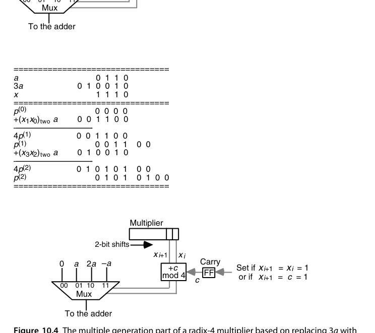{fig-align="center" width="85%"}

用图 10.3 的算例把流程走一遍：$a = (0110)_{\text{two}} = 6$，$x = (1110)_{\text{two}} = 14$，预计算 $3a = (010010)_{\text{two}} = 18$。乘数按两位分组，先低位后高位：第一拍考察 $x_1x_0 = 10$，加 $2a = 001100$（与双宽寄存器高半对齐），$4p^{(1)} = 001100$，右移两位后高半为 $000011$、低两位 $00$ 落定；第二拍考察 $x_3x_2 = 11$，加 $3a = 010010$，得 $4p^{(2)} = 000011 + 010010 = 010101$，拼上已落定的低两位共 $010101\,00$，再右移两位即 $p^{(2)} = (0101\,0100)_{\text{two}} = 84 = 6 \times 14$。注意每拍右移**两位**，乘积的低两位一旦移入寄存器低半就不再变化——这正是"每拍退休两位乘数"的硬件含义。

**解法二：用 $4a - a$ 替代 $3a$（进位顺延）。** 当两位组为 $11$ 需要 $3a$ 时，改为**本拍加 $-a$、并向高一位 radix-4 数字送一个进位 1**（$3a = 4a - a$，那个 $4a$ 正好进位到下一组）。计入来自低位的进位后，每拍所需倍数落在 $[0, 4]$：$0, 1, 2$ 直接处理，$3$ 与 $4$ 分别折算为 $-1$ 与 $0$ 外加一个送出进位（存入触发器留给下一拍）。末尾可能要多一拍收尾进位。原书图 10.4（即下文的图）就是这套结构：mux 在 $\{0, a, 2a, -a\}$ 中选择，控制逻辑按 $x_{i+1}x_i$ 与进位状态决定加什么、是否置位进位触发器。

两种解法都能推广到基数 8、16，但难倍数会越来越多（基数 8 要 $3a, 5a, 7a$），倍数生成硬件的复杂度会吃掉"拍数减少"换来的大部分收益。真正漂亮的解法是把"难倍数"从根上消灭——这就是下一节的 Booth 重编码。

## 10.2 改进 Booth 重编码（Modified Booth's Recoding）

第 9.4 节讲过 radix-2 Booth 重编码：把乘数换成 $\{-1, 0, +1\}$ 数字集，1 串合并为"低端减、高端加"。它有一个容易验证的关键性质：**重编码结果中不会出现相邻的非零数字**（连续的 1 或连续的 $-1$ 都不会出现）。于是若把重编码后的乘数按两位分组做 radix-4 乘法，两位组 $(y_{i+1}y_i)$ 的取值只剩 $00, \pm01, \pm10$ 三种形态，对应倍数 $\{0, \pm a, \pm 2a\}$——**难倍数消失了，全部由移位和取补获得**。

既然 $y_{i+1}$ 由 $(x_{i+1}, x_i)$ 决定、$y_i$ 由 $(x_i, x_{i-1})$ 决定，那么 radix-4 数字 $z_{i/2} = (y_{i+1}y_i)_{\text{two}}$（$i$ 为偶数）可以直接从**重叠的三位窗口** $(x_{i+1}, x_i, x_{i-1})$ 一次算出，根本不必显式生成中间的重编码序列 $y$：

| $x_{i+1}x_ix_{i-1}$ | $y_{i+1}$ | $y_i$ | $z_{i/2}$ | 含义 |
|---|---|---|---|---|
| 000 | 0 | 0 | $0$ | 视野内没有 1 串 |
| 001 | 0 | $+1$ | $+1$ | 1 串的结束 |
| 010 | $+1$ | $-1$ | $+1$ | 孤立的 1 |
| 011 | $+1$ | 0 | $+2$ | 1 串的结束 |
| 100 | $-1$ | 0 | $-2$ | 1 串的开始 |
| 101 | $-1$ | $+1$ | $-1$ | 一串结束、新串开始 |
| 110 | 0 | $-1$ | $-1$ | 1 串的开始 |
| 111 | 0 | 0 | $0$ | 1 串的延续 |

与 radix-2 版一样，这可以看成一次**数字集转换（digit-set conversion）**：把数字集 $[0, 3]$ 的 radix-4 数转换成数字集 $[-2, 2]$。转换公式可写成一个紧凑的算术表达式 $z_{i/2} = -2x_{i+1} + x_i + x_{i-1}$（默认 $x_{-1} = 0$），这个式子同时证明了重编码保值。看一个 16 位无符号数的完整转换：

$$
(1001\,1101\,1010\,1110)_{\text{two}} = (21\,31\,22\,32)_{\text{four}} = (1\,\bar{2}\,2\,\bar{1}\,2\,\bar{1}\,\bar{1}\,0\,\bar{2})_{\text{four}}
$$

注意两点：其一，16 位无符号数变成了 **9 位** radix-4 带符号数——最高位为 1 时需要向左扩一位才能保值，一般 $k$ 位无符号数需要 $\lfloor k/2 \rfloor + 1$ 个重编码数字；其二，若把同一个比特串按 **2 的补码**解释，则**恰恰应该忽略**这个多出来的最高位（补码符号位本身带负权重，直接给出正确编码），此时 $k$ 位补码乘数只需 $\lceil k/2 \rceil$ 个数字（$k$ 为奇数时令 $x_k = x_{k-1}$）。这两条与 9.4 节 radix-2 情形的结论完全平行。

用 4 位补码例子走一遍完整乘法（原书图 10.5）：$a = (0110) = +6$，$x = (1010)_{\text{2's}} = -6$。重编码：窗口 $x_1x_0x_{-1} = 100 \Rightarrow z_0 = -2$，窗口 $x_3x_2x_1 = 101 \Rightarrow z_1 = -1$，即 $z = (\bar{1}\,\bar{2})_{\text{four}}$。第一拍加 $z_0 a = -2a = -12 = (110100)_{\text{2's}}$（6 位），$4p^{(1)} = 110100$，右移两位并做符号扩展得 $p^{(1)} = 111101\,00$；第二拍加 $z_1 a = -a = (111010)$：$4p^{(2)} = 111101 + 111010 = 110111$（低两位 $00$），得 $p^{(2)} = (1101\,1100)_{\text{2's}} = -36 = 6 \times (-6)$。整个过程中，部分积累加器的高半部分要从 4 位扩到 6 位以容纳负值的符号扩展，右移时也要做算术（符号）移位。

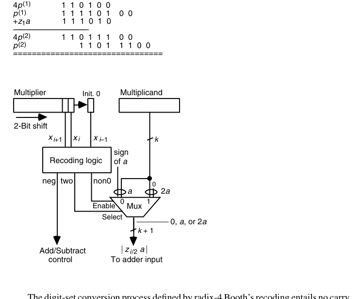{fig-align="center" width="85%"}

图 10.6 是对应的电路实现。五种倍数 $\{0, \pm a, \pm 2a\}$ 至少需要 3 个比特来编码，一种简单高效的分配是：**neg**（非零倍数的符号，同时决定加/减）、**non0**（倍数是否非零，接选择器使能）、**two**（非零倍数是否为 2，控制一位移位）。重编码电路就是 3 输入 3 输出的小组合逻辑，与乘数寄存器右侧一个保存 $x_{i-1}$ 的触发器配合即可。

值得把图 10.4 的方案与 Booth 方案做一次对比：图 10.4 的"进位顺延"重编码是**串行**的（进位必须从右向左逐组传递），而 Booth 重编码是**全并行、无进位**的——每个 $z_{i/2}$ 只看自己那三位窗口，与别的组无关。对逐位使用的时序乘法器来说，这个并行性用不上；但到了第 11 章的树形/阵列乘法器里，所有部分积要**同时**生成，并行重编码就成了不可替代的优势。这也是 Booth 方案最终胜出的深层原因。

::: {.callout-important title="为什么 MBE 是行业标准"}
改进 Booth 重编码（MBE，radix-4）用一张 8 行的真值表把"部分积数量减半 + 有符号免预处理 + 无难倍数"三件事一次解决。实现上每组只需一个 Booth 编码器（几级门）+ 一个 5 选 1 选择器。从 8087 到当代所有 CPU/GPU 的整数与浮点乘法器，部分积生成几乎无一例外是 radix-4 MBE。
:::

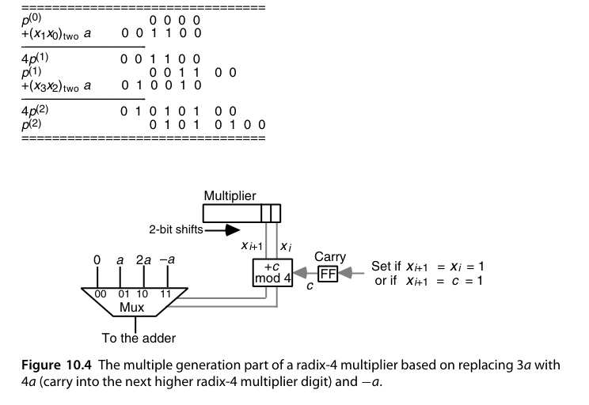{fig-align="center" width="85%"}

## 10.3 配合进位保存加法器（Using Carry-Save Adders）

CSA 在高基数乘法器里有两个独立的作用：**减少每拍的关键路径**，以及**消化难倍数**。

先说后者。不做 Booth 重编码的 radix-4 乘法器里，每拍要把"累积部分积 + $x_i a$ + $2x_{i+1}a$"三个数合并——用一个 CSA 把它们压成两个数再进普通加法器，$3a$ 就被拆成 $a + 2a$ 免费消化掉了（图 10.7）。但请注意账目：这种用法**并没有缩短加法时间**，反而每拍都付出了 CSA 的固定开销（不管当拍是否真的需要 $3a$）。它解决的是倍数生成问题，不是速度问题。

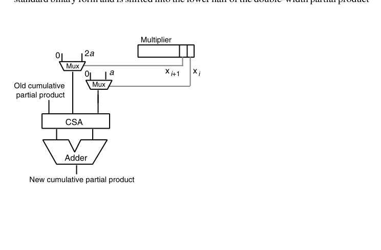{fig-align="center" width="85%"}

真正把 CSA 用到刀刃上的是**让累积部分积保持进位保存（stored-carry）形式**：图 10.8（见章末）所示的 radix-2 乘法器中，只有部分积的**高半部分**保持冗余的（sum, carry）双轨形式。每拍 CSA 把新部分积并入，和与进位各右移一位；由于每拍恰有 1 位以标准二进制形式"毕业"、被移入双宽寄存器的低半部分，**前 $k-1$ 拍完全不需要进位传播**——每拍的关键路径只有 mux 加 CSA 那几级门，且与字长 $k$ 无关。只有最后把 sum 与 carry 合成真值的那一次加法（图 10.8a 中的 k-bit adder）才需要完整进位传播。相比图 9.4a 的朴素时序乘法器，额外的硬件只有一个 $k$ 位寄存器、一个 $k$ 位 CSA 和一个 $k$ 位 mux。

进位保存与 Booth 重编码还可以叠加（图 10.9）：radix-4 + stored-carry，拍数减半、每拍又短。但有一个新麻烦要解决：冗余形式的部分积右移**两位**时，从"列 $k$ 的 1 位 + 列 $k+1$ 的 2 位"共 3 个比特要折算成标准二进制再移入低半部分——这就是图中那个小小的 **2 位加法器**的职务（它还接收上一拍留下的进位）。这部分逻辑比 CSA 慢，好在它的输出一旦产生就不再变化，可以流水化，不会拖累主累加回路。

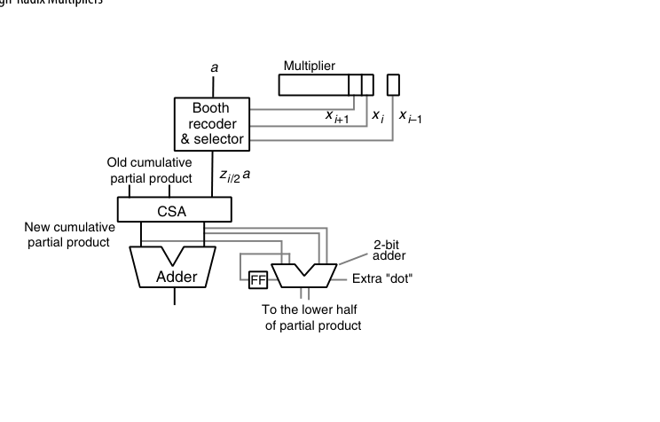{fig-align="center" width="85%"}

此时的 Booth 编码/选择逻辑也与图 10.6 不同（图 10.10）：**倍数的符号必须直接做进倍数本身**，而不能再作为"加/减"控制信号——因为 CSA 只做三路求和，没有减法端。负倍数 $-a$、$-2a$ 以补码形式产生：按位取反、末位加 1。这里有一个精巧的简化：$a$ 或 $2a$ 与位位置 $i$ 对齐时，其右侧补着 $i$ 个 0；取反后这 $i$ 个 0 变成 1，加 1 又把它们变回 0、并恰好向位位置 $i$ 送出一个进位。所以低位部分照旧忽略，只需**在第 $i$ 列直接插一个额外的"点"**（图 10.9 中的 extra "dot"）——这就是 8.5 节负权重技巧在乘法器里的日常形态。

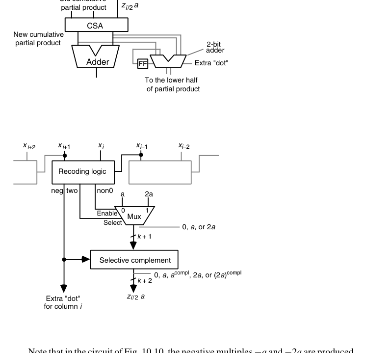{fig-align="center" width="85%"}

最后一种组合是不做 Booth、纯靠 CSA 树消化倍数：累积部分积（sum, carry 两轨）加上 $x_i a$ 与 $2x_{i+1}a$ 共**四个**操作数，需要两级 CSA（图 10.11）。这条路线硬件直白、控制简单，代价是每拍多一级 CSA 延迟。

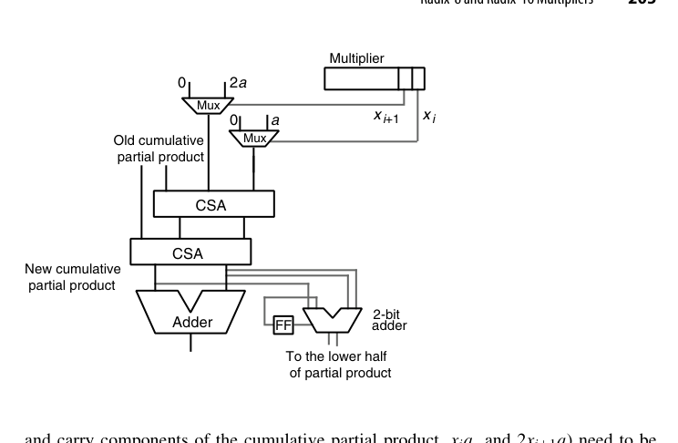{fig-align="center" width="85%"}

## 10.4 基数 8 与基数 16（Radix-8 and Radix-16 Multipliers)

从图 10.11 往上推广是顺其自然的：基数 8 每拍要并入 $x_i a$、$2x_{i+1}a$、$4x_{i+2}a$ 三个倍数，用三级 CSA 树连冗余部分积一起压成两个数；既然都三级了，不如再加一级 CSA 直接上**基数 16**（每拍 4 位，四个倍数），得到图 10.12 的结构——部分积高半部分保持进位保存形式，四个 mux 分别按乘数的四个比特选 $0$ 或 $a, 2a, 4a, 8a$，四级 CSA 收口，末端一个 4 位小加法器把每拍"毕业"的比特折算成标准二进制。另一个等价选项是把图 10.11 的 mux 全部换成 Booth 编码选择器；两者孰优取决于电路级细节与工艺参数。

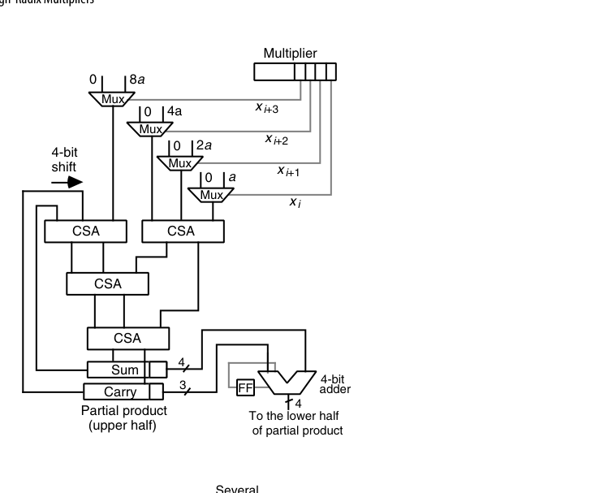{fig-align="center" width="85%"}

要不要 Booth，有个一般性的账可以算。radix-$2^b$ 乘法若先做 Booth 重编码，每拍只有 $b/2$ 个倍数要并入，加上冗余部分积的两轨，CSA 树的输入数是 $b/2 + 2$；不做 Booth 则要 $b + 2$ 输入。Booth 的压缩比更高（2 对 1.5），但 Booth 编码加选择的延迟比一级 CSA 略长——**是个需要拿工艺参数才能裁决的真问题**，并非 Booth 恒胜。

Booth 重编码本身也能升到高基数：radix-8 重编码用数字集 $[-4, 4]$、radix-16 用 $[-8, 8]$，乘数扫描窗口相应变宽（重叠 4 位、5 位）。但难倍数回来了：radix-8 Booth 需要 $\pm 3a$，可以开局预计算 $3a$ 存起来，也可以把 $3a$ 拆成 $2a + a$ 给 CSA 树多喂一路输入。更激进的方案是 radix-256（每拍 8 位）：先做 radix-4 Booth 重编码，把图 10.12 的四个 mux 换成 Booth 选择器即可——和"扫 7 位乘数、把 9 个数扔进四级 CSA 树"这种朴素方案比，谁划算同样取决于工艺。

**收益递减规律**：部分积从 $k/2 \to k/3 \to k/4$，但编码器延迟、选择器复杂度、难倍数预计算全部上升。工业界主流停在 radix-4；radix-8 偶见于对延迟极端敏感的浮点流水线，通常配合 $3a$ 的专用预计算通路。

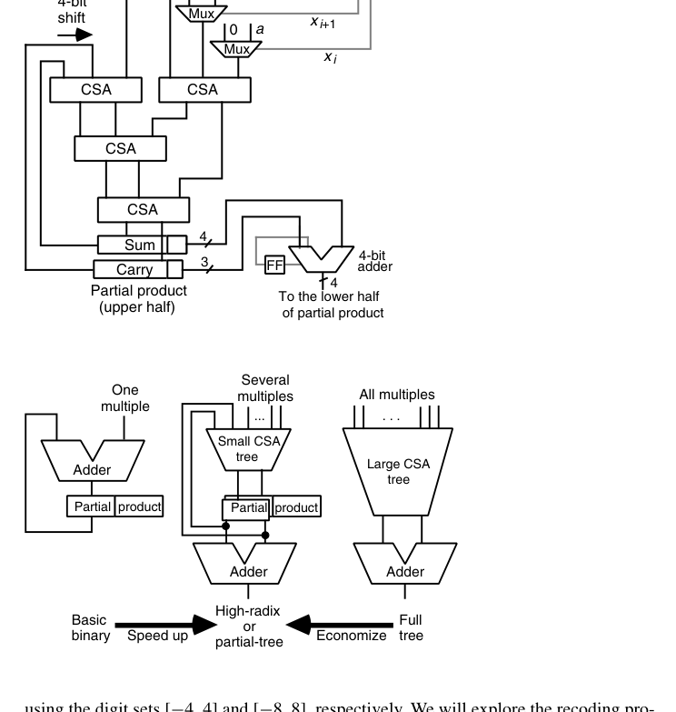{fig-align="center" width="85%"}

图 10.13 把本章与前后章的关系画在了一条轴上：最左端是第 9 章"一拍一个倍数 + 一个加法器"的基本时序乘法器；中间是本章"一拍若干倍数 + 小型 CSA 树"的高基数（或称部分树）乘法器；最右端是第 11 章"所有倍数一次性生成 + 大型压缩树"的全并行树形乘法器。沿轴向右是提速，向左是省钱——设计就是在这条轴上选工作点。

## 10.5 多拍乘法器（Multibeat Multipliers）

图 10.8a 的 CSA 乘法器里，CSA 的输出装回给它供输入的同一组寄存器。常见实现用**主从触发器（master-slave flip-flop）**：时钟高电平的半拍里，主侧接收新数据、从侧保持旧数据对外输出；时钟变低，新数据才从主侧移交从侧。既然主从两侧各自主导半个时钟周期，一个大胆的想法是：**在主、从寄存器之间再插一级 CSA**——只要它挤得进半拍，时钟周期几乎不变，而部分积累加速度直接翻倍。

把这一想法与高基数结合，就得到曼彻斯特大学 MU5 计算机用过的**双拍（twin-beat）乘法器**（图 10.14）：每个时钟周期分成两拍，第一拍用左侧乘数寄存器的 3 位做 radix-8 Booth 重编码并过第一级 CSA，第二拍用右侧寄存器的下 3 位过第二级 CSA——**一个时钟周期退休 6 位乘数**。周期末尾由右下角的小加法器把 6 位乘积折算成标准二进制送入部分积寄存器低半。这个小加法器很可能比 CSA 慢，因此必须流水化；所幸乘积位一旦产生就不再变化，它的延迟不影响进位保存主回路。

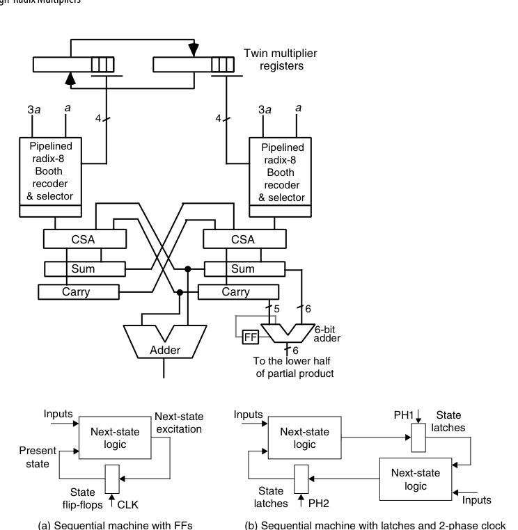{fig-align="center" width="85%"}

双拍的本质是把"一个时钟周期只做一次有效计算"改成"两个半拍各做一次"：用两相不交叠时钟 PH1/PH2 交替驱动上下两排锁存器，任何时序电路都能这样改造。沿此思路再进一步就是**三拍乘法器**（图 10.16）：三个"CSA + 锁存"节点接成环，由三相时钟驱动，每个节点要等两拍才把结果交给下一节点，于是奇数下标与偶数下标的部分积在环上分别累积；最后把环上的四个操作数压成两个，过一次加法器得到最终乘积。

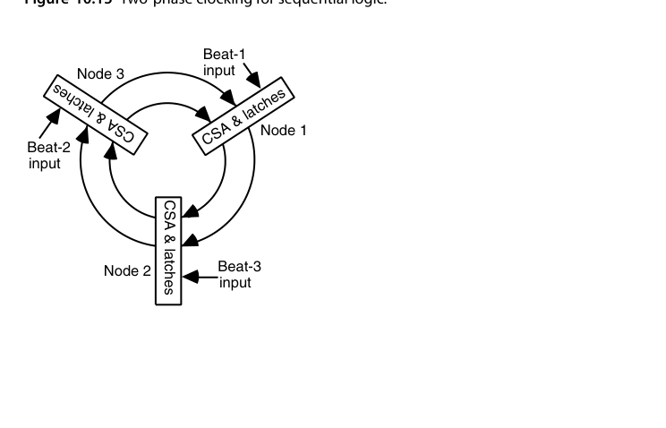{fig-align="center" width="85%"}

多拍结构在面积与吞吐之间给出细粒度的工作点：例如 64 位乘法用 32×32 阵列两拍完成。嵌入式 CPU（如 Cortex-M3 的可选配置）常用这类方案——比全并行树省一半面积，又比纯时序快数倍。

## 10.6 VLSI 复杂度问题（VLSI Complexity Issues）

本章时序乘法器的构件无非是 CSA、寄存器、mux、再加一个最终快速加法器，控制逻辑很少，实现上没有悬念。两个有用的化简随手可用：一输入恒 0 的 2 选 1 mux 退化成一排与门（选择信号当使能）；输入互为反码（$a$ 与 $\bar a$）的 mux 可以换成一排 XOR 门（每个门的一个输入接选择信号）。

对 radix-$2^b$ 乘法器的 CSA 树，通常设计一个**位片（bit slice）**然后横向复制：不做 Booth 时 CSA 树有 $b+2$ 路输入，位片就是一个 $(b+2;\,2)$-计数器（见 8.4 节）；先做 radix-$2^h$ Booth 重编码则每拍倍数减少 $h$ 倍，位片相应变成 $(b/h + 2;\,2)$-计数器。例如 radix-32 不做 Booth 时正好用 $(7;\,2)$-计数器位片。

复杂度可以渐近地算。每拍并行生成 $b$ 个倍数需要 $bk$ 个二输入与门，把 $b$ 个倍数压成 2 个的 CSA 树面积也是 $O(bk)$，均盖过最终加法器，故总面积

$$
A = O(bk),\qquad T = O\big((k/b)\log b + \log k\big)
$$

——$k/b$ 拍、每拍 $O(\log b)$（CSA 树高），加一次 $O(\log k)$ 的最终加法。VLSI 理论告诉我们：任何计算两个 $k$ 位整数乘积的电路都必须满足 $AT = \Omega(k\sqrt{k})$ 与 $AT^2 = \Omega(k^2)$。代入上面的设计：常数 $b$ 时 $AT = O(k^2)$、$AT^2 = O(k^3)$；$b = k$（全并行）时 $AT = O(k^2\log k)$、$AT^2 = O(k^2\log^2 k)$——**整个 $b$ 的取值范围都达不到理论下界**，这些乘法器在渐近意义下全是次优的。

这个负结果有一个反直觉的推论：按 $AT$（常被当作性价比指标）衡量，**慢的 radix-2 乘法器反而优于高基数或树形乘法器**。所以若应用需要海量相互独立的乘法，把同样面积切成许多个慢乘法器，可能比造少数几个快乘法器更划算。当然，实践中 $k$ 并不大（真正的宽字长乘法，如密码学场景，通常用多精度算术拆给中等宽度的乘法器做），渐近次优丝毫不妨碍这些设计在很宽的参数范围内保持实用。第 11 章还会看到：配合更有效的流水方案，时间复杂度能从 $O((k/b)\log b + \log k)$ 降到 $O(k/b + \log k)$，$AT$ 与 $AT^2$ 随之改善，但上述定性结论不变。

## RTL 实践：`rtl/ch10_2_booth_radix4_multiplier`

组合逻辑 8×8 有符号 Booth 乘法器，完整呈现「编码 → 选择 → 压缩 → CPA」流水线：

```systemverilog
// Booth 窗口与部分积选择（第 i 个窗口）
case (win[i])
    3'b000, 3'b111: mag = 16'sd0;                 // 0
    3'b001, 3'b010: mag = {{8{a[7]}}, a};         // +x
    3'b011:         mag = {{7{a[7]}}, a, 1'b0};   // +2x
    3'b100:         mag = {{7{a[7]}}, a, 1'b0};   // -2x
    default:        mag = {{8{a[7]}}, a};         // -x
endcase
```

设计要点：

- **负倍数 = 取反加 1**：选择器输出幅度值，负窗口统一做补码取负，再按窗口位置左移 $2i$ 位——无需任何"难倍数"预计算；
- 4 个部分积用两级行为化 CSA（`s = x^y^z`，`c = majority<<1`）压成 2 行，最后一级 `+` 交给综合器映射为快速 CPA；
- testbench 的黄金模型用 `$signed` 强制符号扩展，覆盖 $(-128)\times(-128)=16384$ 等边界，3000 组随机比对。

```bash
cd rtl/ch10_2_booth_radix4_multiplier
bash run_iverilog.sh    # 或 bash run_verilator.sh
```

## 本章小结

- 高基数 = 每拍扫更多位、部分积更少；难倍数是拦路虎，三种对策：预计算 $3a$、$4a - a$ 进位顺延、Booth 重编码。
- 改进 Booth 重编码（radix-4）：重叠三位窗口、数字集 $\{0,\pm1,\pm2\}$ 全免费倍数、部分积减半、有符号直通、全并行无进位——工业标准。
- CSA 的双重角色：消化难倍数（不提速）与让部分积保持冗余形式（每拍常数延迟，与字长无关）；负倍数以补码进树，低端"额外的点"处理 +1。
- radix-8/16 收益递减，需预计算或拆分难倍数；Booth 与否要拿工艺参数裁决。
- 多拍结构（双拍、三拍）利用主从寄存器的两个半拍，提供面积-吞吐的中间档。
- VLSI 复杂度：$A = O(bk)$、$T = O((k/b)\log b + \log k)$，全范围渐近次优；$AT$ 指标下多个慢乘法器可能比少数快乘法器更划算。

## 原书插图

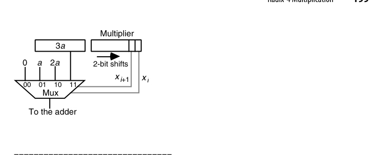{fig-align="center" width="85%"}

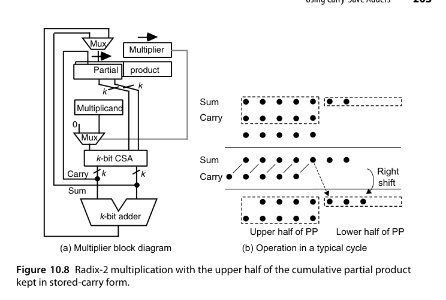{fig-align="center" width="85%"}
