# 第11章 树形与阵列乘法器（Tree and Array Multipliers）

## 本章导读

把第 9、10 章的部分积生成与第 8 章的压缩树合体，就得到现代组合乘法器的完整形态：**部分积生成（Booth）→ 压缩树（CSA/4:2）→ 最终加法器（CPA）**。本章讨论全树、阵列、有符号处理、截断与流水化——这是 CPU/GPU/AI 芯片里每天都在流片的结构。

三段式之外，本章还要回答两个纯粹的工程问题：**为什么"规整"常常比"理论延迟更短"更值钱**（阵列乘法器的生态位），以及**为什么"少算几位"能换来近一半的面积**（截断乘法器）。这两个问题看起来古老，却在今天的 AI 加速器里换了件马甲重新出现。

## 11.1 全树乘法器（Full-Tree Multipliers）

全树（full-tree）：所有部分积一次性生成，一棵树压到底，一次 CPA 收尾。$k$ 位无符号乘法：$k$ 个部分积（或 Booth 后 $k/2$ 个），树高 $O(\log k)$，CPA $O(\log k)$——总延迟 $O(\log k)$，面积 $O(k^2)$。

全树的硬件账本可以直接数出来：第一步用 $k^2$ 个与门生成 $a_jx_i$ 位点，它们在 $2k-1$ 列里排成 $1,2,\dots,k,\dots,2,1$ 的三角分布；第二步用压缩器把这些位点归约到每列不超过 2 个；第三步交给 $2k$ 位 CPA 收尾。压缩器总数与阵列乘法器同阶（都是 $\Theta(k^2)$），真正的差别不在"用了多少加法器"，而在**连线的组织方式**。

延迟则要从"剩余行数"看：一个 3:2 计数器把 3 行合成 2 行，要拿到对数级树高，每级就必须尽量"吃满"——这是 Wallace 的思想；反之每级只做最低限度压缩，树高略增但模式更规律、CPA 更宽——这是 Dadda 的思想。而最终加法器的权重常被低估：压缩树把 $O(k)$ 行压到 2 行，但这两行仍是冗余形式，必须由 CPA 归约；用前缀结构时延迟 $O(\log k)$ 尚可，一旦偷懒用行波加法器，整条路径立刻退回 $O(k)$——这正是阵列乘法器延迟劣化的根源。

::: {.callout-note title="解读"}
$O(k^2)$ 面积听着吓人，但现代工艺里 64×64 乘法器只占零点几平方毫米，瓶颈早已不是"造不造得起"，而是**功耗与时序收敛**——压缩树的连线不规则性让高频下的物理设计很考验功力。
:::

## 11.2 其他归约树（Alternative Reduction Trees）

- **Dadda 策略**：压缩器最少；
- **Wallace 策略**：尽早压缩；
- **4:2 压缩器树**：现代主流。4:2 压缩器摄入 4 个同权重比特 + 级联进位 $c_{in}$，输出 2 比特 + 级联进位 $c_{out}$，关键性质是 **$c_{out}$ 不依赖于 $c_{in}$**——横向级联只走一级 mux 延迟，压缩树各列独立，时序极易收敛；
- **平衡延迟树**：考虑不同路径经过压缩器数量的均衡，避免某些列"级数特别深"。

两种经典策略的差别可以用 4×4 的玩具例子算清楚。16 个位点按 $1,2,3,4,3,2,1$ 分布在 7 列中：**Wallace** 第一级立刻压缩，用 3 FA + 1 HA 把分布变成 $1,3,2,3,2,1,1$，第二级再用 2 FA + 2 HA 压到 $2,2,2,2,1,1,1$，末尾只需一个 4 位 CPA（合计 5 FA + 3 HA）；**Dadda** 第一级只把高度从 4 降到 3（2 个 FA，得 $1,3,2,2,3,2,1$），第二级用 2 FA + 2 HA 压到高度 2（得 $2,2,2,2,1,2,1$），代价是 CPA 变成 6 位（合计 4 FA + 2 HA）。结论很工程化：**Dadda 用更少的加法器换更宽的 CPA**——当 CPA 已是快速前缀结构时，多 2 位几乎不影响延迟，Dadda 往往更划算。

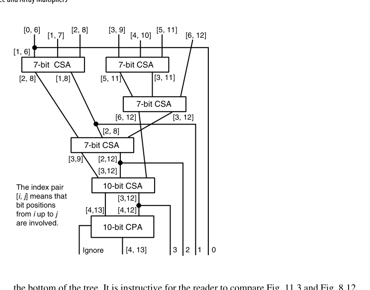{fig-align="center" width="85%"}

规整性问题在 7×7 例子上一览无遗：7 个待加数依次左移 0~6 位，每行有效区间从 $[0,6]$ 撑到 $[6,12]$，压缩器宽度从 7 位一路变到 10 位，树底还出现大量只做"位点搬家"的半加器。与第 8 章图 8.12 对照可知：**同样的 CSA 压缩理论，一旦加上"操作数互相移位"这个约束，结构与代价就全变了**。

一种更规整的替代方案是把基本单元换成 **4:2 压缩器**。用 4:2 模块搭出的树是严格二叉树：顶层每个模块吃掉乘数的 4 个倍数（两上两下），吐出 2 个数给下一层；每加深一层只需复制已有树、中间插一个 4:2 模块。这种递归结构对版图极其友好。若用两级 CSA 拼出 4:2 模块，二叉树级数可能比 Wallace/Dadda 还多，但规整性带来的版图效率通常能补回延迟；而直接从 I/O 规范设计的实现（图 11.5c）延迟只有 3 级 XOR（两级 CSA 拼法是 4 级）。还有一个漂亮的理论视角——二进制 4:2 压缩器本质是数字集 $[0,2]$ 的**广义有符号数字加法器**，2 比特编码为：零 = $(0,0)$、一 = $(0,1)$ 或 $(1,0)$、二 = $(1,1)$，据此可直接延伸到 BSD 部分积与 $[0,3]$ 数字集等变体。

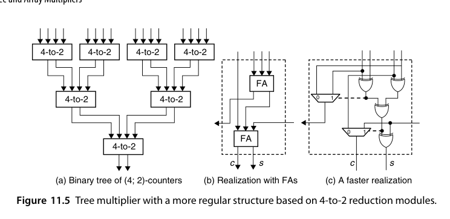{fig-align="center" width="85%"}

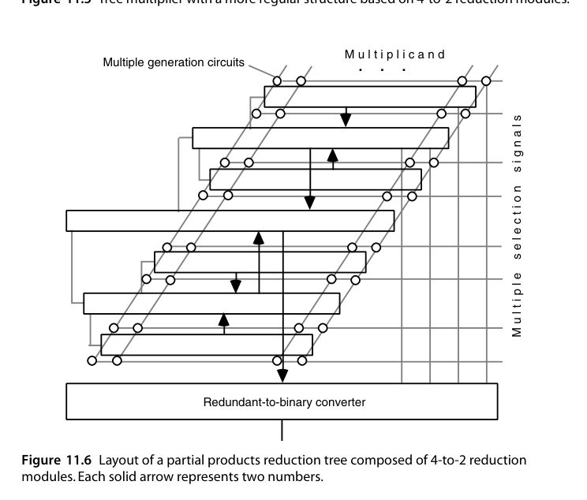{fig-align="center" width="85%"}

**平衡延迟树（balanced-delay tree）** 走的是另一条路：不求"级数最少"，而求"所有输出同时到达"。基于第 8 章表 8.1，11:2 归约至少需要 5 级 FA；图 11.4 给出了一种 5 级布局，其关键特征是第 $i$ 级的进位全部送入第 $i+1$ 级 FA，路径完全均衡。该电路由三列组成（从左到右含 1、3、5 个 FA），占一个很窄的垂直切片，横向复制即可拼出任意宽度的归约树；在右侧追加一列 7 个 FA，输入数就从 11 提升到 18，相邻列之间只有一根连线，互连开销极小。

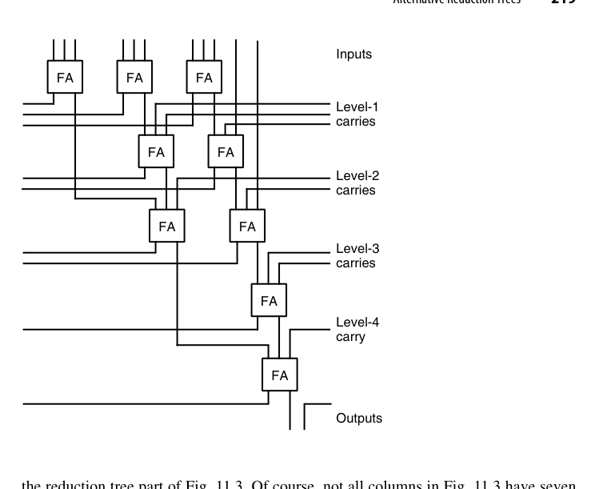{fig-align="center" width="85%"}

::: {.callout-tip title="选型经验"}
四类归约树的适用面可以粗略总结为：**追极限延迟**选 Wallace，**追器件数**选 Dadda，**追版图规整与高主频**选 4:2 二叉树，**追延迟确定性**选平衡延迟树。而在引入 Booth 之后还有一层反问：radix-2 Booth 把行数减半，省下的压缩器是否抵得上编码逻辑本身的面积与时延？现代 VLSI 下的实证结论并不总偏向 Booth——**布线开销与不规则性会把账面优势吃掉**。
:::

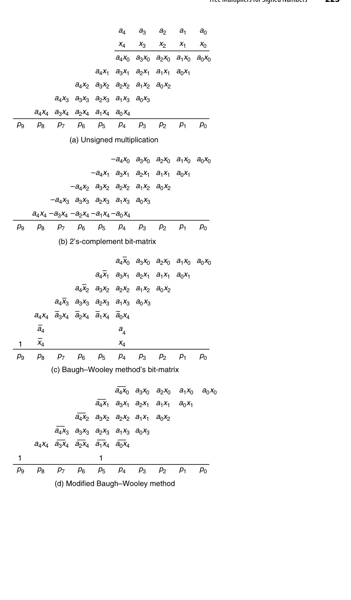{fig-align="center" width="85%"}

## 11.3 有符号数的树形乘法器（Tree Multipliers for Signed Numbers)

Booth 部分积天然带符号，进压缩树时的三板斧（第 8.5、10.3 节已铺垫）：

1. 负倍数部分积取补（取反 + 最低位加 1）；
2. 符号扩展的"翻转 + 常数补偿"技巧消除高位符号串；
3. 最终 CPA 输出真正的 2 的补码乘积。

直接对 2 的补码操作数做乘法时，每个部分积都是有符号数，**必须符号扩展到最终乘积的宽度**。真正的代价不在"扩展"本身，而在扩展产生的冗余位串：一个负的部分积，其高位会拖出一长串 1。这里有一个可复用的恒等式——若 $m$ 个相同符号位 $s$ 占据权重 $2^i$ 到 $2^{i+m-1}$，则

$$
s\cdot\sum_{j=i}^{i+m-1}2^j = s\left(2^{i+m} - 2^i\right)
$$

即这 $m$ 个位点可以压缩成"高位一个 $2^{i+m}$、低位一个 $-2^i$"两项。把矩阵中所有行的符号串、以及取补时各行最低位需要的那个 $+1$ 统一归并，就得到一个**可预计算的常数**——它只有很少几个有效位，直接作为额外一行注入压缩树即可，符号扩展串就此消失。

符号扩展位串还有一个可利用的特性：**不同列可以共用同一个 FA**。图 11.7 画了三个带符号扩展的部分积，某些列的位点模式完全重复，一个 FA 的进位输出可以同时服务好几列，于是"5 份冗余副本被直接删掉"。不过由于各行之间存在移位，这里可复用的模式比第 8 章图 8.19（无移位情形）要少，因此用于容纳符号位的宽度扩张反而略大一些。

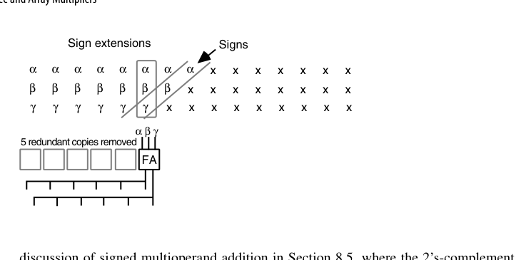{fig-align="center" width="85%"}

Baugh-Wooley 阵列（9.4 节）与 Booth+压缩树是有符号乘法的两大流派，后者因部分积减半而完胜主流市场。

## 11.4 部分树与截断乘法器（Partial-Tree and Truncated Multipliers)

- **部分树（partial-tree）**：只用较小的压缩树，迭代几拍完成（与多拍思想汇合）；
- **截断乘法器（truncated multiplier）**：只要乘积高 $k$ 位时（定点 DSP 的日常），低位部分积整列扔掉，保留列加"舍入补偿常数"控制误差。面积/功耗省近一半，误差有严格上界可分析——FIR、FFT 数据通路的标准优化。

部分树的设计参数只有一个 $h$（$h<k$）：把 $k$ 个操作数的加法拆成 $\lceil k/h\rceil$ 趟，每趟用一个 $(h+2)$ 输入的 CSA 树，把"累积部分积（存储进位形式的两行）"与"新的 $h$ 个操作数"一起压缩。每趟结束后，下一批 $h$ 个操作数相对本批左移 $h$ 位，因此和的后 $h$ 位、进位部分的 $h-1$ 位可以"放松"出去，用一个小型 $h$ 位加法器换算成最终乘积的 $h$ 位，进位出送至触发器与下一批输入合并。图 11.9 中浅灰画出的就是这条可放松的低位通路。本质上图 11.9 就是 **radix-$2^h$ 乘法**，与第 10 章的高基数乘法器只有定量差别：$h$ 较小（不超过 8 位）时叫高基数乘法器，$h$ 占到 $k/2$、$k/4$ 量级时叫部分树乘法器。若前置 radix-$2^b$ Booth 编码，趟数减少 $b$ 倍，每趟可放松 $bh$ 位。

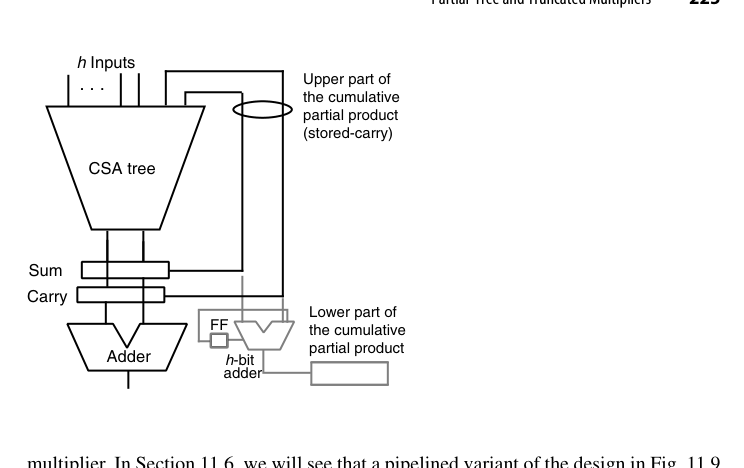{fig-align="center" width="85%"}

截断乘法器的动机来自一个观察：定点小数乘法中，部分积矩阵右半边（图 11.10 虚线右侧）对最终结果影响极小，我们却为它付了与左半边相同的与门数和压缩器数。与其"算完再舍"，不如根本不生成这些位点。若把虚线右侧全部丢弃，最坏情况（丢弃位全是 1）的误差为

$$
\frac{8}{2}+\frac{7}{4}+\frac{6}{8}+\frac{5}{16}+\frac{4}{32}+\frac{3}{64}+\frac{2}{128}+\frac{1}{256}\approx 7.004\ \text{ulp}
$$

$O(7\ \text{ulp})$ 在多数 DSP 场合太大，但同样的分析框架给出三条改进路线：**多留一列**（保留虚线右侧第一列，误差降到 3.5 ulp，代价是多生成并压缩 8 个位点）；**常数补偿**（仍丢第 $-9$ 列及之后，但在第 $-6$ 列插一个常数 1，误差落在 $-3$ 至 $+4$ ulp，量级相当而硬件成本低得多——三个方案里性价比最高）；**可变补偿**（在第 $-7$ 列插入 $a_{-1}$ 与 $x_{-1}$ 两个位点，被丢弃位更可能为 1 时给更大补偿，误差分析需按输入分布做）。

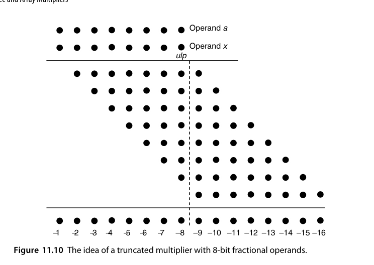{fig-align="center" width="85%"}

::: {.callout-tip title="工程经验"}
AI 芯片的 MAC 阵列里，"截断 + 补偿"思想以**量化（quantization）**的形式出现：INT8 乘加后截断到 INT8/INT16。误差上界的分析方法和截断乘法器一脉相承——第 19 章的误差分析是这些优化的理论底气。
:::

## 11.5 阵列乘法器（Array Multipliers）

阵列（array）乘法器：部分积生成与累加织成一张规则的二维 FA 阵列——每行一个部分积，行内行波、行间斜传进位。延迟 $O(k)$（与行波加法器同阶），但**结构极度规整**：一个 FA 单元平铺 $k^2$ 次，版图就是复制粘贴。

更准确的定义是：阵列乘法器 = **单侧（one-sided）压缩树 + 行波进位加法器**，即"最慢的 CSA 树配最慢的 CPA"。既然两头都用最慢实现，为什么还要用它？答案是**规整性本身就是价值**：所有连线只连接水平、垂直或对角相邻的 FA，线短、局部，版图简单高效，且极易流水化。阵列结构还带来一个免费红利——图 11.11 中最上方 CSA 有一个空闲输入，把它接上一路数据 $y$，阵列就直接算出 $p=ax+y$，卷积与内积运算依赖的正是这个功能；若只想要 $ax$，把这个 CSA 去掉、让 $x_0a$ 与 $x_1a$ 直接进第二个 CSA 即可。

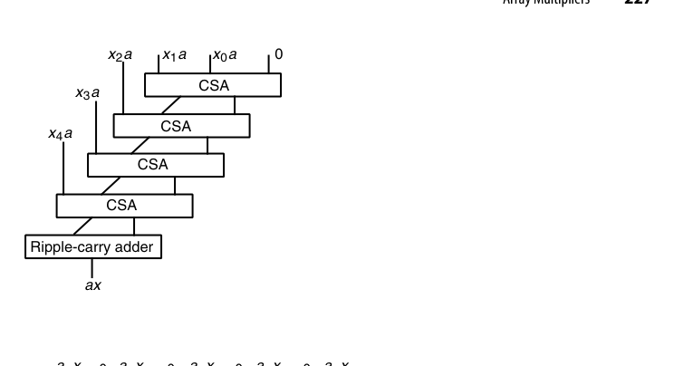{fig-align="center" width="85%"}

- 优点：设计简单、布线全局部、无需任何树形规划；
- 缺点：延迟高，$k$ 大时不敌树形；
- 生态位：小位宽、低成本、或作为更大结构的子模块；历史上也常被教学采用（"看得见的乘法"）。

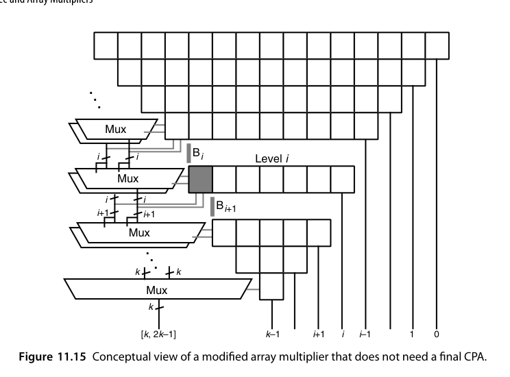{fig-align="center" width="85%"}

把 FA 与一个与门封装成单元，$x_i$ 与 $a_j$ 分别以行、列广播，第 $i$ 行第 $j$ 列的单元自行生成 $a_jx_i$ 并送入本单元 FA——这就是图 11.14 的"带与门的 FA 阵列"；若想再省面积，可只把第一行（或前两行）的单元退化成单个与门。把它改成 2 的补码阵列，用 Baugh-Wooley 方法只需三处改动：在行波加法器右端加一个 FA 接收 $a_4$、$x_4$，在左下边缘加两个 FA 容纳 $a_4$、$x_4$ 与常数 1（图 11.13）。改动如此局部，Pezaris 等需要多种带负权输入/输出 FA 变体的早期方案今天已基本不用。

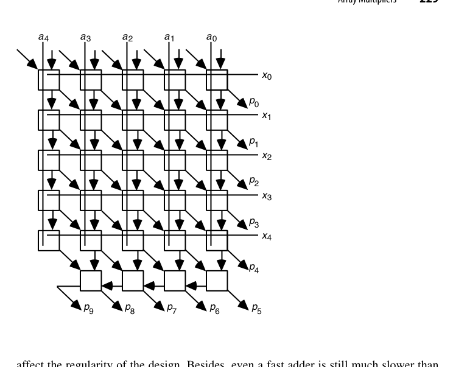{fig-align="center" width="85%"}

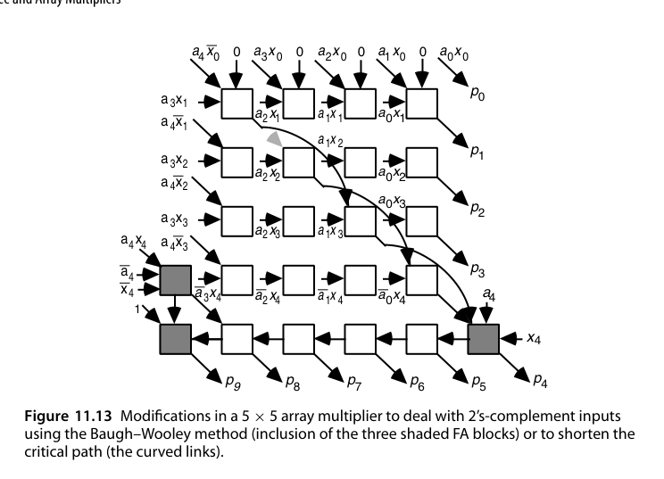{fig-align="center" width="85%"}

阵列的关键路径还有一个结构性事实：当 FA 的求和逻辑比进位逻辑慢时，路径沿主对角线前进、最后在末行水平走到 $p_9$，而末行占了将近一半延迟。一个诱人的想法是让某些和信号"跳行"（从第 $i$ 行直接送到第 $i+h$ 行）——图 11.13 中弯曲的连线就是 $h=2$ 的改法。但跳行会破坏规整性、拉长连线，**实测收益常常抵不上代价**。更彻底的方向是**干脆不要最终 CPA**：把 $k^2$ 个位点按 $1,2,3,\dots,k,\dots,3,2,1$ 排成三角形，最低位直接输出，其余位由若干行 FA/HA 逐步归约；在第 $i$ 级只产生"边界 $B_i$ 上方有条件的两份结果"（一份假设后续进位跨过 $B_i$，一份假设不跨），每下降一级条件位部分延长 1 位，最后一组 mux 给出末尾 $k$ 位的非冗余结果（图 11.16）。这套"条件求和"思想与进位选择加法器一脉相承，把进位传播彻底移出关键路径。

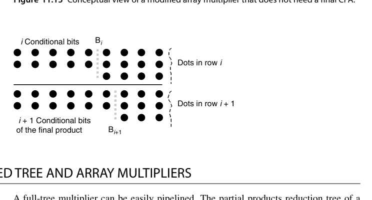{fig-align="center" width="85%"}

::: {.callout-warning title="注意"}
无最终 CPA 的阵列乘法器虽然省掉了进位传播延迟，但代价是 mux 与条件逻辑的面积开销，且设计复杂度明显上升。工程上更常见的折中是**用部分条件逻辑只处理末若干行**，其余仍走常规压缩。
:::

## 11.6 流水化树形与阵列乘法器（Pipelined Tree and Array Multipliers)

压缩树的各级之间插入寄存器 → 流水乘法器，吞吐提升到每拍一条乘法：

- 典型切分：部分积生成+Booth（1 级）→ 压缩树（1-2 级）→ CPA（1 级），共 3-4 级流水；
- 流水寄存器开销约占总面积 20-40%，但频率与吞吐翻倍；
- **延迟（latency）与吞吐（throughput）解耦**是流水线的根本红利（第 25 章系统展开）。

全树乘法器的流水化很直接：压缩树本身是纯组合电路，按级切段、段间插锁存器即可。麻烦出在部分树（图 11.9）上——如果仍把树输出反馈回树输入，那么在新一批输入进来之前必须等前一批的 sum/carry 被锁存，流水节奏被**整棵树深**而非单级延迟决定；$h$ 一大这个限制就很致命。解法是把反馈点从"树的输入端"移到"树的中间"：让压缩树输出的 sum/carry 直接灌进 $(h+2)$ 输入树的**中间层**（图 11.17）。这样每一拍的组合延迟只由两级 CSA 决定，乘法速度大幅提升——这是一个经典手法：**把长反馈环切断并下沉到流水级内部**。

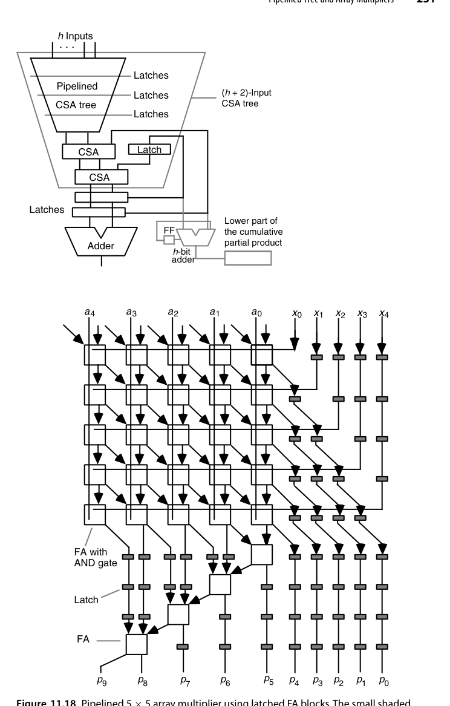{fig-align="center" width="85%"}

阵列乘法器的流水化更自然——行间本来就有规律的斜传结构，切斜线插入流水寄存器即可（称为"斜切流水"）。图 11.18 是 5×5 阵列乘法器的流水实现：输入从上方进入、乘积从下方输出，共需 9 拍（一般情形为 $2k-1$ 拍）；所有 FA 单元的 sum 与 carry 输出都带锁存器，各行需要的 $x_i$ 通过在其路径上插入锁存器来对齐延迟，最后一行原本的 4 位行波加法器也被拆成流水形式。

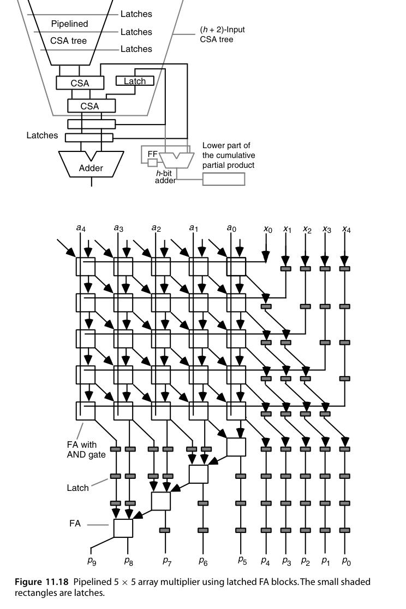{fig-align="center" width="85%"}

::: {.callout-note title="时序要点"}
流水化的真正难点是**末行的加数**：行波加法器的延迟远大于单个 FA 行，若按其他行的节拍切分，末行会成为"瓶颈级"。图 11.18 的处理办法是**把末行也细分成多级流水**，让每级的组合延迟尽量接近。做这类设计时，务必按"最长单级延迟"而不是"平均延迟"确定时钟周期。
:::

## RTL 实践：`rtl/ch11_5_array_multiplier`

8×8 无符号阵列乘法器：部分积按行斜向对齐，行间用全加器链逐级累加——同一个 FA 结构平铺 $N \times 2N$ 次：

```systemverilog
// 第 i 个部分积：a * b[i]，左移 i 位
assign pp[i] = ({{N{1'b0}}, a} & {2*N{b[i]}}) << i;
// 第 i 行：rowsum[i+1] = rowsum[i] + pp[i]（2N 个 FA 组成的行）
for (j = 0; j < 2*N; j = j + 1) begin : g_fa
    assign rowsum[i+1][j] = rowsum[i][j] ^ pp[i][j] ^ c[j];
    assign c[j+1] = (rowsum[i][j] & pp[i][j]) |
                    ((rowsum[i][j] ^ pp[i][j]) & c[j]);
end
```

设计要点：

- **规整性的代价**：延迟 $O(N)$（每行进位行波），换取版图上的完美平铺与全局部布线；
- 与 `ch8_3_wallace_tree` 对照阅读：同样 $N$ 个部分积，树形压缩把延迟降到 $O(\log N)$，但布线不再规则；
- testbench 与黄金模型 `a*b` 做 2000 组随机比对。

```bash
cd rtl/ch11_5_array_multiplier
bash run_iverilog.sh    # 或 bash run_verilator.sh
```

## 本章小结

- 现代乘法器三段式：Booth 生成 → 4:2/CSA 压缩树 → 前缀 CPA。
- Wallace 求快、Dadda 求省、4:2 二叉树求规整、平衡延迟树求时序确定。
- 有符号处理靠 Booth + 符号修正技巧，Baugh-Wooley 为备选。
- 截断乘法器：要高位就扔低位，省一半面积，误差可控（常数补偿最划算）。
- 阵列胜在规整，树形胜在速度；流水化让吞吐起飞，反馈环要下沉到级内。

## 原书插图

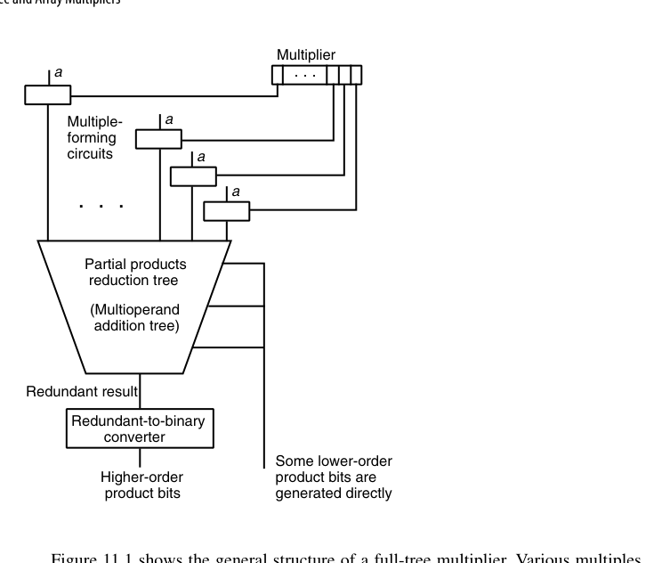{fig-align="center" width="85%"}

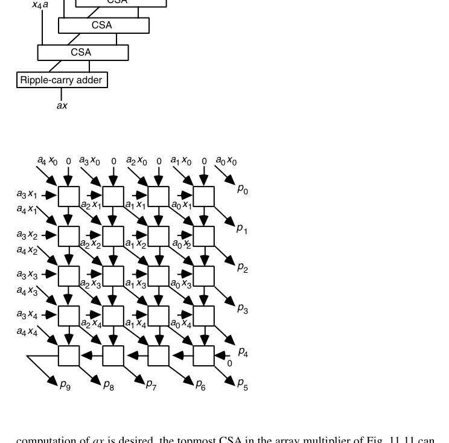{fig-align="center" width="85%"}
