# 第12章 乘法器的变体（Variations in Multipliers）

## 本章导读

主流（Booth + 压缩树）之外，乘法器还有一个丰富的"特种装备库"：分治（Karatsuba）、位串行、模乘、平方专用、乘加融合。它们各守一个细分场景——大数、低功耗、密码学、DSP——本章一次看齐。

这些变体的共同背景是**"不能或不愿从头造乘法器"**：手里只有现成的小乘法器、加法器或查找表，或者受限于芯片面积、封装引脚、布线长度。理解了这层约束，才能理解下面每一种设计为什么长成那个样子。

## 12.1 分治设计（Divide-and-Conquer Designs）

把 $k$ 位乘法拆成 $k/2$ 位小块：直接拆需 4 个子乘法；**Karatsuba 分解**用代数恒等式省掉一个：

$$
x_H y_H \text{ 与 } x_L y_L \text{ 之外，交叉项 } x_H y_L + x_L y_H = (x_H + x_L)(y_H + y_L) - x_H y_H - x_L y_L
$$

4 个子乘法 → 3 个，递归下去渐近复杂度从 $O(k^2)$ 降到约 $O(k^{1.58})$。

先看"直接拆"这条基线。把 $2b$ 位操作数写成 $2^b a_H + a_L$ 与 $2^b x_H + x_L$，则 $(2^b a_H + a_L)(2^b x_H + x_L) = 2^{2b}a_Hx_H + 2^b(a_Hx_L + a_Lx_H) + a_Lx_L$。四个 $b\times b$ 部分积中，$a_Hx_H$ 与 $a_Lx_L$ 的位域不重叠（一个占高 $2b$ 位、一个占低 $2b$ 位），可以拼成一个 $4b$ 位数，真正需要相加的只有三项，因此只需**一级进位保存加法 + 一次 $3b$ 位进位传播加法**收尾，而且低 $b$ 位乘积在子乘法完成后立刻可用。规模可以往上推：用 $b\times b$ 模块拼 $3b\times 3b$ 得到 5 个待加数、拼 $4b\times 4b$ 得到 7 个，分别用一行 $(5;2)$ 或 $(7;2)$ 计数器加一个 $5b$ 或 $7b$ 位快速加法器收尾。具体数字：**用 4×4 乘法器搭 16×16，需要 16 个小乘法器、24 个 $(7;2)$ 计数器和一个 28 位快速加法器**；32×32 用 8×8 模块搭出来的结构与之完全相同——分治是自相似的。

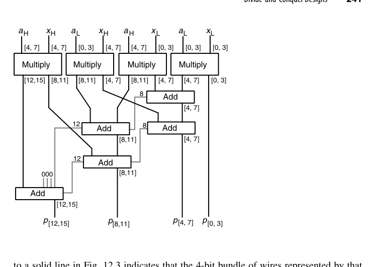{fig-align="center" width="85%"}

如果手头只有 $b$ 位加法器（而非 CSA），$2b\times 2b$ 乘法也能只用 $b$ 位加法器完成。图 12.3 中每条实线代表跨越位区间 $[i,j]$ 的一组 $b$ 位线束，单个整数标注的灰线代表 1 位；整个累加只需 **5 个 $b$ 位加法器模块、电路深度 4**。当 $b$ 位加法器是廉价货架元件时这个方案很划算，其速度与"CSA 归约 + 三级 $b$ 位加法器串成 $3b$ 位最终加法"相差不大。同理，用 $8\times4$ 乘法器做模块时，16×16 可由 8 个这样的单元 + 一个 5-to-2 归约电路 + 28 位加法器构成。Karatsuba 的价值则在"位宽极大"这一端才显现：它把子乘法从 4 个降为 3 个（$a_Hx_H$、$a_Lx_L$、$(a_H+a_L)(x_H+x_L)$），代价是三次额外加减，递归展开后复杂度降为 $O(k^{\log_2 3}) \approx O(k^{1.585})$。

::: {.callout-note title="适用边界"}
Karatsuba 的递归管理与额外加法有常数开销，**只在位宽很大（数百位以上）时才回本**——密码学的大数乘法库（如 4096 位 RSA）是它的主场，64 位 CPU 乘法器用它反而是赔本买卖。
:::

## 12.2 可加乘模块（Additive Multiply Modules, AMM）

一种积木化思路：设计"$(a \times b) + c$ 型"的小乘加模块，多块级联拼出大乘法器。优点是模块化、可扩展、位宽可按需裁切；缺点是拼接处的进位/延迟要仔细对表。在标准单元库受限或需要快速拼出非标准位宽时是实用选择。

标准 AMM 计算 $p = ax + y + z$，其中 $a$、$y$ 是 4 位数，$x$、$z$ 是 2 位数，结果最大值为 $(15\times3)+15+3 = 63$，正好 6 位。这不是巧合，而是一般规律：

$$
(2^b-1)(2^c-1) + (2^b-1) + (2^c-1) = 2^{b+c}-1
$$

即一个 $b\times c$ AMM 有 $b$ 位与 $c$ 位两路乘法输入、$b$ 位与 $c$ 位两路加法输入，输出恰好 $b+c$ 位——**位数刚刚够，一位不多**；实现上只需 4 个 FA 加一个 4 位加法器。

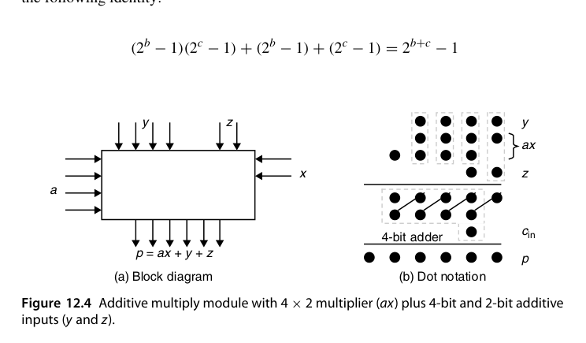{fig-align="center" width="85%"}

用 AMM 拼乘法器要遵守一条位域规则：以 $a[j, j+b-1]$ 与 $x[i, i+c-1]$ 为乘法输入的 AMM，其两路加法输入应覆盖位区间 $[i+j,\ i+j+b-1]$ 与 $[i+j,\ i+j+c-1]$——因为乘积 $a\cdot x$ 的最低有效位权重就是 $2^{i+j}$，加法输入必须与乘积位域对齐。遵守这条规则，上一节那个 8×8 例子只用 **8 个 4×2 AMM** 即可实现（模块数已是下限），每个 AMM 最多比 4×2 乘法器慢一级 FA，图 12.5 的关键路径穿过 6 个 AMM，因此"加法功能"贡献的延迟不超过 6 级 FA；考虑到一个 4×2 AMM 的成本低于"4×2 乘法器 + 4 位加法器"之和，这个方案很划算。

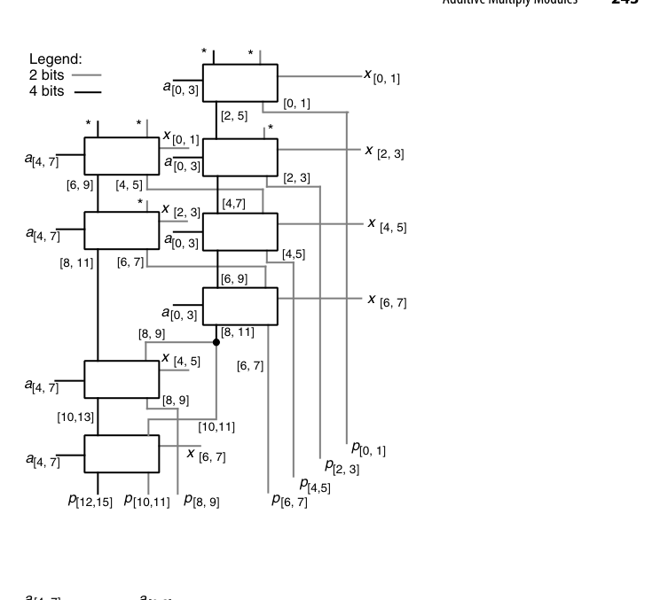{fig-align="center" width="85%"}

图 12.6 是同样 8 个 AMM 的另一种连法，取舍很典型：图 12.5 快（关键路径 6 级），图 12.6 慢（穿过全部 8 个模块）但更规整，能紧凑地推广到任意 $4h_2\times2h_1$ 乘法器。再看推广规则：若 $b$、$c$ 都能整除 $k$ 与 $l$，则 $k\times l$ 乘法器可用 $kl/(bc)$ 个 AMM 组织成 $(k/b)\times(l/c)$ 或 $(k/c)\times(l/b)$ 阵列——**同一函数有两种版图形状**，为面积适配留出余地，但两种形状的速度可能差别不小。

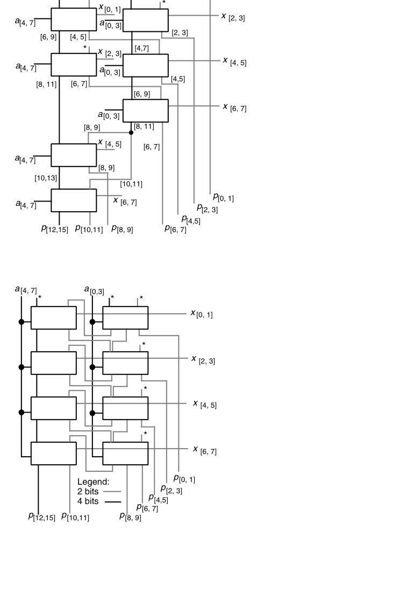{fig-align="center" width="85%"}

## 12.3 位串行乘法器（Bit-Serial Multipliers）

与位串行加法器（5.1 节）一脉相承：每拍处理一比特，面积常数级，$k$ 拍出一个结果。进一步可组成**位串行阵列**，流水吞吐每拍一个乘积——这就是**脉动阵列（systolic array）**思想的原型之一。今天的 AI 加速器（如 TPU 的脉动阵列）把这种"数据流过规则阵列、每拍每单元做一次乘加"的思想发挥到了极致（第 25.6 节再会）。

位串行路线的吸引力来自三个具体约束：**引脚少**（数据本身就以串行形式进出）、**连线短**（VLSI 中互连功耗与延迟的主要来源）、**占地小**；更关键的是紧凑版图允许把时钟拉得很高，使它在速度上接近复杂得多的并行设计。先看**半脉动（semisystolic）**版本：图 12.7 的 4×4 乘法器中，被乘数 $a$ 并行从上方送入，乘数 $x$ 从右侧逐位串行送入（LSB 先来），每一位 $x_i$ 与 $a$ 相乘后累加到以进位保存形式存放在进位/和锁存器中的累积部分积上——**进位位留在原格不动，和位传给右侧邻格**，等价于下次加法前把部分积整体右移一位，结果位从右侧逐位流出。之所以叫"半脉动"，是因为 $x_i$ 被广播到多个单元，违反了纯脉动设计"只有短、局部连线"的要求。$k$ 位无符号乘数 $x$ 必须补 $k$ 个 0 才能让进位一路传到输出，因此每 $2k$ 拍完成一次 $k\times k$ 整数乘法；这类单元很适合"把一个位串行输入乘以一组预存常数之一"的场景——常数从本地 RAM 读出存寄存器，一个工作周期（$2k$ 拍）换一个，因此需要通用乘法器而非第 9.5 节那种专用常数乘法器。

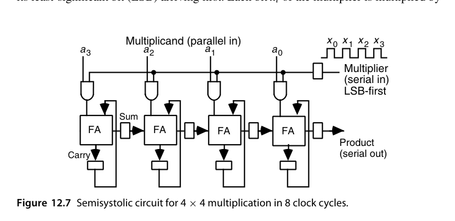{fig-align="center" width="85%"}

要把半脉动变成**全脉动**，必须消除 $x_i$ 的广播，手段叫**脉动重定时（systolic retiming）**。其依据是一条优美的不变式：把同步电路在某处切成 $c_L$ 与 $c_R$ 两半，可以把单向上的所有信号统一延迟 $d$、反方向上的统一提前 $d$，而不改变电路功能与外部时序——前提是两半的主输入/主输出也相应调整，且所有需要提前 $d$ 的信号原本延迟不少于 $d$。

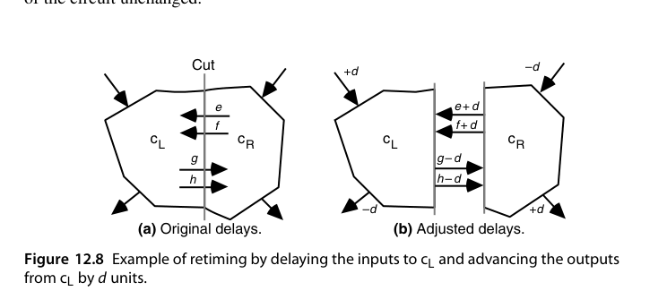{fig-align="center" width="85%"}

按此规则对图 12.7 依次做三次切分（图 12.9 的 Cut 1/2/3），每次把左行信号延迟 1 拍、右行信号提前 1 拍，广播被彻底消除，但新代价出现了：每拍要穿过 4 个 FA 的长组合路径——**问题出在重定时产生的"零延迟连线"**。标准解法是把图 12.7 中所有延迟先**翻倍**再做重定时，这样每拍只允许信号在相邻单元间移动一次；代价是乘数 $x$ 需隔拍输入、总周期翻倍，图 12.10 的全脉动设计需要 **15 拍**完成 4×4 乘法。这就是"完全局部连线"必须付的账。

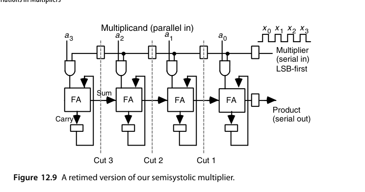{fig-align="center" width="85%"}

若要求被乘数也串行输入，更优雅的一路是**用递推式重新推导**。记 $a^{(i)}$、$x^{(i)}$ 为 $a$、$x$ 截至第 $i$ 位的值，把 $k$ 位 2 的补码操作数符号扩展到 $2k$ 位，定义 $p^{(i)} = 2^{-(i+1)}a^{(i)}x^{(i)}$，利用 $a^{(i)} = 2^ia_i + a^{(i-1)}$、$x^{(i)} = 2^ix_i + x^{(i-1)}$ 可得

$$
2p^{(i)} = p^{(i-1)} + a_i x^{(i-1)} + x_i a^{(i-1)} + 2^i a_i x_i
$$

其工程含义是：只要把 $p^{(i-1)}$ 存成**双进位保存（double carry-save）**形式（位点图上 3 行而非 2 行），就能用一个 $(5;3)$ 计数器与 $a_ix^{(i-1)}$、$x_ia^{(i-1)}$ 合并成下一步结果；最后一项 $2^ia_ix_i$ 在第 $i$ 位之外全是 0，用一个 mux 处理即可（在持有令牌 $t$ 的单元上接到 $s_{out}$），令牌第 0 拍给第 0 个单元、之后逐拍左移实现对齐。$(5;3)$ 计数器的 3 位和输出存入锁存器前要整体右移一位：LSB 接右邻单元、中间位原地、MSB 接左邻单元。一个值得记住的结论是：**两个 $k$ 位数只需 $k-1$ 个这样的单元**就能算出完整 $2k$ 位乘积——因为最大的中间部分积虽然宽达 $2k-1$ 位，但等到它出现时已经有 $k$ 位乘积被产生并移出了。

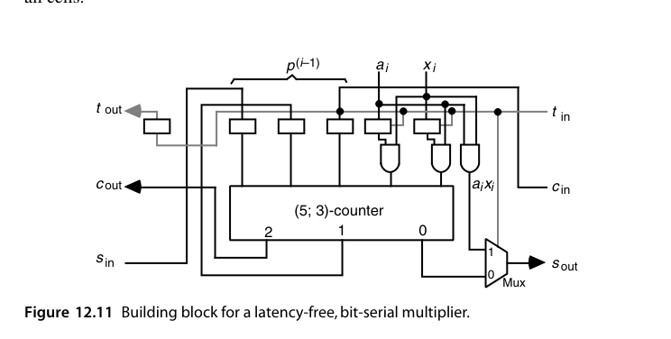{fig-align="center" width="85%"}

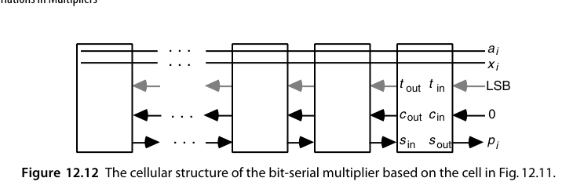{fig-align="center" width="85%"}

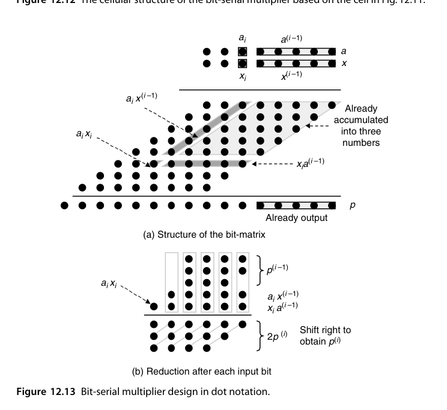{fig-align="center" width="85%"}

::: {.callout-tip title="工程观察"}
位串行/脉动乘法器的现代转世就是 AI 加速器的**脉动阵列**。区别只在于：当年的单元是单比特 FA，今天的单元是 8 位或 16 位乘加器；"数据只有短局部连线、每拍流动一格"的原则没有变。理解位串行乘法器，等于理解了 Tensor Core 类单元的原始设计动机。
:::

## 12.4 模乘法器（Modular Multipliers)

模 $m$ 乘法 $(x \cdot y) \bmod m$ 是公钥密码（RSA/ECC）的核心操作。基本套路：

1. **乘后约简**：先乘出 $2k$ 位乘积，再做模 $m$ 除法取余——约简是瓶颈；
2. **交织约简**：每加/移一次就立即模 $m$ 修正（减 $m$ 的条件选择），乘积永不超界；
3. **Montgomery 乘法**：把数变换到"Montgomery 域"（乘 $2^{-k}$ 的加权表示），模乘变为一系列移位-加-条件减，**完全避开除法**——密码硬件的事实标准；
4. 对 $2^k \pm 1$ 型模数（Mersenne/Fermat 素数），折叠修正几乎免费，NIST 椭圆曲线素数专为这类优化设计。

模数 $m = 2^b$ 与 $m = 2^b-1$ 两个特例一如既往地简单。若部分积用进位保存加法累加，则 $m=2^b$ 时**直接忽略第 $b-1$ 位的进位输出**；$m = 2^b-1$ 时把该进位**回接到第 0 列**（end-around carry），因为 $2^b \equiv 1 \pmod{2^b-1}$——这就是 mod-$(2^b-1)$ CSA。4×4 mod-15 乘法器是完整例子：由于 $16 \equiv 1 \pmod{15}$，图 12.15 左上角灰色三角形里的 6 个重位点可整体"搬家"，把三角分布变成方形矩阵，随后用两级带回接 CSA 加一个带回接进位的 4 位加法器收尾。**这个模 15 乘法器比普通 4×4 二进制乘法器还要简单**。

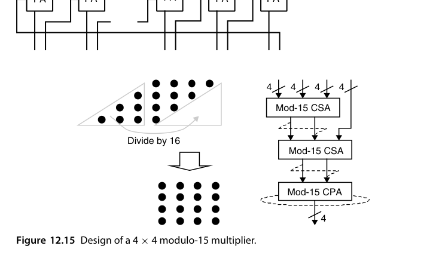{fig-align="center" width="85%"}

一般模数没这么便宜。以 mod 13 为例，利用 $16 \equiv 3$、$32 \equiv 6$、$64 \equiv 12 \pmod{13}$，三角形内每个位点都要替换成低 4 列中的两个位点（图 12.16），位点数变多，最后还需一次"把结果归入 $[0,12]$"的调整。经过一处小简化（从第 1 列去掉一个位点、在第 0 列加两个）之后，剩下的就是模 13 的多操作数加法问题。多操作数模加法有个通用套路（图 12.17）：先用 CSA 树归约，把溢出部分经查找表或专用逻辑做模约简，最终化为**三输入模加器**再收尾——**"$n$ 输入模加"不直接做，而是先降维到 3 输入**。此外，mod-$(2^b+1)$ 在 diminished-1 表示下只需把 $a$ 的表示与 $x$ 的每一位相乘再相加，调整代价与时延增加都不显著。

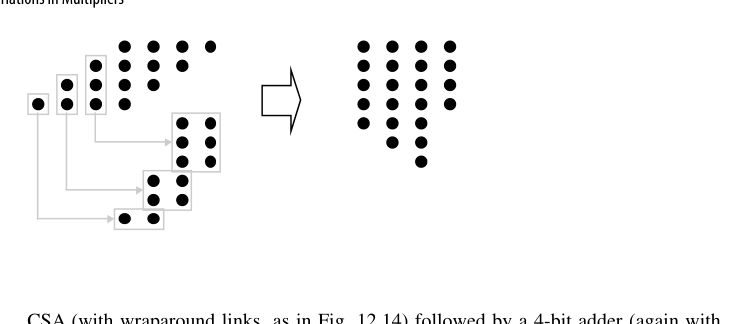{fig-align="center" width="85%"}

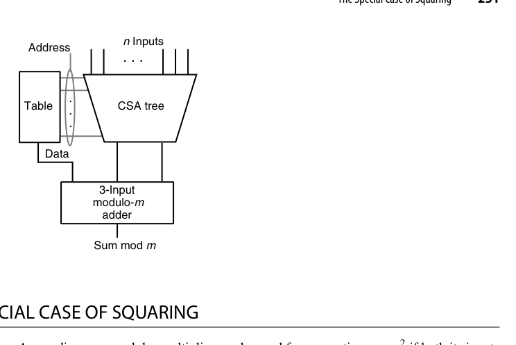{fig-align="center" width="85%"}

## 12.5 平方的特殊情形（The Special Case of Squaring)

$x^2$ 的部分积有对称性：$x_i x_j$ 与 $x_j x_i$ 成对出现，可合并为 $2 x_i x_j$（左移一位）；对角线项 $x_i x_i = x_i$ 退化为单比特。结果：**平方器所需部分积约为一般乘法的一半**，面积和延迟都省近一半。在需要大量平方的场景（复数模方、范数计算、密码学的 square-and-multiply）值得单独做一个单元。

以 5 位无符号数为例，化简规则只有两条：对角项 $x_ix_i \to x_i$（单比特，不需要与门）；同列中的 $x_ix_j$ 与 $x_jx_i$ 合并为**下一高位列**中的一个 $x_ix_j$。化简后的位矩阵有两个直接后果：**平方的最低两位 $p_0$、$p_1$ 零成本得到**；剩余位的计算从一个五操作数加法退化为**三操作数加法**——而普通 5×5 乘法需要五操作数加法。

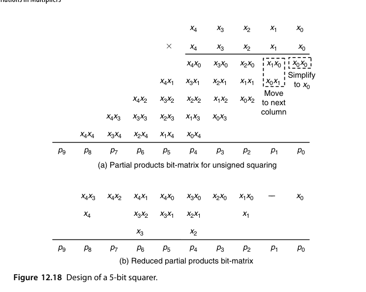{fig-align="center" width="85%"}

还能再抠一点。利用恒等式 $x_1x_0 + x_1 = 2x_1x_0 + x_1(1-x_0) = 2x_1x_0 + x_1\bar{x_0}$，可把第 2 列的 $x_1x_0$、$x_1$ 替换为第 2 列的 $x_1\bar{x_0}$ 与第 3 列的 $x_1x_0$，从而把最终 CPA 宽度从 7 位压到 6 位；第 4、6 列也能做类似替换，但在这个例子里既不减面积也不提速——**优化要看整体账，而不是逐列局部最优**。字宽很小时平方还有捷径：用一张 $2^k$ 项的查找表直接得到平方值，比"两个 $k$ 位数相乘"所需的表小得多；更妙的是两个数相乘可以用两次平方查表加三次加法完成，依据是 $ax = [(a+x)^2 - (a-x)^2]/4$（第 24 章系统讨论查表方法）。平方的另一个高频用途是**幂运算**：由 $x^{13} = x((x(x^2))^2)^2$ 可知"平方—乘—平方—平方—乘"五步即可求出（第 23.3 节展开）。

## 12.6 乘加融合单元（Combined Multiply-Add Units)

$a \times b + c$ 是 DSP 的原子操作（MAC）。融合实现比"乘法器 + 加法器"串联更快：$c$ 直接作为额外一行注入压缩树，几乎零成本。这条路走到极致就是浮点的 **FMA（fused multiply-add，第 18.5 节）**——一次舍入完成乘加，精度与速度双赢，是现代 CPU/GPU 浮点峰值算力的度量单位（FLOPS 按 FMA=2 计）。

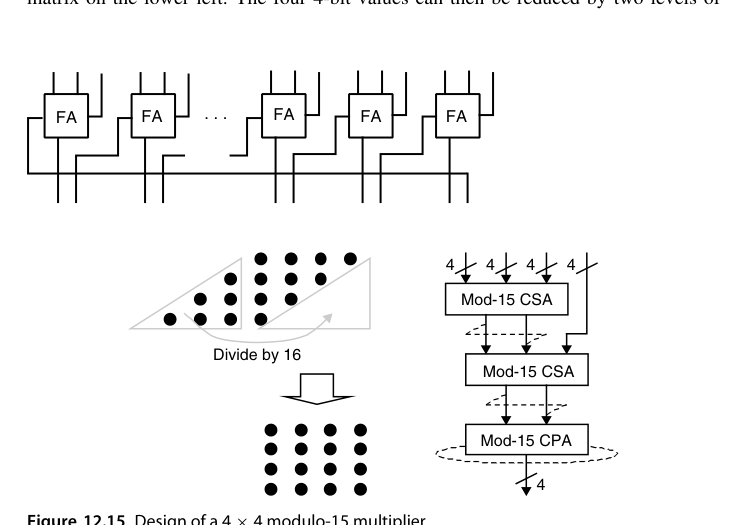{fig-align="center" width="85%"}

值得区分的是：AMM（12.2 节）虽然也叫"乘加"，但它的加法输入宽度与乘法输入相当；这里关心的是另一种形态——**加法输入显著宽于乘法输入**，比如 24 位操作数相乘得到 48 位乘积、却要累加到一个 64 位运行和中。更宽的中和是必需的：或为避免中间步骤溢出，或为在累加过程中对抗误差累积。实现上有三种做法：先用 CSA 树把乘法输入压成进位保存形式、再用一个 CSA 与加法输入合并、最后走快速加法器；或者**运行和也保持进位保存**，这样每步只需两级 CSA（硬件结构与第 11 章图 11.9 的部分树乘法器几乎一致——这不是巧合，二者都在做"多操作数归约 + 累积"）；最彻底的是**完全合并（merged）**，把宽加法输入的位点直接铺进乘法器的部分积矩阵一起归约，此时加入宽加法输入的速度与成本代价都很小。

::: {.callout-important title="关键区别"}
"乘加"和"乘累加"在硬件上其实是同一件事，真正的分水岭在**舍入次数**。普通做法是乘积舍入一次、加法再舍入一次；融合做法只舍入一次，中间结果保持全精度。这既省时间，也消除了"双舍入误差"——在浮点语境下，这就是 FMA 的全部价值所在（第 18.5 节）。
:::

## 本章小结

- 分治：$2b\times2b$ → 4 个子乘 + 三操作数加法；$16\times16$ 用 16 个 4×4 + 24 个 $(7;2)$ 计数器 + 28 位 CPA。
- Karatsuba：大数乘法的分治加速，百位以上才划算；AMM：$b\times c$ 模块输出恰好 $b+c$ 位，同一函数可有两种阵列形状。
- 位串行/脉动：面积换时间，重定时消除广播，AI 阵列的祖师爷。
- 模乘：$2^b$ 丢进位、$2^b-1$ 回接进位；mod 15 比普通乘法器更简单。
- 平方器部分积减半（5 位例：五操作数加法 → 三操作数加法）；MAC/FMA 把加数免费塞进压缩树。

## 原书插图

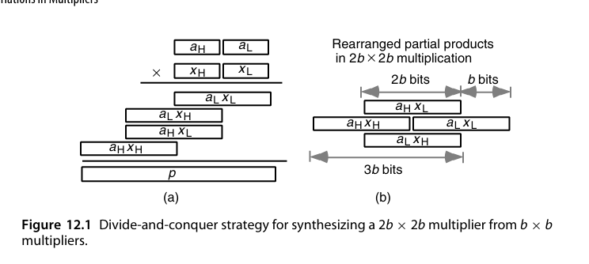{fig-align="center" width="85%"}

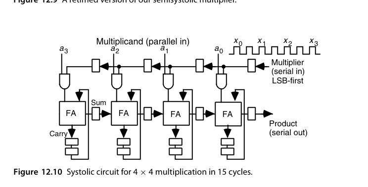{fig-align="center" width="85%"}
