# 第13章 基本除法方案（Basic Division Schemes）

## 本章导读

除法是四则运算中最"别扭"的一个：乘法是"生成部分积再加"，除法却是"猜一位商、试减、看正负、错了还得回退"。这个**试商-回退**的串行依赖决定了除法器的基本结构。本章讲恢复余数（restoring）、不恢复余数（nonrestoring）与 SRT 除法，它们的核心区别就在于**如何处理"试错了"这件事**。

还有一条贯穿全章的视角值得先立起来：**除法与乘法都是多操作数加法问题**。乘法要加的是 $k$ 个部分积，除法要加的是 $k$ 个带符号的 $\pm q_j 2^j d$。因此提速只有两条路——**减少操作数个数**（走高位基数，第 14 章）或**把加操作本身做快**（用进位保存形式表示部分余数，第 14.2 节）。唯一的额外麻烦是：除法的这些操作数**不是先验已知的**，它们由商数字决定，而商数字又依赖中间部分余数的相对大小——这个"鸡生蛋"的依赖，正是除法比乘法难的根本原因。

## 13.1 移位/减除法算法（Shift/Subtract Division Algorithms）

纸笔除法的机械化：$z / d$，逐位确定商 $q$。维护**部分余数（partial remainder）** $s$，每拍：

1. $s \leftarrow 2s$（左移，补入被除数下一位）；
2. 试减：$s - d$；
3. 若结果 $\ge 0$，商本位为 1，保留差值；否则商本位为 0，**恢复**原值。

$k$ 位商需 $k$ 次迭代，每拍一次加减法 + 一次符号判断——符号判断在关键路径上。

用位点（dot notation）表示能看清这个过程的几何形状。被除数 $z$ 的 8 位散在 8 列中，除数 $2^k d$（在 8 位除 4 位的例子里 $k=4$，故除数为 160）按列对齐后逐次右移一位，每次与部分余数相减，所得差值的符号决定商位——这就是图 13.1（见本章插图区）的图形，它与阵列乘法器的位点图恰好互为"倒影"。要注意被减数（部分余数）的位宽比除数大，所以第 9.3 节关于"借位传播"的讨论在这里同样适用；部分余数寄存器通常上 $k$ 位参与运算、下 $k$ 位留作商寄存器。

## 13.2 程序化除法（Programmed Division）

软件实现除法循环的历史与乘法一样长。有趣的是商 0 恢复的处理：软件里自然是"先存旧值再试减"；硬件上则可以并行算 $s$ 与 $s - d$ 再选择（carry-select 思想又出现了）。

程序化除法里有一个容易被忽略的技巧：符号判断可以借机器现有的标志位完成，而且不需要为无符号与有符号各写一套循环。把部分余数移位后存入 $R_s$、除数存入 $R_d$，用一条减法指令得 $R_s - R_d$，再查进位标志：进位为 1 表示 $R_s \ge R_d$（商位取 1），进位为 0 表示 $R_s < R_d$（商位取 0）。此时正确的中间结果应保留 $(2^k + R_s) - R_d$，其中 $2^k$ 是移入进位标志的部分余数最高位。由于

$$
(2^k + R_s) - R_d = R_s + (2^k - R_d) = R_s + R_d \text{ 的 2 的补码}
$$

**即使做的是无符号除法，用 2 的补码减法指令也能在两种情形下都得到正确结果**。寄存器用法上，除法与乘法几乎对称：与乘数可以放在部分积寄存器的低半部分一样，商与被除数一起向高位流动而腾出的低位空间可以共享，因此商寄存器与部分余数寄存器可以是同一个。

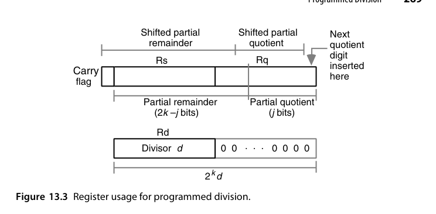{fig-align="center" width="85%"}

除去取操作数与存结果的指令（任何实现都需要），一个除法指令由 **$6k+3$ 到 $8k+3$ 条机器指令**完成；更精确地说，若商的二进制表示中有 $w$ 个 1，则执行 $6k + 2w + 3$ 条指令——因为商位为 0 的迭代里减法与自增指令被跳过，这是运行时间依赖 $w$ 的原因。**对 32 位操作数，平均要 200 多条指令**；即使有专用指令承担循环内的部分功能，循环体也至少需要 32 条指令。这就解释了硬件除法器对数值密集型应用的必要性。至于没有硬件除法器的微程序处理器，则会用一个与图 13.4 极其相似的微例程，出于与第 9.2 节末尾相同的理由，它显著快于等价的机器语言程序，但仍远慢于硬连线实现。

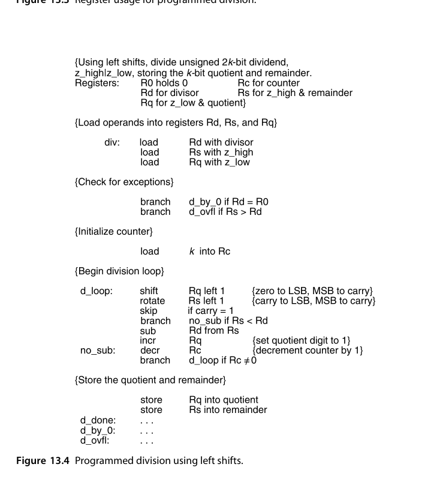{fig-align="center" width="85%"}

## 13.3 恢复余数除法器（Restoring Hardware Dividers）

恢复（restoring）方案忠实复刻纸笔流程：试减为负 → 加回除数恢复 → 移位继续。缺点明显：**每拍最坏两次加法**（减一次、加回一次），且恢复操作使迭代节奏不均匀。硬件数据通路：部分余数寄存器（$2k$ 位，与商寄存器共用移位）、加减法器、符号判断控制——与乘法器同构，只是控制方向相反。

图 13.5 给出了无符号整数顺序除法的硬件实现。每个周期 $j$ 开始时，部分余数 $s^{(j-1)}$ 左移、其最高位被移入一个专用触发器；随后计算试探差 $2s^{(j-1)} - q_{k-j}(2^k d)$。**注意那个 $2^k$ 因子**：它意味着除数只与部分余数的**高 $k$ 位**对齐参与试探减，低半部分不受影响。商位的判定规则是：若移出的最高位为 1，**或**试探差为正（$c_{out}=1$），则 $q_{k-j} = 1$ 并把试探差载入部分余数寄存器的高半部；否则 $q_{k-j}=0$、部分余数保持不变。这里有一个实现选择值得指出：我们**本可以**总是把试探差载入寄存器、需要时再用一次补偿加法恢复回来——但那样硬件更慢，所以图 13.5 的 mux 方案（选择"载入试探差"还是"保持原值"）才是正解。

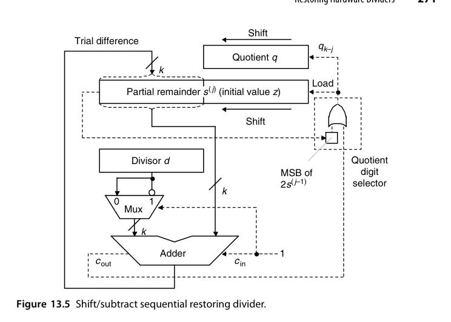{fig-align="center" width="85%"}

::: {.callout-warning title="时序陷阱"}
恢复除法对时序非常敏感。每个周期必须依次完成：寄存器移位 → 信号通过加法器传播 → 存储商位，因此**试探差的符号必须在周期末（例如时钟下降沿）采样**。这种"信号要跑到周期末尾才有效"的模式会拉长时钟周期，是促使人们转向不恢复除法的主要动机之一（13.4 节）。
:::

下面用一组具体数字走一遍。取 $z = (0111\,0101)_2 = 117$，$d = (1010)_2 = 10$，商 4 位，$2^kd = 160$。首先判断溢出：$z$ 的高 4 位 $(0111)_2 = 7 < (1010)_2 = 10$，故无溢出。

| 周期 $j$ | 初始/移位后 | 试减 $\pm 2^kd$ | 新部分余数 $s^{(j)}$ | 商位 |
|---|---|---|---|---|
| — | $s^{(0)} = 117$ | — | $117$ | — |
| 1 | $2s^{(0)} = 234$ | $-160$ | $74$（正） | $q_3 = 1$ |
| 2 | $2s^{(1)} = 148$ | $-160$ | $-12$（负）→ **恢复为 148** | $q_2 = 0$ |
| 3 | $2s^{(2)} = 296$ | $-160$ | $136$（正） | $q_1 = 1$ |
| 4 | $2s^{(3)} = 272$ | $-160$ | $112$（正） | $q_0 = 1$ |

最终部分余数寄存器中的值是 $112$，它是真实余数的 $2^k = 16$ 倍，故余数 $s = 112/16 = 7$；商 $q = (1011)_2 = 11$。验算：$11\times10 + 7 = 117$，正确。第 2 个周期那一步就是**恢复操作**——为了它多付了一次加法。

对带符号操作数，基本除法方程 $z = d\times q + s$ 加上两条约束 $\text{sign}(s) = \text{sign}(z)$ 与 $|s| < |d|$ 就唯一确定了商与余数。看四组符号组合：$5/3 \Rightarrow q=1, s=2$；$5/(-3) \Rightarrow q=-1, s=2$；$(-5)/3 \Rightarrow q=-1, s=-2$；$(-5)/(-3) \Rightarrow q=1, s=-2$。可以看出 **$q$ 与 $s$ 的绝对值只由操作数的绝对值决定**，而符号可以事后修正（商的符号 = 被除数符号 $\oplus$ 除数符号，余数符号跟随被除数）。因此恢复除法处理带符号数的首选办法是"间接算法"——先转成无符号运算，最后按符号规则调整符号位或做取补。

::: {.callout-note title="解读"}
$s = z \bmod d$ 在这里采用的是**截断（truncation）语义**——C 语言族的选择，也是硬件最自然的实现。它与数学上的地板（flooring）语义不同：$-5/3$ 按截断是 $q=-1, s=-2$，按地板则是 $q=-2, s=1$。做除法器前必须先确认目标语义，否则与软件栈的行为对不上。
:::

## 13.4 不恢复余数与有符号除法（Nonrestoring and Signed Division）

**不恢复余数（nonrestoring）**的洞察：恢复 + 移位 + 再减 = 移位 + 加。代数上 $2(s - d) + d = 2s - d$，所以试减失败后不用加回，**下一拍改成加 $d$** 即可。每拍固定一次加减：

- 当前部分余数 $\ge 0$：商本位 1，下一拍**减** $d$；
- 部分余数 $< 0$：商本位 0，下一拍**加** $d$。

迭代节奏完全均匀（每拍一次加法），控制极简。代价：结束时若余数为负需一次最终修正（加回 $d$），商的最低位可能需要舍入修正。

把这套推理写严格一点。设本周期开始时的移位后部分余数为 $u$。若（按恢复法）把 $u - 2^kd$ 恢复为正确的 $u$，下一拍应得 $2u - 2^kd$。若不恢复、直接带着错误值 $u - 2^kd$ 往下走，继续移位再减会得到 $2(u-2^kd) - 2^kd = 2u - 3\times 2^kd$，显然不对；但只要**改成加**，就得到 $2(u - 2^kd) + 2^kd = 2u - 2^kd$——与恢复后所得完全相同。所以规则是：**部分余数变负时保留这个"错误"的值，记下正确的商位，并在下一拍做加法而非减法**。同一个例子换成不恢复算法，差别就在第 2 周期没有回退、第 3 周期用的是 $-24$ 这个"临时错误值"：

| 周期 $j$ | 初始/移位后 | 本拍操作 | 新部分余数 $s^{(j)}$ | 商位 | 下拍动作 |
|---|---|---|---|---|---|
| — | $s^{(0)} = 117$ | — | $117$ | — | 减 |
| 1 | $2s^{(0)} = 234$ | $-160$ | $74$（正） | $q_3 = 1$ | 减 |
| 2 | $2s^{(1)} = 148$ | $-160$ | $-12$（负） | $q_2 = 0$ | **加** |
| 3 | $2s^{(2)} = -24$ | $+160$ | $136$（正） | $q_1 = 1$ | 减 |
| 4 | $2s^{(3)} = 272$ | $-160$ | $112$（正） | $q_0 = 1$ | — |

结果与恢复法一致：$s = 112/16 = 7$，$q = (1011)_2 = 11$；图 13.8 把两种算法的轨迹画在同一张"部分余数—时间"图上，恢复式在负值处有一个向上的回退折线，不恢复式则是一条连续折线（$117 \to 234 \to 74 \to 148 \to -12 \to -24 \to 136 \to 272 \to 112$）——**恢复法多付的那一次加法，在这张图里看得见**。

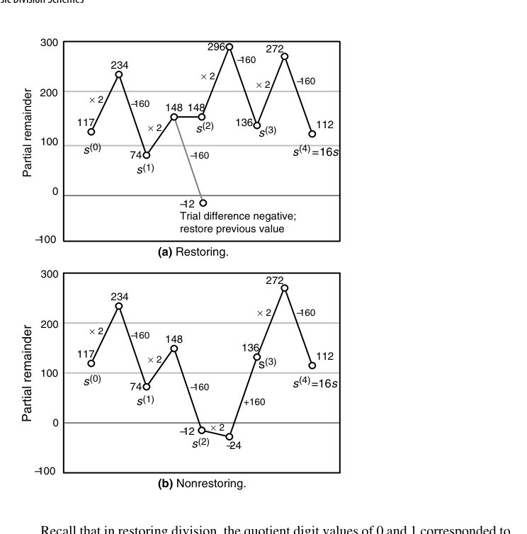{fig-align="center" width="85%"}

不恢复除法的硬件实现（图 13.10）比恢复式更简洁：每个周期开始把 $s^{(j-1)}$ 左移、最高位移入专用触发器；商位由**除数符号与部分余数符号之补**异或得到（部分余数符号之补即 $c_{out}$，因为构成新部分余数的两项总是异号）。全部 $k$ 位商算完后还需 **2~4 个额外周期**修正商与最终余数。把它的行为画成 Robertson 图（新部分余数 $s^{(j)}$ 关于移位后旧部分余数 $2s^{(j-1)}$），商数字的选取规则一目了然：radix-2 不恢复除法的商数字只有 $\{1,-1\}$，判据就是 $2s^{(j-1)}$ 的符号——一条穿过原点的水平分界线，简单到极致（图 13.11）。一旦允许商数字取 0（$q_{-j} \in \{-1,0,1\}$），分界线就不再是一条而是**两条**，中间夹出一条"什么都不做"的零带（图 13.12）——这条零带正是冗余的来源，也是 SRT 与高基数除法的几何起点。

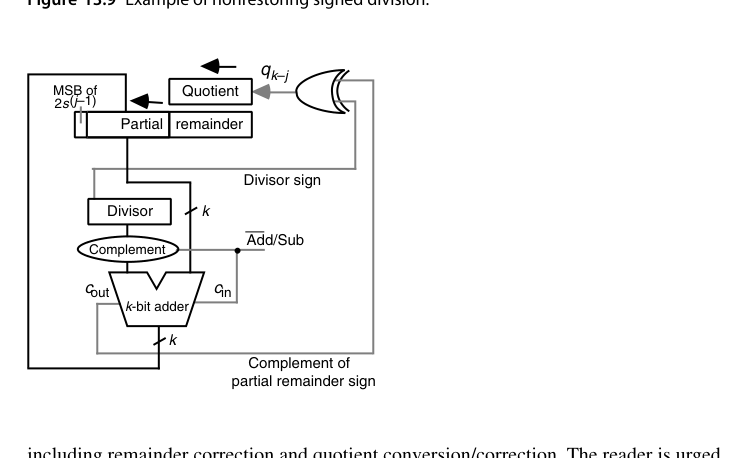{fig-align="center" width="85%"}

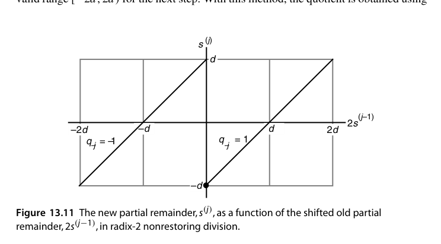{fig-align="center" width="85%"}

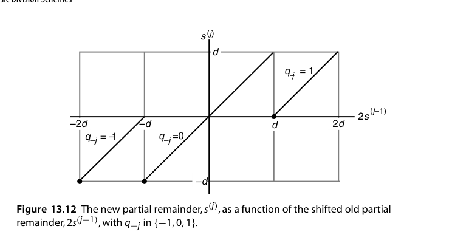{fig-align="center" width="85%"}

有符号除法的商数字选取规则也随之改写为：**若 $\text{sign}(s) = \text{sign}(d)$ 则 $q_{k-j} = 1$，否则 $q_{k-j} = -1$**，即"让部分余数的符号向被除数的符号靠拢"。这条规则带来两个必须收尾的问题。其一，**商要从 $\{1,-1\}$ 数字集转换回标准二进制**：先把所有 $-1$ 替换为 0 得到 $p$（由 $q_i = 2p_i-1$ 的关系），再把 $p$ 的最高位取反、整体左移 1 位并在 LSB 补 1，所得即 2 的补码商；其正确性可由 $\sum_{i=0}^{k-1}2^i = 2^k-1$ 直接验证。其二，**最终余数符号若与被除数相反必须修正**：给余数加减 $2^kd$、同时给商减/加 1——究其根本，数字集 $\{1,-1\}$ 只能表示**奇数**，商如果是偶数，修正就不可避免。好在这个转换可以**即时（on-the-fly）完成**：在初始周期设定商的符号位，此后每次减法产生 1、每次加法产生 0，最后一个数字前再产生一个 1，不需要事后的长链进位传播。图 13.9（见本章插图区）给出了一个 2 的补码操作数的完整示例，涵盖余数修正与商转换/修正的全部环节。

::: {.callout-tip title="解读"}
不恢复余数的真正价值不在省那一次恢复加法，而在**它把商数字集合扩展到 $\{-1, +1\}$**——允许"负的商位"，这正是 SRT 除法（13.6 节）与冗余表示合流的入口。
:::

## 13.5 除以常数（Division by Constants)

除以常数 $d$ 可以变成**乘法**：$z / d \approx z \times \lceil 2^m / d \rceil / 2^m$，预计算"魔数（magic number）"$\lceil 2^m / d \rceil$，一次乘法 + 移位即得商。编译器每天都在做这个变换（`x / 10` 变成乘 `0xCCCCCCCD` 再右移）。误差分析要保证对所有输入商完全正确——魔数与移位量的选择有一套成熟的理论（Granlund-Montgomery 算法）。

讨论除以常数的理由与第 9.5 节"乘以常数"类似，但**收益更明显**——因为除法本来就比乘法慢得多。这里只考虑奇数除数：偶除数可以先除以一个奇数再右移，例如除以 20 就是先除以 5、再把结果右移 2 位。如果感兴趣的常数只有少数几个，最省事的办法是**预计算它们的倒数**、以适当精度存表，于是"除以常数"就变成"乘以常数倒数"。对许多小奇数除数还有一条更漂亮的路子：**每个奇整数 $d$ 都存在奇整数 $m$，使 $d \times m = 2^n - 1$**，于是

$$
\frac{1}{d} = \frac{m}{2^n-1} = \frac{m}{2^n(1-2^{-n})} = \frac{m}{2^n}(1+2^{-n})(1+2^{-2n})(1+2^{-4n})\cdots
$$

$1/(1-2^{-n})$ 的展开含无穷多个形如 $1+2^{-2^i n}$ 的因子，所以把 $z$ 除以 $d$ 就变成"先乘预计算的常数 $m/2^n$，再依次乘若干 $1+2^{-j}$ 因子"——**因子个数与字宽的对数成正比**，而乘每个因子只需一次移位加一次加法。

看 $d = 5$ 这个例子：由 $5 \times 3 = 15 = 2^4-1$ 得 $m=3$、$n=4$，取 24 位精度时

$$
\frac{z}{5} = \frac{3z}{2^4-1} = \frac{3z}{16(1-2^{-4})} = \frac{3z}{16}(1+2^{-4})(1+2^{-8})(1+2^{-16})
$$

三个因子就够了，整个流程是"一次乘法 + 三次移位加"，全程没有除法指令。这类方案还有对应的硬件实现（用一个 $s \in [0,2]$ 的两比特状态从高位向低位传播的线性阵列），延迟与面积与行波加法器同阶。

::: {.callout-note title="适用边界"}
"除以常数 = 乘魔数"的代价是**必须为每个常数单独验证正确性**：$2^m/d$ 的舍入方向、移位量的选择、以及边界值（$z$ 取最大值、$z$ 恰为 $d$ 的倍数）都可能踩坑。这也是为什么现代编译器里"常量除法优化"是一个有大量测试用例的独立模块，而不是一行随手写死的移位。
:::

## 13.6 基数 2 SRT 除法（Radix-2 SRT Division)

SRT（Sweeney-Robertson-Tocher）把不恢复思想与冗余商表示结合：

- 商数字集合 $\{-1, 0, +1\}$——**允许"跳过"**：部分余数接近 0 时商本位选 0，连加减都不用做；
- 选择规则只需看部分余数的**最高几位**（无需完整符号判断）：$s \ge 1/2$ 选 $+1$，$s \le -1/2$ 选 $-1$，否则选 0；
- 商以冗余形式产生，最后做一次"即时转换（on-the-fly conversion）"变成普通二进制——不需要最终减法。

三者的几何关系并排看最清楚：不恢复除法（图 13.11）只有一条原点分界线；允许 $q \in \{-1,0,1\}$ 后（图 13.12）分出三条线、中间多出零带；到了 SRT（图 13.13），选择规则进一步化简为**两条固定阈值线** $\pm d$ 与 $\pm d/2$——选择只需比较部分余数与除数的简单倍数，**而不需要做减法**。请注意"跳过"这条规则的真正收益：在进位保存部分余数出现之后，跳过一次加法其实并不省什么（进位保存加法本身就非常快，判断"是否该跳过"的逻辑延迟与之相当）。SRT 的历史价值在于**它把商数字选择从"精确比较"降级为"看几个高位"**，从而为高基数、进位保存的除法器打开了大门。

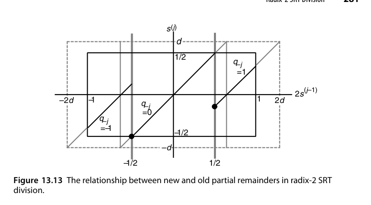{fig-align="center" width="85%"}

下面用一个完整的数值例子走一遍。取归一化小数 $d = (0.1100)_2 = 0.75$，被除数 $z = (0.1000)_2 = 0.5$（$d \in [1/2,1)$ 满足归一化要求，$z<d$ 故无溢出，真值 $z/d = 2/3$），商数字 $q \in \{-1,0,1\}$，选择阈值取 $|2s| \ge 1/2$。

| 周期 | $2s^{(j-1)}$ | 商数字 | 新部分余数 $s^{(j)}$ |
|---|---|---|---|
| 1 | $1.0$ | $q_{-1} = +1$ | $1.0 - 0.75 = 0.25$ |
| 2 | $0.5$ | $q_{-2} = +1$ | $0.5 - 0.75 = -0.25$ |
| 3 | $-0.5$ | $q_{-3} = -1$ | $-0.5 + 0.75 = 0.25$ |
| 4 | $0.5$ | $q_{-4} = +1$ | $-0.25$ |
| 5 | $-0.5$ | $q_{-5} = -1$ | $0.25$ |
| 6 | $0.5$ | $q_{-6} = +1$ | $-0.25$ |

商数字序列 $+1,+1,-1,+1,-1,+1$ 的值为 $2^{-1}+2^{-2}-2^{-3}+2^{-4}-2^{-5}+2^{-6} = 0.671875$，与真值 $0.666\ldots$ 的偏差在 $2^{-6}$ 以内。可以看到**商数字中出现了 $-1$**——这正是冗余表示的具体形态，也是它不能用普通二进制移位直接读出的原因。现在做即时转换：把所有 $-1$ 替换为 0 得 $p = 110101$，把 $p$ 的最高位取反得 0，再左移一位、LSB 补 1，得到 $0101011$；$(0101011)_{\text{2的补码}} = 43$，而 $43/2^6 = 0.671875$，与按数字加权求和的结果完全一致——**转换全程没有做一次减法，也没有等待进位传播**。

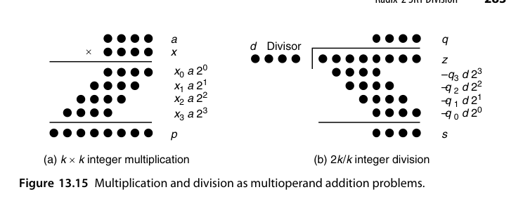{fig-align="center" width="85%"}

图 13.15 把乘法与除法的位点图并排放在一起，是本章最好的收束：**乘法加的是 $x_i a 2^i$（系数先验已知），除法减的是 $q_j d 2^j$（系数由迭代决定）**。结构同构、难度不同——差别全在"操作数是否先验已知"这一条上。

::: {.callout-important title="承上启下"}
基数 2 SRT 的两个关键思想——**冗余商数字**与**只看高位做选择**——正是第 14 章高基数 SRT 的种子。Pentium FDIV bug（1.2 节）就出在 radix-4 SRT 的商数字选择表上，到时候会再提。
:::

## RTL 实践：`rtl/ch13_4_nonrestoring_divider`

16/8 无符号不恢复余数除法器：部分余数为带符号 9 位，每拍固定一次加减，8 拍出商，结尾按需修正余数：

```systemverilog
wire signed [8:0] rem_shift = {rem[7:0], quos[7]};   // 左移补入被除数下一位
wire signed [8:0] rem_next  = (rem >= 0) ? rem_shift - $signed({1'b0, d})
                                         : rem_shift + $signed({1'b0, d});
// 商位 = (rem_next >= 0)；结束时 rem_next < 0 则 r = rem_next + d
```

设计要点：

- **节奏均匀**：不恢复式把恢复式的"减、（可能）加回"两步变成固定的一步加减，控制状态机极简；
- **前置条件**：被除数高 8 位必须小于除数（商才能装进 8 位）——testbench 的随机激励用 `$random % (d*256)` 保证这一约束，这也是硬件除法器规格书里的经典条款；
- **最终修正**：迭代结束若部分余数为负，加回除数得到真正的余数。

```bash
cd rtl/ch13_4_nonrestoring_divider
bash run_iverilog.sh    # 或 bash run_verilator.sh
```

## 本章小结

- 除法 = 试商-试减-修正的串行迭代，符号判断是关键路径。
- 恢复式忠实但节奏不均（117/10 例中第 2 拍要回退）；不恢复式每拍一次加减、均匀可控。
- 除常数 → 魔数乘法（$1/5 = \frac{3}{16}(1+2^{-4})(1+2^{-8})(1+2^{-16})$），编译器日常操作。
- SRT：冗余商数字 $\{-1,0,+1\}$ + 固定阈值 $\pm d/2$ 粗判，即时转换免去最终减法。
- 除法与乘法同为多操作数加法，区别只在操作数是否先验已知。

## 原书插图

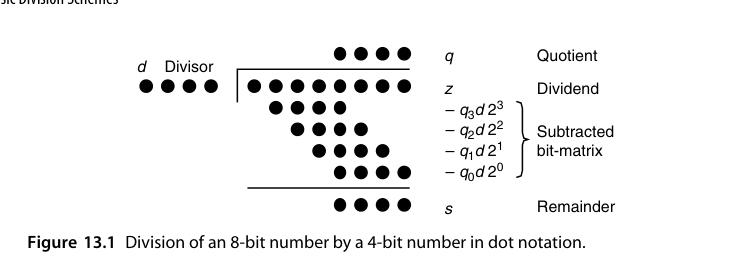{fig-align="center" width="85%"}

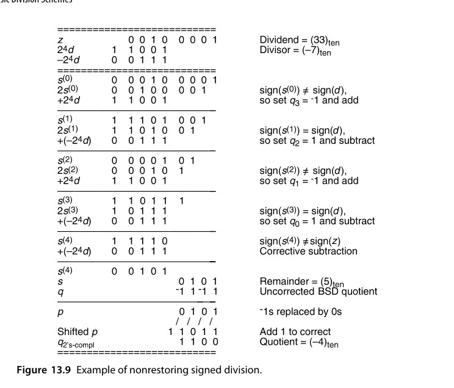{fig-align="center" width="85%"}
