# 第14章 高基数除法器（High-Radix Dividers）

## 本章导读

基数 2 的除法每拍出 1 位商；要提速，自然想到每拍出多位（高基数）。但商数字集合变大后，"选哪个商数字"从简单的符号判断变成要在多个候选中决策——而且部分余数本身若用进位保存形式表示，连它的精确值都不知道！**商数字选择函数（quotient digit selection）**因此成为高基数除法的核心难题，p-d 图是分析它的标准工具。Pentium FDIV 事故正是这张表填错了 5 个格子。

## 14.1 高基数除法基础（Basics of High-Radix Division）

基数 $r$ 的除法每拍确定 $\log_2 r$ 位商，商数字集合通常为 $[-\alpha, +\alpha]$（冗余）。迭代不变式：

$$
s^{(j+1)} = r \cdot s^{(j)} - q_{j+1} \cdot d
$$

即每拍：部分余数左移 $\log_2 r$ 位，减去"选定商数字 × 除数"。需要 $d$ 的倍数 $\{0, \pm d, \pm 2d, \dots, \pm \alpha d\}$——基数越高，需要的倍数越多（难倍数问题，与第 10 章乘法呼应）。

用位点图看 radix-4 除法最直观：与 radix-2 相比，被除数与余数按 2 位一组推进，每拍算出一个取值为 $0,\pm1,\pm2$ 的商数字，并把它乘以除数后从余数中减去，结构完全对偶于 radix-4 Booth 乘法器。

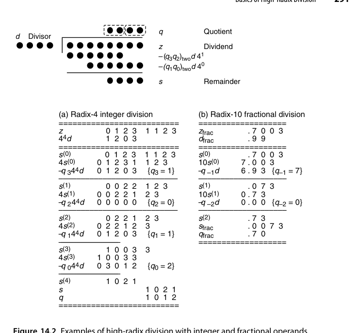{fig-align="center" width="85%"}

操作数的表示形式对算法设计影响很大。图 14.2（见本章插图区）给出了整数与小数操作数两种情形——**整数操作数下部分余数的绝对量级随迭代增长，小数操作数下则保持有界**。工程实现普遍采用小数（归一化）约定：把除数规格化到 $d \in [1/2, 1)$ 或 $[1, 2)$，于是部分余数被限制在 $[-d, d)$ 这类有界区间内，商数字选择的分界线也才有稳定的形状。倍数的生成则是"难倍数问题"的延续：$\pm d$ 取补即可、$\pm 2d$ 一次移位即可，这两个是免费的；而 $3d$、$5d$、$7d$ 之类的难倍数要么预计算（一次加法 + 寄存器），要么用 $4d-d$、$4d+d$、$8d-d$ 临时合成（多一级加法）。基数越高，难倍数越多，这条成本曲线正是 radix-4 成为"实用甜点"的原因。

## 14.2 使用进位保存加法器（Using Carry-Save Adders）

部分余数用 carry-save 形式（sum + carry 两串）保存，$r s - q d$ 的计算就是一个 CSA + 倍数选择，**无需完整进位传播**。但代价是：部分余数的精确值未知，商数字选择只能基于**高位若干比特的估计值**——这是高基数 SRT 的标志性结构：

- 数据通路快（CSA，$O(1)$）；
- 选择逻辑看"截断的部分余数估计值"做决策；
- 冗余商数字集合提供的容错区间，恰好吸收估计误差。

radix-2 情形下的选择阈值可以做成**常数**，这是它最诱人的性质。当部分余数保持 $[-\alpha d, \alpha d)$、商数字取自 $\{-1,0,1\}$ 时，比较的对象是部分余数与除数的倍数，而这些阈值量级由 $d$ 的取值区间决定。图 14.3 给出了该情形下的常数阈值——**注意阈值不再随 $d$ 变化，而是固定的水平线**。能让阈值退化成常数，是因为 $d$ 被规格化到足够窄的区间；一旦区间变宽（例如浮点规格数允许 $d \in [1,2)$），阈值就要重新变成 $d$ 的函数。

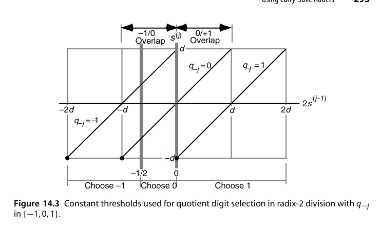{fig-align="center" width="85%"}

把部分余数改成进位保存形式后，交易逻辑的结构就长成图 14.4 的样子：sum 与 carry 两串并行走，加法器是 CSA 而不是 CPA，商数字选择器只截取两串的高几位。这个"**CSA + 截断估计 + 冗余商数字**"的三件套是整个第 14 章的骨架。冗余带来的直接收益是**重叠区（overlap region）**的出现：在 Robertson 图（第 13 章图 13.11~13.13）的框架下推广到 $d$ 为自变量的二维平面，"新部分余数关于移位后旧部分余数"的关系变成一族以 $d$ 为参数的直线，相邻商数字的合法区域之间出现了一个**两者都合法**的重叠带（图 14.5）。只要把选择分界线画在重叠带内部，就无需知道部分余数的精确值。

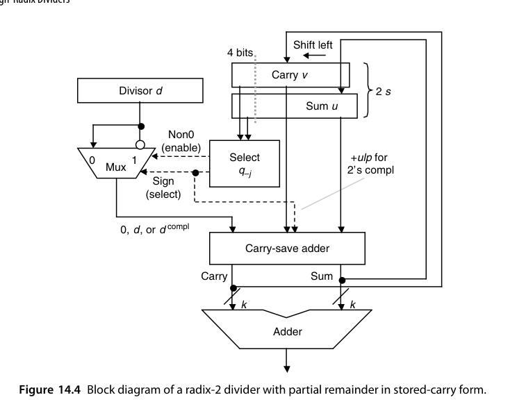{fig-align="center" width="85%"}

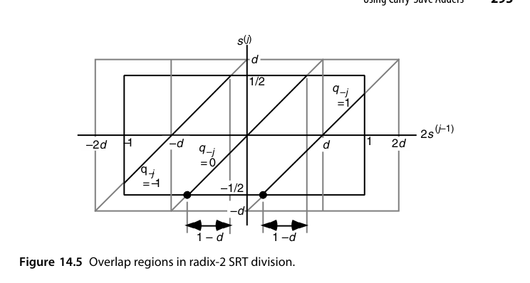{fig-align="center" width="85%"}

::: {.callout-note title="设计哲学"}
冗余在这里扮演双重角色：商数字冗余让"选错一点没关系"（后续迭代能纠正），部分余数冗余（carry-save）让"看不全也没关系"（估计值够用）。两个冗余的容错区间必须匹配——这就是 p-d 图要分析的事。
:::

## 14.3 基数 4 SRT 除法（Radix-4 SRT Division)

最经典的高基数实例：商数字集合 $\{-2, -1, 0, +1, +2\}$，每拍出 2 位商。除数需规格化到 $[1/2, 1)$ 或 $[1, 2)$，倍数 $\{\pm d, \pm 2d\}$ 由移位/取补免费获得。

radix-2 的 p-d 图是理解这一切的最简起点：当 $d \in [1/2,1)$、部分余数在 $[-d,d)$、商数字在 $[-1,1]$ 时，p-d 图由若干条斜率为常数、随 $d$ 线性发散的直线构成，重叠带宽而分界线简单——**这正是 radix-2 SRT 之所以便宜的原因**，选择逻辑几乎不需要表。radix-4 就没这么友好了：$\alpha$ 取不同值时几何形状差别很大，$\alpha=3$ 时图完全"张开"、重叠区窄但允许的部分余数范围更大（图 14.8），$\alpha=2$ 时上下边界收紧、重叠区反而变宽（图 14.9）。

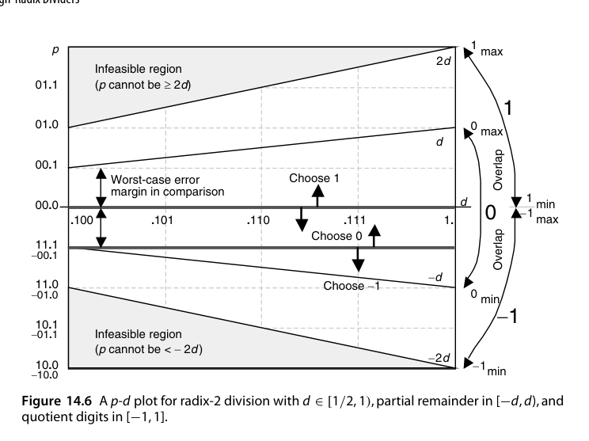{fig-align="center" width="85%"}

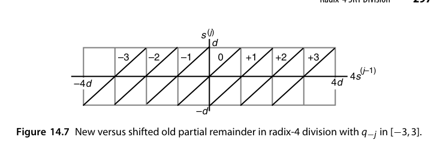{fig-align="center" width="85%"}

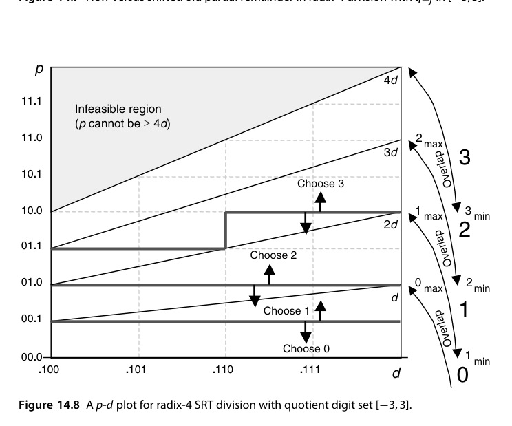{fig-align="center" width="85%"}

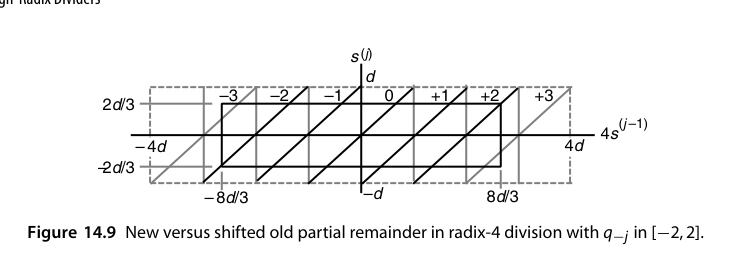{fig-align="center" width="85%"}

"$\alpha$ 越大重叠区越窄"这个现象可以直接算出来。对数字集 $[-\alpha, \alpha]$（要求 $\alpha < r-1$），为保证总存在合法商数字，必须把部分余数限制在 $[-hd, hd)$，由图 14.12 中的实心矩形可得 $rhd - \alpha d \le hd$，即 $h \le \alpha/(r-1)$；为让限制最宽松，通常取 $h = \alpha/(r-1)$。代入 $r=4$、$\alpha=2$ 得 $h = 2/3$、部分余数范围 $[-2d/3,\,2d/3)$；代入 $\alpha=3$ 得 $h=1$、范围 $[-d,d)$。又因 $\alpha \ge r/2$ 时必有 $h > 1/2$，**初始部分余数只需一次右移 1 位**就能落进允许范围。综合来看，**radix-4 取 $\alpha=2$ 优于 $\alpha=3$**：部分余数范围更小（$2/3$ 对 $1$）换来更宽的重叠区与更简单的选择表，而 $\pm 3d$ 这个难倍数也一并省掉了。

商数字选择函数的输入是截断后的部分余数估计（高 4-5 位）与除数（高 3-4 位），一张小规模查找表（PLA/ROM）即可实现。表越大越慢，所以**减少 $\hat p$、$\hat d$ 的位数等价于直接砍掉半个选择器**——这也是 14.6 节那条"允许例外"妥协路线的动机。但**这张表的正确性必须全域验证**：Pentium FDIV 缺陷就是表中 5 个本应为 $\pm 2$ 的格子错置为 0，在特定操作数组合下触发精度损失（1.2 节）。

::: {.callout-warning title="验证教训"}
FDIV 事故的深层教训：商选择表的输入是"截断估计值"，其覆盖空间是全操作数空间的一个压缩投影——**仿真几乎不可能穷尽所有会导致命中每个格子的操作数组合**，必须配合形式验证或定理证明。此后 Intel 及业界对除法/浮点单元全面引入形式方法。
:::

## 14.4 一般高基数除法器（General High-Radix Dividers）

基数 8/16 的障碍：

- 商数字集合更大（$\pm 7$、$\pm 15$），难倍数（$3d, 5d, 7d$）需预计算或分解；
- 选择表输入位数指数增长，查表延迟吃掉迭代收益。

实用对策：**重叠级联（overlapped stages）**——用两级 radix-2/radix-4 的选择逻辑错位拼接出 radix-4/radix-16 的效果（15.2 节）；或 **prescaling**（15.1 节）把除数预变换到接近 1，使选择函数与除数无关。

把 radix-2 的进位保存除法器（图 14.4）推广到 radix-$r$，就得到图 14.11 的通用结构：sum 与 carry 两串寄存器、CSA 阵列做 $rs - qd$、以及从两串的高位截取估计值的商数字选择器。**与 radix-2 唯一的本质差别就是选择器**——它的规模随 $r$ 迅速膨胀。

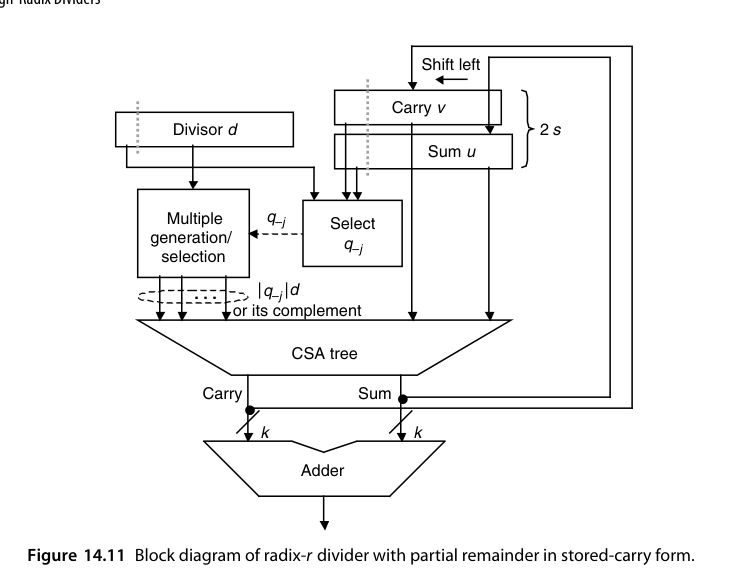{fig-align="center" width="85%"}

## 14.5 商数字选择（Quotient Digit Selection)

选择函数 $q = \text{sel}(\hat{s}, \hat{d})$（$\hat{\cdot}$ 表示截断估计）的设计约束：

1. **包含性**：所选 $q$ 必须保证新部分余数落在下次迭代允许的范围内；
2. **截断容差**：$\hat{s}$ 与真实 $s$ 的误差必须被商数字冗余吸收；
3. **实现成本**：输入位数决定表的大小与延迟。

这三者构成一个组合优化问题：截断多少位、商数字集合多大、表怎么填。

"包含性"约束的几何形态就是图 14.12：以 $2s^{(j-1)}$ 为横轴、$s^{(j)}$ 为纵轴，每个商数字对应一条斜率为 $r$ 的直线 $s^{(j)} = r s^{(j-1)} - qd$。要让**每个** $s^{(j-1)}$ 都有合法商数字，这些平行带的并集必须覆盖整个 $\pm hd$ 区间——这就是 14.3 节那个 $h \le \alpha/(r-1)$ 的不等式来源。而"截断容差"决定了要看多少位：估计值 $\hat s$ 与 $\hat d$ 的误差把真实的 $(s,d)$ 点变成一个**不确定矩形（uncertainty rectangle）**，只要这个矩形整体落在某一个商数字的合法区域内，选择就是安全的。

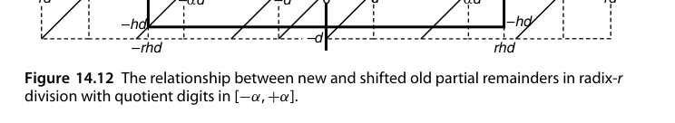{fig-align="center" width="85%"}

## 14.6 p-d 图的实际应用（Using p-d Plots in Practice)

**p-d 图**：横轴除数 $d$、纵轴部分余数 $p$（或移位后的 $r s$），平面被划分为若干区域，每个区域对应一个合法商数字。设计流程：

1. 画出各商数字的合法区域（由迭代不变式推得的上下界直线）；
2. 在重叠区（多个 $q$ 都合法）内画选择分界线；
3. 分界线必须能被"截断网格"实现——即只用 $\hat{p}, \hat{d}$ 的有限精度就能区分；
4. 若网格太粗区分不了，就增加截断位数或调整商数字集合。

分界线并不需要是直线——**阶梯形（staircaselike）分界线同样合法**，而且在"用网格实现"这一约束下往往才是最优选择。图 14.14 展示了这一点：在重叠区里嵌入一条沿网格线走的阶梯路径，路径下方的格子归 $\beta$、上方的归 $\beta+1$。等价的判别准则是：**把整个 p-d 图用给定尺寸的矩形从原点开始平铺，要求没有任何矩形同时与某个重叠区的两条边界相交**（只碰到一条是允许的）。若平铺成功，每个格子的商数字就取该格子左下角所在区域的商数字；落在"两种取值都合法"的深色格子时，按实现与工艺的偏好任选其一。

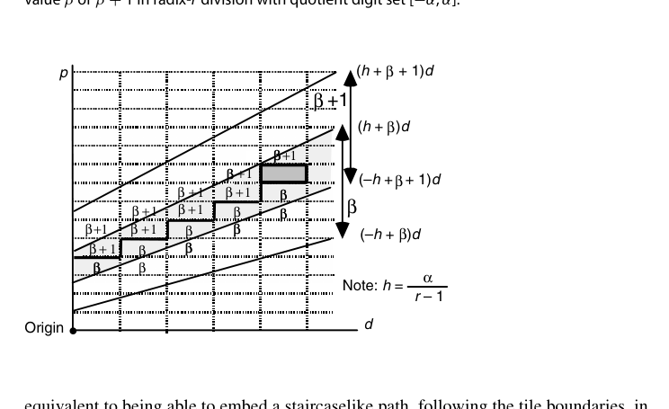{fig-align="center" width="85%"}

真正需要设计者判断的是**矩形该开多大**。矩形越大，需要的 $\hat p$、$\hat d$ 位数越少，选择表越小越快。图 14.15 给出了解析上界：考虑最窄的重叠区——商数字 $\alpha$ 与 $\alpha-1$ 之间的那一块，它由直线 $(-h+\alpha)d$ 与 $(h+\alpha-1)d$ 夹成，这两条线之间的最小水平距离与最小垂直距离构成不确定矩形尺寸的上界：

$$
\Delta d = d_{\min}\cdot\frac{2h-1}{\alpha-h}, \qquad \Delta p = d_{\min}(2h-1)
$$

把 radix-4、$d \in [1/2,1)$、数字集 $[-2,2]$ 的参数（$\alpha = 2$，$d_{\min} = 1/2$，$h = 2/3$）代进去，得 $\Delta d = 1/8$、$\Delta p = 1/6$。由于 $1/8 = 2^{-3}$ 而 $2^{-3} \le 1/6 < 2^{-2}$，**至少**要检查 $d$ 的 3 位（不含前导 1，故实际看 2 位小数）与 $p$ 的 3 位。注意这是**下界**，可能不够——在方格纸上实际画出 p-d 图会发现，**真正常用的是 $p$ 的 3 位加 $d$ 的 4（或 3）位**；若 $p$ 保持进位保存形式，则两串各自都要看 4 位（或先用小型快速加法器把高位 4 位求和）。

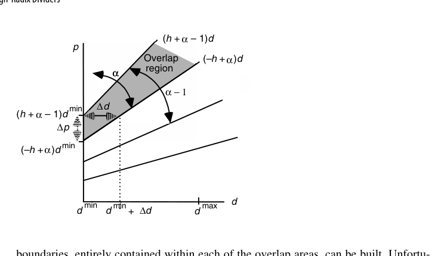{fig-align="center" width="85%"}

二维平面还有一个容易被忽视的麻烦：**四个象限不能靠符号对称来省表**。直觉上似乎"负的部分余数查同一张表、把结果取反"就行，但 2 的补码对正负数的截断是**不对称**的——正数截断向下取整，负数截断向更负的方向取整，误差方向不同。取点 A（坐标 $d, p$）及其关于横轴的镜像点 B（坐标 $d, -p$），可以看到 **B 点对应的商数字并不是 A 点对应值的相反数**（图 14.16）。因此选择表必须扩展到全部四个象限，且 $d$ 与 $p$ 各需额外 1 位符号位——这也是为什么实际 radix-4 SRT 的选择表比"半个 p-d 图"估算出来的要大得多。

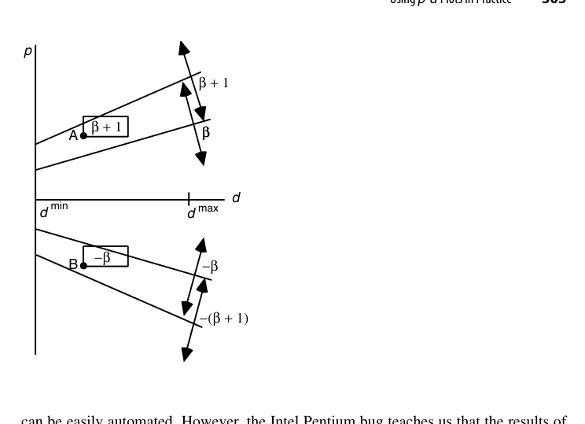{fig-align="center" width="85%"}

最后是一条非常实用的妥协路线：**允许少量例外**。选一个"几乎够用"的较低精度，使绝大多数不确定矩形都完整落在一个商数字的区域内，只有少数几个跨了边界；这些例外格子对应的乘积项里**多引入一位输入**单独处理。图 14.17 给出了具体形态：把四个小格子合并成一个大格子，精度每个分量降低 1 位，只有标了星号的四个格子必须例外处理。举一个具体账目：若 $p$ 以进位保存形式的 3 位（$u_{-1},u_{-2},u_{-3}$ 与 $v_{-1},v_{-2},v_{-3}$）加上 $d$ 的 2 位（$d_{-2},d_{-3}$）在多数情况下够用，而 $d_{-4}$ 只是偶尔需要，那么每个 PLA 输出项的乘积项就由 8 个变量（真或反形式）之和构成，第 9 个变量只出现在少数乘积项里——**它对 PLA 复杂度的贡献被大幅摊薄了**。

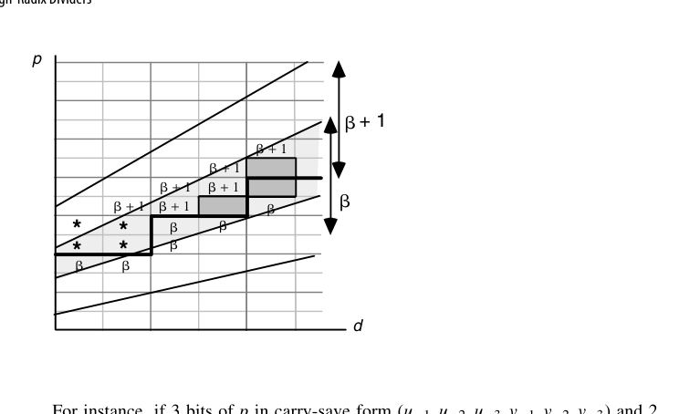{fig-align="center" width="85%"}

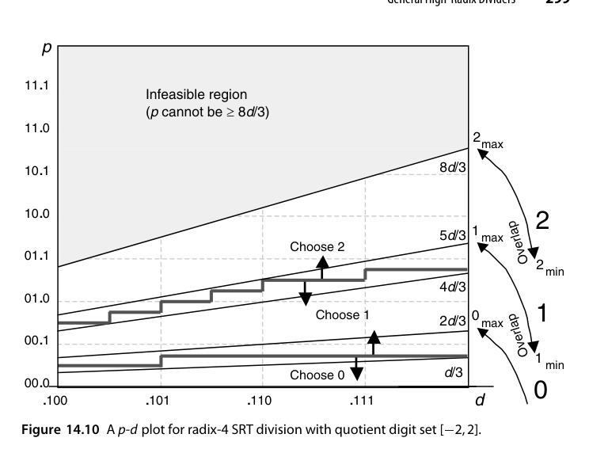{fig-align="center" width="85%"}

::: {.callout-important title="Pentium FDIV 的完整故事"}
表项删除本身是常规做法——**完全落在不可行区域内的格子删掉毫无害处**；问题在于部分落在可行区域内的格子，无论暴露面积多小都**不能删**。Pentium 的脚本错误恰恰删掉了 5 个本应读出 $\pm2$ 的表项，使其读出 0。Coe 与 Tang 后来解释：只有当二进制除数以 `xxxxx111111` 开头时才可能触发错误，这既说明了它为何难被测试抓到，也给出了软件补丁的简易判据；Edelman 进一步给出了五个错误表项在 p-d 图上的确切位置，并证明在 $[1,2)$ 上的最坏绝对误差约为 $10^{-5}$。教训可以浓缩成一句话：**自动生成的表必须被独立验证，而不是被"看起来合理"所接受**。
:::

::: {.callout-note title="设计流程固化"}
高基数除法的设计可以固化为四步：① 定参数（$r$、$\alpha$、$h=\alpha/(r-1)$、$d$ 的取值区间）；② 用 $\Delta d$、$\Delta p$ 估下界以缩小搜索空间；③ 实际平铺，确定 $\hat p$、$\hat d$ 的精确位数与表内容；④ **形式验证**表项完备性（无空格、无非法区、无错删）。
:::

## 本章小结

- 高基数除法：每拍多位商，代价是倍数生成与商数字选择变复杂。
- carry-save 部分余数 + 截断估计 + 冗余商数字 = SRT 三件套。
- radix-4 SRT 是实用甜点（$\alpha=2$、$h=2/3$、部分余数 $[-2d/3, 2d/3)$，比 $\alpha=3$ 重叠区更宽）。
- 选择表规模下界：$\Delta d = d_{\min}(2h-1)/(\alpha-h)$，$\Delta p = d_{\min}(2h-1)$；radix-4 时为 $1/8$ 与 $1/6$。
- 截断在正负数上不对称，四个象限都得建表。
- p-d 图是设计/验证商选择函数的标准几何工具，且**必须独立验证**（FDIV 教训）。

## 原书插图

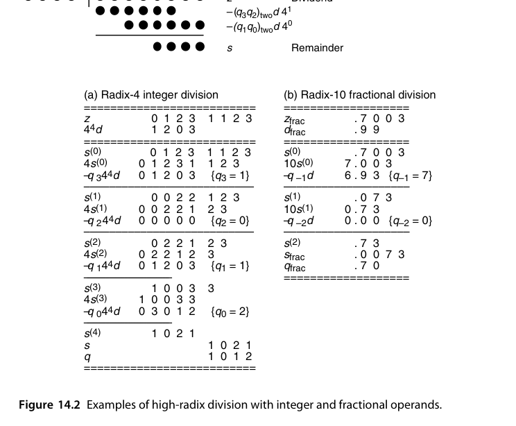{fig-align="center" width="85%"}

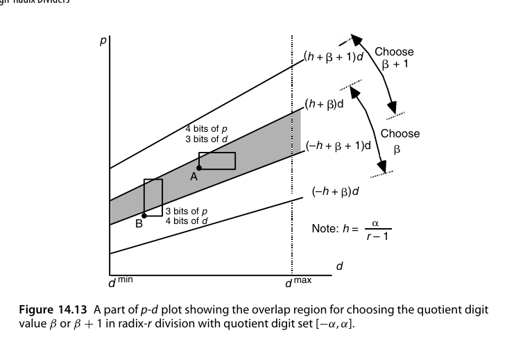{fig-align="center" width="85%"}
