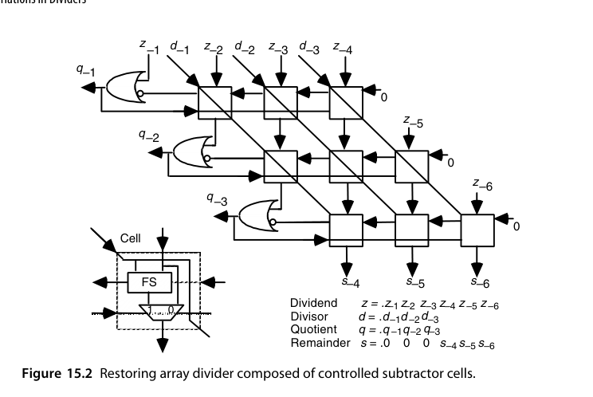
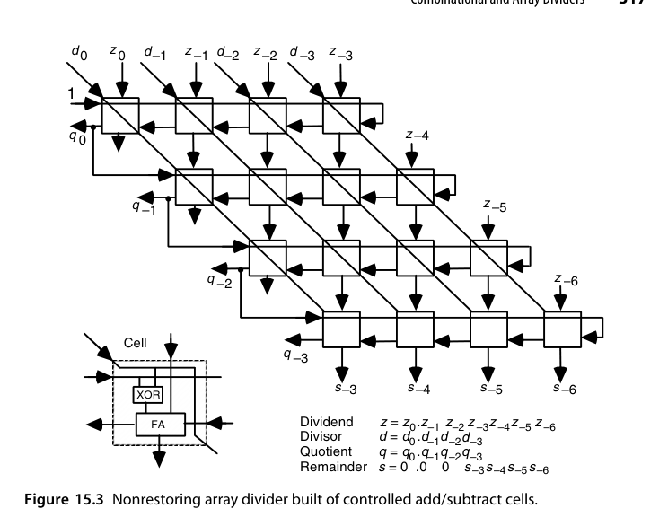
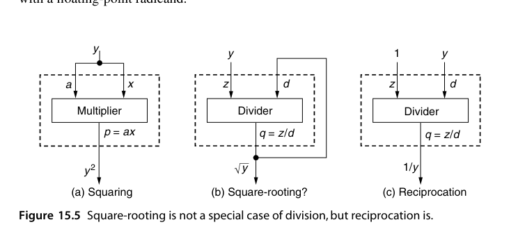
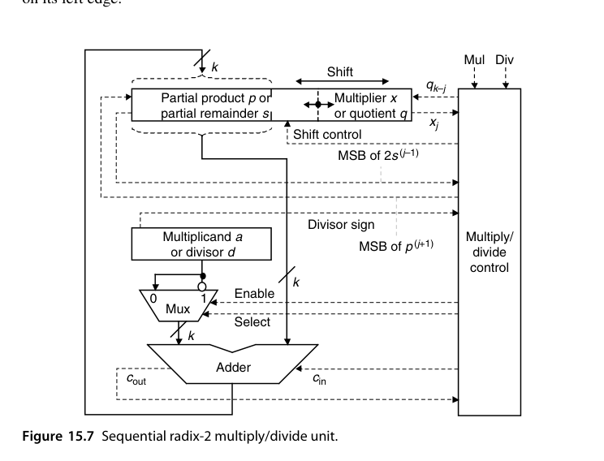
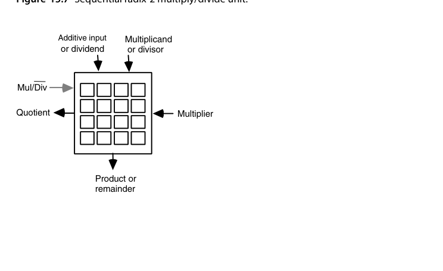
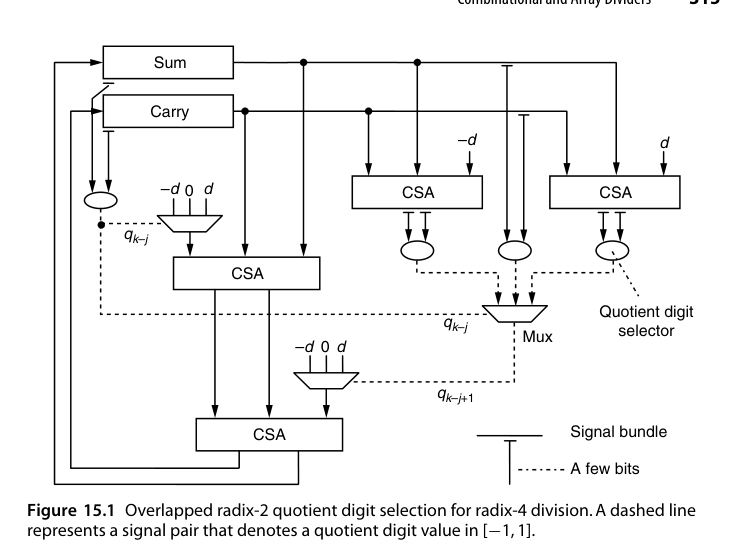
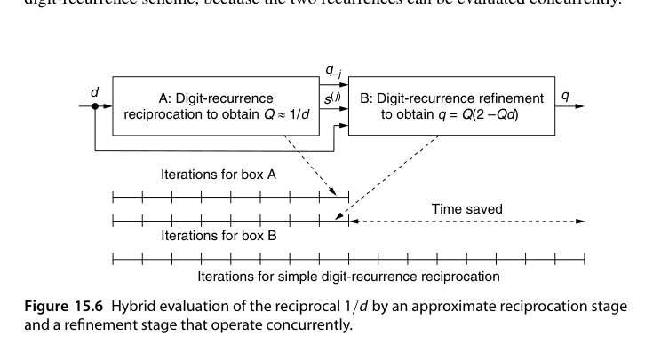

# 第15章 除法器的变体（Variations in Dividers）

## 本章导读

高基数 SRT 之外，除法还有几条重要的提速与特化路线：预缩放（让商选择不依赖除数）、重叠商选择（并行猜两位）、组合/阵列除法（纯组合逻辑展开）、模除（RNS/密码学用）、倒数（把除法变乘法）、乘除复用单元。

这些变体分属两个截然不同的动机：**前三条仍在"逐位收缩"的数字递归框架内**，目标是把每拍的位数做多、做快；**后三条则要么换问题（换到模运算世界），要么换方法（彻底放弃数字递归，用乘法迭代逼近）**。分清这条分界线，比记住每种结构的细节更重要。

## 15.1 预缩放除法（Division with Prescaling)

思想：先把被除数与除数同乘一个因子 $c$，使新除数 $d' = c \cdot d$ 非常接近 1。此时商数字几乎等于部分余数的高位——**选择函数不再依赖除数**，选择表退化为几条固定分界，基数可以做得更高。

代价：两次预乘（被除数、除数各一次）+ 因子 $c$ 的获取（查表或小计算）。净效果：把"每拍的复杂选择"换成"开头的一次性预变换"，高基数下划算。

这种"预处理换取后续简化"的取舍值得量化地看。不预缩放时，每一次迭代都要用 $\hat p$ 和 $\hat d$ 两个量去查表；预缩放后 $\hat d$ 的信息被"吸收"进常数里，选择只需要看 $\hat p$ 的高几位——**表项数从"$\hat p$ 位数 + $\hat d$ 位数"的指数级降到只与 $\hat p$ 位数有关**，节省是指数级的。而付出的代价是一次乘法的延迟，摊到 $k/\log_2 r$ 次迭代上，只要基数足够高就完全划得来。

::: {.callout-note title="与 14.6 节的呼应"}
预缩放把 p-d 图里的**分界线从"随 $d$ 发散的一族斜线"压成"几条水平线"**——这正是图 14.3 中 radix-2 常数阈值成立的原因。radix-2 之所以免费获得这种简化，就是因为它的 $d$ 区间本来就够窄；预缩放做的事，不过是把这种"窄区间"通过乘法人工制造出来。
:::

## 15.2 重叠商数字选择（Overlapped Quotient Digit Selection）

用两套（或多套）radix-2/radix-4 的选择逻辑**错位并行**：第一级用部分余数高位选商，第二级同时针对第一级的两种可能结果预选——类似 carry-select 的"两份都算"。两级错位重叠后，等效于更高基数，但每级选择逻辑保持小巧。radix-8/16 除法器的实用实现多走这条路。

图 15.1（见本章插图区）给出了这个结构的完整形态，值得逐块读一遍：左上角是第一级商数字选择逻辑，输入取自 sum 与 carry 寄存器（以进位保存形式共同表示部分余数）的前几位；右上角是**两个 CSA**，分别针对 $q_{k-j} = 1$ 与 $q_{k-j} = -1$ 计算新部分余数的前几位——**$q_{k-j}=0$ 的情形不需要任何计算**；随后是**三份**商选择逻辑副本，分别求出三种情形下的下一个商数字 $q_{k-j+1}$；最后由 $q_{k-j}$ 的真实取值从三个预估值中选一个出来。

这背后是一条非常重要的工程规律：**"提前算好可能用不上的值"这类投机式计算（speculative computation）在现代数字系统中被广泛使用**，因为它的收益（把选择逻辑从关键路径上摘下来）往往大于成本（多算的电路）。但收益不是白来的：多出来的电路与互连既占面积也耗能量。先进数字系统的设计因此永远是一场"速度 / 面积 / 功耗"的三角平衡（第 26 章会专门讨论降功耗技术）。

## 15.3 组合与阵列除法器（Combinational and Array Dividers)

把 $k$ 拍迭代**空间展开**：$k$ 级"试减-选择"单元排成阵列，纯组合逻辑一次出商。结构与阵列乘法器对偶（除法是乘法的逆过程），延迟 $O(k^2)$ 级门——面积大、延迟高，只在特殊场景（如单拍必须出结果的小位宽除法、或教学演示对偶性）使用。

理论上，把 15.2 节的重叠选择推到极致——一个周期内产生全部 $k$ 位商——是可行的，但代价陡增：投机逻辑会**像树一样分叉**，纯组合除法器的复杂度随 $k$ **指数增长**。作为对照，全组合树形乘法器的延迟是 $O(\log k)$、代价是 $O(k^2)$；而除法过程的理论研究给出的是：对数时间除法器可以造出来，但代价会达到 $O(k^4)$；若把延迟放宽到 $O(\log k \log\log k)$，渐近复杂度才回到与乘法器同阶。可惜的是，**这些理论构造没有一个通向实用的电路设计**。实用的阵列除法器用的是另一种思路：把单元做得像阵列乘法器那样规整。

图 15.2 是由**可控减法单元（controlled subtractor cell）**构成的恢复式阵列除法器。每个单元含一个全减器（FS）和一个二选一 mux：当一行单元的控制输入广播为 0 时，单元的垂直输入（部分余数位）原样下传；否则把对角输入（除数位）从部分余数中减去、把差值下传。**这行的布局与第 13 章图 13.1 的除法则位点图极为相似**——这不是巧合，阵列除法器本质上就是把位点图"固化"成硬件。每一行单元完成一次试探减，结果的符号既决定下一个商位，也决定是"原部分余数"还是"试探差"被送到下一行。

{fig-align="center" width="85%"}

阵列除法器与阵列乘法器的相似性有一点容易误导人：**单元数量相同、单元复杂度相当，但关键路径差别巨大**。$k\times k$ 阵列乘法器的关键路径只穿过 $O(k)$ 个单元，而图 15.2 的关键路径要穿过**全部 $k^2$ 个单元**——因为借位信号在每一行内部都要行波传播。结果是阵列除法器又慢又贵，性价比不佳。图 15.3 是它的"姊妹"版本——非恢复式阵列除法器：单元复杂度与图 15.2 大体相当，但要多用一些单元来处理额外的符号位以及部分余数的最终修正（最后一行）；单元里的 XOR 门充当**选择性取补器**，把除数或其补码送给全加器（FA），从而根据上一行部分余数的符号决定做加法还是减法。延迟仍是 $O(k^2)$。

{fig-align="center" width="85%"}

如果确实要做大量除法，**流水化能显著改善阵列除法器的吞吐**：例如在图 15.2 每一行单元的输出线上插锁存器，输入数据率就由"单行的借位传播延迟"决定，此时性价比大幅提升——不过仍比不上流水化的阵列乘法器。想彻底消除每行的进位/借位传播，可以让部分余数在行间以进位保存形式传递，**但每行的进位出（借位出）仍然必须知道**，否则无法确定下一行该做哪种操作。可以用**跨行的进位/借位预测电路**来获得这个信号，然而预测电路是树形结构、需要长连线，会大幅增加版图面积，把规整布局的速度优势抵消掉一大半；用 radix-2 或高基数 SRT 从少量高位估计商数字也能简化行间逻辑，却要求对冗余商做更复杂的最终转换，且连线会把版图弄得不规整。

::: {.callout-important title="为什么除法器没有树形版本"}
乘法有树形乘法器，除法却没有对应的"树形除法器"，原因在第 13 章已埋下：**除法的各操作数不是先验已知的**，商数字必须逐位确定，这种"逐位收缩"的串行本质无法靠树的并行性消除。这是除法比乘法更难的根源，也是为什么许多现代处理器宁愿**改用基于乘法的方法**（第 16 章）来实现高性能除法——用若干次乘法迭代逼近商，比硬造一个全组合除法器划算得多。
:::

## 15.4 模除法器与模约简器（Modular Dividers and Reducers)

- **模约简（modular reduction）**：$x \bmod m$，$x$ 是 $2k$ 位——本质是"只要余数的除法"，逐位/逐块折叠（第 4 章的 $2^k \pm 1$ 技巧）或 Barrett 约简（乘倒数逼近）；
- **模除（modular division）**：$x / y \bmod m$ 即 $x \cdot y^{-1} \bmod m$——核心是**模逆**，用扩展欧几里得或 Fermat 小定理（$y^{-1} = y^{m-2}$）计算，密码硬件的关键操作。

Barrett 约简与 Montgomery（12.4 节）是免除法模运算的双璧：一个用倒数乘法逼近商，一个变换数域。

先明确定义。给定 $z$ 与 $d \ge 0$，模除法器计算 $q = \lfloor z/d \rfloor$ 与 $s = \langle z \rangle_d$。注意**商按定义是整数，但输入 $z$、$d$ 不必是整数**，例如 $\lfloor -3.76/1.23 \rfloor = -4$、$\langle -3.76 \rangle_{1.23} = 1.16$。$z$ 为正时模除法与普通整数除法相同；带小数的定点数也能用整数除法算法求出 $q$ 与 $s$（把小数点"记在心里"）。但对**负的 $z$**，普通除法给出负余数，而**模运算的余数永远非负**——所以必须在迭代之后加一个修正步骤：只要最终余数为负，就给它加上 $d$、同时从整数商里减去 1。这与第 13 章讨论的截断/地板语义之争是同一个问题。

许多场景只关心商 $q$ 或只关心余数 $s$ 之一：只求 $q$ 时仍得做一次完整除法（余数是副产品），但只求 $\langle z \rangle_d$ 时**模约简可能比完整除法更快、更省**。对常数除数取模第 4.3 节已讲过；对任意的 $2k$ 位被除数 $z$ 与 $k$ 位除数 $d$，把 $z$ 拆成高半 $z_H$ 与低半 $z_L$，则

$$
\langle z \rangle_d = \langle z_H 2^k + z_L \rangle_d = \langle z_H (2^k - 1) + z_H + z_L \rangle_d
$$

即**模约简可转化为"$z_H$ 乘以 $2^k-1$ 再模 $d$"加上两次模加**。两个加法项中，一项可直接用作累积部分积的初值；若模乘法器用存储进位累积部分积，则两项都能在开头一次性装进去。若 $d$ 是位规格化的（最高位为 1），还有更漂亮的特例 $\langle 2^k \rangle_d = 2^k - d$（即 $d$ 的 2 的补码），于是让 $z_H$ 与 $2^k-d$ 做模 $d$ 乘法、把累积部分积初值设为 $z_L$ 即可。不过要提醒一句：**这些方法只在"手里没有、也不打算有快速硬件除法器"时才值得考虑**。

对数百位宽的大操作数，**Montgomery 模约简**才是正解。它通常与模乘法配合使用，而模乘法是模幂运算的基本操作——公钥密码的核心。以 $q = ax \bmod m$（$m$ 为奇数）为例，把 $a, x, q$ 等模 $m$ 的数都表示成 $k$ 位**伪剩余（pseudoresidue）**，允许"余数"$\ge m$（例如模 13 时 15 就是一个合法的 4 位伪剩余）。Montgomery 乘法并不直接给出 $ax \bmod m$，而是给出 $ax/R \bmod m$，其中 $R$ 是常数（radix-2 情形即 $R = 2^k$）。看一个完整的小例子：取 $r = 2$、$m = 13$、$R = 16 = 2^4$，则 $R^{-1} = 9 \pmod{13}$（因为 $16 \times 9 \equiv 1$）。以 $a=10$、$x=11$ 为例，运算是"普通乘法算法配右移"，但**每步右移之前先保证累积部分积是 $r$ 的倍数（本例中即偶数）**——当移位后的部分积 $2p^{(i)}$ 是奇数时就加上 $m$ 再右移（加 $m$ 不改变模 $m$ 的结果）。结果是 $(1111)_2$，作为模 13 的伪剩余等价于 2；验证：$10\times 11\times 9 \bmod 13 = 990 \bmod 13 = 2$。要把 $t = ax/R \bmod m$ 还原成 $ax \bmod m$，只需把 $t$ 乘以 $R^2 \bmod m$ 而不是 $R$，得到 $tR^2/R \bmod m = tR \bmod m$；本例中 $R^2 \bmod m = 256 \bmod 13 = 9$。

::: {.callout-tip title="Montgomery 为什么在硬件上特别好用"}
因为要走两步 Montgomery 乘法，**单次**模乘用它并不划算。真正让它成为密码硬件事实标准的是另一条性质：**每一步"是否加 $m$"的决定只取决于部分积的最低有效位（LSB）**。而在存储进位表示中，最高位是未知的（进位随时可能改变高位），**最低位却是现成可用的**。这意味着整个模乘过程可以全程使用进位保存加法、一次进位传播都不做——与高基数除法器"用截断高位做选择"的困境恰好相反。存在多次模乘时收益更直接：一次性把所有输入转成 Montgomery 码（M-code，即 $yR \bmod m$）、连续做模乘、最后再转换回来即可。
:::

## 15.5 倒数的特殊情形（The Special Case of Reciprocation)

$1/d$ 是很多算法的入口（有了倒数，除法 = 乘法）。硬件求倒数的经典路线：

1. **查表粗值**：用 $d$ 的高位查 ROM 得初始近似 $r_0$（如 8 位精度）；
2. **Newton-Raphson 迭代**：$r_{i+1} = r_i (2 - d \cdot r_i)$——每次迭代精度**平方增长**（8→16→32→64 位），且只用乘法与减法（可用 FMA！）；
3. 迭代误差分析与最终舍入（第 16 章系统展开）。

先澄清一个常见的类比错误：**开平方不是除法的特例，但求倒数确实是**。与"乘法器可以直接当平方器用"不同，"把除法器的被除数接成常数 1 就得到开方器"这种想法行不通——原因要到第 21 章讨论浮点之后再讲。而求倒数则完全可以这样做，只是我们期望一个专用倒数器的成本与延迟都明显优于通用除法器。下面假设 $d$ 是无符号、位规格化的小数，$d \in [0.5, 1)$（即 $(0.1xxx\ldots)_2$），其倒数据此落在 $[1,2]$ 内；为简化讨论忽略 $d = 0.5$ 这个特例。

{fig-align="center" width="85%"}

**一个令人失望的结论是：单纯用数字递归求倒数，相比除法没有任何时间或硬件上的节省。** 虽然初始部分余数是个特殊值（2 倍的 1），这点优势几乎立刻被用光——后续所有部分余数都是普通值，而倒数数字的选择与商数字选择面临完全相同的困难。真正有效的做法是把数字递归与别的方案**混合**：先用数字递归求出**大约一半**的倒数位，构成 $1/d$ 的近似值 $Q$，再用一个精化步骤补齐剩下的位。可以证明，若 $Q$ 逼近 $1/d$ 的误差不超过 $2^{-k/2}$，则 $t = Q(2 - Qd)$ 对 $q$ 的逼近误差不超过 $2^{-k}$。$Q$ 的各比特用常规除法递归产生，而 $t$ 也用数字递归同步算出，用的正是选定的倒数位 $q_{-j}$：

$$
s^{(j+1)} = 2s^{(j)} - q_{-j}d \quad (2s^{(0)} = 1), \qquad
t^{(j+1)} = 4t^{(j)} + q_{-j}\left(4s^{(j)} - q_{-j}d\right) \quad (t^{(0)} = 0)
$$

关键在于**这两个递归可以并发求值**——图 15.6（见本章插图区）中，A 框（数字递归求 $Q$）与 B 框（精化求 $q = Q(2-Qd)$）并行推进，总时间约为简单数字递归的一半。近似倒数还可以**查表**得到（第 16 章讨论），通用查表函数求值方法在第 24 章；低精度近似 $1/d$ 也可以直接用一个定制组合逻辑电路产生。

::: {.callout-tip title="工程观察"}
Newton 迭代的"自校正"性质（误差二次方消失）配合 FMA 硬件，是现代 GPU/CPU 除法与开平方指令（rcp、rsqrt 系列）的内部实现方式。游戏图形学著名的"快速逆平方根"魔数算法，本质就是一次精心设计的查表 + 一步 Newton。
:::

## 15.6 乘除复用单元（Combined Multiply/Divide Units)

乘法器与除法器共享大部分数据通路（移位寄存器、加减法器、压缩树），合并设计可省 30-50% 面积：

- 乘法：部分积累加（正向迭代）；
- 除法：部分余数更新（逆向迭代）；
- 控制状态机复用计数器与移位路径。

在面积敏感的嵌入式核心里，"乘除一体"是常见配置；高性能核则倾向于分开（时序与流水自由度更大）。

这种相似性是贯穿全书的：**除了除法器里的商数字选择逻辑在乘法器中没有对应物，两者所需的硬件元件几乎一模一样**——从基本 radix-2 单元、到高基数设计、再到阵列实现都成立，根本原因还是那句老话：**乘法与除法本质上都是多操作数加法问题**（图 13.15）。图 15.7 给出的是一个把第 9 章图 9.4a 的乘法器与第 13 章图 13.10 的非恢复除法器合并而成的 radix-2 乘除单元。注意两处关键合并：**乘数（商）寄存器与部分积（余数）寄存器已合为一个**，二者的移位分界用虚线标出；图 13.10 中那个用来暂存 $2s^{(j-1)}$ 最高位的额外触发器，已被收进"乘除控制单元"的逻辑里。

{fig-align="center" width="85%"}

高基数版本同样可以合并，而且收益更大。**一个 radix-4 Booth 乘法器（图 10.9）与一个基于商数字集 $[-2,2]$ 的 radix-4 SRT 除法器（图 14.4 的 radix-4 版本）可以合并成一个 radix-4 乘除单元**：因为重编码后的乘数与冗余商**使用同一个数字集 $[-2,2]$**，所以被乘数与除数的**倍数选择电路可以大量共享**——这是"数字集对齐"带来的结构性红利。部分树/全树乘法器与超高基数除法器也能合并：利用乘法器压缩树的**多操作数加法能力**产生一个相当精确的除数倒数 $1/d$ 估计值，再跟几次乘法得到商，这正是第 16 章"基于乘法的除法"的入口。最后，若要求一个单元既能当阵列乘法器、又能当阵列除法器用，它的输入/输出规范要统一设计——图 15.8 给出了这样一个通用电路的 I/O 规格：**同一组引脚、两种工作模式**，是用面积换灵活性的典型做法。

{fig-align="center" width="85%"}

::: {.callout-note title="设计取舍"}
合并的判据不只是面积，预期应用中数值运算的**密度**才是关键：如果乘除混用的比例很高，合并单元能"顺手"复用数据通路；如果乘除各自的吞吐要求都很高，那么**用两个合并单元**比"一个乘法器 + 一个除法器"能提供更多并发执行的机会——因为两个合并单元可以同时执行两条乘法。这也解释了为什么高性能核里常见"两个乘除单元"而不是"一乘一除"。
:::

## 本章小结

- 预缩放：把选择函数的除数依赖性"预付"掉，表项数从指数级降到只与部分余数位数有关。
- 重叠选择：小选择器错位拼出高基数，投机计算换速度，代价是面积与功耗。
- 阵列除法：单元与乘法器同构，但关键路径穿过全部 $k^2$ 个单元；除法**没有树形版本**。
- 模约简：$\langle z \rangle_d = \langle z_H(2^k-1) + z_H + z_L \rangle_d$；Montgomery 用 LSB 判定加 $m$，天然适配进位保存。
- 倒数：数字递归本身不省，混合法（近似 $Q$ + 精化 $Q(2-Qd)$）可把时间减半；Newton 迭代误差平方收敛，FMA 的天然用户。
- 乘除合并：数字集对齐（Booth $[-2,2]$ 与 SRT $[-2,2]$）可共享倍数选择电路。

## 原书插图

{fig-align="center" width="85%"}

{fig-align="center" width="85%"}
