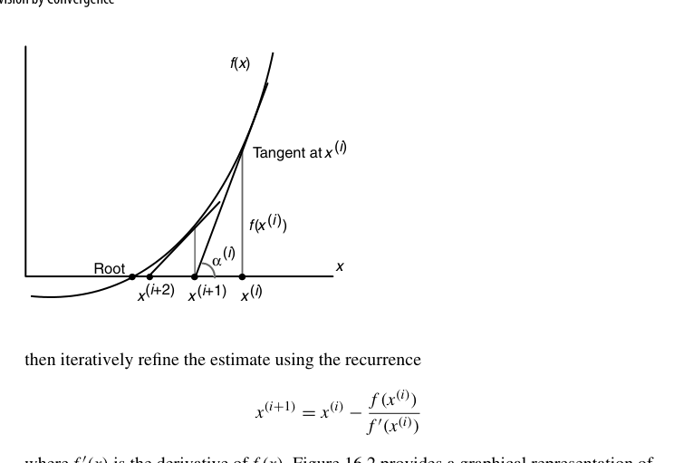
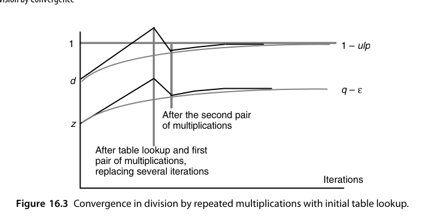
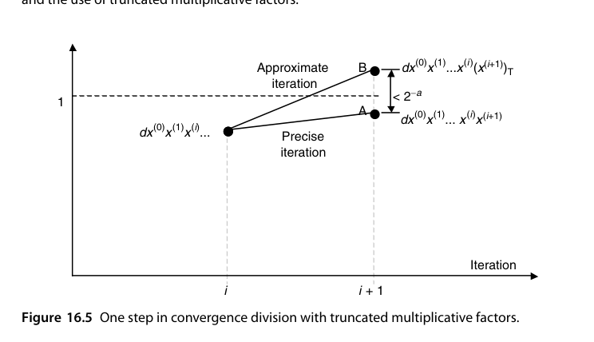
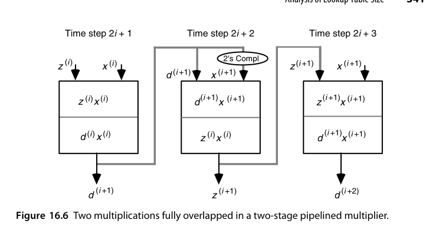
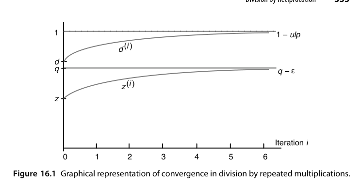
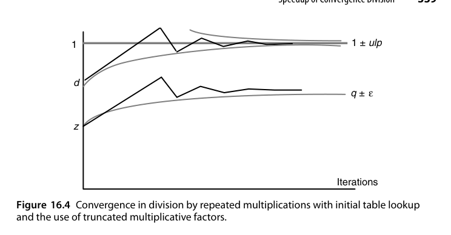

# 第16章 收敛法除法（Division by Convergence）

## 本章导读

前面所有除法都是"每拍硬算几位商"的**数字递归（digit recurrence）**路线；本章换一条完全不同的赛道：**用乘法逼近除法**。如果能算出一串因子，让分子分母同乘后分母趋于 1，分子就趋于商。迭代精度每轮**平方翻倍**（二次收敛，quadratic convergence），8 位 → 16 位 → 32 位 → 64 位只需 3 轮。代价是每轮要用到完整乘法器——所以这条路线只在"已有高速乘法器"的系统里划算（现代 FPU 正合此意）。

这是一次典型的**用单步成本换步数**的交易：数字递归每轮只做移位与加减，但要 $O(k)$ 轮；收敛法每轮做全字长乘法，只需 $O(\log k)$ 轮。乘法由阵列/树型结构实现时稳赚，系统只有迭代式乘法器时血亏。

## 16.1 一般收敛方法（General Convergence Methods)

收敛类算法的通用结构：

$$
z^{(i+1)} = z^{(i)} \times c^{(i)}, \qquad d^{(i+1)} = d^{(i)} \times c^{(i)}
$$

选因子 $c^{(i)}$ 使 $d^{(i)} \to 1$，则 $z^{(i)} \to z/d$。分析重点是**收敛速度**（每轮精度翻几倍）与**每轮成本**（几次乘法）。二次收敛（quadratic convergence）是这类方法的标志，与数字递归的线性收敛形成鲜明对比。

数字递归除法其实也能塞进同一个框架：$s^{(j)} = s^{(j-1)} - \gamma^{(j)}d$、$q^{(j)} = q^{(j-1)} + \gamma^{(j)}$，不变量为 $s^{(j)} + q^{(j)}d = z$，取 $\gamma^{(j)} = q_{-j}r^{-j}$ 就是"每轮吐一位商"。可见**两条路线的区别不在框架，而在 $f$、$g$ 的复杂度与收敛阶**。同一套"迭代 + 乘法"的框架把 $f$、$g$ 换一换，就能算开方、倒数平方根、指数与三角（第 21-23 章反复回到这里）。

## 16.2 连乘法除法（Division by Repeated Multiplications)

经典构造：把分母写成 $d = 1 - e$（先规格化使 $|e| < 1$），则

$$
\frac{1}{d} = \frac{1}{1-e} = (1+e)(1+e^2)(1+e^4)(1+e^8)\cdots
$$

每轮 $c^{(i)} = 1 + e^{2^i}$，而 $1 + e^{2^i}$ 恰好由前一轮分母 $d^{(i)}$ 取"2 的补"得到：$c^{(i)} = 2 - d^{(i)}$。每轮两次乘法（分子、分母各乘 $c^{(i)}$），误差按 $e^{2^i}$ 平方消失。

收敛速度可精确算出：

$$
d^{(i+1)} = d^{(i)}\big(2 - d^{(i)}\big) = 1 - \big(1 - d^{(i)}\big)^2 \;\Longrightarrow\; 1 - d^{(i+1)} = \big(1-d^{(i)}\big)^2
$$

即**误差自平方**。因 $1-d^{(0)} \le 2^{-1}$，有 $1-d^{(i)} \le 2^{-2^i}$；要精确到 $2^{-k}$ 需 $2^m \ge k$，故

$$
m = \lceil \log_2 k \rceil, \qquad \text{总乘法次数 } 2m - 1
$$

最后一轮分母已足够接近 1，只算分子。$k=64$ 时 $m=6$、11 次乘法、6 次求补。

::: {.callout-note title="数值示例：误差平方消失"}
取 $d = 0.9$、$z = 0.5$（精确商 $0.5555\cdots$）：

| $i$ | $x^{(i)} = 2-d^{(i)}$ | $d^{(i+1)}$ | $z^{(i+1)}$ | $1-d^{(i+1)}$ |
|---|---|---|---|---|
| 0 | $1.1$ | $0.99$ | $0.55$ | $10^{-2}$ |
| 1 | $1.01$ | $0.9999$ | $0.5555$ | $10^{-4}$ |
| 2 | $1.0001$ | $0.99999999$ | $0.55555555$ | $10^{-8}$ |

误差的指数 $1 \to 2 \to 4 \to 8$ 每轮翻倍，而不是每轮多固定几位。
:::

误差细节：即使运算完全精确，$z=d$ 时分子分母都收敛到 $1-\mathrm{ulp}$，商偏小一个 ulp；对最高位为 1 的商统一加一个 ulp 可把最大误差降到 $\mathrm{ulp}/2$。乘法截断每轮引入至多 ulp 的负误差，$m$ 轮累积 $\le m\,\mathrm{ulp}$，故中间结果只需多留 $\lceil\log_2 m\rceil$ 位保护位。注意 $d^{(i)}$ 的舍入误差无需计入——它同时出现在两条递推中，比值 $z/d$ 不变。

## 16.3 倒数法除法（Division by Reciprocation)

拆成两步：先求倒数 $1/d$（Newton-Raphson，15.5 节），再乘被除数。Newton 迭代 $r_{i+1} = r_i(2 - d r_i)$ 每轮两次乘法（可融合为 FMA 链）。

Newton-Raphson 求根的几何含义是"在曲线 $y=f(x)$ 上点 $x^{(i)}$ 处作切线，取切线与横轴的交点作为下一个估计"：

$$
x^{(i+1)} = x^{(i)} - \frac{f\big(x^{(i)}\big)}{f'\big(x^{(i)}\big)}
$$

{fig-align="center" width="85%"}

取 $f(x) = 1/x - d$（根为 $1/d$），$f'(x) = -1/x^2$，即得 $x^{(i+1)} = x^{(i)}(2 - x^{(i)}d)$。设 $\delta^{(i)} = 1/d - x^{(i)}$，则

$$
\delta^{(i+1)} = \frac{1}{d} - x^{(i)}\big(2 - x^{(i)}d\big) = d\big(\delta^{(i)}\big)^2
$$

因 $d<1$ 有 $\delta^{(i+1)} < (\delta^{(i)})^2$——二次收敛得证，收敛条件为 $0 < x^{(0)} < 2/d$。最省事的初值是 $x^{(0)} = 1.5$（把 $|\delta^{(0)}|$ 限制在 0.5 内）；更好的线性初值 $x^{(0)} = 4(\sqrt3 - 1) - 2d = 2.9282 - 2d$ 把最大误差降到约 0.1，硬件上只需一次移位加一次减法。

以 $d = 0.5$（精确倒数 2.0）、$x^{(0)} = 1.5$ 为例：$x^{(1)} = 1.875$、$x^{(2)} = 1.9921875$、$x^{(3)} = 1.99996948$，误差依次为 $2^{-1}$、$2^{-3}$、$2^{-7}$、$2^{-15}$——**有效位数 1 → 3 → 7 → 15，严格翻倍**。这就是"平方收敛"的直观含义。

**与 16.2 的对偶**：连乘法分子分母同步更新，倒数法只更新倒数——后者乘法次数略少，且得到的倒数可复用（同一除数多次除法，如矩阵归一化）。

::: {.callout-note title="解读"}
两条路线在现代 FMA 硬件上几乎等价，工程选型更多取决于：**舍入正确性**（16.4 节）与**能否复用倒数**。GPU 的 `rcp` 指令走倒数路线，CPU 的除法微码多为连乘法的变体。
:::

## 16.4 收敛除法的加速（Speedup of Convergence Division)

- **更好的初值**：查表位数从 8 提到 10-12 位，可省一整轮迭代（一轮 = 两次乘法 ≈ 8-10 拍）；
- **倒数与连乘的混合**：前几轮用便宜的连乘，末轮用倒数形式便于舍入控制；
- **末轮直通**：最后一轮只算分子（分母已足够接近 1），省一次乘法；
- **舍入正确性**：IEEE 754 要求除法结果**正确舍入**——逼近算法必须保证最后一步把"几乎正确的商"修正到正确的最近浮点数。常用手段：多算几位保护位 + 余数反推校验（$z - q \cdot d$ 的符号判定舍入方向）。这是收敛除法设计中最微妙的环节。

加速的三条路是**减少乘法次数、让乘法变窄、让乘法变快**。关键在于收敛前期最亏：连乘法从 0 位做到 8 位要 6 次乘法，从 8 位做到 64 位只要 5 次。前几轮做的是把 $d$ 从 $0.1xxx$ 推到 $0.1111xxxx$ 这种粗活，却付了全字长乘法的价钱——把 $d$ 的高 $w$ 位送进 ROM 直接读出 $x^{(0+)} \approx x^{(0)}x^{(1)}x^{(2)}$，一次查表就顶掉四次乘法。

允许 $dx^{(0+)}$ 略大于 1 是另一个省钱技巧：此时下一轮因子 $2-d^{(i)} = 1-\varepsilon$ 会把它拉回 1 下方但更接近 1。真正要保证的只是 $|d^{(i)}-1|$ 平方下降，而不是 $d^{(i)}$ 恒小于 1。

{fig-align="center" width="85%"}

乘因子还可以截断：若目标是"从 $l$ 位收敛到 $2l$ 位"，把 $d^{(i)}$ 截到 $a$ 位（误差 $\alpha < 2^{-a}$），则

$$
d^{(i)}(x^{(i+1)})_T = (1-y^{(i)})(1+y^{(i)}+\alpha) = 1 - (y^{(i)})^2 + \alpha(1-y^{(i)})
$$

因 $1-y^{(i)} < 1$，附加误差 $<\alpha$。取 $a = 2l$，附加误差与目标误差同阶，乘因子变窄、乘法直接变快。代价是收敛方向不再单调，而是在 1 与 $q$ 的上下两侧交替逼近（图 16.4）。

{fig-align="center" width="85%"}

::: {.callout-tip title="工程实例：64 位除法的完整配方"}
① 查表：$256 \times 8 = 2$ Kbit ROM，一次换来 8 位收敛；② 迭代：三轮乘法对，乘因子宽度依次 9、17、33 位；③ 收尾：一次 $64\times64$ 乘法。乘法次数从 11 降到 7，且其中 6 次乘数不足半宽。按位级迭代计总代价 $2(9+17+33)+64 = 182$ 级，仅约 3 次全宽乘法。
:::

## 16.5 硬件实现（Hardware Implementation)

典型数据通路：一个流水乘法器（复用浮点乘法器）+ 查表 ROM + 少量控制微码/状态机。IBM Power/PowerPC 的浮点除法、早期 x86 的除法微码都是这类结构。关键设计点：

- 乘法器的**位宽冗余**（内部多带几位）以控制累积舍入误差；
- 迭代调度尽量填满乘法流水线（两条独立的乘法链可交错）；
- 特殊值（NaN/Inf/0/非规格化）走旁路逻辑，不进迭代。

乘因子变窄是否真能提速取决于乘法器类型：数字递归型乘法器上窄操作数直接意味着更少的位级周期；全树型乘法器的延迟与宽度几乎无关，窄因子白省；部分 CSA 树（图 11.9 那类）介于两者之间。

连乘法每轮的 $z^{(i)}x^{(i)}$ 与 $d^{(i)}x^{(i)}$ 共享同一乘数且彼此独立，**可以完全流水重叠**：在两级流水乘法器上，$z^{(i)}x^{(i)}$ 从上级移到下级的同时，下一轮的 $d^{(i+1)}x^{(i+1)}$ 即可进入上级。调度上把 $d$ 那条链排前面，好让下一轮的乘因子尽早算出。

{fig-align="center" width="85%"}

倒数法享受不到这份重叠——$x^{(i+1)} = x^{(i)}(2 - x^{(i)}d)$ 中第二次乘法依赖第一次的结果。它的出路只有把初值做得更准：初值误差界 $2^{-16}$ 时，32 位商只需 3 次乘法、64 位商只需 5 次。为此可用线性插值补出初值，或把初值写成多操作数加法直接过一遍现成的 CSA 树算出。综合运用各种加速手段后，除法总延迟通常落在**两次到五次普通乘法**的量级。

## 16.6 查找表规模分析（Analysis of Lookup Table Size)

初值表是收敛法的"首付"：输入 $d$ 的高 $t$ 位、输出 $r_0$ 的 $t+u$ 位，表大小 $2^t \times (t+u)$ 位。优化手段：

- **对称性/单调性压缩**：利用倒数曲线形状，只存差分或分段线性系数；
- **双侧舍入（bipartite）与 multipartite 表**（第 24 章）：把一张大表拆成两小张相加，面积平方级下降；
- 目标：用最小表保证初始误差 $\le 2^{-(t+\epsilon)}$，从而减少一轮迭代。

> **定理 16.1** 要在第一轮迭代后获得 $w \ge 5$ 位收敛（$1 - 2^{-w} \le d\,x^{(0+)} \le 1 + 2^{-w}$），必须查看 $d$ 的 $w$ 位（隐藏 1 之后的部分），且读出的 $x^{(0+)}$ 也需 $w$ 位小数。

证明思路：把 $d$ 的前 $w+1$ 位看成整数 $u$（$2^w \le u < 2^{w+1}$）、把 $x^{(0+)}$ 去小数点后看成整数 $v$。由 $2^{-(w+1)}u \le d < 2^{-(w+1)}(u+1)$ 与目标不等式（等价于 $2^w - 1 \le dv \le 2^w+1$）得

$$
\frac{2^{w+1}(2^w - 1)}{u} \le v \le \frac{2^{w+1}(2^w + 1)}{u + 1}
$$

该区间内恒有整数解——这既证明了充分性，也给出了每个表项的上下界闭式，**表的生成可以完全自动化**。

::: {.callout-note title="表项怎么算：一个具体例子"}
设 $w=8$，某表项对应地址 55，即 $d$ 以 `0.1001 1011 1` 开头，故 $311/512 \le d < 312/512$。要求 8 位收敛即

$$
\frac{311}{512}(1+.f) \ge 1-2^{-8}, \qquad \frac{312}{512}(1+.f) \le 1+2^{-8}
$$

解出 $\frac{199}{311} \le .f \le \frac{101}{156}$，即 $163.81 \le f \le 165.74$（$f = 256\times.f$），故取整数 164 或 165 均可。可见**表项不唯一，存在一个合法窗口**——这正是允许"越过 1"带来的自由度。
:::

::: {.callout-tip title="全局视角"}
查表 + 迭代是函数求值（第六部分）的总纲：除法、开方、超越函数都是"**表给粗值、迭代/多项式给精度**"。表的大小与迭代轮数互为消长——16.6 节的分析方法是第 21-24 章的通用武器。
:::

## 本章小结

- 收敛除法：乘法逼近，二次收敛，3-4 轮出 64 位商。
- 连乘（分母→1）与倒数（Newton）两条路线，FMA 硬件上成本接近。
- 瓶颈在**正确舍入的末轮处理**与初值表规模。
- 适用前提：系统已有高速流水乘法器。

## 原书插图

{fig-align="center" width="85%"}

{fig-align="center" width="85%"}
