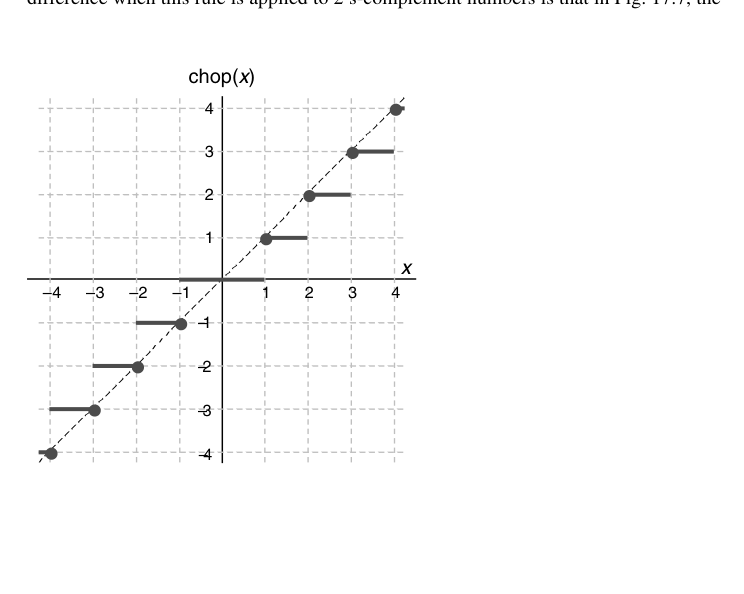
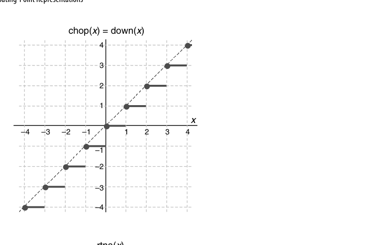
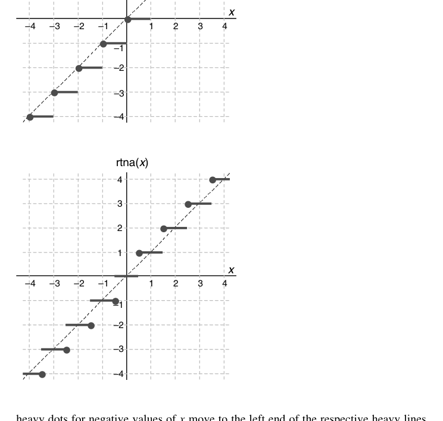
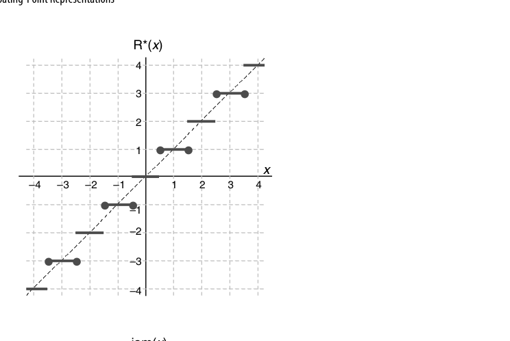
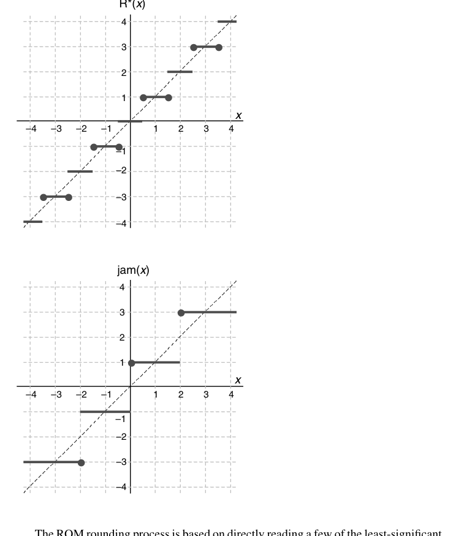
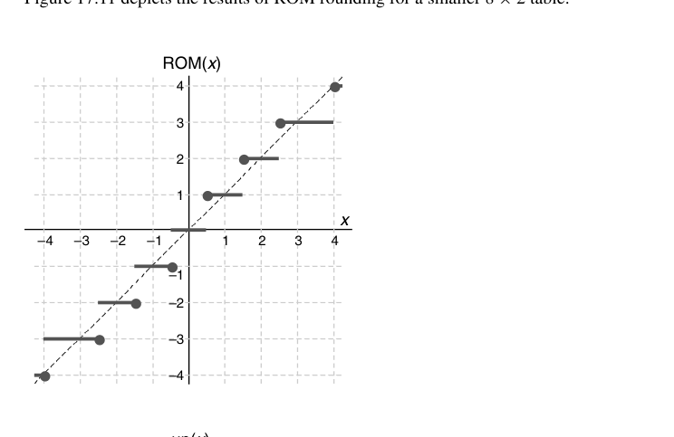
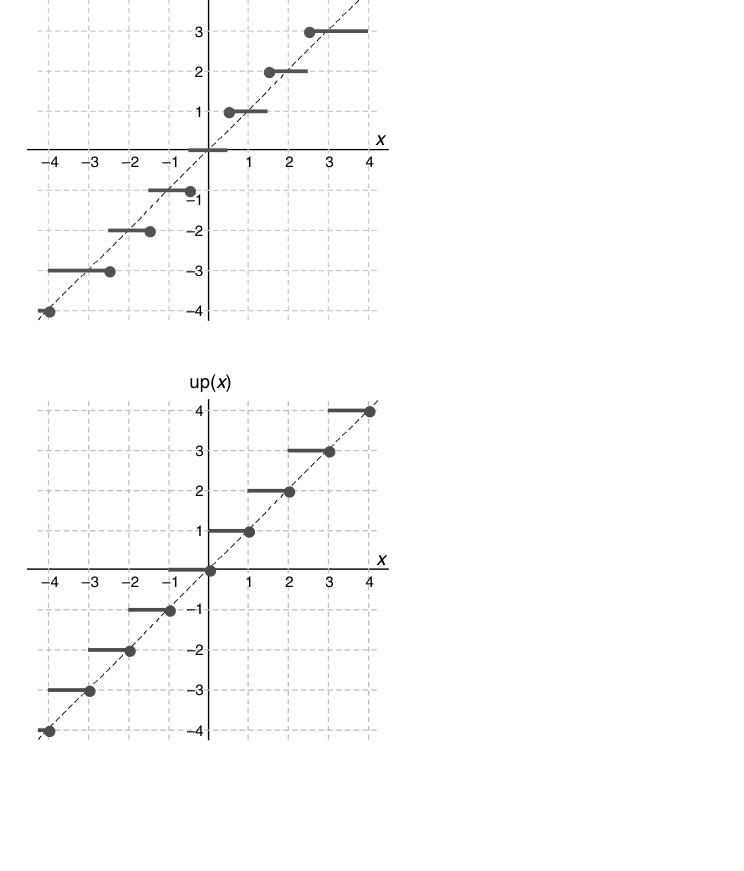
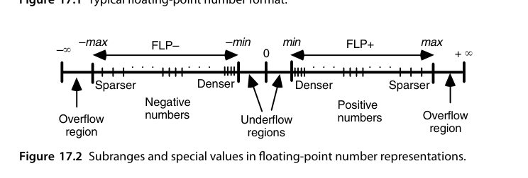
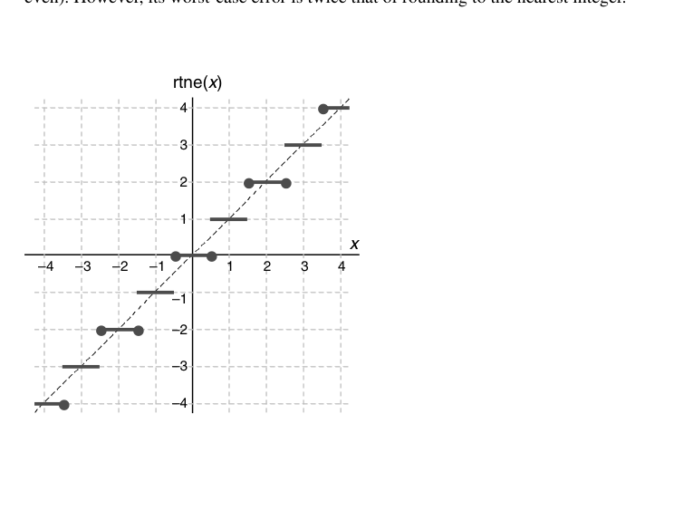

# 第17章 浮点数表示（Floating-Point Representations）

## 本章导读

定点数的表示范围与精度此消彼长，浮点数用"科学计数法"破局：符号 + 阶码 + 尾数，让**表示范围与相对精度解耦**。本章讲浮点表示的基本权衡、IEEE 754 标准的设计决策，以及舍入方案——这些是第 18 章浮点运算与第 19 章误差分析的地基。

抓住一条主线就能串起全章：**浮点数的每个字段都在为"相对精度大致恒定"服务**——尾数决定相对精度，阶码决定这份精度被搬到数轴的哪一段。

## 17.1 浮点数（Floating-Point Numbers)

浮点格式四要素：符号 $s$、基数 $r$、阶码 $e$、有效数/尾数（significand）$m$：

$$
x = (-1)^s \times m \times r^{e}
$$

先看它解决了什么。定点格式把可表示值**等距**排在数轴上，绝对误差处处相同，相对误差却对小数量极其不利：

$$
x = (0000\,0000.\,0000\,1001)_{\text{two}}, \qquad y = (1001\,0000.\,0000\,0000)_{\text{two}}
$$

同样位宽下 $x$ 只有 4 位有效数字而 $y$ 有 8 位，且 $x^2$ 下溢、$y^2$ 上溢。改成浮点后 $x = (1.001)_{\text{two}}\times2^{-5}$、$y = (1.001)_{\text{two}}\times2^{+7}$，两者的**相对**表示误差完全一致。可表示点在小数量处密集、大数量处稀疏，正好对齐"相对精度"的度量方式。

核心权衡（固定总位宽下）：

- **阶码位数多** → 范围大、精度粗；
- **尾数位数多** → 精度细、范围小。

浮点数有两个"符号"值得留意：**数的符号**用单独一位按原码表示；**阶码的符号**不单独编码，而是嵌在偏置码里（2.2 节），偏置取 2 的幂时阶码符号就是最高位的反。偏置码的附带好处是全 0 字自然表示 0，且规格化正浮点数可**当整数直接比大小**。

**基数 $b$ 的取舍**：$b$ 越大，同样阶码位数覆盖的范围越大、指数运算越省事（IBM S/360 用 $b=16$）。代价是**精度抖动（wobbling precision）**：$b=16$ 时规格化尾数前导 0 可能多达 3 位，实际有效位数在标称值上下浮动 0-3 位。现代一律取 $b=2$。

**规格化（normalization）**：规定尾数最高位非零（二进制下首位恒为 1），消除"同一个数多种表示"的歧义，同时白捡 1 位精度（隐藏位 hidden bit）。小数点左边的整数位数 $k$ 也有讲究：$k=0$ 得 $[0,1)$ 的纯小数尾数（传统称 mantissa）；$k=m$ 得整数尾数；IEEE 取 $k=1$，尾数落在 $[1,2)$，整数位恒 1 可隐藏。

## 17.2 IEEE 浮点标准（The IEEE Floating-Point Standard)

IEEE 754 [@ieee754] 的设计决策，每一条都有硬件含义：

| 特性 | 单精度 | 双精度 | 设计意图 |
|---|---|---|---|
| 总位宽 | 32 | 64 | |
| 符号 | 1 | 1 | 原码表示（2.1 节） |
| 阶码（偏置） | 8 位，bias 127 | 11 位，bias 1023 | 偏置码→无符号比较（2.2 节） |
| 尾数 | 23+1 隐藏位 | 52+1 隐藏位 | 规格化白捡 1 位 |

IEEE 754-2008 定义了四种二进制格式：半精度（16 位，5 位阶码 bias 15、10+1 尾数）、单精度、双精度、四精度（128 位，15 位阶码 bias 16383、112+1 尾数）。半精度面向游戏、嵌入式与 AI 推理等能耗敏感场景；四精度服务少数科学计算，并为"中间结果用扩展精度"提供标准归宿。另有 32/64/128 位十进制格式，把三个十进制数字（000-999）压进 10 位而非 BCD 的 12 位。

特殊编码（阶码全 0 / 全 1 的保留用法）：

- **非规格化数（subnormal/denormal）**：阶码全 0，隐藏位变 0——让最小规格数到 0 之间"渐进下溢（gradual underflow）"，避免精度悬崖；
- **Inf**：阶码全 1、尾数 0——溢出的明确表示；
- **NaN**：阶码全 1、尾数非 0——$0/0$、$\infty - \infty$ 等无效运算的结果，且 NaN 参与任何运算仍得 NaN（错误传播不中断）。

::: {.callout-note title="字段拆解示例：$-12.375$ 的单精度编码"}
① $12.375 = (1100.011)_{\text{two}}$；② 规格化得 $(1.100011)_{\text{two}}\times2^{3}$，故 $e=3$；③ 符号位 $=1$；④ 阶码字段 $= e+127 = 130 = (1000\,0010)_{\text{two}}$；⑤ 尾数字段为去掉隐藏 1 后的 `100011` 右补 0 至 23 位。拼接得

`1 10000010 10001100000000000000000` = **0xC1460000**

反验一个：`0x3F800000` → 符号 0、阶码 `01111111`$=127$ → $e=0$、尾数全 0 → $1.0$。

几个常数值得记住：单精度最小规格数 $2^{-126}\approx1.18\times10^{-38}$、最大数 $\approx3.40\times10^{38}$、最小非规格数 $2^{-149}\approx1.4\times10^{-45}$。对 $x\in[1,2)$，$\mathrm{ulp}=2^{-23}\approx1.19\times10^{-7}$，就近舍入的相对误差界为 $2^{-24}\approx5.96\times10^{-8}$——这就是"单精度约 7 位十进制有效数字"的来源。
:::

标准还定义了**扩展格式**（single-extended：阶码 ≥11 位、尾数 ≥32 位；double-extended：阶码 ≥15 位、尾数 ≥64 位）。扩展格式不保证运算达标，价值在于**控制误差传播**：长串求和时把正负项分别累加更准，但小计可能溢出，用扩展格式就能把溢出概率压下去（x86 的 80 位 `long double` 即其实例）。比较规则也进了标准：$\pm0$ 视为同一个数；NaN 与一切（含自身）无序，故 `NaN != NaN` 为真；不同格式的两个数按其**无限精确值**比较。

{fig-align="center" width="85%"}

::: {.callout-important title="为什么 IEEE 754 是伟大的标准"}
它不仅统一了格式，更统一了**语义**：每个运算的结果必须是"无限精确结果按指定模式舍入后的值"（正确舍入）。这让同一程序在任何合规机器上逐比特一致——可移植性与可复现性的基石。非规格化数曾是最具争议的条款（硬件成本），但"渐进下溢"换来的数值稳定性被证明物有所值。
:::

## 17.3 基本浮点算法（Basic Floating-Point Algorithms)

浮点运算的通用流程（第 18 章细化）：

1. **拆解**：分离符号、阶码、尾数，还原隐藏位；
2. **对齐/运算**：加减法先对阶（小阶向大阶对齐，尾数右移），乘除法阶码相加减、尾数相乘除；
3. **规格化**：结果左移/右移恢复"1.xxx"形态，阶码相应调整；
4. **舍入**：按目标格式截断尾数；
5. **异常处理**：溢出→Inf 或最大数，下溢→非规格化或 0，无效→NaN。

每一步都对应真实的硬件模块——第 18 章的浮点加法器/乘法器就是这条流水线的具体化。

加减法的对阶公式（设 $e_1 \ge e_2$）：

$$
\pm s_1 b^{e_1} \pm s_2 b^{e_2} = \left(\pm s_1 \pm \frac{s_2}{b^{\,e_1-e_2}}\right) b^{e_1}
$$

::: {.callout-note title="逐步过程：对阶、加减与规格化"}
**例 1（异阶相加）**：$x = (1.0100)_{\text{two}}\times2^{5}$，$y = (1.1011)_{\text{two}}\times2^{2}$。指数差 $\Delta e = 3$，把 $y$ 的尾数右移 3 位得 $(0.0011011)_{\text{two}}\times2^{5}$；相加得 $(1.0111011)_{\text{two}}\times2^{5}$，已在 $[1,2)$ 无需规格化。同号相加的结果落在 $[1,4)$，至多右移 1 位。

**例 2（有效减法）**：$x = (1.1000)_{\text{two}}\times2^{4} = 24$，$y = (1.0111)_{\text{two}}\times2^{4} = 23$。阶码相同无需对阶，相减得 $(0.0001)_{\text{two}}\times2^{4}$，需**左移 4 位**并阶码 $-4$，结果为 $(1.000)_{\text{two}}\times2^{0}$。

例 2 揭示了浮点加法的难点：有效减法产生的前导 0 长度不可预知，且被移出的低位一旦丢弃，相对误差可任意大（第 19 章的灾难性抵消）——这正是保护位存在的理由。
:::

乘法：尾数相乘、阶码相加；两个 $[1,2)$ 尾数之积落在 $[1,4)$，至多右移 1 位。阶码用偏置码时要"加完再减一个 bias"，单精度下实现技巧是令进位输入为 1（等价于减 128）再把结果 MSB 取反。除法：尾数相除、阶码相减，商落在 $(1/2,2)$ 至多左移 1 位。开方：先把阶码调成偶数（奇数时尾数乘 2、阶码减 1），再用 $\sqrt{s\times b^e} = \sqrt{s}\times b^{e/2}$，且**永不**上溢或下溢。

一个易被忽略的细节：**舍入本身也可能引发再规格化与溢出**——尾数 $(1.111\cdots1)_{\text{two}}$ 进位后变成 $(10.0)_{\text{two}}$，需再右移 1 位并调阶码。概率极低但设计必须覆盖。

## 17.4 转换与异常（Conversions and Exceptions)

- **整数↔浮点**：注意双向精度损失（32 位 int 转单精度可能丢低位；大浮点转 int 可能溢出）；
- **单精度↔双精度**：扩精度无损，缩精度需舍入；
- **十进制↔二进制**：输入输出转换的**正确舍入**曾长期是标准库的 bug 温床（1.5 节的进制转换问题在此重演）。

任何高精度→低精度的转换都必须按当前舍入模式舍入。IEEE 754-2008 规定**五种舍入模式**：就近取偶（rtne，默认）、就近远离零（rtna）、向零（inward）、向 $+\infty$（upward）、向 $-\infty$（downward）。后两种定向舍入是**区间算术**（20.5 节）的硬件钩子：下界向下舍、上界向上舍，才能保证区间真的包住真值。

异常五类：无效操作、除零、溢出、下溢、不精确（inexact）。IEEE 754 默认"置标志 + 给默认值"而非陷入——保证数值程序批量运行不中断。

| 异常 | 典型触发 |
|---|---|
| 无效操作 | $(+\infty)+(-\infty)$、$0\times\infty$、$0/0$、$\sqrt{x}$ 且 $x<0$、无序比较 |
| 除零 | 非零有限数 ÷ 0 |
| 溢出 | 舍入后阶码超出上界 |
| 下溢 | 幅值小于最小规格数（含渐进下溢） |
| 不精确 | 舍入结果与无限精确结果不等 |

特殊值的传播规则也是定死的：普通数 $\div(+\infty) = \pm0$、$(+\infty)\times$普通数 $=\pm\infty$、NaN $+$ 普通数 $=$ NaN。这样异常就能**顺着数据流传到计算末尾**，而不是中途炸掉。

## 17.5 舍入方案（Rounding Schemes)

IEEE 754 的四种舍入模式：

- **就近舍入（round-to-nearest-even，默认）**：最近的可表示值；平局时取末位为偶者——**统计上无偏**，长期累加误差最小；
- **向零（截断）**：硬件最简，但有偏（系统性偏小）；
- **向 $+\infty$ / 向 $-\infty$**：区间算术（20.5 节）的左右护法，用于严格的误差界限。

硬件实现的关键三比特：**保护位（guard）、舍入位（round）、粘位（sticky）**——sticky 是"被移出的所有位的 OR"，有了它才能区分"恰好一半"与"略多于一半"，从而正确执行就近偶舍入。第 18.3 节会看到这哥仨如何驱动舍入逻辑。

舍入要解决的问题很朴素：把 $x_{k-1}\cdots x_0.x_{-1}\cdots x_{-l}$ 变成整数（保留 $l'$ 位小数只是把小数点左右同移 $l'$ 位）。逐个方案看它们的硬件代价与统计偏差。

**截断（chopping）**：它的效果取决于编码——这是最易被忽略的一点。对**原码**数，截断使幅值变小，即**向零舍入**（图 17.5）；对 **2 的补码**数，截断使数值变小，即**向 $-\infty$ 舍入**。

{fig-align="center" width="85%"}

**就近舍入、平局远离零（rtna）**：小数部分 $<1/2$ 舍去，$\ge1/2$ 进位。

{fig-align="center" width="85%"}

rtna 看似公平，其实**有系统性上偏**。保留 2 位小数时四种末位组合的误差为 $00\to0$、$01\to-0.25$、$10\to+0.5$、$11\to+0.25$，等概率下平均 $+0.125$——**不是零**。更麻烦的是实际计算中出现"恰好一半"的概率远高于随机的 $2^{-l}$，偏差会被放大，长链累加时形成可观的漂移（drift）。

**就近取偶（rtne）**把平局按末位奇偶一分为二，于是**统计无偏**；附带好处是结果"更圆"（末位为 0），后续再遇平局的概率下降。它是 IEEE 754-2008 的默认模式。

**$\mathrm{R}^*$ 舍入**：平局时截断并把结果最低位**强制为 1**，等价于"就近取奇"。同样无偏，但结果末位恒为 1、"更不圆"，未被标准采纳。

{fig-align="center" width="85%"}

上述方案最坏都要对 $k$ 个整数位做**完整进位传播**，而舍入总在关键路径末端，开销令人不快。历史上两种"消灭进位传播"的方案都因别的问题没进实践：

- **Jamming（von Neumann 舍入）**：截断后把最低位强制为 1，兼具截断的简洁与舍入的对称性（误差有正有负），但**最坏误差是就近舍入的两倍**（1 ulp 而非 ulp/2）。

{fig-align="center" width="85%"}

- **ROM 舍入**：以"受影响的低位 + 被丢弃部分的最高位"为地址，直接读出舍入后的低位。4 位结果可用 $32\times4$ 的 ROM（地址 $x_3x_2x_1x_0x_{-1}$）：$x_{-1}=0$ 或低位全 1 时输出原值，否则输出原值 $+1$。16 种情形中 15 种与就近舍入一致，仅低位全 1 时误差偏大；完全避开进位传播，代价是额外的表与残余向下偏差。

{fig-align="center" width="85%"}

**定向舍入**：有时需要**强制误差朝某个方向走**——计算上界时偏大无害、偏小则可能使结论失效。为此定义向上与向下两种定向舍入，它们（连同向零）是 IEEE 754-2008 的必备特性。

{fig-align="center" width="85%"}

## 17.6 对数数系（Logarithmic Number Systems, LNS)

另类实数表示：存 $\log_b |x|$ + 符号。乘法/除法/开方变成定点加减/移位（极快），但加法/减法需要查表计算 $\log(1 \pm b^{v-u})$——难运算与易运算完全对调。

形式上，对数数（sign-and-logarithm）就是**尾数字段被删掉、只剩隐藏 1** 的浮点数的极限情形：数由符号 $S_x$ 与定点对数域 $L_x = \log_2|x|$ 组成，对数域必须带小数位，否则只能表示 2 的幂。因 $(0,1)$ 内数的对数为负，对数域要么按 2 的补码解释，要么整体加偏置（等价于把所有数乘一个比例因子）。

LNS 最吸引人的性质是**相对表示误差处处恒定**。设对数域有 $l$ 位小数，就近舍入下 $|\Delta e| \le 2^{-(l+1)}$，而 $x = 2^e$，故

$$
\frac{|x_{\text{fp}} - x|}{x} = 2^{|\Delta e|} - 1 \approx (\ln 2)|\Delta e| \le 0.693 \times 2^{-(l+1)}
$$

这个界与 $x$ 的大小完全无关。对比浮点：相对误差在 $2^{-p}$ 与 $2^{-p+1}$ 之间抖动（$r=16$ 时差 16 倍）。**LNS 用一条平坦的精度曲线换取了加法的困难。**

::: {.callout-note title="12 位 LNS 的编码示例"}
取基 2、对数域 5 位整数 + 6 位小数（2 的补码），指数范围 $[-16, 16-2^{-6}]$，可表示数范围约 $[-2^{16}, 2^{16}]$。位模式 `1 | 10110.001011`：符号位 1 表示负数，对数域 MSB 为 1，取补得 $-(01001.110101)_{\text{two}} = -9.828125$，故该模式表示 $-2^{-9.828125} \approx -0.0011$。

乘除极简（符号 XOR、对数相加减）；加减要用 $\log(x\pm y) = \log x + \log(1\pm y/x)$，其中 $\log(1\pm y/x)$ 只能查表——直接查 $\log$ 与 $\log^{-1}$ 需 $2^{2k}\times k$ 的表，$k$ 超 12 位就不现实（18.6 节的 $\varphi^{\pm}$ 单操作数方案是实用化解法）。
:::

LNS 在特定 DSP 负载（乘法密集、加法少）曾有一波研究热潮；通用计算未能撼动 IEEE 754。它的思想遗产活在 AI 量化里——**log 域量化**（幂次量化）本质上就是一种粗精度 LNS。介于两者之间的还有**半对数数系**：阶码是带 $h$ 位小数的定点数、尾数落在 $[1,1+2^{-h})$，$h=0$ 退化为浮点、$h=k$ 退化为 LNS，构成一条连续光谱。

## 本章小结

- 浮点 = 范围与精度解耦；规格化 + 隐藏位是免费精度。
- IEEE 754 的伟大在于语义统一：正确舍入 + 明确的特殊值与异常。
- 非规格化数实现渐进下溢；NaN 让错误不中断传播。
- 就近偶舍入无偏；guard/round/sticky 三比特是舍入硬件的核心。

## 原书插图

{fig-align="center" width="85%"}

{fig-align="center" width="85%"}
