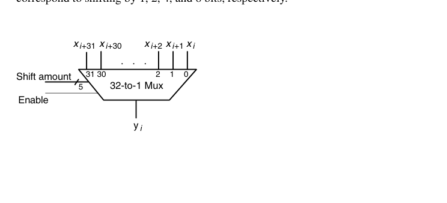
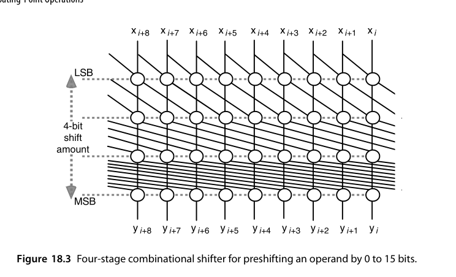
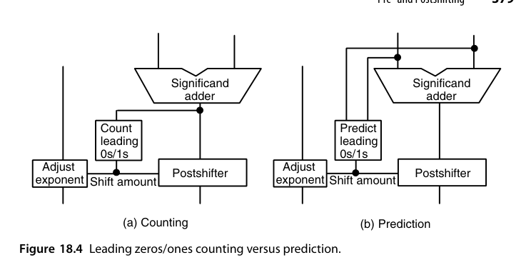
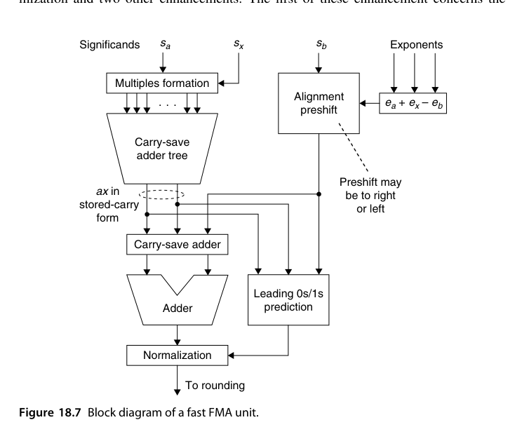
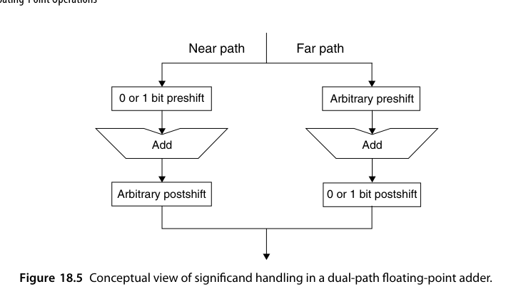
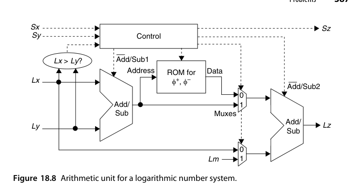
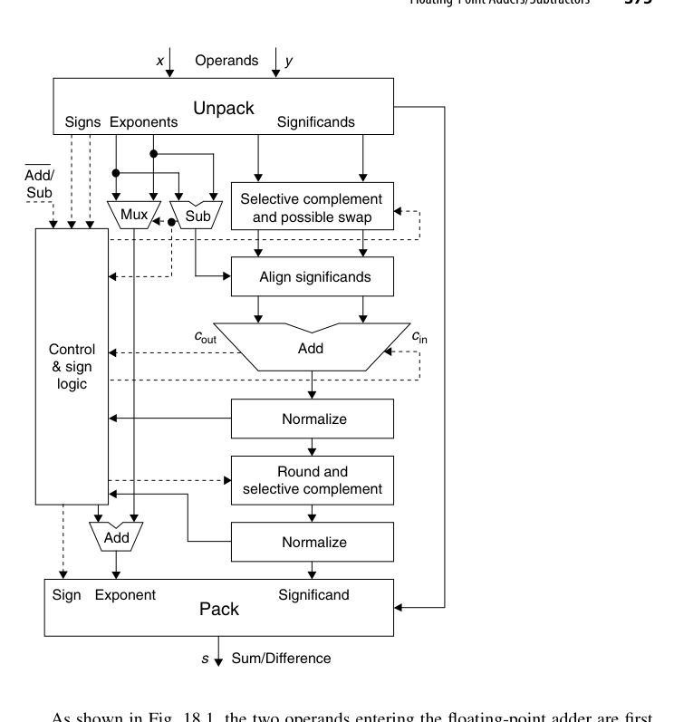
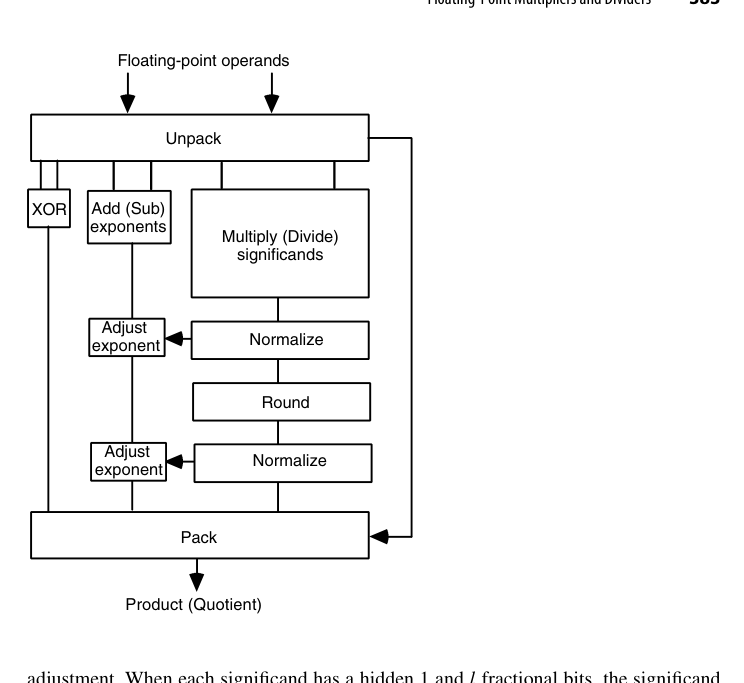

# 第18章 浮点运算（Floating-Point Operations）

## 本章导读

第 17 章讲了浮点"怎么表示"，本章讲"怎么算"。浮点加法器比乘法器更难做（对阶与规格化的两次大移位），FMA 是二者的融合巅峰。这一章是全书前面所有整数技术的"总装车间"：移位器、CLA、压缩树、舍入逻辑在此会师。

读这一章盯住两个主题：**如何把串行步骤并行化或提前做**（指数预计算、前导零预测、双通路）与**如何在不保存全部位的前提下保证正确舍入**（guard/round/sticky）。现代 FPU 的性能差距几乎都来自对这两件事的处理水平。

## 18.1 浮点加减法器（Floating-Point Adders/Subtractors)

浮点加法的完整流程：

1. **指数差对齐**：算 $e_x - e_y$，小阶尾数右移（对齐移位器 alignment shifter）；
2. **尾数加减**：按有效操作（符号⊕操作码）做加或减；
3. **规格化**：结果可能前导零一串（有效减法且指数接近时）→ 前导零计数（LZC）+ 左移；也可能溢出 1 位 → 右移 1 位；
4. **舍入**：用 guard/round/sticky 按模式舍入；
5. **异常**：溢出/下溢/无效处理。

几处省硬件的经典手法：**只给一个操作数配备前移位器**（另一个需要移位时把两者交换）；**只给一个操作数配备求补逻辑**（通常配给不被前移位的那个，缩短关键路径），符号由符号逻辑统一裁决；尾数加法器比输入尾数**宽**（左侧多 1 位容纳符号、右侧多 3 位放 GRS）。IEEE 754 下对齐后的和/差落在 $[0,4)$：落在 $[2,4)$ 则右移 1 位阶码 +1，落在 $[0,1)$ 则可能需任意位左移。左移位数由**前导零/前导一计数器（LZC）**给出，也可在加法进行的同时**预测**（18.2 节），把 LZC 移出关键路径。

::: {.callout-note title="为什么浮点加法比乘法难"}
乘法没有"对阶"（指数直接相加），尾数乘法后只需最多右移 1 位；加法则有**两次不可预知方向的大移位**（对阶右移 + 规格化左移），加上 LZC——关键路径明显更长。这就是 FPU 里加法器往往比乘法器流水级更多的原因。
:::

**双通路（dual-path）优化**：把"指数差大"（对齐主导，规格化最多 1 位）与"指数差小且有效减法"（规格化主导，对齐最多 1 位）拆成 FAR/CLOSE 两条专用通路，每条只做一次大移位——现代浮点加法器标准结构。

{fig-align="center" width="85%"}

一个工程细节：结果为负时要做 2 的补码还原（取反加 ulp），而舍入又可能要加 ulp——两次加法可合并，于是舍入阶段实际只往加法器输出上加 **0、ulp 或 2ulp** 三者之一。

## 18.2 前移位与后移位（Pre- and Postshifting)

- **前移位（对阶）**：右移丢失的低位要收进 sticky——移位器输出带 GRS 三比特；
- **后移位（规格化）**：左移时用保护位补充低位，保持精度；
- 桶形移位器（barrel shifter）是这两处的共同硬件，$k$ 位单拍任意移位——面积大户（$O(k \log k)$ 个 mux），浮点单元的面积相当部分在移位器上。

**移位量可以大幅简化**：单精度下指数差理论上可达 253，但尾数加法器只有几十位——若加法器 32 位宽，任何 $\ge32$ 位的右移都把操作数变成 0（只留 sticky）。于是只需算指数差的**低 5 位**，差 $\ge32$ 时强制输出 0。

移位器有两种极端实现：单级是每位输出一个 32 选 1 mux（图 18.2），扇入扇出问题严重；多级则把移位量按二进制分解，每级做"移或不移 $2^j$"的 2 选 1 mux，$k$ 位任意移位只需 $\log_2 k$ 级。

{fig-align="center" width="85%"}

工程上常取折中：0-31 位移位分两级，第一级由移位量低 3 位控制做 0-7 位移，第二级由高 2 位控制做 0/8/16/24 位移。指数差为负时，可求补、可用 ROM 直译，也可把 $e_1-e_2$ 与 $e_2-e_1$ 都算出来再选正的那个——只需算少数几位，复制一个减法器几乎不花钱。

后移位器与前移位器的差别只有一点：要能做"右移 0-1 位"**或**"左移 0-31 位"。把加法器输出写成 $z = (c_{out}z_1z_0.z_{-1}z_{-2}\cdots)_{\text{2's-compl}}$，需右移规格化的条件是 $c_{out}\ne z_1$；若 $c_{out}=z_1$，左移位数等于从 $z_0$ 开始与 $z_1$ 相同的连续位数。

{fig-align="center" width="85%"}

**预测法**借用第 5.6 节的进位记号：异号相加（只有这时才需左移规格化）时，若恰有 $i$ 个位置从 0 开始传播进位（$p_0=\cdots=p_{-i+1}=1$、$p_{-i}=0$），则沿 $g$ 串或 $a$ 串找到第一个断点 $j$，前导 0（或 1）的个数就是 $j$ 或 $j-1$，由第 $j$ 位的进位输出二选一。$g,p,a$ 与进位信号可直接从尾数加法器内部取出，故额外硬件不多；电路上第一级类似 CLA（本质可写成并行前缀计算），第二级是优先编码器。

## 18.3 舍入与异常（Rounding and Exceptions)

舍入逻辑的真值输入：结果的 LSB、G、R、S 四比特 + 舍入模式。就近偶舍入规则：

- $R=0$：不进位（舍去部分不足一半）；
- $R=1, S=1$：进位（超过一半）；
- $R=1, S=0$（恰好一半）：LSB=1 才进位（向偶收敛）。

为什么**三个额外位就够**？因为两件互补的事实：对阶右移**恰好 1 位**时 G 保存被移出的那一位，精度毫无损失；右移 **2 位及以上**时被移操作数幅值 $<1/2$，与未被移的 $[1,2)$ 操作数之差落在 $[1/2,2)$，**规格化左移至多 1 位**，G 仍足以保护精度。故加法器右侧只需加宽 3 位，输出写成 $(c_{out}z_1z_0.z_{-1}\cdots z_{-l}\,G\,R\,S)_{\text{2's-compl}}$，其中 $S$ 是"所有经过它的位的逻辑 OR"——例如右移 7 位时，G 存第 1 个移出位、R 存第 2 个，S 是后 5 位的 OR。这个 OR 可顺手做在移位器里，几乎不花钱。

::: {.callout-note title="GRS 与规格化移位的联动"}
规格化右移 1 位时新的 $S \leftarrow R\lor S$；左移 1 位时右侧补 0。多位左移时粘位必然为 0，因此**无需舍入**——精度完整保留，这正是双通路设计中 CLOSE 通路"甚至可以不做舍入"的根据。

最终对正的规格化结果 $Z$ 做就近偶舍入：若 $Z_{-l-1}=0$（不足一半），或 $Z_{-l}=Z_{-l-2}=Z_{-l-3}=0$（恰好一半且末位为偶），则原样截断；否则加 $\mathrm{ulp}=2^{-l}$。
:::

舍入后可能再次溢出（1.111…1 进成 10.0），需"舍入后再规格化"——设计时通常把这一步与规格化合拍（预测 + 修正）。上溢只可能伴随右移规格化发生，下溢只可能伴随左移规格化发生，都由指数调整加法器检出；零结果的检测则是 LZC 的副产品。

## 18.4 浮点乘法器与除法器（Floating-Point Multipliers and Dividers)

**乘法器**：指数相加（减偏置）+ 尾数相乘（第 9-11 章全套技术：Booth + 压缩树 + CPA）+ 规格化（最多 1 位）+ 舍入。特殊值旁路：$0 \times \infty = \text{NaN}$ 等。

与加法不同：两个 $[1,2)$ 尾数之积落在 $[1,4)$，至多右移 1 位，故**指数可预计算两个候选值**等结果明了后二选一；尾数乘法是全流程最慢的一段，其余计算有充裕时间"偷跑"；且**不需要 guard 位**——乘积的小数点位置确定，被丢弃部分从固定位置开始，只需 round + sticky 即可正确舍入（加法因左移规格化会把 GRS 拉进结果才需要 G）。多数乘法器先算出积的低位，而是否右移规格化要到末尾才知，于是可并行准备"右移版"与"不右移版"两个舍入结果最后二选一。

**除法器**：指数相减 + 尾数相除（第 13-16 章：SRT 或收敛法）+ 舍入。除法延迟通常是乘法的 3-10 倍，是 FPU 的吞吐短板——很多流水线设计让除法器独立非流水，容忍它的长延迟。

除法与乘法在舍入上的关键差异：商的尾数落在 $(1/2,2)$，可能要**左移** 1 位，故商必须多产生 2 位作为 guard 与 round 位。若用产生余数的数字递归方案，sticky 位可直接由**最终余数是否为零**推出；若用收敛法（第 16 章）则**没有余数可用**，正确舍入只能靠多算保护位 + 符号判定——这是收敛除法落地时最头疼的一环。由于乘除结构高度相似（图 18.6 是共用框图），用收敛法实现除法时把浮点乘法器改造成乘除一体单元几乎不需要额外硬件。

## 18.5 乘加融合单元（Fused Multiply-Add Units, FMA）

$a \times b + c$ **单次舍入**完成（对比"乘后加"两次舍入）：

- **精度优势**：乘积不被截断就参与加法，消除中间舍入误差；
- **结构要点**：$c$ 的尾数需与 $2k$ 位乘积对阶（移位范围大），加法器宽 $3k$ 级别，压缩树里 $c$ 只是"免费多来的一行"（12.6 节的思想在浮点的落地）；
- **生态影响**：FMA 是现代指令集（AVX-512、ARM NEON、GPU）的浮点原子，峰值算力 = 核心数 × 频率 × FMA 数 × 2。数值算法（点积、多项式求值、Newton 迭代）因 FMA 重写而更快更准。

FMA 值得单做硬件，是因为它命中两类最常见的序列：多项式求值（Horner 法 $s \leftarrow sz + c^{(j)}$）与向量点积（$s \leftarrow s + u^{(j)}v^{(j)}$）。朴素实现是"保留双倍宽乘积的乘法器 + 双倍宽加法器"级联，延迟过长。融合结构有三处改进：

1. **乘积保持存储进位形式**，省掉乘法末尾的进位传播；随后的加法变成三操作数加（一层 CSA + 一次快速加法）；
2. **对阶前移固定施加在 $b$ 上**，方向可左可右。移位后的 $b$ 取三倍字宽即可：右移超 $k$ 位的部分压进 sticky，左移超 $k$ 位则乘积极小、只通过舍入影响结果；
3. **三输入前导零预测**（乘积的存储进位形式 + 移位后的 $b$），比两输入略慢但仍快于进位传播加法，且前面多一层 CSA，时间预算更宽松。

{fig-align="center" width="85%"}

{fig-align="center" width="85%"}

优化后 FMA 的延迟与普通浮点乘法器相当，于是**可以干脆不设独立的加法器与乘法器**：令 $x=1$ 就是加法，令 $b=0$ 就是乘法。

## 18.6 对数运算单元（Logarithmic Arithmetic Unit)

LNS（17.6 节）的运算单元：乘除是定点加减（廉价），加减要算 $\log(1 \pm b^{\Delta})$——通过查表 + 插值实现（第 24 章技术）。单元结构因此与浮点完全对偶：**简单运算便宜、复杂运算靠表**。在乘法密集的专用负载中曾有原型芯片验证了可行性与能效优势。

关键的一步化简是**把二元运算变成一元运算**。设 $x > y > 0$，则

$$
L_z = \log(x \pm y) = \log x + \log\big(1 \pm y/x\big)
$$

其中 $\log x$ 已知，$\Delta = \log(y/x) = -(\log x - \log y) \le 0$ 由一次减法得到。于是只需两张**单操作数**表 $\varphi^{+}(\Delta) = \log(1+\log^{-1}\Delta)$ 与 $\varphi^{-}(\Delta) = \log(1-\log^{-1}\Delta)$，加减法即 $\log(x\pm y) = \log x + \varphi^{\pm}(\Delta)$。表规模从 $2^{2k}\times k$ 降到 $2^k\times k$，这才使 LNS 实用化。

{fig-align="center" width="85%"}

单元先比较 $L_x$ 与 $L_y$ 决定谁大，控制逻辑据此解释差值符号与结果符号。若所有值都乘了比例因子 $m$（使小于 1 的数也能用无符号对数表示），乘法要减去 $L_m$、除法要加回、加减法则由第二个加减器把 $L_x$ 与查表值相加。整个单元就是"两个加减器 + 两张 ROM + 少量控制"——硬件重心从移位器转移到了表。

## RTL 实践：`rtl/ch18_4_fp_multiplier`

简化 IEEE-754 binary32 浮点乘法器（教学版），覆盖 18.4 节核心流程：

```systemverilog
wire [47:0] mprod = ma * mb;                    // 24x24 尾数相乘
wire        norm_shift = mprod[47];             // 乘积落在 [1,4) 的哪一半
wire        guard  = mnorm[23];                 // RNE 三比特
wire        round  = mnorm[22];
wire        sticky = |mnorm[21:0];
wire        round_up = guard & (round | sticky | mnorm[24]);  // 平局看 LSB 奇偶
```

设计要点：

- **隐藏位还原**：`{1'b1, a[22:0]}`——规格化数的隐藏 1 必须先补回再运算；
- **二次规格化**：尾数乘积可能落在 $[2,4)$，需右移一位并阶码 +1；舍入进位还可能再次触发这一修正（`re_norm`）；
- **就近偶舍入**：`round_up = guard & (round | sticky | lsb)`——平局时看结果末位奇偶，这是 IEEE 754 无偏性的硬件表达；
- 教学简化：仅处理规格化数与 ±0；上溢饱和到最大规格数、下溢刷零，未实现非规格化数/Inf/NaN（这些正是工业 FPU 验证的大头）；
- testbench 的 14 个定向用例覆盖符号组合、RNE 平局取偶、sticky 向下、上溢饱和、下溢刷零。

```bash
cd rtl/ch18_4_fp_multiplier
bash run_iverilog.sh    # 或 bash run_verilator.sh
```

## 本章小结

- 浮点加法的难点是两次大移位；双通路（FAR/CLOSE）是标准解。
- 舍入四比特（LSB, G, R, S）+ 模式 → 舍入决策；舍入后可能需再规格化。
- 乘法复用整数乘法全套技术；除法用 SRT/收敛法，是 FPU 短板。
- FMA 单次舍入，精度与吞吐双赢，现代算力的原子单位。

## 原书插图

{fig-align="center" width="85%"}

{fig-align="center" width="85%"}
