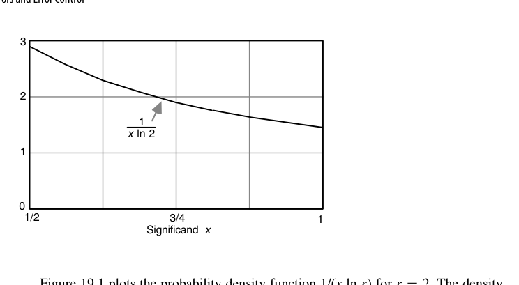

# 第19章 误差与误差控制（Errors and Error Control）

## 本章导读

有限精度算术的本质是**每次运算都在制造微小误差**。本章建立误差的词汇表（绝对/相对误差、ulp）、打破代数直觉（浮点世界里结合律失效）、给出误差累积的分析框架（最坏情况 vs. 统计期望、前向/后向分析）。这是连接"硬件实现"与"数值算法可信度"的桥梁章节。

一句话概括本章的方法论：**表示误差与运算误差都可以被界定，但"相减"会把它们放大到无法界定**。后面所有的分析技巧（保护位、重排公式、补偿求和、前/后向分析），本质上都是在与"相减"这件事周旋。

## 19.1 计算误差的来源（Sources of Computational Errors)

误差四源头：

1. **表示误差**：$\pi$、0.1 这类数一开始就无法精确表示（1.5 节的进制转换问题）；
2. **运算舍入**：每次浮点运算结果要舍回有限位宽——相对误差不超过半个 ulp（就近舍入下 $\le 2^{-24}$ 单精度）；
3. **算法截断**：迭代法、级数截断引入的方法误差（与硬件无关，但与舍入误差竞争预算）；
4. **输入扰动**：测量/传感数据的固有不确定度。

**ulp（unit in the last place）**：最低位权重，是度量一切浮点误差的基本尺子。"误差在 0.5 ulp 内"即正确舍入的定义。注意 ulp 是**相对的**：单精度下 $x\in[1,2)$ 时 $\mathrm{ulp}=2^{-23}$，而 $x\in[1024,2048)$ 时 $\mathrm{ulp}=2^{-13}$——真正可比的是**相对误差** $\eta = (x_{\text{fp}}-x)/x$。

形式化地，浮点系统由基数 $r$、精度 $p$ 与近似方案 $A$ 刻画，记作 $\mathrm{FLP}(r,p,A)$，其中 $A\in\{\text{chop},\text{round},\text{rtne},\text{chop}(g),\ldots\}$，$g$ 为中间结果保留的保护数字个数。规格化使 $1/r \le s < 1$ 时 $x_{\text{fp}} = (1+\eta)x$，且

$$
A=\text{chop}:\ -r\cdot\mathrm{ulp} < \eta \le 0, \qquad
A=\text{round}:\ |\eta| \le \frac{r\cdot\mathrm{ulp}}{2}, \qquad \mathrm{ulp} = r^{-p}
$$

**最坏相对表示误差随基数 $r$ 线性增长**。$\mathrm{FLP}(r{=}16,p{=}6,\text{chop})$ 的 $|\eta|\le 16^{-5}=2^{-20}$，占用 24 位二进制尾数；要在 $\mathrm{FLP}(r{=}2,p,\text{chop})$ 下达同样界限需 $p=21$——**同样的 24 位，十六进制最坏少约 3 位有效精度**，这就是"精度抖动"的量化表达。

运算误差怎么传播？设操作数的相对表示误差为 $\sigma$、$\tau$，忽略二阶小量后有

$$
x_{\text{fp}}\times_{\text{fp}} y_{\text{fp}} \approx (1+\eta+\sigma+\tau)xy, \qquad
x_{\text{fp}}/_{\text{fp}} y_{\text{fp}} \approx (1+\eta+\sigma-\tau)\frac{x}{y}
$$

即**乘除中相对误差相加**，非常温和；加法的最坏相对误差也不超过 $|\eta|+\max(|\sigma|,|\tau|)$。**减法才是真麻烦**：

$$
x_{\text{fp}} -_{\text{fp}} y_{\text{fp}} = (1+\eta)\left(1 + \frac{\sigma x - \tau y}{x-y}\right)(x-y)
$$

$x$、$y$ 大而 $x-y$ 小时，$\frac{\sigma x-\tau y}{x-y}$ 可任意大——**同号相减的相对误差没有上界**，这就是抵消（cancellation）/有效位丢失。

由 $\eta$ 引起的那部分可用保护位治好：

> **定理 19.1**：$\mathrm{FLP}(r,p,\text{chop}(g))$ 中 $g\ge1$ 时 $x+_{\text{fp}}y = (1+\eta)(x+y)$，且 $-r^{-p+1}<\eta<r^{-p-g+2}$。
> **推论**：$\mathrm{FLP}(r,p,\text{chop}(1))$ 中 $|\eta| < r^{-p+1}$——**一个保护位就足以让加减法的运算误差降到与表示误差同量级**。

以十进制 $\mathrm{FLP}(10,6)$ 为例：$x=-0.100000000\times10^3$、$y=-0.999999456\times10^2$，真值 $x+y = 0.544\times10^{-4}$，无保护位算出 $.100000\times10^{-2}$，**相对误差约 17.38（结果偏大 1638% ）**；加一个保护位后得 $.100000\times10^{-3}$，相对误差降到 80.5%——虽然仍大，但要害在于**相对于给定的两个操作数，这个结果是精确的**，误差已全部归咎于输入而非算法。

## 19.2 失效的代数定律（Invalidated Laws of Algebra)

浮点世界里的"法律变更"：

- **结合律失效**：$(a+b)+c \ne a+(b+c)$——大数先加会吞掉小数（吸收现象）；
- **分配律失效**：$a(b+c) \ne ab + ac$ 逐比特意义下不成立；
- **消去律失效**：$a + c = b + c \nRightarrow a = b$；
- **灾难性抵消（catastrophic cancellation）**：两个相近数相减，高位全消，剩下的是**误差被放大到主位**——相对误差爆炸的头号元凶。

取 $a = 0.12341\times10^5$、$b = -0.12340\times10^5$、$c = 0.14321\times10^1$（五位十进制尾数）：$a+_{\text{fp}}(b+_{\text{fp}}c) = 0.20000\times10^1$，而 $(a+_{\text{fp}}b)+_{\text{fp}}c = 0.24321\times10^1$——**相差约 20%**。后果是实实在在的：优化编译器若为打散数据相关而重排浮点表达式，就可能改变程序结果，因此多数语言默认禁止（除非打开 `-ffast-math` 之类开关）。

有意思的解药是**不规格化算术**：中间结果不做规格化左移。重算上例，两种顺序都得 $0.00002\times10^5$——不仅一致，而且结果的**前导零个数本身就是精度告警**，明说只剩一位有效数字；相比之下 $0.24321\times10^1$ 装出五位精度，其实五位都不靠谱。

::: {.callout-warning title="工程守则"}
- 求和从**小到大**加（减小吸收）；大量数求和用 **Kahan 补偿求和**（误差从 $O(n)$ 降到 $O(1)$）；
- 公式变形避开相近数相减：$1 - \cos x$ 在 $x$ 小时改写为 $2\sin^2(x/2)$；
- 二次方程求根用 $|q|$ 大的根先算，另一个用韦达定理 $x_1 x_2 = c/a$ 推——教科书级避险动作。
:::

三条"变形避险"有共同数学动机：把"相近数相减"改写成"相近数相加或相乘"。$1-\cos x$ 中 $\cos x$ 的舍入误差被 $x^2$ 这个极小的分母放大成主误差，改写后减法消失；扁三角形的海伦公式同理。

## 19.3 最坏情况误差累积（Worst-Case Error Accumulation)

$n$ 次运算的误差界：每次乘加引入相对误差 $\le \epsilon$（机器精度），最坏情况误差约 $n\epsilon$ 级别。链越长，界越松——**最坏情况分析保证可信但过于悲观**，它给出的是"绝不会更差"的保险单，不是"典型表现"。量化地说：最坏绝对误差为 $m\,\mathrm{ulp}$ 等价于**损失 $\log_2 m$ 位精度**。

以 1024 项内积 $z=\sum x^{(i)}y^{(i)}$ 为例：每次乘加引入 $\mathrm{ulp}/2+\mathrm{ulp}/2 = \mathrm{ulp}$，累积 **1024 ulp 即损失 10 位**，24 位单精度算完只剩 14 位可信。改用 FMA（末尾只舍入一次）每步误差降到 $\mathrm{ulp}/2$，总界 512 ulp——只挽回 1 位。

真正有效的办法是**保留双倍宽乘积**：乘法完全不引入舍入误差，每次加法引入至多 $\mathrm{ulp}^2/2$，总界 $n\times\mathrm{ulp}^2/2$；只要 $n < r^p = 1/\mathrm{ulp}$，最终误差就在 ulp 以内。这就是 DSP 普遍内置高精度内积单元、IEEE 定义扩展格式的理由。

**Kahan 补偿求和**是软件侧的标准解法：把每次加法中被吸收掉的部分记进补偿项 $c$，下一轮先减回去——$y \leftarrow x^{(i)}-c$；$z \leftarrow s+y$；$c \leftarrow (z-s)-y$；$s \leftarrow z$。误差从 $O(n)\,\mathrm{ulp}$ 降到 $O(1)\,\mathrm{ulp}$，代价只是每步多两次加减。

累积误差的另一面是**步数本身的矛盾**：数值积分中步长越小离散化误差越小，但步数越多舍入误差累积越大——于是存在使总误差最小的最优步长。这类"两头堵"的权衡在数值方法中反复出现。

## 19.4 误差分布与期望误差（Error Distribution and Expected Errors)

把舍入误差建模为随机变量（均匀分布、零均值——就近偶舍入的无偏性在此关键），$n$ 次运算的误差按 $\sqrt{n}\,\epsilon$ 增长（随机游走），而非 $n\epsilon$。这解释了实践中"结果通常比最坏界好得多"的现象——但**赌统计期望的算法在对抗性输入下会现原形**（滤波器自激、迭代发散）。

最坏相对表示误差（MRRE）为 $\mathrm{MRRE}(\text{chop}) = r^{-p+1}$、$\mathrm{MRRE}(\text{round}) = r^{-p+1}/2$。平均相对表示误差（ARRE）则是

$$
\mathrm{ARRE}(\mathrm{FLP}(r,p,A)) = \int_{1/r}^{1} \frac{|x_{\text{fp}}-x|}{x}\cdot\frac{dx}{x\ln r}
$$

其中 $\frac{1}{x\ln r}$ 是规格化尾数的概率密度（对数分布律）：尾数落在 $[x,x+dx]$ 的概率为 $dx/(x\ln r)$——**小尾数比大尾数更可能出现**。对 $r=2$（尾数在 $[1/2,1)$），密度从 $x=1/2$ 处的 $2/\ln2\approx2.885$ 降到 $x=1$ 处的 $1/\ln2\approx1.443$（图 19.1）；积分得尾数落在 $[1/2,3/4)$ 的概率为 $\ln(1.5)/\ln2\approx0.585$——**近六成的数尾数首位是 0**。这是本福特定律在浮点尾数上的近亲。

代入后得 $\mathrm{ARRE}(\text{chop}) \approx \frac{(r-1)r^{-p}}{2\ln r}$、$\mathrm{ARRE}(\text{round}) \approx \frac{(r-1)r^{-p}}{4\ln r}\left(1+\frac1r\right)$。更严格的分布分析显示相对误差在小端**均匀**、大端呈**倒数分布**（$\propto 1/z$），$r=2$ 时两者之比为

$$
\frac{\mathrm{ARRE}(\text{round})}{\mathrm{ARRE}(\text{chop})} = \frac{3}{4}
$$

注意这个数字：最坏情况比与粗略估计都是 $1/2$，但严格的平均值之比是 $3/4$——大误差端那条长尾把平均拉高了。**舍入的实际优势没有最坏情况分析暗示的那么大。**

## 19.5 前向误差分析（Forward Error Analysis)

沿计算图正向追踪："输入误差 δ 经过这个运算后变成多少？"每个节点的误差 = 传递误差 + 本地新生误差。工具：条件数（condition number）——$\kappa = |x f'(x) / f(x)|$ 衡量问题本身对输入扰动的放大倍数。

对 $y = ax+b$，前向分析要估计 $\eta$ 使 $y_{\text{fp}} = (1+\eta)y$。一般情形下**这个界不存在**：若 $a_{\text{fp}}x_{\text{fp}}$ 与 $b_{\text{fp}}$ 幅值相当、符号相反，最后那次加法会出现抵消，结果对输入的微小扰动极度敏感（19.1 节的例子正是如此）。只有对输入范围施加约束后界才可能存在。

实践中有四种前向分析手段：**自动误差分析**（用更高精度重跑同一批用例比较结果，只能给"大概安全"，无任何保证）；**有效位算术**（不规格化中间结果，让前导零当精度告警）；**噪声模式计算**（规格化左移时填入随机数字而非 0，多次运行结果一致则说明抵消不严重）；**区间算术**（每个数带区间走完全程，20.5 节详述）。

::: {.callout-note title="解读"}
**条件数是问题的属性，与算法无关**——病态问题（$\kappa$ 大）任何算法都救不了（如 Hilbert 矩阵求逆，$f(x)=\ln x$ 在 $x\to1$ 时 $\kappa = 1/|\ln x|$ 爆炸）；良态问题配不稳定算法才会出错。前向分析告诉你"这个算法在这个问题上误差多大"。
:::

## 19.6 后向误差分析（Backward Error Analysis)

Wilkinson 的天才转身：不问"结果差多少"，改问"**这个结果是对哪个扰动后的输入的精确解**"。若答案所需扰动与输入固有误差同阶，则算法**后向稳定**——结果不可指责，误差归罪于问题本身。

把 $y_{\text{fp}} = (a_{\text{fp}}\times_{\text{fp}}x_{\text{fp}}) +_{\text{fp}} b_{\text{fp}}$ 拆开（$\mu$、$\nu$ 为加乘两级的运算误差，模均 $< r^{-p+1} = r\times\mathrm{ulp}$；$\sigma,\delta,\gamma$ 为输入的表示误差）：

$$
y_{\text{fp}} = (1+\mu)\big[(1+\nu)a_{\text{fp}}x_{\text{fp}} + b_{\text{fp}}\big]
\approx (1+\sigma+\mu)a\cdot(1+\delta+\nu)x + (1+\gamma+\mu)b
$$

读作：**浮点算出的结果，等于把 $a$、$b$、$x$ 各自扰动 $r\times\mathrm{ulp}$ 之后精确算出的结果**。于是可以向用户保证——运算误差的后果不超过"每个输入多带 $r\times\mathrm{ulp}$ 相对误差"的后果；若输入本身的精度还不如这个量级，就完全不必为运算误差操心。

一般化地说：给定 $y_{\text{fp}} = f_{\text{fp}}(x^{(1)}_{\text{fp}},\ldots,x^{(n)}_{\text{fp}})$，后向分析要找的是使 $y_{\text{fp}} = f(x^{(1)}_{\text{alt}},\ldots,x^{(n)}_{\text{alt}})$ **精确成立**的那组扰动输入，并刻画它与 $x^{(i)}_{\text{fp}}$ 的距离。

高斯消元法配部分主元的后向误差分析是数值分析史上最漂亮的成果之一；FFT 的出色精度（误差 $O(\log n)\epsilon$ 而非 $O(n)\epsilon$）也只能用后向/结构化分析解释。另一个经典结论：Horner 法求多项式值在后向意义下等价于"系数各带一个 $(1+\eta^{(i)})$ 扰动的精确多项式"——**Horner 法是后向稳定的**，这才解释了它为何在实践中远比前向误差界暗示的准确。

## 本章小结

- ulp 是浮点误差的基本单位；正确舍入 = 误差 ≤ 0.5 ulp。
- 结合律失效与灾难性抵消是数值 bug 的两大温床。
- 最坏 $n\epsilon$ vs. 期望 $\sqrt{n}\epsilon$：保险单与天气预报的区别。
- 前向看算法×问题，后向看"等价扰动"；条件数是问题的固有属性。

## 原书插图

{fig-align="center" width="85%"}
