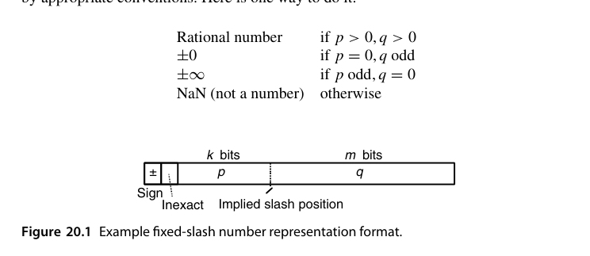
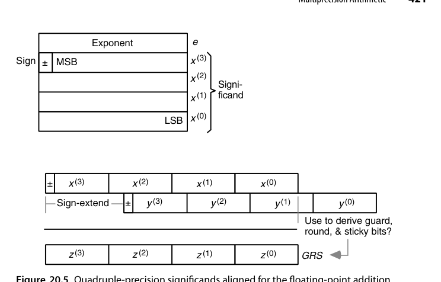
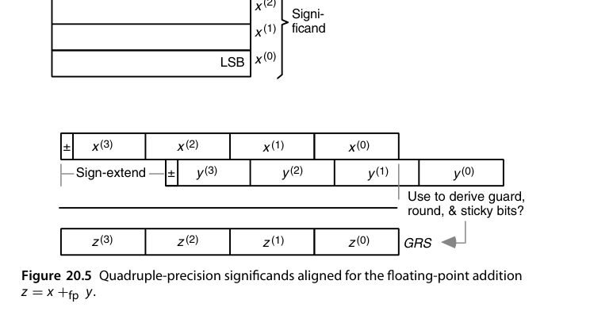
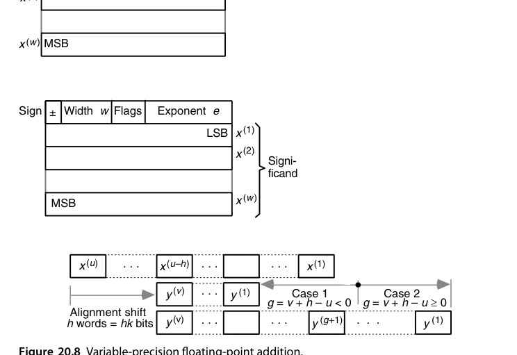
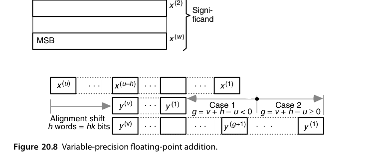
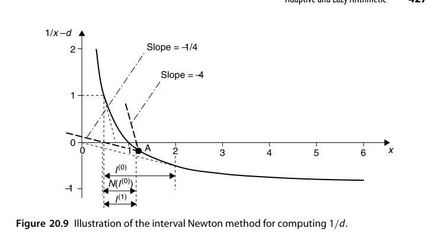
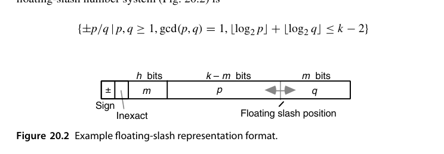
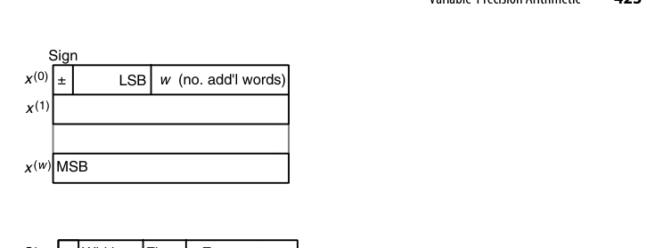

# 第20章 精确与可证算术（Precise and Certifiable Arithmetic）

## 本章导读

第 19 章教会我们"误差有多大"，本章回答"能不能**没有**误差，或者误差**有铁证**"。四条路线：精确算术（有理数/代数数）、多精度（软件拼大位宽）、可变精度（按需伸长）、区间算术（每个数都带着误差界走）。它们是计算机代数、形式化数学、高可信计算的硬件基础。

贯穿全章的判断标准是"**可信度 gap**"：结果可能有足够精度，但我们不知道该相信几位。三条应对路线各有代价——精确算术彻底消除怀疑但位宽会爆；多精度把怀疑压到极小却不给保证；区间算术给出铁证却可能把界放得太宽。

## 20.1 高精度与可证性（High Precision and Certifiability)

两个不同的目标：

- **高精度（high precision）**：结果的有效位数远超常规格式——天文轨道、常数计算（$\pi$ 的上万亿位）；
- **可证性（certifiability）**：结果附带**可机器检查的误差界**——"答案在 $[a, b]$ 区间内"是数学陈述而非统计估计。

高精度不自动等于可信（长链计算误差可能累积吞掉精度），可证性要求全程误差受控——这正是区间算术的价值。

缩小可信度 gap 的三条路线对应本章三节：① **精确算术**（20.2 节）彻底精确，怀疑归零——若它总是可行且划算，后两条都不必存在；② **多精度/可变精度**（20.3、20.4 节）静态或动态增加位宽，把"结果离谱"的概率压到很低，提供的是**概率意义上的保证**而非数学保证；③ **误差跟踪**（20.5 节）用普通或高精度算术算，同时跟踪误差累积，最终按误差界**认证**或发出告警使系统进入失效安全（fail-safe）模式。

除了精度，**范围**也会成为瓶颈。常见做法是让表示本身可动态伸长：数通常占一个字，但留 1-2 位作标记，允许它延伸到后续字里；代价是损失这几位 + 每次运算都要检查是否需要伸长。

::: {.callout-warning title="可证性不只是算术的事"}
可证性涵盖三个层面：算术精度、算法与硬件的正确性验证、故障检测与容错。现代系统的复杂度让"事后抓虫"几乎没有希望——并行、流水、节能机制的相互作用使验证空间爆炸。**Pentium 浮点除法缺陷**就是最好的注脚：一个查表项错误，代价是数亿美元与整个行业的信任。
:::

## 20.2 精确算术（Exact Arithmetic)

**连分数（continued fraction）**是精确表示有理数的优雅路线：任何非负有理数有唯一展开，生成过程是反复写 $s^{(i)} = \lfloor s^{(i)}\rfloor + 1/s^{(i+1)}$。以 $277/642$ 为例得 $s^{(1)}=642/277$、$s^{(2)}=277/88$、$s^{(3)}=88/13$、$s^{(4)}=13/10$、$s^{(5)}=10/3$、$s^{(6)}=3$，故 $277/642 = [0/2/3/6/1/3/3]$。截断即得"最佳有理逼近"序列：

$$
[0]=0,\ [0/2]=\tfrac12,\ [0/2/3]=\tfrac37,\ [0/2/3/6]=\tfrac{19}{44},\ [0/2/3/6/1]=\tfrac{22}{51},\ [0/2/3/6/1/3]=\tfrac{85}{197}
$$

Vuillemin 提出用"有限位数字 + 一个续延"做精确实数的惰性表示，正如十进制里把 $8/3$ 写成 $(2.66;\,6)$、$1/7$ 写成 $(0.1;\,428571)$。几个漂亮的例子：黄金比 $=[;\,1]$、$\sqrt2 = [1;\,2]$、$e = [2;\,1/2i+2/1]$。可惜连分数上的四则运算相当复杂，这条路没有走通。

**有理数算术**：分子分母各自为任意精度整数，四则运算完全精确。代价：

- 位宽随运算链**爆炸式增长**（分数相加分子分母交叉相乘）；
- 周期性约分（GCD）成本高昂；
- 对策：**模算术/p-adic 表示**（在多个素数模下计算，最后 CRT 重建——第 4 章 RNS 的华丽返场）、连分数表示。

**定斜杠数系（fixed-slash number system）**是有理数算术最直接的落地：符号位 + **不精确标志（inexact flag）** + $k$ 位分子 $p$ + $m$ 位分母 $q$，共 $k+m+2$ 位。

{fig-align="center" width="85%"}

约定很有讲究：整数是它的子类（$q=1$）；表示**规格化**当且仅当 $\gcd(p,q)=1$；$p=0$ 且 $q$ 为奇数表示 $\pm0$，$p$ 为奇数且 $q=0$ 表示 $\pm\infty$，其余情形为 NaN。加法需 3 次整数乘法 + 1 次加法，乘法需 2 次乘法；求加法逆只翻符号位，求乘法逆只交换 $p$、$q$。

多表示带来的空间浪费其实有限——Dirichlet 的结果

$$
\lim_{n\to\infty}\frac{|\{p/q \mid 1\le p,q\le n,\ \gcd(p,q)=1\}|}{n^2} = \frac{6}{\pi^2}\approx0.608
$$

说明随机两个整数互素的概率大于 0.6，**超过一半的码字表示唯一的数，浪费不足 1 位**。真正的杀手是：结果超出精确表示范围时，要舍入到"最近的可表示有理数"，而求 $\gcd$ 的开销往往不可接受。

**浮斜杠数系（floating-slash number system）**把斜杠位置也变成可变：符号 + 不精确位 + $h$ 位斜杠位置字段 $m$ + $k$ 位字段（$(k-m)$ 位分子与 $m$ 位分母低位，分母最高位隐藏为 1），$m=0$ 时退化为整数。可表示集合为 $\{\pm p/q \mid \gcd(p,q)=1,\ \lfloor\log_2 p\rfloor+\lfloor\log_2 q\rfloor\le k-2\}$。它消除了"$q=1$ 时浪费整个字段"的问题（图 20.2），但运算更复杂，应用同样有限。

**代数数与符号算术**：$\sqrt{2}$ 不展开为小数，而作为符号对象按规则化简——计算机代数系统（Mathematica 等）的核心，硬件加速意义有限但思想影响深远。典型玩法：为 $a+b\sqrt5$（$a,b$ 有理）定义精确表示，即可精确算出任意 Fibonacci 数。

## 20.3 多精度算术（Multiprecision Arithmetic)

用软件把大整数拆成 $k$ 位"肢（limb）"数组，逐肢运算：

- 加减：逐肢加 + 进位传递（软件版行波进位）；
- 乘法：学校法 $O(n^2)$ 肢乘 → Karatsuba/Toom-Cook → 万位以上用 **FFT 乘法**（$O(n \log n)$）；
- GMP、OpenSSL 的 BIGNUM 都是这套体系。

多精度整数就是**以 $2^k$ 为基数的定点数**（$k$ 为机器字宽）：32 位机器上四精度整数用四个无符号字表示，基数 $2^{32}$。加法从最低肢开始，$z^{(0)} = x^{(0)}+y^{(0)}$ 的进位留在进位标志里，再算 $z^{(1)} = x^{(1)}+y^{(1)}+c^{(1)}$，如此循环；几乎所有处理器都提供带进位加法指令。

::: {.callout-note title="硬件呼应"}
多精度加法的进位传递与硬件行波进位同构——只是"肢"从比特变成字。现代 CPU 的 ADC/ADCX/ADOX 指令（双进位链）就是为多精度加法专门优化的证据：软件大数与硬件算术在这里首尾呼应。
:::

多精度浮点可用同样思路拼出。一种干净的布局是**指数单独占一个字**（32 位偏置码，范围足够一切实用场景），尾数按整数格式占若干字，从而避免反复打包/解包的开销。

{fig-align="center" width="85%"}

加法按 17.3 节的算法逐步实现：把小阶操作数的尾数右移指数差那么多位，相加，再规格化。

{fig-align="center" width="85%"}

舍入有两种态度：直接砍掉移出的位（赌扩展精度足够补偿），或按 18.3 节的办法派生 GRS 再做正确舍入。

::: {.callout-tip title="另一条路：double-double"}
不必另造格式——用**两个**标准 IEEE 双精度数拼出更高精度，可以直接吃标准浮点硬件。设 $s_u,s_v\in[1,2)$，取 $u = s_u\times2^{20}$、$v = s_v\times2^{-33}$，则

$$
w = u+v = (s_u + s_v\times2^{-53})\times2^{20}
$$

对阶后 $s_v$ 的全部比特恰好落在 $s_u$ 右侧，精度**翻倍到约 106 位**。这类 double-double（以及四个双精度拼成的 quad-double）的四则运算都用常规浮点指令实现，是高精度软件的主力方案之一。
:::

## 20.4 可变精度算术（Variable-Precision Arithmetic)

比固定多精度更进一步：**位宽按需动态调整**。

- **在线/增量式求精**：先给粗答案，用户要更多位就继续算——流式（streaming）求值器、任意精度库（MPFR）的工作方式；
- **硬件支持**：可重构位宽的运算单元（28 章的 FPGA 场景）让"精度"成为一个运行时可调的旋钮——AI 推理芯片的动态精度切换（INT8/FP16 混合）是这一思想的工业化变体。

与多精度的唯一结构差别是：每个数要带一个**宽度字段**说明占几个字；若宽度可在运行期改变，还需动态存储分配与垃圾回收。存储顺序因此在可变精度下变得重要：把**低序字放前面（little-endian）**能让加减法的下标从 0 开始统一递增，循环写起来干净得多（图 20.6，与图 20.4 的 big-endian 相反）。

{fig-align="center" width="85%"}

一个非常实用的技巧：**把指数基数取成 $2^k$ 而不是 2**。这样对阶移位量必然是 $k$ 的整数倍即**整字移动**，移位可用索引运算代替真正的数据搬移（代价是可用精度随指数基数增大而下降）。

{fig-align="center" width="85%"}

设 $x$ 占 $u$ 字、$y$ 占 $v$ 字、$y$ 右移 $h$ 字后与 $x$ 相加得 $u$ 字的 $z$，记 $g = v+h-u$，则主循环可写成三段（前段只搬 $x$、中段两者相加、后段处理 $y$ 的符号扩展），各段在特定条件下为空循环。

可变精度的另一面同样重要：**精度过剩也是浪费**——用 64 位乘法器去乘 8 位数据纯属浪费，这正是"分数精度算术"与子字并行的动机（20.6 节）。

## 20.5 区间算术的误差界（Error Bounding via Interval Arithmetic)

**区间算术（interval arithmetic）**：每个数以区间 $[\underline{x}, \overline{x}]$ 表示，运算规则保证结果区间包含所有可能真值：

$$
[\underline{x},\overline{x}] + [\underline{y},\overline{y}] = [\underline{x}+\underline{y},\ \overline{x}+\overline{y}]
$$

- 下界运算**向下舍入**、上界**向上舍入**——IEEE 754 的定向舍入模式（17.5 节）就是为区间算术准备的硬件钩子；
- 区间会**逐渐变宽**（依赖问题：$x - x$ 不会得 $[0,0]$ 而是 $[\underline{x}-\overline{x}, \overline{x}-\underline{x}]$）——需要分裂、仿射算术等收紧技术；
- 应用：全局优化（排除无解区域）、机器人运动学、形式化验证的数值部分。

四则运算的完整定义（减法与加法对称，除法化为乘以倒数）：

$$
[\underline{x},\overline{x}]\times[\underline{y},\overline{y}] = \big[\min(\underline{x}\underline{y},\underline{x}\overline{y},\overline{x}\underline{y},\overline{x}\overline{y}),\ \max(\cdots)\big], \qquad
\frac{[\underline{x},\overline{x}]}{[\underline{y},\overline{y}]} = [\underline{x},\overline{x}]\times\left[\frac{1}{\overline{y}},\frac{1}{\underline{y}}\right]
$$

乘法看着要算四次乘积，实际按四个端点的符号分成九种情形后，只有一种需要两次以上乘法。求逆要求 $0\notin[\underline{x},\overline{x}]$，否则逆未定义。

两条定理撑起了区间算术的实用价值：

> **定理 20.1（包含单调性）**：若 $f$ 是区间变量的有理表达式，则 $x^{(i)}\supset y^{(i)}$（对所有 $i$）蕴含 $f(x^{(1)},\ldots,x^{(n)}) \supset f(y^{(1)},\ldots,y^{(n)})$。
> **定理 20.2（精度换界）**：同一算法在精度 $q>p$ 下用机器区间算术执行，**绝对误差与相对误差的界**都缩小 $r^{\,q-p}$ 倍。

注意定理 20.2 说的是**界**缩小而非误差缩小，但界缩小就够了：先用精度 $p$ 算，若结果区间宽度 $w_{\max}\le\varepsilon$ 就收工，否则换用 $q = p + \lceil\log_r w_{\max} - \log_r\varepsilon\rceil$ 位精度重算，必定达标。

区间算术的软肋是**依赖问题**：同一变量在表达式中出现多次时每次都被当作独立变量，区间无谓膨胀（$x-x$ 得两倍宽而非 $[0,0]$）。经典对照是并联电阻——用 $R_1R_2/(R_1+R_2)$ 与用 $1/[1/R_1+1/R_2]$ 得到的区间宽度并不相同，**选对表达式形式本身就是一门技术**。应对手段包括区间分裂、仿射算术与中心形式。

::: {.callout-note title="区间 Newton 法：一个完整算例"}
区间化还能给迭代法加上"保证"。求 $1/d$ 即求 $f(x)=1/x-d$ 的根，区间 Newton 迭代为

$$
N\big(I^{(i)}\big) = c^{(i)} - \frac{f(c^{(i)})}{f'(I^{(i)})}, \qquad I^{(i+1)} = I^{(i)}\cap N\big(I^{(i)}\big)
$$

与点迭代的区别在于分母用的是**整个区间上的全部可能斜率**，而不是单点斜率——这一步就消除了"可能漏掉根"的风险。

以 $d=1$、$I^{(0)} = [1/2, 2]$ 为例：中心 $c^{(0)}=5/4$，$f(c^{(0)}) = 4/5-1 = -1/5$；$f'(x) = -1/x^2$ 在区间上取遍 $f'(I^{(0)}) = [-4,-1/4]$；于是

$$
N(I^{(0)}) = \tfrac54 - \frac{-1/5}{[-4,-1/4]} = \tfrac54 - [\tfrac1{20},\tfrac45] = [\tfrac9{20},\tfrac65], \qquad
I^{(1)} = [\tfrac12,\tfrac65]
$$

区间宽度从 1.5 收窄到 0.7，且每一步都**保证**根仍在区间内。

{fig-align="center" width="85%"}
:::

## 20.6 自适应与惰性算术（Adaptive and Lazy Arithmetic)

**自适应精度（adaptive precision）**：先快速粗算（双精度浮点滤镜），只有当结果"太接近边界无法判定"时才升级到高精度——计算几何谓词（orientation test、in-circle test）的经典方案（Shewchuk 的 predicates），绝大多数输入走快路径。

**惰性算术（lazy arithmetic）**：数不立即求值，存"表达式 DAG + 当前精度"，需要更多位时沿 DAG 回溯重算——精确几何计算库（CGAL 的 Lazy_exact_nt）的核心机制。一种典型实现用三元组 $\langle x_{lo}, x_{xct}, x_{hi}\rangle$：$x_{xct}$ 是精确有理值（或获取它的过程指针），$[x_{lo},x_{hi}]$ 是用区间算术粗算出的浮点界；平时只推进区间算术，一旦精度不够才回退到精确计算。

另一类自适应是**表示切换**：给每个数打标签区分主/次两种表示——主表示精度高范围小、次表示范围大精度低，按需切换以避免或推迟上溢。Holmes 的"复合算术"提案用四路标签进一步区分精确值与不精确值。

**分数精度算术**是自适应在另一个方向上的延伸：多媒体负载里大量 8/16 位数据，用 64 位乘法器去算纯属浪费。Intel MMX 把浮点寄存器当作 8×8、4×16、2×32 的打包整数来用，配合专门的加、乘、乘加与并行比较指令——这就是**子字并行（subword parallelism）**；今天 AI 推理芯片上的 INT8/FP4 数据通路是同一思想的第三代产物。

::: {.callout-tip title="共同哲学"}
**"快路径大概率正确，慢路径保证正确"**——用 99% 的廉价计算 + 1% 的昂贵复核，逼近"平均最快、最坏可信"。这一哲学在缓存、分支预测、近似计算里反复出现，是计算机系统的通用智慧。
:::

值得留意的技术连接：**冗余数表示**天然适合惰性算术——冗余数运算可从最高位开始逐位产出，于是"先算几位、不够再补"变得自然，想多要几位只是多跑几个周期，不必从头重算。

## 本章小结

- 精确算术：有理/符号，代价是位宽爆炸；RNS/模算术是实用化解药。
- 多精度：软件拼 limb，GMP/BIGNUM 体系；FFT 乘法是万位以上之王。
- 区间算术：误差界随数同行，IEEE 定向舍入是硬件钩子；注意区间膨胀。
- 自适应/惰性：快路径 + 慢复核，工程美学的典范。

## 原书插图

{fig-align="center" width="85%"}

{fig-align="center" width="85%"}
