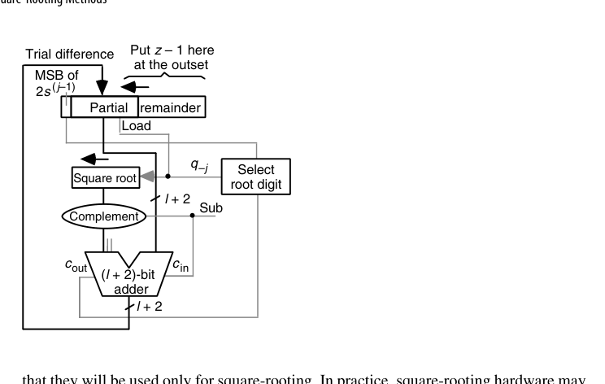
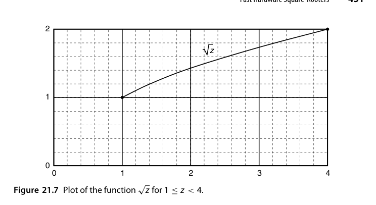
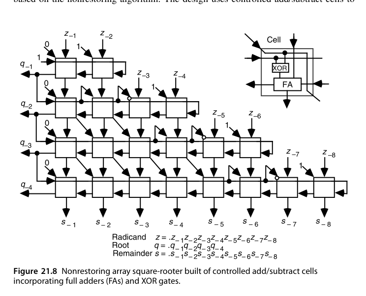
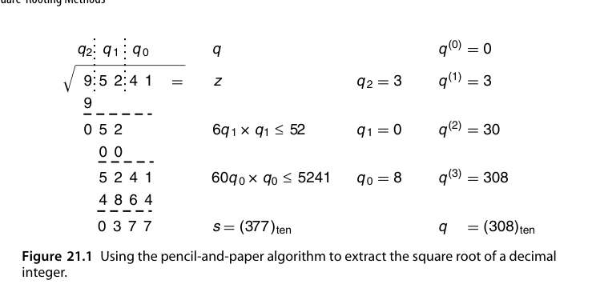
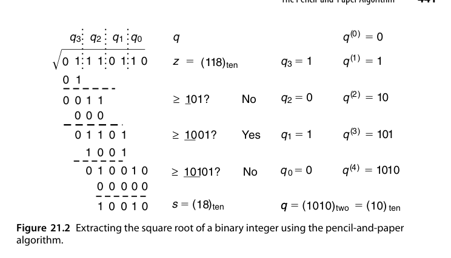

# 第21章 开平方方法（Square-Rooting Methods）

## 本章导读

开平方（square root）是除法的"近亲"：同样有数字递归（逐位试根）与收敛迭代（Newton）两大家族，且都能复用除法器的数据通路。本章从纸笔算法讲起，走完恢复/不恢复、高基数、收敛法全程，最后看快速硬件开方器——图形学（归一化）、DSP（均方根）、科学计算的日常需求。

## 21.1 纸笔算法（The Pencil-and-Paper Algorithm)

手工开平方的口诀：两位一组分段，逐位试根 $q$，每步计算"当前根×20 + 新位"乘以新位并从余数中减去。本质：利用 $(10a + b)^2 = 100a^2 + (20a + b)b$ 的展开，每步确定一位新根。

二进制版本大幅简化：**试根位只需试 1**（0 自动成立），每步比较"部分余数 vs. $(4q + 1) \ll 2j$"——一次减法定一位。

先补上记号与一条关键不等式：设 $2k$ 位的被开方数 $z$（radicand）、$k$ 位的根 $q$，则余数 $s = z - q^2$ 必满足 $s \le 2q$——若 $s \ge 2q+1$，就有 $z = q^2 + s \ge (q+1)^2$，与 $q = \lfloor\sqrt{z}\rfloor$ 矛盾。这解释了为什么 $2k$ 位的 $z$ 需要 $k+1$ 位的余数：余数寄存器必须容得下"根再长一位"所需的全部信息。

"乘 20 添位"的来历一步可推。设部分根为 $q^{(i)}$，添上新数字 $b$ 后新根为 $10q^{(i)} + b$，其平方为

$$
(10q^{(i)} + b)^2 = 100\,(q^{(i)})^2 + (20q^{(i)} + b)\,b
$$

第一项 $100(q^{(i)})^2$ 已在早前各步从部分余数中扣净，故本步只需再减 $(20q^{(i)} + b) \times b$——把部分根翻倍、右端拼上新位、再乘新位，口诀的全部内容都在这个展开式里。

::: {.callout-note title="算例：十进制 √95241 与二进制 √1110110"}
十进制：两位分组 $09\,52\,41$，故根有 3 位。首位 $q_2 = 3$：$3^2 = 9$ 恰好扣净首组 09，部分余数剩 52。次位：部分根 3 翻倍得 6，找 $q_1$ 使 $(60 + q_1) \cdot q_1 \le 52$——$61 \times 1$ 都放不下，故 $q_1 = 0$。末位：部分根 30 翻倍得 60，找 $q_0$ 使 $(600 + q_0) \cdot q_0 \le 5241$，取 $q_0 = 8$（$608 \times 8 = 4864$）。最终 $q = 308$，$s = 95241 - 308^2 = 377$。

二进制：$z = (1110110)_2 = 118$，分组 $1\,11\,01\,10$。根数字只取 0/1，试根退化为一次试探减法：把部分根 $q^{(i)}$ 右端拼上 $01$（即 $4q^{(i)} + 1$）与部分余数比较，够减则该位为 1。各步比较依次为 $\ge 1$?（是）、$\ge 101$?（否）、$\ge 1001$?（是）、$\ge 10101$?（否），得 $q = (1010)_2 = 10$、余数 $s = 18$——与 $10^2 + 18 = 118$ 相符。
:::

从二进制算例还能抽象出**点记法（dot notation）**视图：被开方数与根写在顶部，其下每行点阵对应一个"部分根拼 $0q_{k-i-1}$ 后乘新根位"的被减数。由于根数字只有 0/1 两种取值，二进制开平方就退化为"从 $z$ 中减去一串 0 或 $(q^{(i)}01)_2$ 的移位版本"。这张点阵图与乘法点阵一样，是后文推导恢复/不恢复阵列开方器的蓝图。

## 21.2 恢复式移位/减算法（Restoring Shift/Subtract Algorithm)

硬件版恢复式开方，与恢复除法同构：

1. 部分余数左移 2 位（每拍出 1 位根，因为开方每次消耗被开方数 2 位）；
2. 试减 $(4q + 1) \ll 2j$；
3. 够减：根位置 1，保留差；不够减：根位置 0，恢复原值。

数据通路可直接改造自除法器：除数寄存器换成"动态生成的试减项"（$(4q+1)$ 由当前根左移 2 位 + 1 构成，一个拼接电路即可）。

把算法写成对**小数（fractional）**被开方数的递推更贴近硬件实现。IEEE 754 浮点开方对应 $1 \le z < 4$、$1 \le q < 2$（奇指数先减 1 变偶、尾数左移一位即落入此区间）。维持不变式 $s^{(j)} = z - [q^{(j)}]^2$，由 $q^{(j)} = q^{(j-1)} + 2^{-j}q_{-j}$ 展开平方差可解出每拍递推

$$
s^{(j)} = 2s^{(j-1)} - q_{-j}\left(2q^{(j-1)} + 2^{-j}q_{-j}\right), \qquad s^{(0)} = z - 1,\ q^{(0)} = 1
$$

即部分余数每拍左移 2 位（开方每拍消耗 $z$ 的 2 位），再减去试减项 $2q^{(j-1)} + 2^{-j}$ 或 0。试减项的构造极其便宜：$2q^{(j-1)} + 2^{-j}$ 就是"部分根左移一位后右端拼 $01$"——纯拼接、无加法器。

::: {.callout-note title="算例：恢复式开方 z = 118/64"}
$z = (01.110110)_2$，$s^{(0)} = z - 1 = 0.110110$。逐拍：$2s^{(0)} = 001.101100$，试减 $10.1_2$（即 $2 \times 1 + 0.5$）得负 → $q_{-1} = 0$，恢复原余数；$2s^{(1)} = 011.011000$，试减 $10.01_2$ 成功 → $q_{-2} = 1$；如此继续六拍得 $q = 1.010110_2 = 86/64$，$s^{(6)} = 156/64$。
:::

舍入环节有个漂亮的免费午餐。要得到 $l$ 位的舍入结果，只需多迭代一位 $q_{-l-1}$：为 0 则截断、为 1 则末位进 1。除法里最麻烦的"恰在中间"（需要 sticky bit 的场景）在开方中**不可能出现**：中点情形要求 $z = (q + 2^{-(l+1)})^2$，展开后其小数部分在第 $2l+2$ 位上有一个无法对消的 1，而 $z$ 本身只有 $l$ 个小数位——矛盾。于是既不用 sticky 逻辑，也不用检查余数是否为零。

## 21.3 二进制不恢复算法（Binary Nonrestoring Algorithm)

与不恢复除法平行：试减失败不回退，下一拍改做加法补偿。根数字集合 $\{-1, +1\}$（或 $\{0, 1\}$ 编码），每拍固定一次加减：

- 部分余数 $\ge 0$：根位 1，下拍减；
- 部分余数 $< 0$：根位 0（即 $-1$），下拍加。

收尾时若余数为负做一次最终修正。根以冗余形式产出，**即时转换（on-the-fly conversion）**为普通二进制——与 SRT 除法完全同款技巧。

{fig-align="center" width="85%"}

工程实现上唯一的新麻烦是 $q_{-j} = -1$ 时的加数 $2q^{(j-1)} - 2^{-j}$：它不再是对部分根的简单拼接（$+2^{-j}$ 变成了 $-2^{-j}$）。经典解法是维护一对寄存器——$Q$ 存部分根 $q^{(j-1)}$，$Q^*$ 存**缩减小根（diminished partial root）** $q^{(j-1)} - 2^{-j+1}$。于是两种情形都能拼出来：

- $q_{-j} = 1$：减 $2q^{(j-1)} + 2^{-j}$，由 $Q$ 右端拼 $01$ 移位形成；
- $q_{-j} = -1$：加 $2q^{(j-1)} - 2^{-j}$，由 $Q^*$ 右端拼 $11$ 移位形成。

$Q/Q^*$ 的更新规则同样只是拼接：$q_{-j}=1 \Rightarrow Q := Q\,1,\ Q^* := Q\,0$；$q_{-j}=-1 \Rightarrow Q := Q^*\,1,\ Q^* := Q^*\,0$。再补一条 $q_{-j}=0 \Rightarrow Q := Q\,0,\ Q^* := Q^*\,1$，就得到与 SRT 除法（13.6 节）同款的"跳 0/跳 1"变体：检测部分余数的前导 0/1 并连移，一次产出多位根数字。若进一步把部分余数保持为**保留进位形式（stored-carry form）**，用和/进位两分量高几位查表选根位，便得到与 14.2 节 carry-save SRT 完全平行的开方器——除法器的每一级进化都能在开方器上重演一遍。

## 21.4 高基数开方（High-Radix Square-Rooting)

radix-4 开方每拍出 2 位根，试减项集合变大，同样需要"根数字选择表"——与 radix-4 SRT 除法的问题结构几乎一致（部分余数截断估计 + 冗余根数字）。差别：除法的"除数"固定，开方的"试减项"随根的增长逐拍变化——选择表的输入因此多一维，设计更微妙。实用系统中 radix-4 开方多由 SRT 除法器共享实现。

基数 $r$ 的开方递推是二进制版本的直接推广：

$$
s^{(j)} = r\,s^{(j-1)} - q_{-j}\left(2q^{(j-1)} + r^{-j}q_{-j}\right)
$$

以 radix-4、根数字集 $[-2, 2]$ 为例：$Q^*$ 存 $q^{(j-1)} - 4^{-j+1}$，四种非零数字对应的加/减项都可由 $Q$ 或 $Q^*$ 拼接常数后移位形成——$q_{-j} = 2$ 减 $4q^{(j-1)} + 2^{-2j+2}$（$Q$ 拼 $010$ 双移）、$q_{-j} = 1$ 减 $2q^{(j-1)} + 2^{-2j}$（$Q$ 拼 $001$）、$q_{-j} = -1$ 加 $2q^{(j-1)} - 2^{-2j}$（$Q^*$ 拼 $111$）、$q_{-j} = -2$ 加 $4q^{(j-1)} - 2^{-2j+2}$（$Q^*$ 拼 $110$）。$Q/Q^*$ 的五条更新规则仍是纯拼接，根在**即时转换（on-the-fly conversion）**中直接落成普通二进制，无需收尾转换步骤。

与除法相比有两处结构性差异，设计者必须警惕：

1. **选择表无法全程统一**。除法的除数从头就是已知的，选择表只需观察部分余数；开方的"试减项"依赖部分根本身，而最初几拍根几乎未知。补救：开机时用一个小 PLA/查表先"冒出"根的前几位，或前几拍改用略有不同的选择规则。
2. **与除法共享选择表需要改数字集**。对比 radix-4 两种递推——除法减 $q_{-j} d$，开方减 $q_{-j}(2q^{(j-1)} + 4^{-j}q_{-j})$——若把开方数字集改用 $\{-1, -\tfrac12, 0, \tfrac12, 1\}$，两者部分余数的幅值范围就一致了，可复用同一张商/根数字选择表；该数字集转回 $[-2,2]$ 或普通二进制无需额外计算。

另外，IEEE 754 下 $z \in [1,4)$ 的根在 $[1,2)$，radix-4 数字集 $[-2,2]$ 表示绰绰有余；首位数字实际可限制在 $[0,2]$，但不能想当然压到 $[0,1]$——冗余表示下首位仍可能需要取 2、由后续位借位补偿（原书留作思考题）。

## 21.5 收敛法开方（Square-Rooting by Convergence)

与收敛除法（16 章）完全平行：

1. **直接 Newton**：$r_{i+1} = \frac{1}{2}(r_i + x / r_i)$——每轮含一次除法，不理想；
2. **倒根 Newton**：先求 $1/\sqrt{x}$：$r_{i+1} = \frac{r_i}{2}(3 - x r_i^2)$——**只用乘法**（每轮 2-3 次乘法，FMA 友好），最后乘 $x$ 得 $\sqrt{x}$。二次收敛：8 位查表初值 → 16 → 32 → 64 位，3 轮。

补全推导与收敛分析。对 $f(x) = x^2 - z$ 套 Newton–Raphson 迭代 $x^{(i+1)} = x^{(i)} - f(x^{(i)})/f'(x^{(i)})$ 即得上式。令 $\delta_i = \sqrt{z} - x^{(i)}$，代入可证

$$
\delta_{i+1} = -\frac{\delta_i^2}{2x^{(i)}}
$$

误差恒为负（从上方单调收敛）且按平方消失；$z \in [1,4)$ 时从 $x^{(0)} = 2$ 出发可保持 $|\delta_{i+1}| \le \delta_i^2/2$。若查表把初值精度提到 $2^{-8}$，三轮迭代即达 64 位。

::: {.callout-note title="算例：Newton 开方 z = 2.4"}
查表得初值 $x^{(0)} = 1.5$（精度 $10^{-1}$）：

| $i$ | $x^{(i)}$ | 精度 |
|---|---|---|
| 0 | 1.5 | $10^{-1}$ |
| 1 | $0.5\,(1.5 + 2.4/1.5) = 1.550\,000$ | $10^{-2}$ |
| 2 | $1.549\,193\,548$ | $10^{-4}$ |
| 3 | $1.549\,193\,338$ | $10^{-8}$ |

三轮、每轮一次除法——这正是"直接 Newton 含除法"的代价，也是各种免除非法（division-free）变体的动机。
:::

去除法的三条路线，按工程出现频率排序：

1. **倒根 Newton**：对 $f(x) = 1/x^2 - z$（根在 $x = 1/\sqrt{z}$）迭代，得 $x^{(i+1)} = \frac{x^{(i)}}{2}\left(3 - z(x^{(i)})^2\right)$，每轮 3 乘 1 加，最后乘 $z$ 还原。Cray-2 即用此法，且把 $1.5x^{(0)}$ 与 $0.5(x^{(0)})^3$ 预存成表，首轮只剩 1 乘 1 加；$x^{(1)}$ 已达半个机器精度，第二轮后乘 $z$ 收工。算例：$z = 0.5678$，$x^{(0)} = 1.3$ → $x^{(1)} = 1.326\,271\,700$ → $x^{(2)} = 1.327\,095\,128$，乘 $z$ 得 $\sqrt{z} \approx 0.753\,524\,613$。
2. **倒数表辅助**：把迭代改写为 $x^{(i+1)} = x^{(i)} + \frac{1}{2x^{(i)}}\left(z - (x^{(i)})^2\right)$，用近似倒数 $\gamma(x^{(i)})$ 代替精确的 $1/x^{(i)}$——每轮表查 + 2 乘 2 加，但收敛降到低于二次，轮数要放宽。
3. **双迭代交织**：$x^{(i+1)} = \frac{1}{2}(x^{(i)} + z\,y^{(i)})$、$y^{(i+1)} = y^{(i)}(2 - x^{(i)}y^{(i)})$，$x$ 逼近 $\sqrt{z}$、$y$ 逼近 $1/\sqrt{z}$（后者即 16 章的倒数 Newton）；两路乘法可流水，收敛介于线性与二次之间。

::: {.callout-tip title="工程观察"}
GPU 的 `rsqrt`（快速逆平方根）指令 = 查表 + 1 轮倒根 Newton，精度约 23 位——图形学向量归一化的标配。它与 15.5 节的倒数 Newton 共享同一套"初始粗值 + 平方收敛 + FMA 实现"方法论。
:::

## 21.6 快速硬件开方器（Fast Hardware Square-Rooters)

工程选型指南：

| 方案 | 延迟 | 面积 | 适用 |
|---|---|---|---|
| 数字递归（radix-2/4） | $k$ 或 $k/2$ 拍 | 小（可复用除法器） | 通用 FPU、嵌入式 |
| 收敛法 | ~3 轮乘法 | 复用乘法器 + 表 | 已有快速乘法器的 FPU/GPU |
| 组合阵列 | 1 拍 | 大 | 小位宽、极致延迟 |

现代 FPU 通常让开方与除法**共享同一个 SRT 单元**（控制微码不同），因为两者数据通路同构——面积几乎零增加。

组合式开方器有两大用途：给收敛法提供初值，或干脆整体替代递归式方案。初值近似的"阶梯"很能说明设计取舍——对 $z \in [1,4)$ 上的 $\sqrt{z}$：

- 最佳常数近似 $x^{(0)} = 1.5$：最大绝对误差 0.5，$z=1$ 处相对误差 50%；
- 免运算线性近似 $x^{(0)} = 1 + z/4$（移位拼位即得）：绝对误差 0.25，相对误差 25%；
- 只加一次法的线性近似 $x^{(0)} = 7/8 + z/4$：误差减半至 0.125；
- 最佳线性近似 $x^{(0)} = 17/24 + z/3$（需一次常数乘法）：误差 $1/24 \approx 4.2\%$，在 $z = 1, 2.25, 4$ 三处达到。

把 $[1,4)$ 按 $z_1$ 位切成 $[1,2)$ 与 $[2,4)$ 两个子区间、各用免运算线性近似（低位子区间用 $1 + (z-1)/2$，高位用 $1 + z/4$），最大误差进一步降到约 0.086。整条阶梯与 24 章的插值/分段表一脉相承——**用一点点逻辑换大幅存储或迭代轮数**。

{fig-align="center" width="85%"}

整数情形还有一个只靠"计前导零 + 移位"的初值：设 $z$ 的最高位 1 在奇位置 $2^{2m-1}$（否则把 $z$ 翻倍、结果乘 $1/\sqrt{2} \approx 0.707\,107$），取 $x^{(0)} = 2^{m-1} + 2^{-(m+1)}z$，可证最大相对误差 6.07%（最坏在 $z_{rest} = 0$ 处，$x^{(0)}/\sqrt{z} = 3/\sqrt{8}$）。Schwarz 与 Flynn 给出更工程化的方案：在 53 位乘法器上加约 1000 个门，让它顺带"算出"16 位的 $\sqrt{z}$ 初值，之后仅两轮 Newton 即达双精度——初值生成几乎白拿。

另一极端是完全不迭代的**阵列开方器（array square-rooter）**：从点记法图出发，像 15.5 节由除法点阵导出阵列除法器那样，直接铺出受控加/减细胞阵列。下图为非恢复式 8 位小数开方器：每个细胞含一个全加器（FA）与一个异或门，按上一行部分余数的符号决定本行做加还是做减——非恢复算法的"欠账/还账"被摊平成二维电路。与阵列除法器一样，它用面积换延迟，适合位宽小、延迟极敏感的场合。

{fig-align="center" width="85%"}

## RTL 实践：`rtl/ch21_2_restoring_sqrt`

16 位无符号恢复式开方器：每拍部分余数左移 2 位、试减 $4q+1$，8 拍出 8 位根与余数：

```systemverilog
wire [15:0] rem_sh = {rem[13:0], din[15:14]};   // 左移 2 位 + 被开方数新 2 位
wire [15:0] trial  = {6'b0, root, 2'b01};       // 4q + 1：当前根左移 2 位置 1
// 够减：rem <= rem_sh - trial，根位置 1；否则 rem <= rem_sh，根位置 0
```

设计要点：

- **试减项的拼接触**：（$4q+1$）无需乘法器——把当前根左移 2 位、末位置 01 即可，这正是二进制开方比十进制优雅的原因；
- **每拍消耗 2 位输入**：开方每拍出 1 位根，对应被开方数 2 位——与除法（每拍 1 位）的节奏差异来自平方的幂次；
- 不变式：迭代全程保持 $d = q^2 + r$ 且 $0 \le r \le 2q$，testbench 的黄金模型直接按定义枚举验证，覆盖 $0$、$255^2$、$2^{16}-1$ 边界与 1000 组随机。

```bash
cd rtl/ch21_2_restoring_sqrt
bash run_iverilog.sh    # 或 bash run_verilator.sh
```

## 本章小结

- 开方与除法同构：数字递归（恢复/不恢复/SRT）与收敛（Newton）两族。
- 不恢复 + 即时转换 = SRT 开方，与除法器共享数据通路。
- 倒根 Newton 只用乘法，GPU rsqrt 的内部实现。
- 工程上开方器很少独立存在——它是除法器的一种工作模式。

## 原书插图

{fig-align="center" width="85%"}

{fig-align="center" width="85%"}
