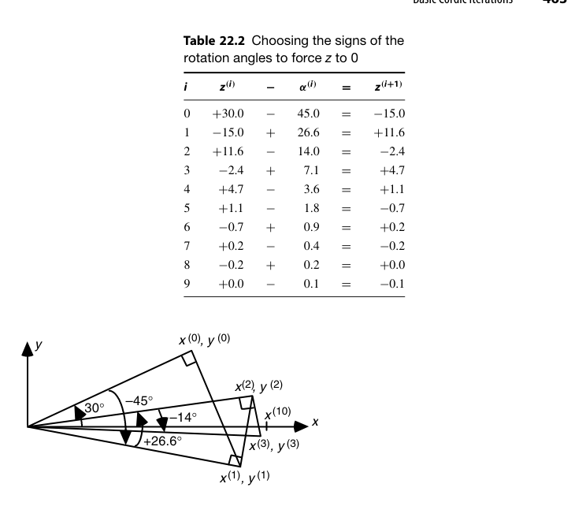
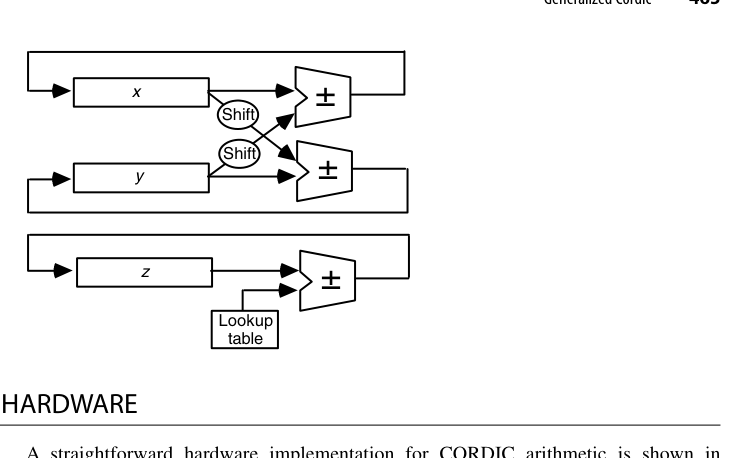
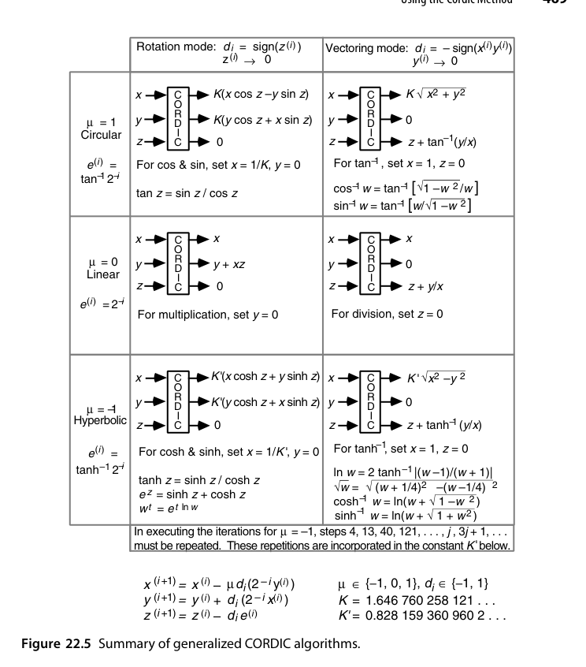
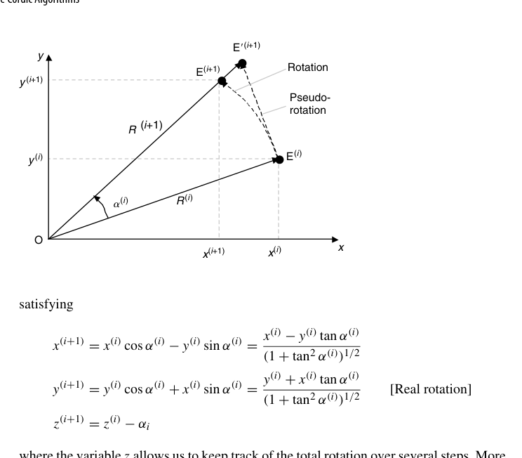
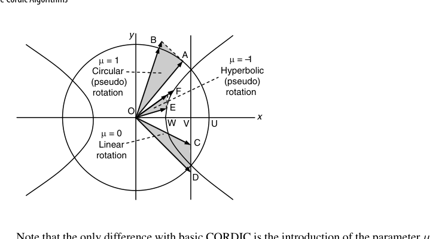

# 第22章 CORDIC 算法（The CORDIC Algorithms）

## 本章导读

CORDIC（COordinate Rotation DIgital Computer）[@volder1959] 是硬件算法设计的一颗明珠：**只用移位和加法**，通过一系列预定义角度的"伪旋转"，算出 sin、cos、arctan、sinh、cosh、ln、exp，甚至乘除法——一台没有乘法器的计算器（HP-35，1972）因此能算超越函数。它的"迭代 + 查小表 + 每拍一次移位加"骨架，与除法/开方一脉相承，是函数求值硬件化的第三条路线（前两条：多项式逼近、大查找表）。

## 22.1 旋转与伪旋转（Rotations and Pseudorotations)

平面旋转 $(x, y)$ 转角度 $\theta$：

$$
x' = x\cos\theta - y\sin\theta, \qquad y' = x\sin\theta + y\cos\theta
$$

提出 $\cos\theta$ 因子并选特殊角度 $\theta_i = \arctan(2^{-i})$（使 $\tan\theta_i = 2^{-i}$，乘法变移位）：

$$
x_{i+1} = K_i \left( x_i - d_i \cdot 2^{-i} y_i \right), \qquad
y_{i+1} = K_i \left( y_i + d_i \cdot 2^{-i} x_i \right)
$$

其中 $d_i = \pm 1$ 为旋转方向，$K_i = \cos(\arctan 2^{-i}) = 1/\sqrt{1 + 2^{-2i}}$ 是**伪旋转**引入的尺度因子。关键洞察：$\prod K_i$ 是**常数**（迭代次数固定时），可预先算好一次性补偿——每拍只剩移位、加/减、方向决策！

补全推导。真实旋转不改变向量长度，而"提出 $\cos$ 因子"的伪旋转（pseudorotation）会把长度放大

$$
R^{(i+1)} = R^{(i)}\left(1 + \tan^2\alpha^{(i)}\right)^{1/2} = \frac{R^{(i)}}{\cos\alpha^{(i)}}
$$

伪旋转方程因此就是真实旋转方程整体乘上了这个放大因子。$m$ 步累积下来，坐标被放大了

$$
K = \prod_{i} \left(1 + \tan^2\alpha^{(i)}\right)^{1/2}
$$

关键在于：只要每步使用的角度集合固定（正负号任意），$K$ 就与旋转目标无关、可预先算好。这是整个方法成立的基石——**系统性误差一次性预补偿，逐拍不产生新误差**。反之，若角度集合随输入变化，$K$ 就不再是常数，补偿的代价会吞掉伪旋转省下的硬件。

## 22.2 基本 CORDIC 迭代（Basic CORDIC Iterations)

三种工作模式的统一形式（$m \in \{1, 0, -1\}$ 对应圆/线/双曲坐标系）：

$$
x_{i+1} = x_i - m\, d_i\, 2^{-i} y_i, \quad
y_{i+1} = y_i + d_i\, 2^{-i} x_i, \quad
z_{i+1} = z_i - d_i\, e_i
$$

$e_i$ 是查表得到的角度常数（$\arctan 2^{-i}$ 或 $\text{artanh}\, 2^{-i}$）。两种使用方式：

- **旋转模式（rotation）**：驱动 $z \to 0$，把向量转到目标角度——得 $\sin/\cos$（令初始 $x = 1/K, y = 0$）、复数旋转、极坐标转换；
- **向量模式（vectoring）**：驱动 $y \to 0$，把向量转到 x 轴——得 $\arctan(y/x)$（$z$ 累出角度）、向量模（$x$ 得 $|v| \cdot K$）、直角转极坐标。

展开两点工程细节。其一，每步迭代 = 2 次移位 + 1 次查表 + 3 次加减，角度常数 $e^{(i)} = \arctan 2^{-i}$ 预存小表（$i = 0,1,2,3,\dots$ 依次约为 $45.0°, 26.6°, 14.0°, 7.1°, 3.6°,\dots$，每角约为前一角的一半）。其二，方向决策 $d_i = \mathrm{sign}(z^{(i)})$（旋转模式）与不恢复除法"试减失败改加法"如出一辙：$z$ 过冲就往回转、欠着就继续转。

旋转模式跑完 $m$ 步、$z^{(m)} \to 0$ 时：

$$
x^{(m)} = K(x\cos z - y\sin z), \qquad y^{(m)} = K(y\cos z + x\sin z)
$$

$K = 1.646\,760\,258\,121\cdots$。求 $\sin z$ 与 $\cos z$ 只需令 $x = 1/K = 0.607\,252\,935\cdots$、$y = 0$ 起步，把尺度因子在入口处消化掉。$k$ 位精度需要 $k$ 次迭代：大 $i$ 时 $\arctan 2^{-i} \approx 2^{-i}$，超过 $k$ 步的旋转对结果的贡献小于 ulp。

收敛域由角度表的完备性决定：圆周模式下为 $-99.7° \le z \le 99.7°$（全部角度之和），恰好覆盖 $[-\pi/2, \pi/2]$。收敛的充要条件是每个角度不小于其后所有角度之和的一半——$\arctan 2^{-(i+1)} \ge \frac{1}{2}\arctan 2^{-i}$ 成立；后文会看到双曲模式恰恰在这里翻车。

::: {.callout-note title="一鱼多吃"}
换 $m$ 与模式组合：$m=-1$ 双曲模式得 sinh/cosh/artanh，进而 $\ln x = 2\,\text{artanh}\left(\frac{x-1}{x+1}\right)$、$e^x = \sinh x + \cosh x$；$m=0$ 线性模式退化为乘法（旋转）与除法（向量）——CORDIC 是一台"算法万花筒"。
:::

{fig-align="center" width="85%"}

::: {.callout-note title="数值轨迹：CORDIC 旋转 +30°"}
以度为单位跟踪 $z^{(i)}$（目标：驱动 $z \to 0$，每步选 $d_i = \mathrm{sign}(z^{(i)})$）：

$$
+30.0 \xrightarrow{-45.0} -15.0 \xrightarrow{+26.6} +11.6 \xrightarrow{-14.0} -2.4 \xrightarrow{+7.1} +4.7 \xrightarrow{-3.6} +1.1 \xrightarrow{-1.8} -0.7 \xrightarrow{+0.9} +0.2 \xrightarrow{-0.4} -0.2 \xrightarrow{+0.2} +0.0 \xrightarrow{-0.1} -0.1
$$

10 步后 $z$ 已压到 $0.1°$ 量级（本例用近似角度值便于心算，实际硬件用弧度全精度表）；向量 $(x, y)$ 沿图 22.2 的折线从初始方向逼近 $+30°$ 方向。整个决策序列与不恢复除法的商数字序列在结构上完全同构。
:::

向量模式（vectoring）把决策对象换成 $y$：$d_i = -\mathrm{sign}(x^{(i)}y^{(i)})$ 驱动 $y \to 0$，$m$ 步后

$$
x^{(m)} = K\sqrt{x^2 + y^2}, \qquad z^{(m)} = z + \arctan\frac{y}{x}
$$

令 $x = 1, z = 0$ 起步即得 $\arctan y$，$x$ 累出的是向量模。配合恒等式 $\arctan(1/y) = \pi/2 - \arctan y$ 可把定点运算的范围压半。注意：旋转模式有收敛域问题，向量模式对任意输入都收敛——22.5 节选型时这是个重要区别。

## 22.3 CORDIC 硬件（CORDIC Hardware)

最简实现：三个寄存器（$x, y, z$）+ 两个桶形移位器（或时序复用一个）+ 三个加减法器 + 角度 ROM + 符号决策逻辑。每拍一次迭代，$k$ 位精度约 $k$ 拍。

提速方向：

- **展开流水**：$k$ 级全流水，每级固定移位量（移位变**硬连线**，桶形移位器消失！）——吞吐每拍一个结果，这是 FPGA 上 CORDIC 的标准形态（28 章）；
- **高基数/冗余 CORDIC**：方向集合扩到 $\{-1, 0, +1\}$ 或更高基数，减少迭代次数，代价是选择逻辑变复杂（与 SRT 的历史重演）。

成本阶梯从简到繁，可以排成一张选型单：

- **最简时序版**：3 个寄存器 + 角度查表 ROM + 2 个移位器 + 3 个加减法器；$d_i$ 通过"选原码还是补码"进入加减法器。面积再省可让 3 路计算分时共享一个加减法器（慢约 3 倍）；
- **固件/软件版**：直接在通用处理器的 ALU 上跑迭代循环，角度表放控制 ROM 或内存——早期科学计算器（如 HP-35）正是这么干的；
- **位串行版**：加减法器位串行化，$k$ 位精度约 $O(k^2)$ 拍——对手持计算器完全够用（几万拍不过几十毫秒，人眼无感）；
- **全展开流水版**：$k$ 级流水、每级移位量固定，桶形移位器退化为硬连线，吞吐每拍一个结果——FPGA 函数计算的标准形态（28 章）。

{fig-align="center" width="85%"}

## 22.4 广义 CORDIC（Generalized CORDIC)

把"旋转矩阵"抽象为更一般的迭代映射，可以覆盖更多函数（对数、指数、开方的统一推导）。价值在于提供**统一的收敛性分析框架**：什么条件下迭代收敛、收敛域多大、需要几次补偿迭代。

三种坐标系的差异全在 $e^{(i)}$ 与尺度因子上：

| $\mu$ | 坐标系 | $e^{(i)}$ | 尺度因子 | 向量"长度" |
|---|---|---|---|---|
| 1 | 圆 | $\arctan 2^{-i}$ | $K = 1.6468$（放大） | $\sqrt{x^2+y^2}$ |
| 0 | 线 | $2^{-i}$ | 1（真旋转） | $x$ |
| $-1$ | 双曲 | $\text{artanh}\, 2^{-i}$ | $K' = 0.8282$（缩小） | $\sqrt{x^2-y^2}$ |

线性模式是"伪旋转全变真旋转"的退化情形：旋转模式（$y$ 起步为 0）直接算乘法/乘加 $y + xz$；向量模式（$z$ 起步为 0）直接算除法/除加 $z + y/x$。双曲模式下伪旋转使向量长度**收缩**（$\cosh\alpha > 1$），累积收缩因子 $K' = 0.828\,159\,360\,960\,2\cdots$。

双曲模式的收敛有个著名的坑：$\arctan$ 满足"每个角度 ≥ 后续角度之和的一半"，$\text{artanh}$ 却不满足。修补方法简单粗暴——**下标 $i = 4, 13, 40, 121, \dots$（即 $3j+1$ 序列）的迭代执行两遍**，角度序列重新完备；实际精度需求下 $m < 121$，重复代价可忽略（已折算进 $K'$）。修好之后：$\sinh/\cosh$ 的收敛域 $|z| < 1.13$，$\text{artanh}$ 的收敛域 $|y| < 0.81$，配合域归约恒等式足以覆盖全值域。

## 22.5 CORDIC 方法的应用（Using the CORDIC Method)

- **收敛域扩展**：输入超出收敛范围时先做**域归约（range reduction）**——三角函数用周期性/对称性归到 $[0, \pi/4]$，对数用 $x = m \cdot 2^e$ 拆成 $\ln m + e \ln 2$；
- **尺度因子补偿**：$\prod K_i$ 预乘到初始值，或在最终乘法中吸收；
- **典型应用**：DDS（直接数字频率合成）的相位→正弦转换、QR 分解/Givens 旋转（向量模式的硬件实现）、机器人运动学、软件无线电的数字上下变频。

除直接函数外，"一次预处理 + 一次向量模式"还能拿下一批复合函数：$\ln w = 2\,\text{artanh}\frac{w-1}{w+1}$（两次加法预备）、$\sqrt{w} = \sqrt{(w+\frac{1}{4})^2 - (w-\frac{1}{4})^2}$（双曲向量模式算 $\sqrt{x^2-y^2}$）、$\sin^{-1} w = \arctan\frac{w}{\sqrt{1-w^2}}$、$e^z = \sinh z + \cosh z$ 等。下表是全书最实用的"坐标系 × 模式 × 初始化 → 函数"对照图之一。

{fig-align="center" width="85%"}

两个工程细节值得展开：

- **迭代次数必须固定**。为了让 $K$（与 $K'$）保持常数，即使 $z$（或 $y$）中途已到 0 也不能提前收工——线性模式除外。想提前停止或跳步，就必须逐拍维护 $(K^{(i)})^2 \leftarrow (K^{(i)})^2(1 \pm 2^{-2i})$ 并在结尾做开方/除法修正——变因子 CORDIC 的额外开销通常得不偿失。
- **截断 CORDIC（truncated CORDIC）免费省一半**：前 $k/2$ 步照常迭代；对小角度有 $\arctan\varepsilon \approx \varepsilon$，剩余 $k/2$ 步可合并成**一次乘法**（如 $x^{(k/2+1)} = x^{(k/2)} - y^{(k/2)}z^{(k/2)}$），$z$ 一步清零。可证被丢弃的角度对 $K$ 的贡献小于 ulp——尺度因子一个字都不用改。此外，高 radix 版本（$d_i \in \{-2,-1,1,2\}$，移位器后加 2 选 1 多路器）把迭代数再砍半，与 SRT 的高 radix 化完全同构。

## 22.6 代数表述（An Algebraic Formulation)

用复数乘法的语言：CORDIC 旋转 = 乘以 $(1 + j\, d_i 2^{-i})$，整个迭代 = 复数连乘。这个视角把 CORDIC 与 FFT 的旋转因子、复数乘法器设计联系起来，也给出收敛性（角度级数的完备性：$\sum \arctan 2^{-i}$ 能逼近范围内任意角）的严格证明路径。

完整的代数推导其实不长。从乘性归一化迭代 $u^{(i+1)} = u^{(i)} - \ln c^{(i)}$、$v^{(i+1)} = v^{(i)}c^{(i)}$ 出发（$u \to 0$ 时 $v \to v\,e^{u(0)}$，23.3 节证明），取

$$
c^{(i)} = \frac{1 + j\,d_i 2^{-i}}{\sqrt{1 + 2^{-2i}}} = e^{j g^{(i)}}, \qquad g^{(i)} = \arctan(d_i 2^{-i})
$$

则 $u$ 中被消去的是纯虚数 $j\arctan(d_i 2^{-i})$，与 CORDIC 的角度累减逐字对应。令 $u^{(0)} = jz$、$v^{(0)} = 1$，复数乘法 $v^{(i+1)} = v^{(i)}(1 + j d_i 2^{-i})$ 按实虚部展开正是圆周 CORDIC 的两条坐标递推；分母 $\sqrt{1+2^{-2i}}$ 的连乘累积出尺度因子 $K$，取 $v^{(0)} = 1/K$ 即完成预补偿。复数视角还顺手把收敛性说清：角度表 $\{\arctan 2^{-i}\}$ 的完备性（每角 ≥ 后续和的一半）等价于二进制选择能覆盖 $[-99.7°, 99.7°]$ 中的每个角。

## RTL 实践：`rtl/ch22_2_cordic_rotation`

12 级迭代 CORDIC（旋转模式），定点 Q2.14 格式，输入角度输出 sin/cos：

```systemverilog
wire        dir = (z >= 0);   // 旋转方向由剩余角度符号决定
wire signed [15:0] x_next = dir ? x - (y >>> i) : x + (y >>> i);
wire signed [15:0] y_next = dir ? y + (x >>> i) : y - (x >>> i);
wire signed [15:0] z_next = dir ? z - atan_tab[i] : z + atan_tab[i];
```

设计要点：

- **无乘法器**：每拍只有移位（`>>>` 算术右移）与加减——CORDIC 的全部本钱；
- **增益预偿**：初始 $x = K \cdot 2^{14}$（$K \approx 0.6073$），把 12 级旋转的尺度因子一次性预付，输出直接就是真值比例；
- **角度表**：$\arctan(2^{-i})$ 常数表是唯一的"存储"，12 项足够 Q2.14 精度（末项 $\approx 2^{-11}$）；
- testbench 对 $0$、$\pm\pi/4$、$\pm 0.5$、$1.0$ 等角度做定向校验，容差 $\pm 150$（约 0.009 rad），实测误差仅几个 LSB。

```bash
cd rtl/ch22_2_cordic_rotation
bash run_iverilog.sh    # 或 bash run_verilator.sh
```

## 本章小结

- CORDIC = 移位 + 加 + 小角度表，算尽常见超越函数。
- 伪旋转的尺度因子是常数，可集中补偿；每拍只做方向决策与移位加。
- 旋转/向量两模式 × 圆/线/双曲三坐标系 = 函数全家桶。
- 全流水展开后移位器消失，FPGA 上是函数求值的常客。

## 原书插图

{fig-align="center" width="85%"}

{fig-align="center" width="85%"}
