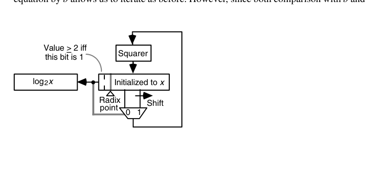

# 第23章 函数求值的变体（Variations in Function Evaluation）

## 本章导读

超越函数求值有三大家族：**迭代法**（CORDIC、Newton——第 21、22 章）、**多项式/有理逼近**（本章主力）、**查表法**（第 24 章）。本章讨论通用的预处理（域归约）、对数/指数的具体计算、逼近理论要点，以及把多个运算"熔"成一个数据通路的 merged arithmetic。

## 23.1 归一化与域归约（Normalization and Range Reduction)

几乎所有函数求值的第一步都是**域归约**：把任意输入映射到逼近公式好用的小区间。

- 三角函数：周期 + 对称 → $[0, \pi/4]$（注意 $\pi$ 的精度——大角度归约需要超精度的 $\pi$，Payne-Hanek 算法是经典方案）；
- 指数：$e^x = 2^{x/\ln 2}$，拆 $x/\ln 2 = n + f$，只剩 $2^f$（$f \in [0,1)$）要算；
- 对数：$x = m \cdot 2^e$ → $\ln x = \ln m + e \ln 2$，$m \in [1, 2)$。

::: {.callout-warning title="工程陷阱"}
**域归约是函数库精度事故的高发区**：归约常数（$\pi/2$、$\ln 2$）的精度不够，大输入下误差直接爆炸。glibc 的 sin() 曾因极端大角度归约而臭名昭著——硬件实现同样要在规格书里写清"输入超过多少时精度不再保证"。
:::

先把收敛方法（convergence method）的术语钉牢：一组递推 $u^{(i+1)} = f(u^{(i)}, v^{(i)})$、$v^{(i+1)} = g(u^{(i)}, v^{(i)})$，迭代使某个变量 $u$ 收敛到常数——这叫**归一化（normalization）**。每拍用一次加法使 $u$ 归一的叫**加性归一化（additive normalization）**，用一次乘法的叫**乘性归一化（multiplicative normalization）**。CORDIC 与数字递归除法/开方属前者，收敛除法与倒根 Newton 属后者。乘法比加法慢，但乘性法收敛快（二次 vs. 每拍约 1 位）；而且当乘性项形如 $1 \pm 2^a$ 时，乘法退化为移位加减——两类方法速度拉平。这就是 21.5 节倒根 Newton、下两节对数/指数迭代的公共形态。

域归约同样分加性/乘性两族。加性例子：算 $\cos(1.125 \times 2^{47})$，先减去适当的 $2\pi$ 整数倍落入 $[-\pi, \pi]$，再按 $\cos x = -\cos(x-\pi)$ 之类恒等式送进收敛域；乘性例子：对数的 $x = 2^q s$ 拆分本质是乘性归约，且当比例常数是对数底的幂时几乎免费。

## 23.2 计算对数（Computing Logarithms)

- **归约 + 多项式**：$\ln m$（$m \in [1, 2)$）用极小化（minimax）多项式或 $\ln\frac{1+t}{1-t}$ 变换（收敛更快的级数）；
- **迭代法**：CORDIC 双曲模式（22 章）、或基于乘法归一的 BKM 算法（每次乘 $(1 + 2^{-i})$ 使 $m \to 1$，累加 $\ln(1+2^{-i})$ 表值）；
- **查表 + 插值**：第 24 章。

**乘性归一化求 $\ln x$** 值得完整写出。维持两条递推：

$$
x^{(i+1)} = x^{(i)}(1 + d_i 2^{-i}), \qquad y^{(i+1)} = y^{(i)} - \ln(1 + d_i 2^{-i}), \qquad d_i \in \{-1, 0, 1\}
$$

选 $d_i$ 使 $x \to 1$，则 $\prod c^{(i)} \approx 1/x$，于是 $y^{(m)} = y - \ln \prod c^{(i)} \approx y + \ln x$——令 $y^{(0)} = 0$ 即得 $\ln x$。$\ln(1 \pm 2^{-i})$ 是一张小表；收敛域 $0.21 \le x \le 3.45$；$k$ 位精度 $k$ 拍（大 $i$ 时 $\ln(1\pm 2^{-i}) \approx \pm 2^{-i}$，与 CORDIC 同款 ulp 论证）。任意 $x = 2^q s$ 拆出整数部分：$\ln x = 0.693\,147\,180\,q + \ln s$；换底只需乘常数 $\log_2 e = 1.442\,695\,041$。radix-4 版本把 $d_i$ 扩到 $[-2,2]$、迭代数砍半，套路仍是"缩放变量 $u = r^i(x - 1)$ + 与统一阈值（如 $\pm 13/8$、$\pm 5/8$）比较选数字"。

**只需平方器的巧法**（Lo–Chen）：求 $y = \log_2 x$（$1 \le x < 2$）时注意 $x^2 = 2^{2y} = 2^{(y_{-1}.y_{-2}\cdots)_2}$，于是 $x^2 \ge 2 \iff y_{-1} = 1$。逐位算法：

$$
\text{for } i = 1 \text{ to } l:\quad x := x^2;\ \ \text{if } x \ge 2 \text{ then } y_{-i} := 1,\ x := x/2\ \text{ else } y_{-i} := 0
$$

每拍一次平方、一次比较、偶而一次除 2（移位），硬件就是"平方器 + 寄存器 + 小控制"（见章末图 23.1）。推广到以 $b$ 为底只需把与 2 的比较换成与 $b$ 的比较——故只对 2 的幂的底数直接适用，其余底数用换底常数缩放。

## 23.3 指数运算（Exponentiation)

- $e^x$：归约到 $2^f$ 后用多项式/查表；
- $x^y = 2^{y \log_2 x}$：通用幂通过对数-指数链实现（精度分析要小心两级误差叠加）；
- **整数幂**：平方-乘（square-and-multiply）——密码学模幂（12.4 节 Montgomery 的用武之地），硬件上是"乘法器 + 状态机"的经典考题。

指数与对数是对偶的**加性归一化**迭代：

$$
x^{(i+1)} = x^{(i)} - \ln(1 + d_i 2^{-i}), \qquad y^{(i+1)} = y^{(i)}(1 + d_i 2^{-i}), \qquad d_i \in \{-1, 0, 1\}
$$

选 $d_i$ 使 $x \to 0$，则 $\sum \ln c^{(i)} \approx x$，$y^{(m)} = y \prod c^{(i)} = y\, e^{\sum \ln c^{(i)}} \approx y\, e^x$——令 $y^{(0)} = 1$ 得 $e^x$。收敛域 $-1.24 \le x \le 1.56$。这里有个漂亮的**提前收尾**：当剩余 $x^{(j)}$ 足够小（前 $k/2$ 位为 0）时 $\ln(1+\varepsilon) \approx \varepsilon$，剩余全部迭代合并为一次真乘法 $y^{(j+1)} = y^{(j)}(1 + x^{(j)})$、$x$ 直接清零——$k$ 拍缩成 $k/2$ 拍加 1 乘。

超出演算域时先做乘性归约：$x = 2^q s$ 时 $e^x = (e^s)^{2^q}$，用连续平方（$q>0$）或开方（$q<0$）消化 $q$；更高效的做法是预乘 $\log_2 e$ 拆出 $h + f$，则 $e^x = 2^h e^{f \ln 2}$——小数部分送进上面的迭代，整数部分变成指数域调整（移位）。

**通用幂 $x^y = e^{y \ln x}$** 由对数、一次乘法、指数三段串联。精度要小心：$y \ln x$ 的相对误差 $\varepsilon$ 经指数环节放大为约 $|y \ln x| \cdot \varepsilon$ 的最终相对误差，两段误差是相乘放大的（22 章习题 22.21 的教训）。**整数幂**则走平方-乘：$x^{25} = ((((x)^2x)^2)^2)^2x$，4 平方 2 乘，对应 $25 = (11001)_2$ 的扫描；常数幂还能借鉴 9.5 节乘常数的优化——$15 = (1111)_2$ 经 Booth 重编码成 $(100\bar{1})_2$ 变 3 平方 1 除法，或因式分解 $15 = 3 \times 5$ 变 3 平方 2 乘（$x^3$ 存临时寄存器）；更一般地 $y = dq + s$ 时 $x^y = x^s (x^d)^q$，分治进寄存器。模幂把每步乘法换成 Montgomery 乘（15.4 节），其余不变。

## 23.4 再看除法与开方（Division and Square-Rooting, Again)

从"函数求值"视角回看：$1/x$ 与 $1/\sqrt{x}$ 都是**自收敛迭代函数**——Newton 迭代自带误差平方消失性质。本节点题：**第 13-16、21 章的数字递归与收敛法，与第 22 章 CORDIC、本章多项式逼近，共同构成函数求值的方法谱系**——选型三问：有无可复用的乘法器？精度要求多少？吞吐还是延迟优先？

把视角拔高，除法本身就是"加性归一化求 $s \to 0$"：

$$
s^{(i+1)} = s^{(i)} - \gamma^{(i)} \times d, \qquad q^{(i+1)} = q^{(i)} + \gamma^{(i)}
$$

$s^{(0)} = z$、$q^{(0)} = 0$，选 $\gamma^{(i)}$ 使 $s$ 收敛到 0，商即 $q^{(m)}$。小数版的缩放形式 $s^{(i+1)} = r\,s^{(i)} - \gamma^{(i)} d$、$q^{(i+1)} = r\,q^{(i)} + \gamma^{(i)}$ 正是第 13-15 章所有数字递归除法的母体——$\gamma^{(i)}$ 取商数字时，$q$ 的更新加法退化为拼接。CORDIC 除法（线性向量模式）同样落在这个框架里。

开方也有乘性/加性两个新变体。**乘性归一化开方**：令 $x^{(0)} = y^{(0)} = z$，迭代 $x^{(i+1)} = x^{(i)}(1 + d_i 2^{-i})^2$、$y^{(i+1)} = y^{(i)}(1 + d_i 2^{-i})$；当 $x \to 1$（即 $\prod(1 + d_i 2^{-i})^2 \to 1/z$）时 $y \to \sqrt{z}$。选 $d_i \in \{-1, 0, 1\}$，把 $x$ 换成缩放变量 $u^{(i)} = 2^i (x^{(i)} - 1)$ 后各拍比较阈值统一为 $\pm\alpha$。**加性归一化开方**：令 $x^{(0)} = z$、$y^{(0)} = 0$，迭代

$$
x^{(i+1)} = x^{(i)} + 2d_i y^{(i)} 2^{-i} - d_i^2 2^{-2i}, \qquad y^{(i+1)} = y^{(i)} - d_i 2^{-i}
$$

$x \to 0$ 意味着 $z - (\textstyle\sum c^{(i)})^2 \to 0$，$y$ 收敛到 $\sqrt{z}$。两族都有 radix-4 版本；它们的迭代骨架与 21 章的数字递归开方同源，只是"选数字的依据"从除数/试减项换成了统一的比较常数。

## 23.5 逼近函数的使用（Use of Approximating Functions)

**多项式逼近**是软件数学库（libm）的绝对主力，也在硬件协处理器中广泛使用：

- **极小化多项式（minimax）**：在给定区间与次数下使最大误差最小——Remez 算法求解；比泰勒展开"性价比"高得多（同次数下误差小几个数量级）；
- **Chebyshev 展开**：接近极小化的实用替代，系数有闭式；
- **有理函数逼近（Padé）**：同阶数下逼近能力更强，但需要除法——硬件不友好；
- **分段逼近**：区间切片 + 每段低次多项式（表存系数）——第 24 章 multipartite 的先声。

理论基础两条。其一，**Taylor–Maclaurin 级数**给出"现成的"多项式（$\sin x$、$e^x$、$\tanh^{-1} x$ 等的展开式都是标准表），系数简单时甚至可以现场递推（如 $\sin x$ 的 $c^{(i)} = c^{(i-1)}/[2i(2i+1)]$）。但**泰勒不是终点**：它在展开点附近极好、离点越远越差。教科书级例子：$\ln x$ 用 $y = 1 - x$ 的 Maclaurin 级数在 $x \approx 1$ 时收敛飞快，$x \approx 2$（$y \approx -1$）时要几十项才够 32 位精度；换成 $z = \frac{x-1}{x+1}$ 的展开（$x \approx 2$ 时 $z \approx 1/3$），几项就收敛。其二，**极小化（minimax）多项式**干脆放弃"在一点展开"，在整个区间上压最大误差——同次数下比泰勒好几个数量级，系数由 Remez 算法求出；Chebyshev 展开是有闭式系数的近似替代。

求值一律用 **Horner 格式**（$m$ 次 FMA 串行）。再进一步，把输入劈成高低两段 $x = x_H + 2^{-t} x_L$，在 $x_H$ 处做泰勒展开：

$$
f(x) \approx f(x_H) + 2^{-t} x_L\, f'(x_H) + \cdots
$$

高阶项衰减极快（因子 $2^{-jt}/j!$），通常一两项就够；而 $f(x_H)$、$f'(x_H)$ 恰好可以**查表**——这正通向 24 章的插值存储器。最后一档是**有理逼近**：两个五次多项式之比，Horner 求值分子分母共 10 乘 10 加 1 除——逼近能力更强，但只有在快速除法/倒数单元可复用时才划算。

::: {.callout-note title="硬件化要点"}
多项式求值用 **Horner 格式**（$((c_n x + c_{n-1})x + \cdots)x + c_0$）——天然的 FMA 链！一个 $n$ 次多项式 = $n$ 个 FMA 串行，延迟 $n \times T_{FMA}$。要吞吐就展开成 Estrin 格式（并行度更高）。这就是"数学库函数硬件化"的标准姿势。
:::

## 23.6 融合算术（Merged Arithmetic)

思想：当算法是一整段算术（如 FIR 的一段、复数乘加链），不要逐运算调用标准单元，而是**把整个表达式作为一个数据通路统一优化**：

- 中间结果**不做完整舍入/规格化**，保留进位保存/冗余形态直通到底；
- 常数系数的乘法用 CSD 网络（9.5 节）；
- 最终的位级优化（截断、补偿）在整个表达式层面统一做。

收益：省掉中间 CPA 与舍入逻辑，延迟/面积/功耗全面下降。代价：设计自动化程度低、验证复杂——是"手工打磨 DSP 内核"的高级技法，在 FIR/FFT 硬核中回报丰厚。

一个完整的算例说明它的威力。算内积累加 $z = z^{(0)} + x^{(1)}y^{(1)} + x^{(2)}y^{(2)} + x^{(3)}y^{(3)}$（4 位无符号 $x, y$，8 位 $z^{(0)}$）：逐运算分解要三个 4×4 乘法器加一串加法器；merged 做法是把三个部分积点阵与 $z^{(0)}$ 直接堆成**一个**点阵，用 Wallace/Dadda 规则一次性归约。归约后关键路径只有 1 个与门 + 5 个全加器 + 一个 5 位 CPA；总成本 48 个与门、46 个全加器、4 个半加器加 5 位 CPA——显著低于三个独立乘法器的合计。前提是中间积 $x^{(i)} y^{(i)}$ 不作他用，否则中间值必须完整成形，融合就无从谈起。

同一思想还能造出意外部件：**汉明重量比较器**（判断向量中 1 的个数与某常数的大小）用累积并行计数阵列直接实现，比"计数器 + 比较器"两件套更快更省。它的边界条件也很清楚：表达式必须固定（位宽、结构不能参数化），设计/验证成本高——适合手磨硬核，不适合做通用积木。

## 本章小结

- 域归约是函数求值的第一道工序，也是精度事故高发区。
- 对数/指数：归约 + 极小化多项式 + Horner/FMA 是主流配方。
- 选型三问：乘法器有无、精度、吞吐 vs. 延迟。
- Merged arithmetic：整段表达式统一优化，DSP 内核的高级技法。

## 原书插图

{fig-align="center" width="85%"}
