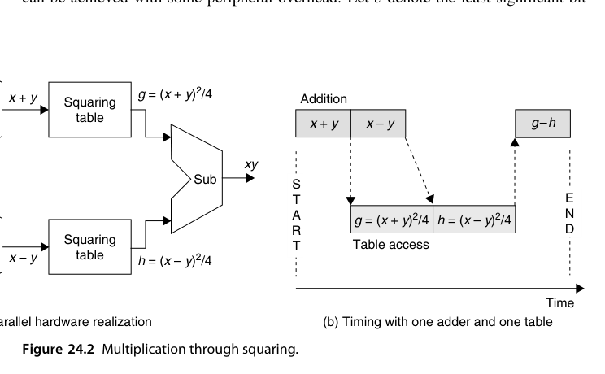
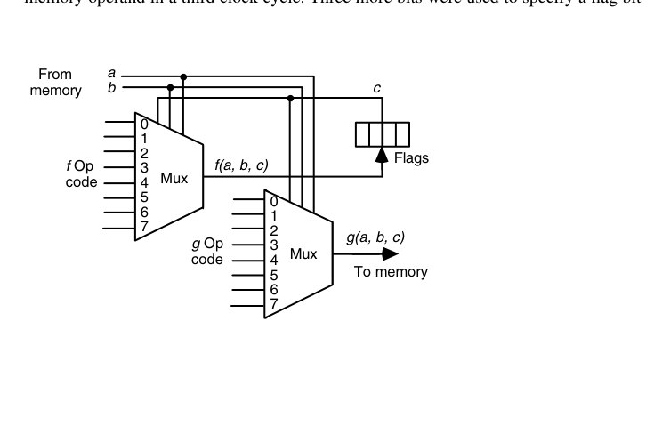
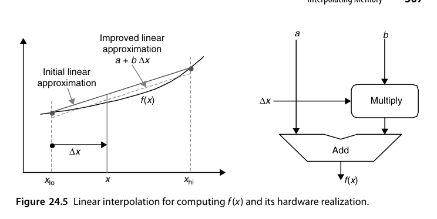
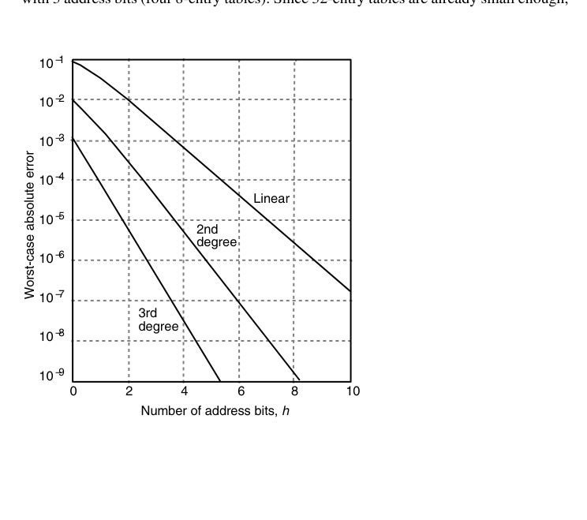
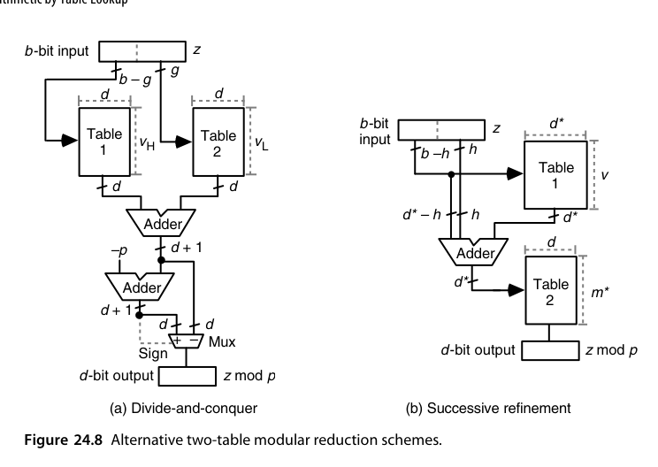
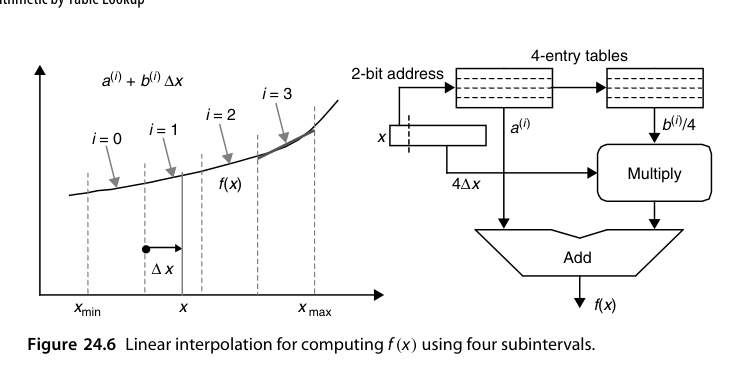
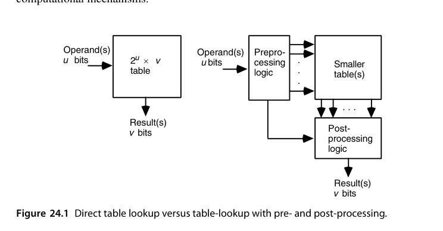
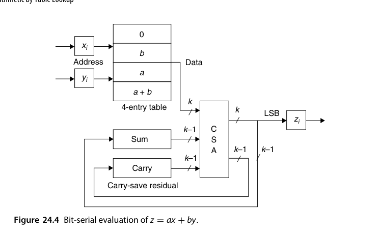

# 第24章 查表算术（Arithmetic by Table Lookup）

## 本章导读

"存起来代替算出来"是最古老的加速思想。ROM/RAM 成本暴跌让查表法从小把戏变成严肃的算术技术：直接查表、插值表、分段表、多部件表（multipartite）。本章的主题是**表大小与精度的经济学**——这也是 16.6 节（除法初值表）与 AI 时代 LUT-based 推理的共同语言。

## 24.1 直接与间接查表（Direct and Indirect Table Lookup)

- **直接查表**：输入 $k$ 位 → $2^k$ 项表。$k$ 稍大就不可行（16 位输入 = 64K 项）——只适用于小位宽或粗精度；
- **间接查表**：先用逻辑把输入**压缩/变换**到更小的索引空间（如利用对称性：$\sin$ 只需存 $[0, \pi/4]$；利用前导零定位规格化），再查小表。

::: {.callout-note title="解读"}
查表法的本质是用**存储换计算**，而"间接"是用**少量计算换大量存储**。这条压缩索引的思路与缓存的组相联、哈希表的设计一脉相通。
:::

查表法在 VLSI 里的物理依据是：**存储比随机逻辑密度高得多**。多兆位查表已实用，且 ROM（尤其加了检错/纠错编码的）比组合逻辑更稳健；若用 RAM + 可重构外围逻辑，同一块硬件换表即算不同函数——设计、验证、测试、改版、维护全线受益。但直接表的容量曲线是指数级的：一元函数（$1/x$、$\ln x$、$x^2$）输入 16~24 位尚可承受（64K~16M 项）；二元函数（$xy$、$x \bmod y$、$x^y$）超过约 12 位就基本出局；三元以上彻底无望。

于是本章的主旋律是三招压表术：**预处理/后处理**（24.2 节）、**位串行化与多位拆分**（24.3 节）、**插值/分段/多部件**（24.4-24.6 节）。纯逻辑实现与纯查表实现是一条谱系的两个端点，实用设计几乎都停在中间某处——两端出发都能推导出同一批混合方案。

## 24.2 二元到一元归约（Binary-to-Unary Reduction)

一种结构化的表实现：把二进制输入译码为"一元/温度计码（thermometer code）"，每根译码线驱动一行表项——本质上就是 ROM 的内部结构（译码器 + 存储阵列）。理解这一层有助于估算"查表"在 ASIC 里的真实成本：**译码逻辑 + 阵列**，而非抽象的"一次访问"。

"用一元函数表算二元函数"有两个经典案例，都值得细看。

**例一：对数数制的加法**（18.6 节）。对数域相加 $L_z = \log(x \pm y)$ 可变换为

$$
L_z = L_x + \log(1 \pm \log^{-1}\Delta), \qquad \Delta = L_y - L_x
$$

预处理：比大小定符号、算 $\Delta$；查一元函数表得 $\log(1 \pm \log^{-1}\Delta)$；后处理：加 $L_x$。三段流水后节拍由表访问时间决定——比纯逻辑的对数加法器划算得多。

**例二：乘法变平方**。恒等式

$$
xy = \frac{(x+y)^2 - (x-y)^2}{4}
$$

把二元乘法化成一元平方：预处理算 $x \pm y$，查平方表（可共用一张表访问两次），后处理一减一移位。表还有免费的压缩：$x+y$ 与 $x-y$ 同奇偶，故两个平方数的最低 2 位相同（$00$ 或 $01$）、相减必然对消——表项可截掉 2 位，末尾移位也省了。更激进的压缩：记 $\varepsilon$ 为 $x \pm y$ 的最低位，可证

$$
\frac{(x+y)^2 - (x-y)^2}{4} = \left\lfloor \frac{x+y}{2} \right\rfloor^2 - \left\lfloor \frac{x-y}{2} \right\rfloor^2 + \varepsilon y
$$

于是丢掉两数的最低位、查 $2^k \times (2^k - 1)$ 的表，再用一个 CSA 把 $\varepsilon y$ 并入三操作数加法——表再省一半，代价是后处理多一路 CSA（$\varepsilon y$ 与首项加法的延迟可被第二次表访问掩盖）。这是"**表容量 vs. 外围逻辑**"权衡的教科书案例。另有一种与函数无关的拆表法：若 $v$ 位结果的低 $w$ 位只依赖输入的低 $l$ 位，可拆成 $2^l \times w$ 与 $2^k \times (v-w)$ 两张表，总容量从 $2^k v$ 降到 $2^k v - (2^k - 2^l) w$。

{fig-align="center" width="85%"}

## 24.3 位串行算术中的表（Tables in Bit-Serial Arithmetic)

位串行运算里，表可以替代组合逻辑：$k$ 位状态 + 输入比特 → 查表得输出与新状态。这是**分布式算术（distributed arithmetic, DA）**的思想源头——把"乘加"的位级结构重排成按位查表累加，FPGA 上实现 FIR 滤波器时大放异彩（28.4 节）。

三个风格迥异的例子说明"表"在位串行世界里能干什么。

**例一：CM-2 的查表 ALU**。Connection Machine CM-2 每个处理器极简（16 个核挤在一片 1980 年代中期的芯片上），ALU 收 3 个 1 位输入、产 2 个 1 位输出，且每个输出允许是输入的任意 $2^{2^3} = 256$ 种布尔函数之一。编码方案令人拍案：每个 3 输入布尔函数恰好由 8 位真值表完全刻画——**真值表本身就是操作码**。硬件上整个 ALU 就是两个 8 选 1 多路器（下图）。做加法时 $a, b$ 是操作数位、$c$ 是进位：$f$ 选多数函数（$00010111$，即 $ab \vee bc \vee ca$）当进位输出、$g$ 选三输入异或（$01010101$）当和位。$k$ 位加法要 $3k$ 拍，但 64K 个处理器并行——"蚂蚁军团"式的取舍。

{fig-align="center" width="85%"}

**例二：位串行模归约**。把数逐位送入，每位 $x_i$ 查小表得 $x_i r^i \bmod m$（$r$ 为基数权），模加进运行和；除最后一次外全部用保留进位加法并与下一次查表重叠——转换延迟 = $k$ 次表访问。这是 4.3 节 RNS 数制转换的表实现。

**例三：位串行线性表达式 $z = ax + by$**（DA 的雏形）。把 $x, y$ 按 LSB 逐位展开：

$$
z = \sum_{i=0}^{k-1} (a x_i + b y_i)\, 2^i, \qquad ax_i + by_i \in \{0,\ b,\ a,\ a+b\}
$$

4 种取值查一张 4 项表，余数递推 $s^{(i+1)} = \lfloor s^{(i)}/2 \rfloor + f(x_i, y_i)$，移出的位即输出 $z_i$——余数保持保留进位形式时**全程不需要进位传播加法器**（结构见章末图 24.4）。$a, b$ 是常数，意味着这张表可退化为纯连线；结果超宽时把输入 0 扩展、晚 $k$ 拍收输出即可。

## 24.4 插值存储器（Interpolating Memory)

直接查表的精度受限于表项数；**插值**让精度起飞：

- 存函数在网格点的值（以及可能的导数），中间值用线性/二次插值；
- 一次"查表" = 读两个邻点 + 一次乘加：$f(x) \approx f(x_0) + (x - x_0) \cdot \frac{f(x_1)-f(x_0)}{x_1 - x_0}$；
- 等价于**分段线性逼近**：表存系数（$a_i, b_i$ 对），计算 $a_i x + b_i$。

精度-成本曲线：表项数减为 $1/n$（区间变宽），误差升为 $O(h^2)$（$h$ 为区间宽）——用一次 FMA 的代价换存储的平方级压缩，通常极划算。

把公式落到实处。插值式表面要 4 加 1 乘 1 除，但把区间端点取成 2 的相邻幂后，除法与两次加法全变成移位/拼位。最粗糙的例子：$[1,2)$ 上的 $\log_2 x$，因 $\log_2 1 = 0$、$\log_2 2 = 1$，线性插值退化为 $\log_2 x \approx x - 1$——最大绝对误差 0.086（在 $x = \log_2 e$ 处），不可用但结构已现。改进一档：不用端点连线，而用**最坏误差最小的斜线**（下图），得 $\log_2 x \approx 0.043\,036 + (x - 1)$，误差减半——但单条直线终究不够，于是把区间切成 $2^h$ 段，每段存一对系数，查表 + 1 乘 1 加完成求值：

$$
f(x) \approx a^{(i)} + b^{(i)}\,\Delta x, \qquad i = x \text{ 的 } h \text{ 个最高位}, \quad \Delta x = \text{其余位}
$$

{fig-align="center" width="85%"}

两个抠门的细节：为省地址/数据位宽，表中存 $b^{(i)}/4$ 而用 $4\Delta x$（天然多 2 个前导 0）做乘法；二阶插值 $a + b\Delta x + c\Delta x^2$ 可再压误差，且 $\Delta x^2$ 的平方能与查表并行，但三阶以上通常不划算。以 $[1,2)$ 上的 $\log_2 x$、4 子区间为例，各段最坏误差从 ±0.0045 递减到 ±0.0016——比单线方案的 0.086 好一个数量级以上。

精度-成本的定量曲线（下图）是选型工具：$m$ 阶插值、$h$ 位地址时表项总数为 $(m+1) \cdot 2^h$。若总表预算 256 字：线性插值可用 $h = 7$（最坏误差约 $10^{-5}$）、二阶 $h = 6$（$10^{-7}$）、三阶（$10^{-10}$）；反过来若指标定为 $10^{-6}$：线性要 $h = 9$（两张 512 项表）、二阶 $h = 5$（三张 32 项表）、三阶 $h = 3$（四张 8 项表）——32 项的表已经够小，三阶多出的乘法器抵不过那点精度收益，通常二阶封顶。不同函数的误差曲线形状与此高度相似（所需地址位差 ±1 以内），因此可以造**通用插值存储器**：换 ROM 内容或重载 RAM 即换函数。

{fig-align="center" width="85%"}

均匀分段之外还能**按曲率分段**：曲率大的区域窄段、平缓区域宽段。非均匀段的地址生成也不贵——例如 $[0,1)$ 按前缀模式 $0xx, 10x, 110, 111$ 分成宽度 1/2, 1/4, 1/8, 1/8 的四段，几根门线即可把 3 位区间索引译成表地址；代价是各段 $\Delta x$ 的提取规则不同。

## 24.5 分段查找表（Piecewise Lookup Tables)

函数曲率不均匀时（如 $1/x$ 在 $x \to 0$ 附近剧烈弯曲），**均匀分段浪费表项**：平缓区段可以稀疏，剧烈区段必须密集。变长分段（地址高位先经"段译码"）让存储预算花在刀刃上。与 23.5 节分段多项式是同一思想。

两个代表性方案把"操作数切片查表"发挥到极致。

**例一：单精度函数求值（Wong 方案）**。把 26 位尾数 $x$（2 整数位 + 24 小数位）切成四段：

$$
x = t + \lambda u + \lambda^2 v + \lambda^3 w, \qquad \lambda = 2^{-6}
$$

在 $t + \lambda u$ 处做泰勒展开、丢弃 $\lambda^5$ 以下各项，得

$$
f(x) \approx f(t{+}\lambda u) + \frac{\lambda^2}{2}\left[f(t{+}\lambda u{+}\lambda v) - f(t{+}\lambda u{-}\lambda v)\right] + \frac{\lambda^2}{2}\left[f(t{+}\lambda u{+}\lambda w) - f(t{+}\lambda u{-}\lambda w)\right] + \lambda^4\left[\frac{v^2}{2}f^{(2)}(t) - \frac{v^3}{6}f^{(3)}(t)\right]
$$

流程：4 次加法造出 4 个 14 位查表地址 → 读 5 个 $f$ 表值 + 1 个修正项表值 → 一次六操作数加法。可证误差 $< 2^{-24} = \text{ulp}/2$；对 24 位操作数穷举实测精度 27.3~33.3 位——**查表为主、外围几乎只有加法**的单精度函数求值方案。

**例二：模归约的两表法**。求 $b$ 位数 $z \bmod p$（$d = \lceil \log_2 p \rceil$）。**分治式**：把 $z$ 按 $g$ 位切成高低两半 $z = 2^g z_H + z_L$（$g \ge d$），两半各查一张 $d$ 位余数表、相加后试减 $p$ 定结果；总表容量 $d(\lceil m/2^g \rceil + 2^g)$ 在 $g = \lfloor b/2 \rfloor$ 时最小——例：$p = 13$、$m = 2^{16}$ 时总容量 2048 位，比直接查表省 128 倍。**逐次精炼式**：高位 $b - h$ 位查第一张表得"应减去的 $p$ 之倍数"的低位部分，加到 $z$ 上把范围从 $[0, m)$ 压到 $[0, m^*)$（$p < m^* \ll m$），第二张 $m^*$ 项表直接查 $z^* \bmod p$；例中取 $d^* = 9$、$m^* = 269$，总容量 3380 位——表比分治式大，但外围只剩一个加法器（$m^* < 2p$ 时第二张表还能退化成减法器 + 多路器）。两方案见下图。

{fig-align="center" width="85%"}

## 24.6 多部件表方法（Multipartite Table Methods)

**Multipartite / 双侧（bipartite）表**：把输入拆成高、中、低几段，函数值近似为几张小表之和：

$$
f(x) \approx T_0(x_{hi}) + T_1(x_{hi}, x_{mid}) + T_2(x_{hi}, x_{lo})
$$

每张表都比全表小得多，总和误差可控。典型效果：24 位精度的倒数表，直接查表需天文存储，bipartite 只需几十 KB。

**Bipartite（双部件）表**是插值思想的一次"去乘法化"。把 $k$ 位输入 $x$ 切成三段：$x_0$（$a$ 位，选区间）、$x_1$（$b$ 位，选子区间）、$x_2$（其余 $k - a - b$ 位）。区间内所有子区间**共用一条斜率**，斜率乘 $x_2$ 的全部可能取值于是可以直接制表：

$$
f(x) \approx \underbrace{u(x_0, x_1)}_{\text{子区间常数表，} 2^{a+b} \text{ 项}} + \underbrace{v(x_0, x_2)}_{\text{区间斜率} \times x_2 \text{ 表，} 2^{k-b} \text{ 项}}
$$

两张表 + 一个加法器——加法器还能省掉：两表输出按保留进位形式直接交给后续计算步骤。误差有四个来源：线性化截断、区间共用斜率、表项舍入（$g$ 位保护位）、最终舍入；设计自由度就是 $a, b, g$ 三个参数，任务是凑出目标误差下的最小总表容量。

::: {.callout-tip title="算例：24 位函数表的压缩倍数"}
$k = 24$ 时直接查表需 $2^{24}$ 项。取 $a = b = 8$：两张 $2^{16}$ 项表共 $2^{17}$ 项，**压缩 128 倍**；$a = 7, b = 8$ 压到约 170 倍（精度略降）；$a = 10, b = 7$ 精度更好但压缩降到 64 倍。多数初等函数在此配置下可达 1 ulp 误差——即**忠实舍入（faithful rounding）**：误差不超过 1 ulp、方向任意；更强的**精确舍入（exact rounding）**要求误差 $\le \frac{1}{2}$ ulp，纯表方法一般做不到。
:::

两个增强方向。**对称 bipartite**：利用每个子区间内函数值关于中点近似对称，表存中点值、按 $x_2$ 最高位决定加/减斜率项并做选择性取补——表再省一半，代价是两排异或门与微小附加误差。**Multipartite**：推广到三张表以上——tripartite 把输入切成 4 段，三张表分别以 $(x_0, x_1)$、$(x_0, x_2)$、$(x_0, x_3)$ 为地址，进一步压表并改善误差。表内容的优化（误差估算 + 搜索式系数微调）是落地时的主要工作量。

::: {.callout-important title="为什么今天仍要读这一节"}
Multipartite 思想是**现代函数单元（GPU SFU、AI 加速器 LUT 单元）内部结构的直接祖先**："粗表 + 修正表 + 小乘法"的三件套无处不在。它与插值（24.4）、分段（24.5）自由组合，构成函数硬件化的完整工具箱。
:::

{fig-align="center" width="85%"}

## 本章小结

- 查表 = 存储换计算；间接查表 = 少量计算换大量存储。
- 插值把表项需求平方级压缩；分段把存储花在高曲率区。
- Multipartite：多张小表之和逼近一张大表，现代 SFU 的内部结构。
- 表方法与前 22/23 章的迭代/多项式方法自由组合，构成函数求值全景。

## 原书插图

{fig-align="center" width="85%"}

{fig-align="center" width="85%"}
