# 第25章 高吞吐算术（High-Throughput Arithmetic）

## 本章导读

第七部分从"算法"转向"系统"。吞吐量（throughput）才是现代芯片的第一指标——GPU 的单精度算力、交换芯片的包转发率，靠的都是流水线。本章讲算术部件的流水化原则、时钟与吞吐的关系、以及脉动阵列（systolic array）——今天 AI 加速器的体系结构原型。

## 25.1 算术函数的流水化（Pipelining of Arithmetic Functions）

**流水线（pipeline）**：在组合逻辑中插入寄存器，把一次长延迟计算切成 $\sigma$ 级，每级一个时钟周期。效果：

- 时钟周期 ≈ 原延迟的 $1/\sigma$（+寄存器开销）；
- 延迟（latency）不变甚至略增，但**吞吐提升近 $\sigma$ 倍**——每拍可吞入一个新任务。

算术部件的流水切分原则：

- **均衡级延迟**：关键路径决定时钟，切分不均等于白送频率；
- **寄存器开销**：算术数据通路宽，流水寄存器面积可占 20-40%——级数不是越多越好；
- **Hazard 设计**：迭代型算法（除法、CORDIC）反馈环内不能随意插寄存器——这是"可流水"与"不可流水"算法的分水岭。

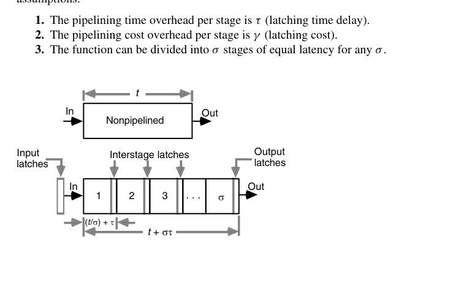{fig-align="center" width="85%"}

一组具体数字有助于建立直觉。设某乘加单元 $t = 40\,\mathrm{ns}$、$g$ 折合 500 个门，锁存器时间开销 $\tau = 2\,\mathrm{ns}$、成本开销 $\gamma = 25$ 门。不流水时吞吐为 $1/40\,\mathrm{ns} = 25$ Mops；切成 4 级后每级 $10\,\mathrm{ns}$，时钟周期 $12\,\mathrm{ns}$，吞吐升到约 83 Mops（3.3 倍），端到端延迟从 40 ns 变为 48 ns，成本增加约 20%。若进一步切成 8 级，周期降到 $7\,\mathrm{ns}$、吞吐约 143 Mops（5.7 倍），但此时寄存器开销已与原逻辑的一半相当，且 $\tau$ 已占去周期的近三成——继续切下去，每一刀换来的频率越来越少。

流水线的**效率（efficiency）**定义为加速比与级数之比 $E = S/\sigma$：级间延迟完全均衡且 $\tau = 0$ 时 $E = 1$；上例中 4 级流水的加速比为 3.3，效率 0.83，8 级时降到 0.71。$\tau$ 固定时令级数继续加大，效率单调下滑。效率曲线与吞吐曲线放到同一张图上看，合理的工作点通常落在"吞吐尚未饱和、效率尚可接受"的拐角附近——这也是为什么实际设计很少用到理论最优级数，而是停在它的一半到三分之二处。

**定量模型**。设原功能单元成本为 $g$、延迟为 $t$，每级锁存的时间开销为 $\tau$、成本开销为 $\gamma$，且函数能被切成 $\sigma$ 个延迟相等的级，则流水线版本的三项指标为

$$
T = t + \sigma\tau, \qquad
R = \frac{1}{T/\sigma} = \frac{1}{t/\sigma + \tau}, \qquad
G = g + \sigma\gamma
$$

$R \to 1/\tau$ 是理论天花板。但工程上把级内逻辑压到约 4 级门（$4\delta$）就停手——再切下去，级间信号条数增加带来的 $\gamma$ 增长、以及时钟树的功耗，会把频率收益全部吃掉。取级延迟恰为 $4\delta$（即 $\sigma = t/4\delta$）时，三式化为

$$
T = t\left(1 + \frac{\tau}{4\delta}\right), \qquad
R = \frac{1}{4\delta + \tau}, \qquad
G = g\left(1 + \frac{t\gamma}{4g\delta}\right)
$$

括号里那两项就是"为极限吞吐付出的延迟税与面积税"——它们只依赖工艺与寄存器结构，与被流水化的函数无关。

**最优级数**。吞吐不是唯一目标时，一个自然的品质因数是"单位成本的吞吐"

$$
E = \frac{R}{G} = \frac{\sigma}{(t + \sigma\tau)(g + \sigma\gamma)}
$$

令 $\mathrm{d}E/\mathrm{d}\sigma = 0$，得到

$$
\sigma_{opt} = \sqrt{\frac{tg}{\tau\gamma}}
$$

结论朴素而有用：**原函数越慢越复杂（$t, g$ 大）、锁存越快越便宜（$\tau, \gamma$ 小），级数就该越多**。举个具体数字：$t = 40\delta$、$g = 500$ 门、$\tau = 4\delta$、$\gamma = 50$ 门，得 $\sigma_{opt} = 10$——代价是成本与延迟各翻一倍，换来吞吐提升 5 倍。把流水线冒险（数据相关、条件执行迫使排空）算进去之后，实际最优级数会明显小于这个解析值。

::: {.callout-tip title="工程解读"}
这组公式的用处不在于给出精确级数，而在于给出**校正方向**：换更快的锁存器（降 $\tau$）或更窄的接口（降 $\gamma$），最优级数立刻右移；反过来，若切分点选在函数内部的"胖"边界上（几十条信号要过寄存器），$\gamma$ 暴涨，级数必须收敛。这也解释了为什么深流水总伴随着"寻找自然边界"的人工匠心——自动切分工具必须先学会估算每个切点的信号条数。
:::

什么时候不能流水？只要算法内部存在携带反馈的递推 $s^{(j)} = F(s^{(j-1)})$——除法的部分余数递推、IIR 滤波器的输出回授、CORDIC 的迭代——寄存器就只能插在递推环路之外，环路延迟照旧限制迭代速率。对付这类结构的办法不是硬插流水，而是**变换算法本身**：第 26.5 节的循环展开、第 16 章把除法递推改造成乘法链的收敛法，都是把"不可流水的递推"变成"可流水的直馈"的范例。

反过来看，哪些算术单元天然适合深流水？凡是可以写成**直馈数据流图**的结构都行：阵列/树形乘法器（部分积阵列一层就是一级）、FIR 滤波器（每个抽头一级）、查表 + 乘加的函数求值链。这些结构的共同点是"数据只朝一个方向走"，寄存器可以插在任意位置而不改变功能——这也正是第 26.5 节重定时变换合法的前提。

## 25.2 时钟速率与吞吐（Clock Rate and Throughput）

吞吐 = 每拍任务数 × 时钟频率。提升路径只有两条：**更深流水**（缩短周期）与**更宽并行**（每拍更多任务）。物理现实：

- 流水深度有收益拐点（寄存器延迟占比、时钟树功耗、分支/依赖惩罚）；
- 并行度受面积/功耗墙约束——这就是"功耗墙"时代转向专用加速器（NPU/TPU）的根本逻辑：用**领域定制的并行**取代通用高频。

两条路径还可以组合：超宽数据通路 + 深流水。GPU 的 SIMT 是"每拍更多任务"的极限形态（一个 warp 32 个线程共用同一条流水线），超标量 CPU 则是"更深流水 + 乱序填坑"的代表。选择哪边取决于负载的**规则性**：数据级并行度越高、控制流越平直，越应该走宽度方向（宽而慢，能效还好）；依赖链长、分支密集的标量代码，只能往深里切并承担冒险惩罚。

**时钟周期的严格下界**必须把**时钟偏斜（clock skew）**算进来。若随机偏斜的上界为 $\pm\varepsilon$，最坏情形下输入锁存晚到 $\varepsilon$、输出锁存早到 $\varepsilon$，可用于计算的时间被扣掉 $2\varepsilon$：

$$
\Delta t \ge t_{stage} + \tau + 2\varepsilon
$$

当级数很多、$\Delta t$ 很小时，$\varepsilon$ 所占比例上升——这就是为什么深流水通常要配更昂贵的时钟分配网络（H 树、网格、去偏斜电路）。

代入数字感受更深：2 GHz 设计（周期 500 ps）中，若锁存开销 50 ps、随机偏斜 ±50 ps，级内可用于逻辑的预算只剩 300 ps——偏斜一项吃掉两成预算。频率升到 4 GHz，同样的 50 ps 偏斜占比立刻翻倍；而偏斜绝对值并不随工艺同步缩小，这就是 GHz 级深流水芯片里时钟网络动辄占去两三成总功耗的原因。

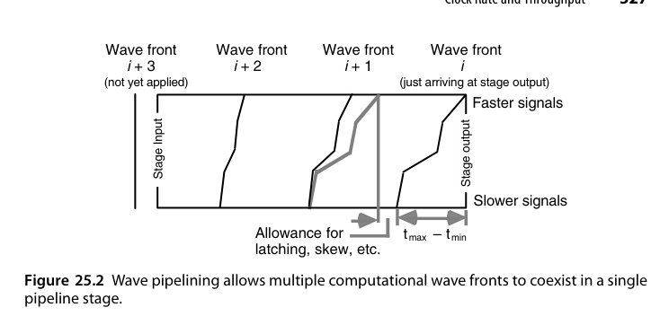{fig-align="center" width="85%"}

**波流水（wave pipelining）**是一个反直觉的技巧。级延迟并非常数，最快路径为 $t_{min}$、最慢路径为 $t_{max}$；既然两者之间存在时差，为什么不干脆让多个"计算波前"同时在一个流水级里穿行？只要相邻两组输入的信号在**空间上**（沿逻辑深度方向）彼此分开，它们在**时间上**重叠并无害处：

$$
\Delta t \ge t_{max} - t_{min} + \tau
$$

于是提高吞吐有两条路：传统的**减小 $t_{max}$**，以及反直觉的**抬高 $t_{min}$**——即延迟均衡化。极端情形下 $t_{max} - t_{min} = 0$，$\Delta t$ 只要大于等于 $\tau$ 即可，此时必须在输出锁存处人为注入**受控时钟偏斜（controlled clock skew）**才能正确采样第 $i$ 级的结果：

$$
S^{(i)} = \left(\sum_{j=1}^{i} \bigl(t^{(j)}_{max} + \tau\bigr)\right) \bmod \Delta t
$$

例：$t_{max} + \tau = 12\,\mathrm{ns}$、$\Delta t = 5\,\mathrm{ns}$，则输出锁存相对输入锁存需要 $+2$ ns 的偏斜。波流水的代价是对随机偏斜更敏感：$\Delta t \ge t_{max} - t_{min} + \tau + 4\varepsilon$——输入、输出两端各有 $2\varepsilon$ 的最坏损失，而分母如今已经很小了。

波流水的思想可以追溯到 1960 年代末 Cotton 对"最大速率流水"的研究，1990 年代一度成为研究热点（当时期望用它把时钟频率推过传统流水线的极限）。它最终没有进入主流 EDA 流程，根本原因在于延迟均衡必须对**工艺、电压、温度（PVT）全域**成立——仿真里对齐的两条路径，到了硅片上、到了高温角落里就会错开，而波流水恰恰把性能押在这个错开量上。

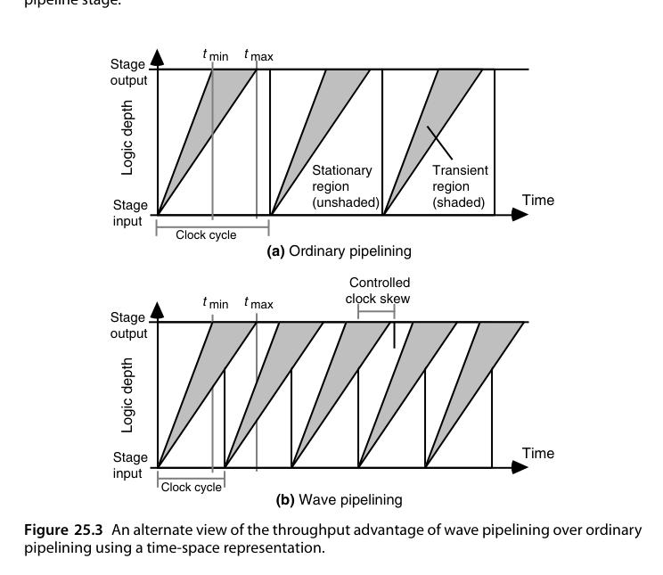{fig-align="center" width="85%"}

::: {.callout-note title="波流水的现代回响"}
波流水在工业界从未成为主流设计风格（对工艺漂移和数据相关的延迟极其敏感），但它留下了一个持久的观念：**均衡路径既是低功耗手段（消除毛刺），也是高吞吐手段（压缩 $t_{max}-t_{min}$）**。第 26 章会从能耗角度再次遇到同一件事。
:::

## 25.3 Earle 锁存器（The Earle Latch）

经典高速锁存技术：把锁存器嵌入逻辑门内（时钟与数据路径合并优化），减少每级流水的"寄存器税"。它代表了**电路级流水优化**——当逻辑级延迟已经很小时，锁存器自身的建立/保持开销占比上升，必须电路结构创新。现代对应物：脉冲锁存器（pulsed latch）、时间借用（time borrowing）。

Earle 锁存器的行为方程是一条带反馈的与或式：

$$
z = dC \lor dz \lor Cz
$$

$C = 1$ 时输出跟随数据输入 $d$；$C$ 由 1 降到 0 的瞬间采样并保持，此后只要 $C$ 保持为 0，$d$ 的变化不影响 $z$。它最初是为锁存进位保存加法器（carry-save adder）而设计的。

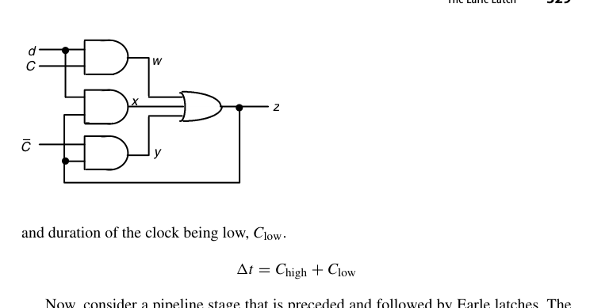{fig-align="center" width="85%"}

真正有价值的性质是：**它能与前级的两级与或逻辑合并，而不增加一级门延迟**。设前级算出 $d = vw \lor xy$，代入上式展开得

$$
z = (vw \lor xy)C \lor (vw \lor xy)z \lor Cz
  = vwC \lor xyC \lor vwz \lor xyz \lor Cz
$$

结果依然是一个两级与或网络——锁存器只是给与阵列多添了几个带 $C$ 或 $z$ 的乘积项。这就是所谓的"零延迟锁存"：在关键路径上，加法器的最后一级逻辑与寄存器合二为一。

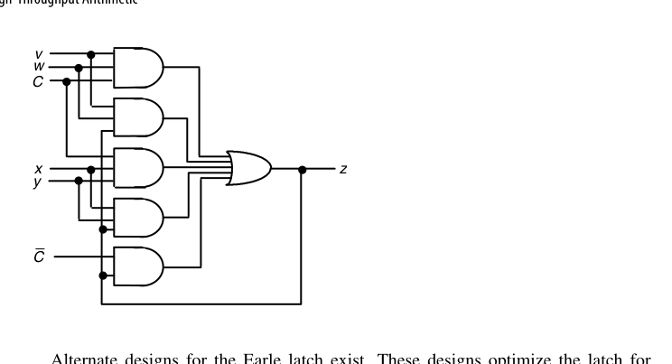{fig-align="center" width="85%"}

代价是对**时钟脉冲宽度**施加了双边约束。设最大/最小门延迟为 $\delta_{max}, \delta_{min}$，级最小延迟为 $t_{min}$，则

$$
3\delta_{max} - \delta_{min} + S_{max}(C{\uparrow}, \bar{C}{\downarrow}) \le C_{high} \le 2\delta_{min} + t_{min}
$$

下界保证：数据确实被保存下来，且当 $C$ 的 0→1 略微领先 $\bar{C}$ 的 1→0 时不至于因逻辑冒险（hazard）锁进错值；上界保证：时钟必须在**下一组输入的最快信号**来得及改变本锁存器输入之前变低。这类"同时有上下界的时序约束"正是 Earle 锁存器难用之处，也是后续各种改进型（如不需要数据扇出的变体）试图简化的地方。

代入一组数感受一下窗口有多窄：$\delta_{max} = 0.3\,\mathrm{ns}$、$\delta_{min} = 0.15\,\mathrm{ns}$、级最小延迟 $t_{min} = 0.6\,\mathrm{ns}$，忽略 $S_{max}$ 项，则 $C_{high}$ 必须落在 $[0.75,\ 0.9]\,\mathrm{ns}$ 内——整个时钟周期里高电平的合法宽度只有 150 ps。这样的约束只能由电路设计师手工保障，无法丢给标准单元流程，这正是 Earle 锁存器留在定制数据通路（手工设计的乘法器、寄存器堆）而没有进入 ASIC 综合流程的原因。

把 Earle 锁存器嵌进进位保存加法器（它最初的应用场景）之后，一条乘法累加链的每级延迟可以压到 3 级门左右——早期高性能乘法器能把时钟周期做得极低，靠的正是这类电路技巧。今天的对应技术包括脉冲触发器（pulsed flip-flop）、相邻透明锁存器之间的时间借用（time borrowing）、以及把锁存功能分摊进多米诺逻辑的动态锁存结构。共同思想不变：**当时钟周期逼近几级门延迟时，寄存器不能再是外挂的盒子，必须融化进逻辑里。**

## 25.4 并行与数字串行流水线（Parallel and Digit-Serial Pipelines）

**数字串行（digit-serial）**：介于位串行（1 比特/拍）与全并行（$k$ 比特/拍）之间，每拍传 $d$ 位（一个"digit"）。$k$ 位数据 $k/d$ 拍传完：

- 面积 ≈ 全并行的 $d/k$；
- 吞吐 = 全并行的 $d/k$；
- **面积-吞吐乘积近似不变**，但功耗/布线的甜点往往在中等 digit 宽度。

这是 NoC 链路、SerDes 接口、以及资源受限 FPGA 设计的常用刻度尺。

以 32 位数据通路为例：全并行乘法器需要 32 位宽的压缩树与最终加法器；digit 宽度取 8，则同样功能可用约 1/4 的数据通路面积在 4 拍内完成；取 $d = 4$ 则面积约为 1/8、8 拍完成。翻转的电容随数据通路同比例缩小，总**功率**近似按面积下降，而每次操作的**能量**基本不变——这正是数字串行在低功耗场景的真实卖点：省的是功率与面积，不是能量。

digit 宽度的最优值由两个相反趋势夹出来：$d$ 越小，数据通路越省，但控制、寄存器与接口的固定开销占比越大，且完成一次运算的拍数越多；$d$ 越大则迅速逼近全并行的成本。经验上甜点常落在 $k/8$ 到 $k/4$ 之间。还有一条布线视角的约束：digit 宽度决定了每个周期要在模块间搬多少条线，在布线资源紧张的设计（FPGA、高密度标准单元）里，$d$ 常常是被布线而不是被逻辑面积钉死的。

关键在于：**哪些运算天生低位序可流水，哪些不是**。以

$$
z = \left(\frac{(a+b)\,c\,d}{e-f}\right)^{1/2}
$$

为例，它由两次加/减、两次乘法、一次除法、一次开方按固定流图串成。

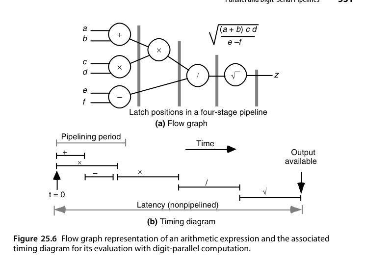{fig-align="center" width="85%"}

加法和乘法可以**最低位优先（LSB-first）**位串行地做：只要 $a+b$ 和 $c \times d$ 的最低位一出来，下一级乘法器就能开工——每往关键路径上挂一个功能单元，总延迟几乎不增加。流动性好得惊人。

把图 25.6 的时账具体化：设加/减单元需 $t_a$、乘法器需 $t_m$、除法与开方各需 $t_d$。数字并行方案的总延迟约为 $2t_a + 2t_m + 2t_d$，且每个单元算完就闲置，利用率极低；数字流水方案中乘法器在加法器吐出第一个数字后即开工，整条链的完成时间只比最慢的那个单元多出一小段"排头"时间。挂进链里的单元越多、链越长，这种重叠的收益越大——这是数字流水相对数字并行的本质优势。

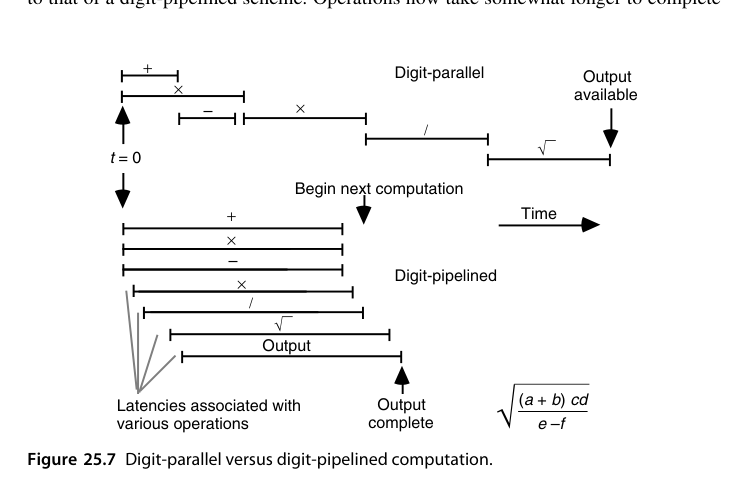{fig-align="center" width="85%"}

除法和开方却必须**最高位优先（MSB-first）**，而且它们的首位依赖于操作数的**所有位**。看一个十进制例子，$0.1234/0.2469$：

- 只看首位数字 $0.1xxx / 0.2xxx$，商的首位可能在 $[3, 9]$ 中的任何一位（最小约 $0.1000/0.2999 \approx 0.3334$，最大约 $0.1999/0.2000 \approx 0.9995$）；
- 看到第二位仍不解决问题，$0.12xx/0.24xx$ 落在约 $[0.4802, 0.5413]$；
- 直到看完全部四位，才能确定首位商 $q_{-1} = 4$。

因此，**用标准（非冗余）数制做位串行/数字串行的全流水级联，只能覆盖"加法-乘法"链**；除法和开方必须先把操作数收齐，再回到第 14、21 章的完整算法。唯一的出路是**允许结果以冗余形式输出**——冗余数允许事后修正选错的商位/根位，所以只需操作数的高几位就能定出下一位。这是第 25.5 节在线算术的动机。

## 25.5 在线/数字流水算术（On-Line or Digit-Pipelined Arithmetic）

**在线算术（on-line arithmetic）**：操作数与结果都按**最高位先出**的串行流，第 $j$ 位结果在收到前 $j + \delta$ 位输入后即可产出（$\delta$ 为在线延迟）。它让长串算术运算（如 $((a \times b) + c) / d$）可以**全流水级联**：上一级的结果高位先行喂给下一级，总延迟 ≈ 各部件在线延迟之和，而非各自完整延迟之和。

代价：需要冗余表示（高位先行意味着修正只能向低位传播）、控制复杂。在专用信号处理流水线（CORDIC 级联、复数运算链）中有独特价值。

结果最终以冗余形式产出，而系统其余部分多半要常规二进制。好在转换可以**在线进行（on-the-fly conversion）**：维护两个寄存器 $Q$（已收到前缀在"当前位为 0"假设下的值）与 $Q^-$（"当前位为 $-1$"假设下的值），每来一个新数字就按三种情况同时更新两者，最后一个数字到达时直接选出正确值——整个转换被吸收进串行流，不需要额外的一次完整加法。

在线算术最成功的落点是**固定拓扑的信号处理链**：自适应滤波器的状态更新（乘加交替）、坐标变换（CORDIC 旋转 → 伸缩 → 反三角的级联）、复数运算链。这些场景里各级单元全部 MSB-first 流水，中间没有任何位宽转换与整字缓冲，端到端延迟约等于各级在线延迟之和再加链长——比起"每个单元收齐整个字再开工"的传统组织，流水深度直接降了一个量级。

二进制有符号数字（BSD, binary signed-digit）——基 2、数字集 $[-1, 1]$——给出最简单的在线硬件。更高的基 $r = 2^j$ 用更大的数字集把周期数降下来，但元胞更复杂、引脚更多，能否真的更快要看时钟频率是否同步下降；实践中 $r > 16$ 很少划算。浮点数还要求指数先到、尾数后处理，属于可直接叠加的工程细节。

各类基本运算的**在线延迟**（收到第 $i$ 位输入到产出第 $i$ 位输出之间的拍数）如下：

| 运算 | 在线延迟（拍） | 前提 |
|---|---|---|
| 加法 | 1 / 2 | 数字集支持无进位加法 / 只能有限进位加法 |
| 乘法 | 1 / 2 | 同上 |
| 开方 | 1 - 2 | 视数制而定 |
| 除法 | 3 / 4 | 支持无进位加法 / 只能有限进位加法 |

读这张表的方式：加法和乘法"看见输入的高位就能产出结果的高位"，所以延迟最小；开方稍难，因为根的高位受被开方数低位的微弱影响；除法最难，因为商同时受被除数与除数两端不确定性的拉扯（下面会用一个基 4 的例子看清这一点）。这张表也是设计在线运算链的"接线图"——把各单元的在线延迟错开对齐，数据流才能严丝合缝地咬合。

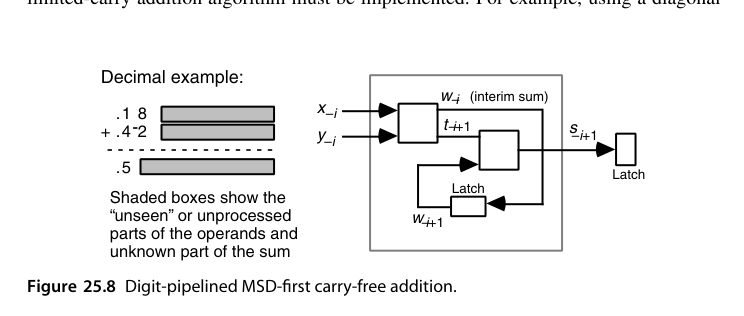{fig-align="center" width="85%"}

加法的第 $-i$ 位结果只依赖两个操作数的第 $-i$ 与 $-i-1$ 位（这正是第 3 章无进位加法的定义），所以收到两个最高位数字就能吐出结果的最高位——图中斜线右侧的阴影代表"尚未看到"的操作数低位与"尚不可知"的和的低位。

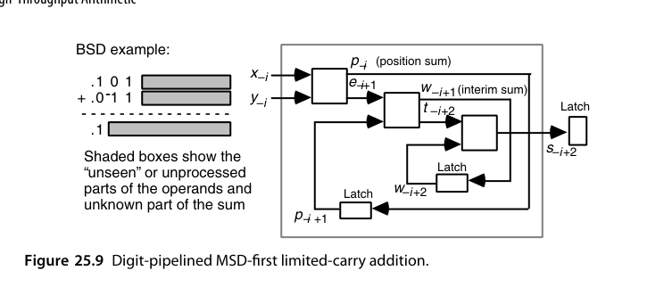{fig-align="center" width="85%"}

BSD 输入不满足无进位加法的条件，必须改用有限进位加法：先算位置进位 $t_{-i+2}$ 与位置和 $w_{-i+1}$，再合并出临时和 $w_{-i}$，因此多用一级锁存延迟，在线延迟变成 2 拍。

除法的延迟之所以高达 3-4 拍，直观原因是被除数与除数的不确定性对商的影响方向相反，必须同时收窄两端。以 $r = 4$、数字集 $[-2, 2]$ 为例（可表示范围仅为 $(-2/3,\, 2/3)$）：

- 第 1 拍：被除数 $(.0\cdots)_4$、除数 $(.1\cdots)_4$ → 商落在 $(-2/3,\,2/3)$，$q_{-1} \in [-2, 2]$；
- 第 2 拍：$(.00\cdots)_4 / (.1\bar{2}\cdots)_4$ → 收窄到 $(-1/2,\,1/2)$，仍不足以定出首位；
- 第 3 拍：收窄到 $(1/16,\,5/16)$，$q_{-1} \in [0, 1]$；
- 第 4 拍：才最终收敛到 $q_{-1} = 1$。

有人证明过：只要数制支持无进位加法，3 拍总是充分必要；若只能做有限进位加法，则需要 4 拍。

在线乘法的递推值得写下来。设到第 $i$ 拍为止，两个操作数已收到的高位部分分别构成前缀 $A_{[i]}$ 与 $X_{[i]}$，新到数字为 $a_{-i}$、$x_{-i}$。部分积满足

$$
P_{[i]} = P_{[i-1]} + \bigl(a_{-i} X_{[i-1]} + x_{-i} A_{[i-1]}\bigr)\, r^{-i} + a_{-i} x_{-i}\, r^{-2i}
$$

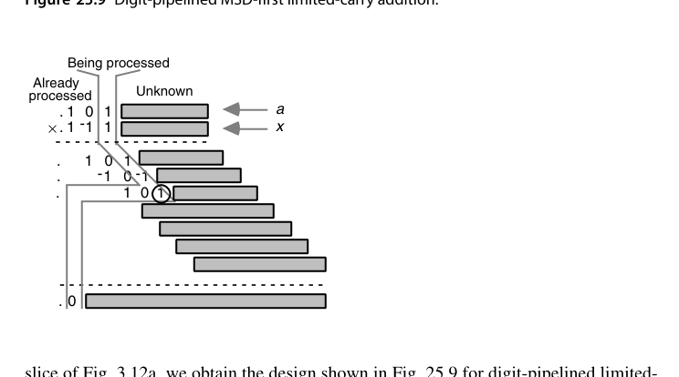{fig-align="center" width="85%"}

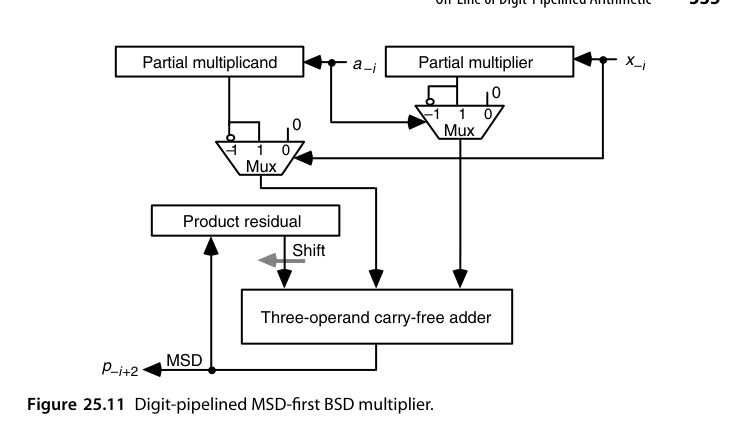{fig-align="center" width="85%"}

乘法的每拍工作是：把新到的 $a_{-i}$ 与 $x_{-i}$ 分别乘上已有的部分乘数和部分被乘数，再加上 $a_{-i}x_{-i}$，与左移一位的乘积残量 $p^{(i-1)}$ 做三操作数无进位加法；结果的最高位就是本拍要输出的数字，被丢弃，余下的数字构成新的残量 $p^{(i)}$。

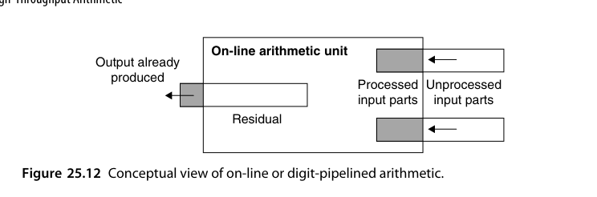{fig-align="center" width="85%"}

所有在线运算共用同一幅图景：**残余（residual）+ 已处理前缀 + 未处理后缀**。对除法而言，残余量就是"被除数减去已知的商数字与除数相乘所得的部分积"；每确定一位商，就从这个残余里减去两项乘积（新商位 × 部分除数、新除数位 × 部分商），再用残余的高几位去估计下一位商。这与第 14 章 SRT 的残余递推是一回事，只不过操作数是"逐位抵达"的。

::: {.callout-warning title="为什么在线算术没有普及"}
在线算术用很小的在线延迟换来了"运算链全流水"的能力，在 CORDIC 级联、复数乘加链这类固定拓扑中有过成功应用；但它要求全局统一采用冗余数、并承担最后的冗余-二进制转换开销。当 VLSI 引脚限制不再是瓶颈、而设计周期与工具链成为瓶颈时，"大家都写 `$a + b$`"的结构胜出了。它的思想遗产留在今天的流式数据流架构里。
:::

## 25.6 脉动算术单元（Systolic Arithmetic Units）

**脉动阵列（systolic array）**：大量简单 PE（处理单元）规则连接，数据像血液一样在阵列中"脉动"流动，每个 PE 每拍做一次小运算（通常是 MAC）并把结果传给邻居。性质：

- 计算与通信**严格局部化**——无全局总线、无长连线；
- 完美流水：阵列越大吞吐越高，延迟线性增长但吞吐恒定；
- 矩阵乘法是最经典映射。

判据还需要加严一条：**任何未经锁存的信号都不允许跨多个单元传播**——否则行波进位加法器也要算「脉动」了。进位链不经寄存器地横跨整个字宽，所以它不是脉动结构；这一条把「局部性」从几何要求提升成了时序要求。

三个值得记住的构造实例：

- **阵列乘法器 → 位并行脉动乘法器**。图 11.18 的流水阵列乘法器把 $a_i$ 广播给整列、把 $x_j$ 广播给整行；把广播改成「从前一个 PE 接过来、每拍往下（或往右）传一格」，同时在其余输入路径上补齐等量延迟，电路功能完全不变——这种变换叫**脉动重定时（systolic retiming）**。若要求乘积各位同时可用，还要在 $p$ 输出路径上补延迟。
- **数字流水乘法器 → 脉动形式**。图 25.11 中 $a_{-i}$ 与 $x_{-i}$ 驱动一大批 2 选 1 多路器，扇出巨大；但并不需要立刻用到 $x_{-i}a_{[-1,-i+1]}$ 的全部数字，因此可以把相关动作沿阵列铺开：头元胞先形成最高位，输入数字继续右传、结果左传。

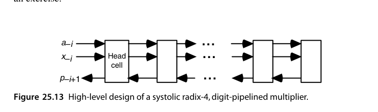{fig-align="center" width="85%"}

- **Montgomery 模乘**天生适合脉动化：它的"是否减去模 $m$ 的倍数"由**最低位**决定，与进位从低位向高位传播的方向一致，从而化解了第 15.4 节提到的方向冲突；只需把普通阵列乘法器的元胞换成能存部分积位并能做加法带 $m$ 的复杂元胞即可。

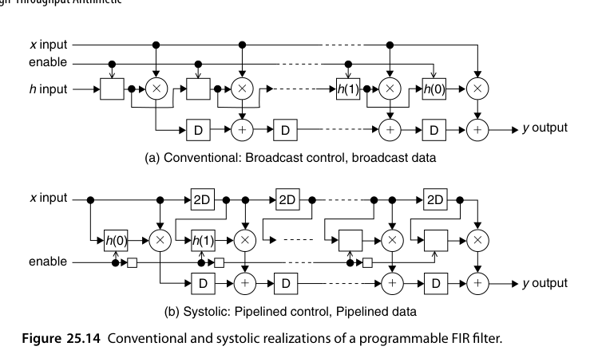{fig-align="center" width="85%"}

$N$ 抽头 FIR 的常规实现是 $y(t) = \sum_{i=0}^{N-1} h(i)\,x(t-i)$：系数 $h(i)$ 由控制信号广播到所有抽头单元。脉动版本把**数据与控制一起流水化**：输入样本沿链一级级右传，系数载荷也随时间戳向前传递，不再有任何信号需要跨越整个阵列。

把时序账算清楚：常规广播实现的时钟周期里含一条穿越全部 $N$ 个抽头的广播线，其延迟随 $N$ 线性增长，吞吐随之衰减；脉动版本中每条连线只连接相邻单元，时钟周期与 $N$ 无关——$N$ 加倍只是把流水填满的时间（延迟）加了几拍，每拍出一份结果的速率分毫不变。这个"延迟换吞吐、且延迟只涨线性"的交换比，正是脉动结构在大规模阵列上不可替代的原因。

矩阵乘法映射到脉动阵列有三种经典数据流：**输出固定**（每个 PE 持有一个 $C_{ij}$ 累加器，$A$ 的行与 $B$ 的列交叉流过）、**权重固定**（TPU v1 的选择：权重预先载入 PE，激活流过阵列）、**行固定**（结果行驻留阵列内）。三者的差别不在算力而在**数据搬运量**——谁静止、谁流动，决定了 SRAM 的读写次数与能耗，这正是第 26 章的视角：脉动阵列省的不只是延迟，还有搬数的焦耳。

脉动重定时的合法性由一条简单的**割集规则（cut-set rule）**保证：在数据流图上任取一条把图分成两半的割，若把割上所有前向边的延迟各加 $k$、所有反向边的延迟各减 $k$（不能减成负数），则系统的输入输出功能完全不变。FIR 的广播数据路径变成逐级传递，正是对每条广播线应用一次割集变换的结果。这条规则也是第 26.5 节重定时优化的理论基础——两者是同一枚硬币的两面。

::: {.callout-important title="从历史到当下"}
脉动阵列 1980 年代由孔祥重（H.T. Kung）提出时因制造技术受限而沉寂，2016 年 Google TPU 以 256×256 脉动 MAC 阵列重出江湖——**深度学习的矩阵乘法负载 + 先进工艺**，让"数据流过规则阵列"的古老思想成为 AI 芯片的主流架构之一。读本节时值得对照 TPU/NPU 的架构文档。
:::

::: {.callout-note title="一个值得记住的量化结论"}
对可编程 FIR 的两种实现做过详细建模：随着工艺缩放、电路速度提升，**脉动版本几乎保住全部速度收益，而常规版本在仅 20 个抽头时就丢掉近一半，到 200 抽头时几乎丢光**——全部损失来自互连延迟与负载。换句话说，连线延迟在延迟预算中的占比越高，「通信局部化」这一条的价值就越大；这也是今天先进工艺下脉动架构重新吃香的物理原因。
:::

## 本章小结

- 流水线用寄存器换吞吐；$T = t+\sigma\tau$、$R = 1/(t/\sigma+\tau)$、$G = g+\sigma\gamma$，$\sigma_{opt} = \sqrt{tg/(\tau\gamma)}$。
- 时钟周期下界要计入锁存开销与随机偏斜；波流水把 $t_{max}-t_{min}$ 而非 $t_{max}$ 作为目标。
- Earle 锁存器把寄存器"融"进两级与或逻辑；代价是严格的双边脉宽约束。
- 数字串行给出面积-吞吐的连续刻度；LSB 优先的加/乘可流水，MSB 优先的除/开方不行。
- 在线算术：高位先出 + 冗余表示，让运算链全流水；在线延迟加 1-2、开方 1-2、除 3-4 拍。
- 脉动阵列：局部通信的规则阵列，吞吐与规模无关、延迟线性增长——AI 加速器的体系结构原型。
