# 第26章 低功耗算术（Low-Power Arithmetic）

## 本章导读

功耗早已取代速度成为芯片设计的第一约束（"功耗墙"）。算术单元是数据通路的功耗大户，本章从功耗的物理来源讲起，系统梳理降低功耗与能量浪费的手段——从算法选择、结构变换到电路技术。核心公式只有一个：$P = \alpha C V^2 f$，但围绕它的攻防战异常丰富。

## 26.1 低功耗设计的必要性（The Need for Low-Power Design）

功耗成为硬约束的三重驱动：

- **封装散热上限**：风冷约 100W 量级封顶，单芯片功耗触及物理天花板；
- **移动/电池设备**：能效（performance per watt）直接等于续航；
- **可靠性与成本**：高温加速电迁移等失效机理，封装/散热成本随功耗非线性上升。

可靠性一条还可以补物理账：半导体失效率对温度的依赖近似 Arrhenius 关系，经验法则是结温每升高 10°C、长期失效率约翻倍。数据中心的账更直接——每瓦 IT 功耗还要再配 0.5-1 W 的制冷与配电开销（PUE），省功耗在那里是**按两遍计价**的。

工程上把上述约束凝结成一个数字：**热设计功耗（TDP）**——散热方案保证能持续带走的热量上限。芯片的一切功耗管理（DVFS、功耗封顶、睿频）本质上都是把瞬态与平均功耗动态地塞进这个包络里。算术单元作为数据通路的功耗大户，往往是功耗封顶时第一个被降频的对象。

把数量级摆出来更有说服力。锂离子电池的能量密度约 **0.2 瓦时/克**；按一天工作不充电、电池重量控制在 0.5 kg 以内倒推，整机的平均功耗必须压到 **5-10 W**。而现代高性能微处理器的功耗大致与"芯片面积 × 时钟频率"成正比，早已达到 **100-200 W**——比上述预算高出 1-2 个数量级，每瓦大约只能买到 200-500 MFLOPS。手机电池只有 10-20 克，还要同时供养计算、存储、屏幕与射频，留给算术单元的份额就更小了。

注意区分**功耗（power，瓦特）**与**能量（energy，焦耳/操作）**：跑得快但时间短可能总能量更低（race-to-halt），优化的目标函数要先想清楚。书里给的例子很典型：把高位乘法器换成树形乘法器，**功率翻倍**，但运算时间降到 $1/4$，总能量反而减半——于是"树形乘法器是低能量设计，高位乘法器是低功率设计"。本书沿用"低功耗"这个更通行的说法，但读者应始终清楚自己在优化哪一个量。

需要单一指标时，工程上常用**能量-延迟积（energy-delay product, EDP）**做折中度量：它同时惩罚"耗电"与"慢"，比单纯看瓦特或焦耳更能反映"性能受限、功耗也受限"的真实场景。追求极限能效时还可以进一步用能量-延迟平方积——但在算术单元选型层面，EDP 已经足够暴露大多数错误取舍。

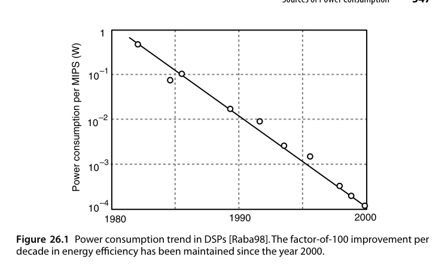{fig-align="center" width="85%"}

趋势曲线本身也值得读：整机的绝对功耗一直在涨，但**单位性能的功耗**自 1980 年以来每五年降一个数量级，而且 2000 年之后并未明显放缓。这一半来自更低的电源电压，一半来自本章要讲的电源管理方法。反过来说：**只看功耗管理的收益是不够的，工艺与架构两项红利都还在，但边际都在变差。**

## 26.2 功耗来源（Sources of Power Consumption）

CMOS 功耗三成分：

1. **动态开关功耗**：$P_{dyn} = \alpha C V^2 f$——翻转率 $\alpha$、负载电容 $C$、电压 $V$、频率 $f$。电压的**平方**杠杆最强；
2. **短路功耗**：翻转瞬间 PMOS/NMOS 同时导通的直通电流，约占动态功耗 10-20%；
3. **静态漏电流**：亚阈值漏电 + 栅氧隧穿——先进工艺下已与动态功耗同量级，是"关机也耗电"的元凶。

短路功耗可估计为 $P_{sc} = \alpha f V\, I_{peak}\, t_{sc}$，其中 $t_{sc}$ 是翻转期间两管同时导通的时间窗。输入信号斜率越缓，窗口越长——这就是低功耗标准单元库必须对输入转换时间（slew rate）设上限的原因：一个驱动不足的长线不只是慢，还在沿途每一个接收门里烧短路电流。

漏电有一个残忍的正反馈：**它随温度显著上升**，而今天是越来越热的芯片在跑。这就是为什么电源电压没有被一路降到 0.5 V——降到某个点之后，漏电（与阈值电压、与温度强相关）带来的静态功耗会反噬掉降压带来的动态收益。降低静态功耗属于电路层面的手段（高 $V_{th}$ 器件、电源门控、体偏置），本书不展开。

负载电容 $C$ 的构成也值得拆开看：它由**器件电容**（栅、扩散区）与**互连电容**（金属线、通孔）两部分组成。在 0.18 μm 之前的年代器件电容占主导，之后互连电容反超——这就是"降 $C$"越来越等价于"缩短连线、提高局部性"的原因，也把低功耗与第 25 章的脉动化、第 28 章的硬化资源（进位链、DSP 块）悄悄连在了一起：专用连线既快又省电容。

一个可直接上手的数值例子：一条 32 位片外总线，5 V、100 MHz，每位负载电容 30 pF。若每拍放随机数据则 $\alpha = 0.5$；考虑数据相关性与空闲周期取 $\alpha = 0.2$，则

$$
P_{avg} \approx \alpha f C V^2 = 0.2 \times 10^{8} \times (32 \times 30 \times 10^{-12}) \times 5^{2} \approx 0.48\,\mathrm{W}
$$

**一条总线就吃掉半瓦**——片外 I/O 的低功耗从来都是首要议题，总线编码（26.3 节）之所以重要正源于此。

再看芯片内部：某 GHz 级处理器核心，$V = 1\,\mathrm{V}$、$f = 2\,\mathrm{GHz}$、等效翻转电容 $C_{eff} = 25\,\mathrm{nF}$，则

$$
P_{dyn} = C_{eff} V^2 f = 25\times 10^{-9} \times 1 \times 2\times 10^{9} = 50\,\mathrm{W}
$$

电压下调 10%（到 0.9 V）且频率不变，动态功耗立即变为 $0.9^2 = 0.81$ 倍，省下近 10 W——平方杠杆的威力在系统级同样立竿见影。

频率一旦确定，就只剩三条路：降 $V$（平方杠杆）、降 $C$（更少更小的器件 + 更短更少的互连）、降 $\alpha$（26.4 节）。三者之间并非独立：

- 更小的器件驱动电流更小、更慢；
- 追求速度往往必须容忍非局域的长线（例如行波进位加法器器件少、连线短，$C$ 最小，但人们通常还是会选互连更长的超前进位结构）；
- 降压有严重的速度代价。

于是低功耗设计变成一个**全局优化问题**：不能孤立地盯一个变量。

::: {.callout-note title="算术单元的特殊点"}
算术数据通路的 $\alpha$（翻转率）高度依赖**数据本身**：行波进位链上越靠高位翻转越少，压缩树的内部节点翻转极密集。低功耗算术因此必须"懂算法"——结构不同，同样功能翻转率可差数倍。
:::

## 26.3 减少功耗浪费（Reduction of Power Waste）

**无用翻转是头号浪费源**：

- **毛刺（glitch）**：组合逻辑路径不均衡导致的虚假翻转，在深组合逻辑（如压缩树）中可占动态功耗一半——对策：路径均衡化、流水线切断毛刺传播、选用无毛刺结构（如传输门加法器）；
- **门控（gating）**：时钟门控（clock gating）关断空闲模块的时钟树翻转——现代 SoC 的标配，算术单元空闲一拍就省一拍；
- **操作数隔离（operand isolation）**：模块空闲时把输入钉死，防止输入翻转传入内部；
- **总线编码**：减少高翻转总线上的翻转次数。

在此之前还有一条更"便宜"的路：**减少运算本身的次数**。$a(b+c)$ 优于 $ab+ac$，$16a - a$ 优于 $15a$——这类强度削减无论是否关心功耗都该做。真正的取舍出现在"运算更少但关键路径更长"的情形，例如复数乘法

$$
(a + bj)(c + dj) = \bigl[c(a+b) - b(c+d)\bigr] + \bigl[c(a+b) - a(c-d)\bigr]j
$$

把 4 次乘法压到 3 次，代价是比直接实现多一级加法延迟。若 $c + dj$ 是一串数据流要乘的固定常量，则 $c+d$ 与 $c-d$ 只需算一次，之后每个复数步长就是稳稳的"3 乘 3 加"。

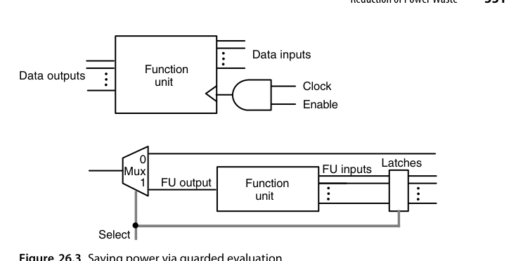{fig-align="center" width="85%"}

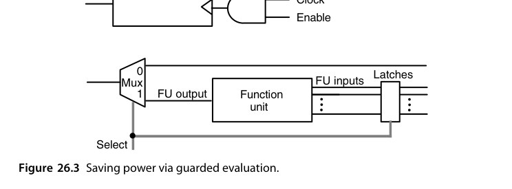{fig-align="center" width="85%"}

时钟门控与**受控求值（guarded evaluation）**是一对互补手段：前者关掉了时钟树（包括触发器内部时钟）的翻转，后者锁住输入寄存器使功能单元内部完全静止。前提都是使能/选择信号本身的翻转率远低于时钟。二者的开销都在控制通路上（生成门控信号的逻辑本身要耗电，且会在某些信号路径上插入一级延迟）。

总线编码的代表作是**总线翻转编码（bus-invert coding）**：发送端比较本次数据与上次数据，若汉明距离超过总线宽度的一半，就把数据按位取反再发，同时拉高一根额外的"反相"标志线；接收端按标志线决定是否取反还原。最坏情况下每拍翻转次数从 $k$ 降到约 $k/2 + 1$，随机数据下平均翻转率可降两成左右——代价只是一根标志线和一点编解码逻辑。对 26.2 节那条半瓦的片外总线，这意味着百毫瓦级的净收益。

操作数隔离的常见形态是在功能单元输入端放一个受使能控制的与门阵列（或一级锁存器）：单元本拍不被选中时，输入被钉成常数（通常是全 0），内部节点完全静止。它与受控求值的差别在于粒度——隔离发生在单元输入边界上、不需要冻结寄存器状态，因此可以和流水结构自由组合，也是综合工具最容易自动插入的一种省功耗手段。

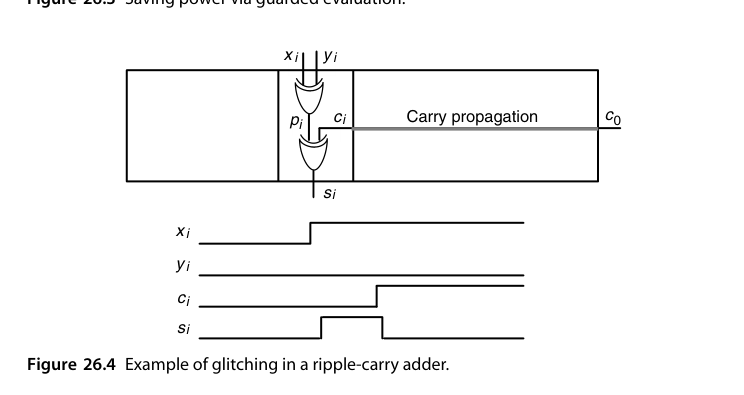{fig-align="center" width="85%"}

毛刺的机制值得看清。**初始化为全 0 的第 $i$ 位全加器中，若新一轮输入使 $c_i$ 与 $p_i$ 都要从 0 变 1**：$p_i = x_i \oplus y_i$ 几乎立刻生效，而 $c_i$ 要等低位进位链慢慢爬上来。在这段时间里 $s_i = p_i \oplus c_i$ 先变成 1、等 $c_i$ 到达后又变回 0——一次纯属浪费的完整充放电。越深的锥体（受越多原始输入影响的内部节点）毛刺越严重，这就是为什么压缩树与并行前缀网络是毛刺重灾区。

量级上，未经处理的算术数据通路里毛刺可占动态功耗的 20-70%，乘法器与压缩树类结构处于高段。除了延迟均衡，电路层面还有两招：一是**门级尺寸调整**——让到达同一门的两条输入路径延迟对齐；二是**无毛刺逻辑风格**，如传输门实现的加法器，其输出只在所有输入稳定后才翻转一次。前者不改变结构只调尺寸，适合后端优化；后者要从单元库做起。

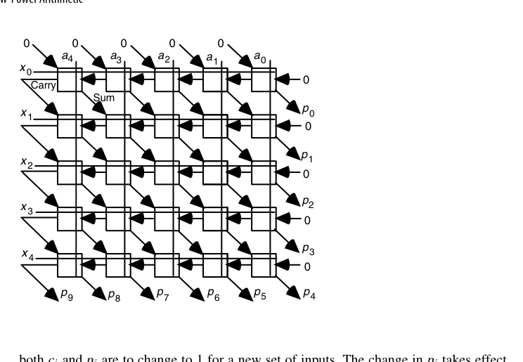{fig-align="center" width="85%"}

对策是**延迟均衡**。在阵列乘法器中，进入位于 $x_i$ 行、$a_j$ 列的元胞时，水平进位输入与对角和输入要经过 $2i + j$ 个元胞的关键路径，而 $a_i, x_j$ 广播信号几乎零延迟直达。解决方法是在每条水平广播线上每个元胞插入 1 单位延迟、每条垂直广播线上插入 2 单位延迟，把全部信号路径对齐。代价是阵列延迟变长，收益是毛刺几乎消失。同样的思路用于不规则结构的树形乘法器更难，但文献报告的节能幅度超过 1/3。

流水线也是一种"治毛刺"的手段，虽然它的初衷是提频：每段水级内部的逻辑深度被切得很小，信号路径长度的差异自然随之收敛，留给毛刺的空间也就没了。

## 26.4 降低活动率（Reduction of Activity）

从**算法与结构层面**降低 $\alpha$：

- **数制选择**：冗余表示在串行运算中可减少翻转（某些位不变）；
- **编码优化**：Gray 码计数器（每拍只翻 1 位）vs. 二进制计数器（平均翻约 2 位、最坏全翻）——地址生成、FIFO 指针的标准选择；
- **符号数据优化**：2 的补码在小幅值正负数间切换时高位大面积翻转，符号-幅值在某些 DSP 数据流中更省电；
- **近似/精度缩减**：位宽减半，动态功耗近似减半（$C$ 与翻转位数同降）——AI 量化的能效收益正源于此。

要把这些直觉落实，需要区分两种情况。

**编码层面的例子**。取反操作：符号-幅值只需翻转一个符号位，2 的补码却平均有一半位翻转——但符号-幅值的加减法更复杂，这部分开销可能抵消掉全部收益，所以"符号-幅值更省电"并不是无条件成立。**计数器**的账可以算得很细：4 位计数器计满一圈 16 步，二进制编码下第 0 位每步都翻（16 次）、第 1 位 8 次、第 2 位 4 次、第 3 位 2 次，合计 30 次位翻转；Gray 码每步恰好翻 1 位，合计 16 次——活动率近乎减半，双向计数同样成立。更一般的说法是：**让状态机中经常被连续访问的状态拥有相邻编码**，这是把组合优化问题（最小汉密尔顿路径/图着色）搬到了低功耗领域。

**数据相关性的例子**。同一根线连续若干拍承载来自同一数据流的高位部分时，翻转很少（数值高位本来就不常变）；若交替承载两条独立数据流，则每位每拍都有 1/2 概率翻转。结论：**共享（复用）的运算部件和数据通路会增加 $\alpha$**——低功耗设计倾向于专用而非复用，这与面积优化鼓励复用的常识正好相反。

精度缩减的能效量级也值得记住：32 位浮点乘法器的单次操作能耗大约是 16 位版本的 3-4 倍、8 位整数乘法的数十倍（精确数字随工艺变化，但标度律稳定）——位宽对能耗的影响接近平方，因为部分积阵列的面积与位宽平方成正比。这就是 AI 推理从 FP32 退到 INT8 能拿到近一个数量级能效收益的算术根源。

另外还有一个免费的：**运算重排**。把 $n$ 个数相加时，先按正、负分成两组各自累加、最后再合并，活动率往往下降；有趣的是，这一招同时还能减小舍入误差（第 19 章），一举两得。

地址总线是编码优化的另一个高产场景：顺序访问的地址流本身就是计数器，用 Gray 码编码地址可以把地址总线的翻转率减半——很多存储器接口与 FIFO 指针正是这么做的。同理，**分段总线**（把宽总线拆成几段、空闲段整体门控）与**小摆幅信号**（把总线电压摆幅从 $V$ 压到几百毫伏，能耗按平方下降、靠灵敏放大器恢复）都是高负载总线上的常用手段。

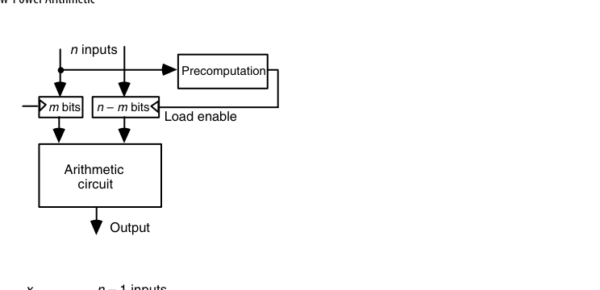{fig-align="center" width="85%"}

**预计算（precomputation）**是把"大概率不需要算的东西挡在门外"：若 $f$ 的值常常只由 $m$ 个变量就能确定，那么用一个小回路先探测这些特例，命中时才允许其余 $n - m$ 位装载进输入寄存器；未命中时主运算单元完全静止。代价是这块预测电路串进了关键路径，且本身占用面积与功耗。

它的变体是**香农展开（Shannon expansion）**：按某个变量 $x_{n-1}$ 把复杂函数劈成两块更简单

$$
f = x_{n-1}\, f|_{x_{n-1}=1} \ \lor\ \overline{x_{n-1}}\, f|_{x_{n-1}=0}
$$

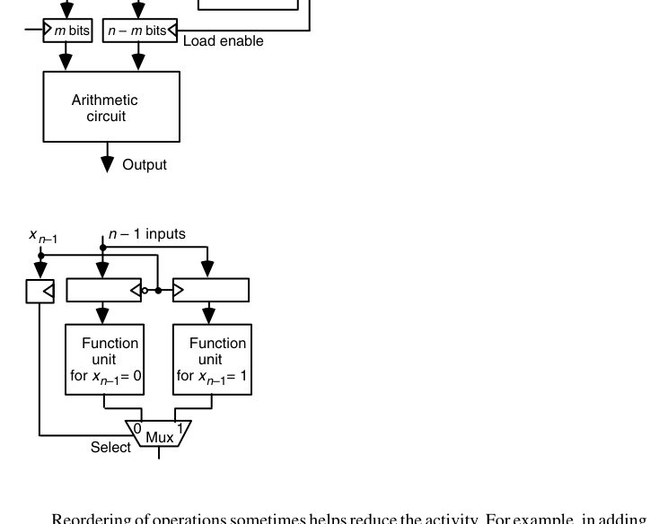{fig-align="center" width="85%"}

物理上就是把 $n-1$ 位的输入寄存器复制一份、分别送给两个更简单的功能单元，$x_{n-1}$ 决定往哪一份里装载，每次只有一半电路活动（图 26.7）。这部分寄存器开销不可避免，而运算部分的开销则可以通过精挑展开变量来压缩。

## 26.5 变换与权衡（Transformations and Trade-offs）

**电压是最大杠杆**（平方项），但降压即降速——由此产生经典变换：

- **并行化换电压**：两份硬件各跑半速，吞吐不变、$V$ 可降、功耗净省（理论上可省一半以上）；
- **流水化换电压**：深流水降周期要求 → 降压 → 省功耗（寄存器开销为代价）；
- **重定时（retiming）**：不改变功能地移动寄存器均衡级延迟，为降压创造条件；
- **DVFS**：运行时按负载动态调压调频——把"最坏情况设计"变成"按需供给"。

先把数字算清楚。设原始晶体管工作在频率 $f$、有效电容 $C$、电压 $V$，功耗 $P \propto fCV^2$。

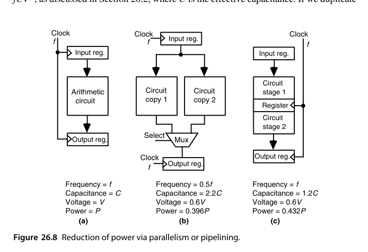{fig-align="center" width="85%"}

**并行方案**：复制两份，交替处理输入，每份只需跑到 $f/2$，于是可以降压到约 $0.6V$。总电容因复制多路器与输入/输出寄存器涨到约 $2.2C$：

$$
P_{par} \propto 0.5 \times 2.2 \times 0.6^{2}\, P = 0.396\,P
$$

**流水方案**：切成两级，每级逻辑深度减半，同样降到 $0.6V$，但由于频率仍是 $f$，电容只涨到约 $1.2C$（只多了寄存器）：

$$
P_{pipe} \propto 1 \times 1.2 \times 0.6^{2}\, P = 0.432\,P
$$

两者都保持了原吞吐，功耗降到四成左右。有意思的是：**在这个数据下并行略优于流水**——并行把频率也降下来了（功耗正比于 $f$ 的一次方），而流水保住了频率。实际选型还要看 $2.2C$ 与 $1.2C$ 的真实取值（复制整个数据通路远比插寄存器贵），以及寄存器的漏电代价。

"降 1/3 电压为什么只能换半速"可以用 **α 幂律（alpha-power law）**解释：延迟近似满足

$$
t \propto \frac{V}{(V - V_{th})^{\alpha}}, \qquad \alpha \approx 1.3\text{--}2
$$

取 $V_{th} = 0.3\,\mathrm{V}$、$\alpha = 2$：1.2 V 时 $t \propto 1.2/0.9^2 \approx 1.48$，0.8 V 时 $t \propto 0.8/0.5^2 = 3.2$——延迟约增 2.2 倍，吞吐近乎减半。与此同时功耗的电压因子变为 $(0.8/1.2)^2 \approx 0.44$。电压平方收益远大于频率线性损失，这就是"并行/流水换电压"这笔交易稳赚的数学根源；也可以看到 $V$ 越逼近 $V_{th}$，延迟惩罚越陡峭，降压的空间是有底的。

DVFS 把同一笔账搬到时间轴上。按操作计能耗：满压满频时每操作能耗为 1；负载只需要一半吞吐的时段降到约 $0.6V$、$f/2$，同样的操作花两倍时间完成（仍满足截止期），每操作能耗变为 $0.6^2 = 0.36$。若两类操作各占一半，平均能耗约 $0.68$——三成多的节省，且没有一个任务逾期。关键在于**低负载时段必须真实存在且可预测**，这正是 DVFS 调度器要解决的系统问题。

另一个几乎零成本的技巧：**双边沿触发器（double-edge-triggered flip-flop）**可以把时钟频率直接减半；由于时钟分配网络本身是同步系统的主要功耗源之一，这笔账很划算，代价只是触发器更复杂。类似地，**自门控触发器**在输入与输出相同时抑制内部时钟翻转。

并非所有并行机会都一目了然。看一阶 IIR 滤波器

$$
y(i) = a\,x(i) + b\,y(i-1)
$$

它天生是递归的——下一拍依赖上一拍，似乎无法并行。办法是**循环展开（loop unrolling）**：同时算出相邻两拍

$$
y(i) = a\,x(i) + b\,y(i-1), \qquad
y(i+1) = a\,x(i+1) + a b\,x(i) + b^{2}\,y(i-1)
$$

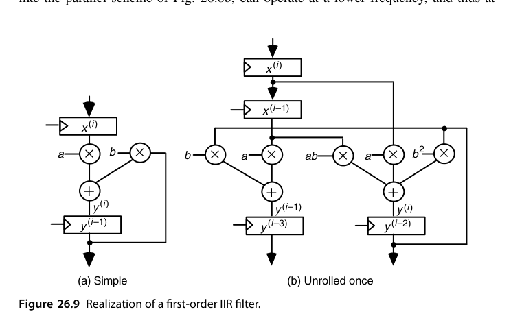{fig-align="center" width="85%"}

新电路的关键路径多了一级加法（三操作数加法），但只要用**进位保存加法器 + 一个标准两操作数加法器**来实现，$f/2$ 的目标几乎不受影响，于是同样可以降压。

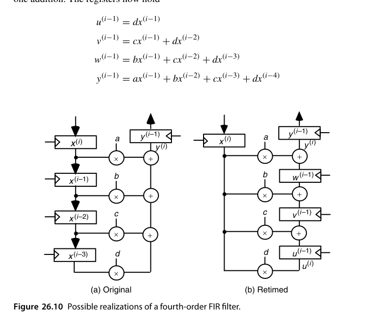{fig-align="center" width="85%"}

对 FIR 滤波器 $y(i) = ax(i) + bx(i-1) + cx(i-2) + dx(i-3)$，**重定时（retiming）**提供了另一条路。直接实现的流水级延迟等于"一级乘法 + 三级加法"——因为寄存器在左侧，所有乘法结果必须在同一拍内加完。把寄存器挪到右边，各级寄存器里保存的就变成了部分和

$$
u(i-1) = d\,x(i-1), \quad
v(i-1) = c\,x(i-1) + d\,x(i-2), \quad
w(i-1) = b\,x(i-1) + c\,x(i-2) + d\,x(i-3)
$$

于是每级延迟降到"一级乘法 + 一级加法"，可以在更高频率（同一电压）或更低电压（同一吞吐）下工作。代价是寄存器数量增加、且电容变化难以事先预测。**注意这是一个纯粹的算子寄存器搬移——功能完全不变，只是时序重排**，这正是重定时最迷人的地方。

另一种思路是用两级加法器二叉树把加法层级从 3 压到 2，但那样一来结构变得不规则、难以模块化扩展；相比之下重定时保持了模块性。

逻辑层面还有两个与变换配套的旋钮：**多阈值（multi-$V_{th}$）分配**——非关键路径上的门换用高阈值器件，漏电大降而速度损失由宽裕的路径吸收；以及**门尺寸缩放（sizing）**——只放大真正在关键路径上的门。工业设计的典型结果是：90% 以上的门可以用低漏电版本，功耗代价集中在那几个百分点的关键路径门上。这类优化不改变任何结构，纯粹是"把钱花在刀刃上"的器件级预算分配。

::: {.callout-tip title="思想要点"}
低功耗设计的精髓是**用面积（硅很便宜）换电压（平方杠杆）**。并行化与流水化这对第 25 章的吞吐武器，同时也是功耗武器——一体两面。
:::

## 26.6 新兴方法（New and Emerging Methods）

- **绝热/能量回收逻辑**：让充放电电流缓升缓降，理论上可突破 $CV^2$ 下界——研究多年，实用化仍受限；
- **近似计算（approximate computing）**：在容错负载（图像、ML）中故意放松精度换能效——近似加法器/乘法器是一个活跃研究方向；
- **异步/自定时设计**（呼应 5.4 节）：无时钟树功耗，事件驱动天然低功耗；
- **新型器件**：FinFET→GAA、存内计算（compute-in-memory）把"搬数"的能耗釜底抽薪——算术单元与存储的边界正在模糊。

在工程层面，一条很务实的路线是**先建立低功耗的标准积木**：查表、多路器、并行压缩器（3:2 / 4:2）、快速进位网络。把这几类单元的低功耗变体做好，就能快速拼装候选设计，再集中精力做全局去冗余。文献中对此的结论常令人意外——例如更快的算术电路在某些条件下反而**更节能**，前提是它们能在空闲时被干净彻底地关掉。

绝热逻辑的原理值得一写：用随时间缓变的"功率时钟"代替阶跃电源给负载充放电，每次转换的能耗从 $\frac{1}{2}CV^2$ 降到约

$$
E \approx \frac{RC}{T}\, C V^2
$$

其中 $T$ 是电源斜坡时间——只要愿意慢下来（$T$ 远大于 $RC$），单次翻转能耗理论上任意小；已消耗的能量还能部分回收到电源网络。代价是需要特殊的谐振供电与时钟网络、与标准 CMOS 设计流程不兼容，因此至今主要停留在研究原型阶段。

近似算术的代表做法是把加法器/乘法器的低位部分换成廉价逻辑（低位用或门近似全加器、或直接截断部分积阵列的右下角）：32 位加法器把低 12 位近似化可省下约三分之一能耗，最坏误差被压在 $2^{-20}$ 量级——对图像、神经网络这类本身带噪的负载完全不可感知。关键是误差必须**有界且可分析**：每个近似单元都要有严格的误差上界证明，系统级再把各级误差预算分配下去。这是近似计算与"随便砍一刀"的分界线。

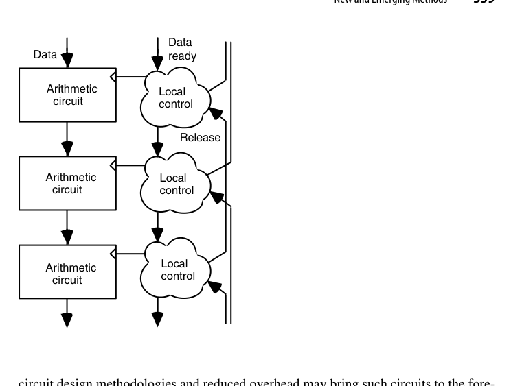{fig-align="center" width="85%"}

**异步电路**是其中最有工业前景的一条。它没有全局时钟树，控制就在数据身边（捆绑数据协议用一根"数据就绪"线配一根"应答"线；双轨协议则用两根线编码每一位，代价是线数翻倍，收益是完全对延迟不敏感）。从低功耗角度看，最优形态是**双轨编码 + 跳变信令**：一根线跳变代表来了 0，另一根代表来了 1，每次事务后不必回到 0，因而比电平信令省电。阻碍异步电路普及的一直是设计/综合工具与测试方法的缺失，而非原理本身。

**波流水**（25.2 节）在功耗上有两层收益：一是为追求性能而做的延迟均衡顺便消除了毛刺；二是同样的吞吐可以在更低的时钟频率上达成，而频率是功耗的一次方。

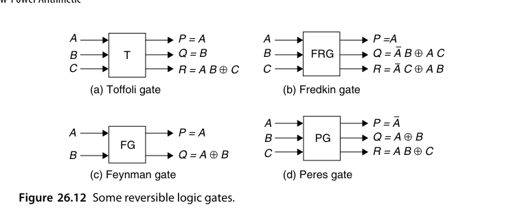{fig-align="center" width="85%"}

最后是低功耗的"终极形态"。热力学第二定律保证：**逻辑可逆且物理可逆的电路不发热**。逻辑可逆指的是"由输出能唯一确定输入"——传统逻辑门做不到这一点（同时知道 $A \lor B$ 与 $A \land B$ 也无法反推 $A, B$）。可逆门的共同结构是**输入线与输出线等数量、且实现输入组合到输出组合的一个置换**（图 26.12）。

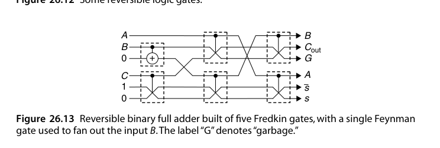{fig-align="center" width="85%"}

代价藏在图 26.13 的标注里：$G$ 表示**垃圾（garbage）输出**。为了让全加器（3 进 2 出，本身不可逆）变成可逆，必须保留若干无人使用的输出位来维持信息守恒；这些线要布线、要耗电，也是眼下可逆逻辑难以实用的主要障碍之一。绝热开关、光逻辑与量子计算都在试图跨越这道坎，但实用化仍以数十年计。

## 本章小结

- $P = \alpha C V^2 f$：电压平方杠杆最大，翻转率最"懂算法"；同时要分清**低功耗**与**低能量**两个不同的目标函数。
- 电池能量密度约 0.2 Wh/g，手机级预算只有几瓦——这是所有移动端算术设计的物理地基。
- 毛刺与空闲翻转是浪费大户：路径均衡、门控、操作数隔离、受控求值、预计算都能治。
- 降低 $\alpha$ 要同时看编码（Gray vs 二进制）、数制（补码 vs 符号-幅值）、数据相关性与运算顺序。
- 并行/流水/重定时换降压是经典交易：$P$ 可降到四成左右；DVFS 把功耗变成运行时变量。
- 可逆逻辑提供了零发热的理论出口，代价是垃圾线与极不成熟的工艺；近似计算与存内计算是能效的下一个 frontier。
