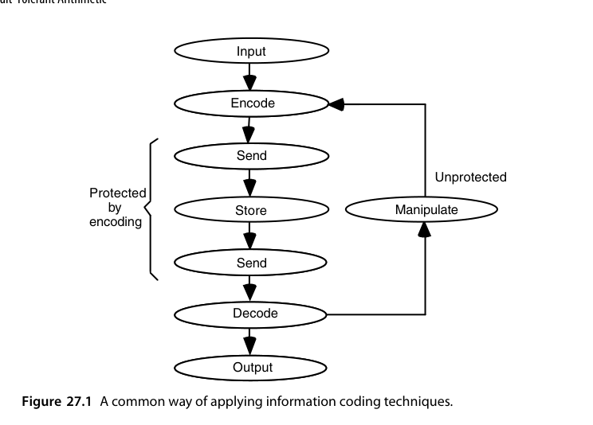
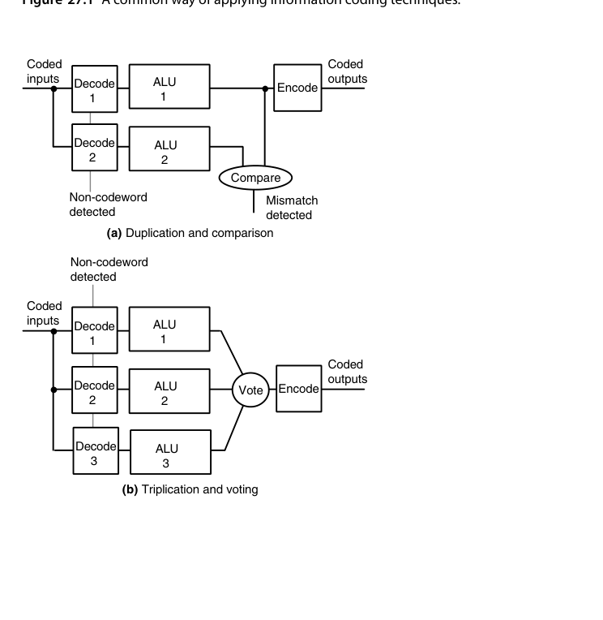
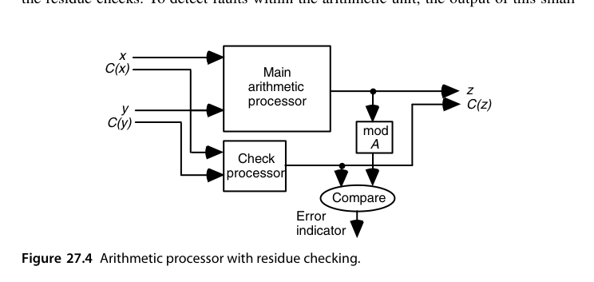
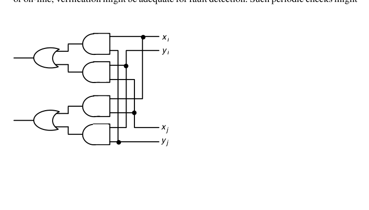
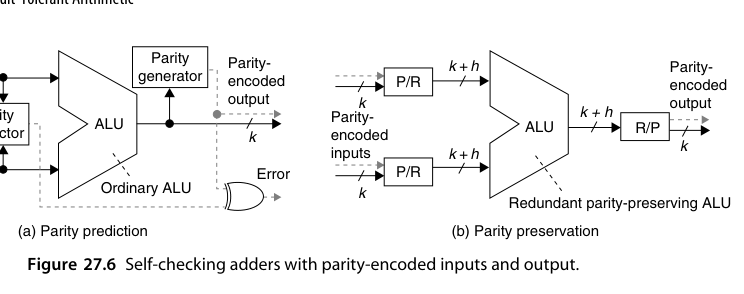

# 第27章 容错算术（Fault-Tolerant Arithmetic）

## 本章导读

芯片会出错：宇宙射线翻转存储位（软错误）、工艺缺陷、老化、电压扰动。安全关键系统（汽车、航天、医疗）要求算术单元**出错能被检测甚至纠正**。本章讲差错模型、算术编码（利用算术结构保持性的检错码）、自校验单元与算法级容错——第 4 章的冗余 RNS 在这里华丽返场。

## 27.1 故障、错误与纠错码（Faults, Errors, and Error Codes）

术语链：**故障（fault）→ 错误（error）→ 失效（failure）**。

- 故障是物理原因（位翻转、固定 0/1、短路）；错误是故障导致的内部状态异常；失效是错误传播到系统边界造成的服务异常；
- **软错误（soft error）**：α 粒子/中子引发的瞬态翻转，随特征尺寸缩小而加剧——存储器早已标配 ECC，逻辑与数据通路的软错误防护是本章主题；
- 编码理论基础：汉明距离决定检错/纠错能力——距离 $d$ 的码可检 $d-1$ 错或纠 $\lfloor (d-1)/2 \rfloor$ 错。

**故障模型（fault model）**是一切讨论的起点：永久故障（stuck-at-0/1、桥接短路）、瞬时故障（软错误、电源毛刺）、间歇故障（老化边缘、接触不良）三类的防护难度递增。任何检错/纠错方案的评价都相对于某个故障模型才有意义——"可检全部单比特错"只在单事件翻转（SEU）模型下成立；工艺进入个位数纳米后，一次粒子撞击翻转多个相邻单元的多单元翻转（MCU）比例明显上升，单纯按单比特假设设计的码开始显得单薄。

量级上，静态 RAM 的软错误率约为每 Gbit 每 $10^9$ 小时数百到数千次（FIT 量级）；逻辑电路没有存储节点的电荷保持问题，错误率低 1-2 个数量级，但随电压下降、节点电荷减小而持续恶化。对一颗集成数十亿晶体管的芯片，"每天若干次瞬态翻转"是设计基线而非危言耸听——这正是把第 27 章从"航天专用话题"变成"通用设计议题"的原因。

业界的默认做法是**接送受保护、中间裸奔**（图 27.1）：通信链路与存储器由奇偶、校验和、SEC/DED 等码保护，而中间的运算部分没有任何保护——因为普通码**对算术运算不封闭**。两个偶校验数相加，结果未必还是偶校验；改动受校验和保护的数据表中的一个元素，就得重算整个校验和。解码/编码这道门槛正是算术码要解决的痛点。

{fig-align="center" width="85%"}

最直接的方案是**复制 + 比较**（检错）或**三模冗余 + 表决**（屏蔽单个错误），如图 27.2。两张图里有几个细节值得咀嚼：

- (a) 图中**解码器被一起复制**了，否则解码器单点故障会漏检；而编码器是"关键元件"——它的输出是冗余（编码后的）的，因此可以把它设计成**自校验（self-checking）**的：一旦自身出问题就吐出一个非码字。
- (b) 图中**表决器无法自校验**，因为它的输出是非冗余的。把表决与编码两个功能合并起来，才有可能做出自校验的表决-编码器。
- 三模之外推广到 $n$ 模可以容忍更多故障，但开销增长很快就不可接受。

可靠性的账可以用一个公式记住：设单模块可靠度为 $R$、表决器理想，则三模冗余（TMR）的可靠度为

$$
R_{TMR} = 3R^2 - 2R^3
$$

$R = 0.9$ 时 $R_{TMR} = 0.972$——单点故障被屏蔽的收益真实可见；但 $R$ 较低时 TMR 反而更差（三个不可靠部件加起来的暴露面更大）。这解释了为什么冗余只在"单模块本身已经相当可靠"的系统里有效，也解释了为什么表决器与比较器自身的可靠性必须单独论证——它们不在冗余的保护范围之内。

{fig-align="center" width="85%"}

**为什么通信码不适合算术**。通信领域习惯按"随机错误""突发错误"分类，这在算术里没有意义：加法器进位链上一个门的故障可以翻转任意多个输出位。看图 27.3 的例子：

```
  0010 0111 0010 0001
+ 0101 1000 1101 0011
  0111 1111 1111 0100   ← 正确和
  1000 0000 0000 0100   ← 错误和（某级产生了错误的进位 1）
```

两个结果的**汉明距离是 12**——看上去是"十二位错"。但它们的**数值差只有 $2^4 = 16$**！算术处理的是数，不是任意比特串，合适的度量应该是后者。

由此定义**算术权重（arithmetic weight）**：把一个正确值变成错误值所需相加的最少**带符号 2 的幂**的个数。上面的例子权重为 1；而 $\text{-}32752 = -2^{15} + 2^4$ 这类差值的权重为 2。相应地可以证明：$k$ 比特错误幅度的最小权重 BSD 表示最多有 $\lceil (k+1)/2 \rceil$ 个非零数字，且总能写成没有相邻非零数字的**规范 BSD 形式**——规范形式唯一，与算术权重的概念紧密相连。

## 27.2 算术检错码（Arithmetic Error-Detecting Codes）

普通检错码（奇偶、汉明）为存储/传输设计，但**算术运算不保持码字结构**（两个合法码字相加一般不是合法码字）。**算术码**专为此设计：

- **AN 码**：把数 $x$ 编码为 $A \cdot x$（$A$ 为常数，如 3）。加法保持结构：$Ax + Ay = A(x+y)$——结果仍是合法码字，能被 $A$ 整除即可检错。可检所有单比特错误（$A$ 选奇数时）；
- **剩余码（residue code）**：编码 = 数据 + 其对模 $m$ 的剩余。加法后校验：$(x + y) \bmod m \stackrel{?}{=} (x \bmod m + y \bmod m) \bmod m$。$m = 3$（低成本剩余码）只需 2 位校验，可检单比特错；
- **双剩余/反向剩余**：两份独立的剩余校验提高覆盖率。

算术码有两条定义性质的要求：(1) 按**可检错误的算术权重**来刻画能力；(2) 允许**直接在编码操作数上做算术**。第二条是省钱的关键——比起全复制或三模冗余，算术码用低得多的冗余把整条数据通路罩住。

### 乘积码（AN 码）与低成本形式

数 $N$ 编码为 $AN$，校验就是检查能否被 $A$ 整除。**$A$ 取奇数时，所有权 1 的算术错误（含全部单比特错误）都能检出**：因为错误幅度为 $\pm 2^i$，而奇数 $A$ 不可能整除 $2^i$。权重 2 及以上的错误不保证可检——例如 $32736 = 2^{15} - 2^{5}$ 能被 3、11、31 同时整除，用这些 $A$ 都漏检。

让 $A = 2^a - 1$ 就得到**低成本乘积码**：乘 $A$ 只需"移位 + 减"（逐 $a$ 位做的话只要一个 $a$ 位加法器、一个 $a$ 位寄存器和一个进位触发器），除 $A$ 同样简单——由 $y = (2^a - 1)x$ 求 $x$ 等价于算 $2^a x - y$，而 $2^a x$ 的末 $a$ 位必为 0，于是可以逐段反推出 $x$。

以 $A = 7$（$a = 3$）为例走一遍校验：$x = 25$ 编码为 $y = 7x = 175$。校验时把 $y$ 按 3 位分段 $010\,101\,111_{two}$，逐段做模 7 累加（循环进位）得 $2 + 5 + 7 \equiv 0 \pmod 7$——能整除，码字合法。若某一位翻转使 $y$ 变为 $183$，分段和变为 $2 + 5 + 7 + 8 \equiv 1 \pmod 7$，立刻检出。编码端同样便宜：$7x = 8x - x$，一次移位减即得。

**定理 27.1**：用 $A = 2^a - 1$ 的低成本乘积码，可检出算术权重不超过 $a-1$ 的**单向错误**（所有出错位的翻转方向一致，在 CMOS 里是很典型的错误形态）。

举例：$A = 15$（$a = 4$）除了所有权 1 错误，还能检出权重 2、3 的单向错误，因为这类错误幅度不会是 15 的倍数：$8 + 4 = 12$、$128 + 4 = 132$、$16 + 4 + 2 = 22$、$256 + 16 + 2 = 274$，全都不是 15 的倍数。

编码后的算术也很整洁：

$$
Ax \pm Ay = A(x \pm y) \quad \text{（加减直接做）}, \qquad
Aa \times Ax = A^2 ax \quad \text{（乘完要除以 } A \text{ 才是码字）}
$$

除法最麻烦。由 $z = qd + s$ 有 $Az = q(Ad) + As$：**余数是编码形式的，商却是裸的**——算商的过程中出的错一个也查不出来。对策是先把被除数预乘 $A$，用 $A^2 z$ 除以 $Ad$，再把末位 radix-$2^a$ 商数字调整到区间 $[-2^a + 2,\, 1]$ 内使修正后的商 $q^{**}$ 正好是 $A$ 的倍数。开方有完全类似的问题（$\lfloor\sqrt{A^2 x}\rfloor$ 通常不等于 $A\lfloor\sqrt{x}\rfloor$），用同一套路解决。

AN 码属于**非分离码（nonseparable）**：数据和校验信息绞在一起，看一眼 $AN$ 得不出 $N$。这带来一个常被忽视的工程后果：**每次要把数值送去显示、比较或做格式转换，都得先做一次除 $A$ 解码**——在非分离码保护全系统的方案里，编解码器的速度与自校验能力本身也成了关键路径的一部分。

不过有些操作在非分离码上依然免费：$A$ 取正数时 $Ax$ 与 $Ay$ 的大小顺序与 $x, y$ 一致，因此**比较与判号可以直接在编码态做**；加减法也免费。真正需要解码的是溢出判断、浮点规格化、与外设交换这类必须解读绝对数值的操作。设计非分离码系统时，把"哪些操作必须解码"列成清单，是避免解码器沦为新单点的前提。

### 剩余码与反向剩余码

剩余码把数编成配对 $(N, C(N))$，其中 $C(N) = N \bmod A$——这是**分离码**，数据部分和校验部分互不混淆，因此"解码"（读出真值）是零成本的。取 $A = 2^a - 1$ 时编码只要把 $N$ 的 $a$ 位分段做模 $2^a - 1$ 加法（$a$ 位加法器 + 循环进位），既可串行也可排成二叉树并行。

算术运算同样干净：

$$
(x, C(x)) \pm (y, C(y)) = \bigl(x \pm y,\ (C(x) \pm C(y)) \bmod A\bigr)
$$

$$
(a, C(a)) \times (x, C(x)) = \bigl(a \times x,\ (C(a) \times C(x)) \bmod A\bigr)
$$

{fig-align="center" width="85%"}

按图 27.4 搭出来的结构是全章最有价值的一张图：**主算术处理器 + 小的校验处理器 + 比较器**。这正是"弃九法（casting out nines）"的硬件版本——我们手算乘法时习惯用"两边各自的数字和对 9 取余是否一致"来快速验算，本质上是同一个想法。

举个具体数字，$A = 3$：$x = 25$ 的剩余 $C(25) = 1$，$y = 13$ 的剩余 $C(13) = 1$；和 $38$ 的剩余应为 $(1+1) \bmod 3 = 2$，而 $38 \bmod 3 = 2$，一致。换成 AN 码：$A=3$ 时 $x \to 75$、$y \to 39$，和 $=114 = 3 \times 38$；若第 3 位（权值 8）翻转得到 $122$，除以 3 不整除 → 检出。

开销账也算一下：$k = 32$ 位数据配 $A = 3$（$a = 2$）的剩余码，校验位只有 2 位，冗余 6%；校验处理器就是一个 2 位的模 3 加法器（含循环进位修正），面积不到主加法器的 5%。**位宽越大，剩余码的相对开销越小**——这是它在宽数据通路上极具吸引力的原因。

但剩余码对**单向多位错误**的能力弱于乘积码：$A = 15$ 的剩余码检不出"数据最低位与剩余最低位同时由 0 变 1"这类权重 2 错误——因为这等于给数据和剩余**同时加 1**，结果仍是一个合法码字。

修法是**反向剩余码（inverse residue code）**：校验部分不再是 $N \bmod A$，而是 $A - (N \bmod A)$。当 $A = 2^a - 1$ 时它恰好是 $N \bmod A$ 的**逐位取反**。单向错误现在会使数据部分与校验部分朝**相反方向**变化，于是更容易暴露。这一点可以严格化：把 $a$ 位的反向剩余 $C'(N)$ 拼到 $k$ 位 $N$ 的最低位一侧，所得 $(k+a)$ 位数恰好是 $A$ 的倍数，于是有

**定理 27.2**：用 $A = 2^a - 1$ 的低成本反向剩余码，可检出算术权重不超过 $a-1$ 的单向错误。

三者的代价比较也值得记：位宽开销上，三者都需要 $a$ 个额外位；做加减乘时，剩余码比乘积码**简单**（不需要乘除 $A$）；做除法时则相反，剩余码更难（校验处理器无法独立工作，必须与主处理器交互才能算出结果的余）。

把三种码放进应用场景里看：总线与寄存器堆的端到端保护选奇偶或剩余码（分离、解码免费）；运算密集且错误形态以单向多位为主的定制数据通路，选低成本乘积码或反向剩余码；需要在线纠错的场合才会走到双剩余码乃至更多模数。没有一种码通吃，但"$A = 2^a - 1$ 的低成本形式"是所有场景的共同底座。

另外两条深刻的"不可能"结论值得背下来：

- 剩余类码是**唯一**能够校验加法器的分离码（Peterson, 1958）；
- 按位逻辑运算（AND/OR/XOR）无法用低于 100% 冗余的任何编码方案来检错（Peterson & Rabin, 1959）——也就是说，**对逻辑运算，除了复制比较别无捷径**。

::: {.callout-note title="设计要点"}
算术码的精髓：**校验通道与数据通道并行、各自独立运算，结果互相比对**。校验通道位宽小（模 3 只需 2 位），面积开销 10-30%，却能罩住整个数据通路——比全复制（DMR）便宜得多。
:::

## 27.3 算术纠错码（Arithmetic Error-Correcting Codes）

把剩余码扩展到**多个模数**：模 $m_1, m_2$ 的两组剩余可提供纠错所需冗余（本质是 RNS 的纠错应用，27.6 节）。乘积码（AN 码的 $A$ 取复合数）也能提供纠错能力。纠错码的代价显著高于检错码——多数安全设计选"**检错 + 重算/重启**"而非在线纠错。

典型的代表是**双剩余码（biresidue code）**：数 $N$ 编成三元组 $(N, C(N), D(N))$，其中 $C(N) = N \bmod A$、$D(N) = N \bmod B$。$k$ 位数据总共需要 $k + \lceil \log_2 A \rceil + \lceil \log_2 B \rceil$ 位。两个校验处理器可以并行工作，**不损失速度**。

纠错的判据很清晰：

- 若只有 $C(N)$ 出错：$C$ 侧的校验失败、$D$ 侧通过 → 重算 $N \bmod A$ 即可纠正；
- 若 $N$ 出错（且错误幅度不是 $A$ 或 $B$ 的倍数）：两侧都失败 → 定位到数据部分。此时
  $$
  \bigl[(N_{wrong} \bmod A) - C(N)\bigr] \bmod A, \qquad
  \bigl[(N_{wrong} \bmod B) - D(N)\bigr] \bmod B
  $$
  这对差值构成**错误综合征（error syndrome）**；只要不同错误对应的综合征互不相同，就可从综合征表反查出错误值并减掉。

以 $A = 7$、$B = 15$ 为例：$|E| \le 2048$ 内的所有权重 1 误差都有独一无二的综合征（例如 $E = 64$ 的模 7/模 15 余量是 $(1, 4)$，$E = -64$ 是 $(6, 11)$），因此可纠；$E = 64 \times 64 = 4096$ 之后综合征开始循环重复（$(1,1)$ 与 $E=1$ 相同）。结论：**这套码只能保证数据部分在 12 位以内**。两个剩余共需 7 位表示，于是冗余为 $7/12 \approx 58\%$。

综合征表长什么样？把 $E = \pm 2^i$ 逐个代入 $(E \bmod 7,\ E \bmod 15)$：$E = 1 \to (1,1)$，$2 \to (2,2)$，$4 \to (4,4)$，$8 \to (1,8)$，$16 \to (2,1)$，$32 \to (4,2)$，$64 \to (1,4)$，$128 \to (2,8)$，$256 \to (4,1)$，$512 \to (1,2)$，$1024 \to (2,4)$，$2048 \to (4,8)$——12 个值互不相同，负值对称取余也不冲突；而 $E = 2^{12} = 4096$ 回到 $(1,1)$，与 $E = 1$ 相撞。数据部分 12 位的上限，就是这张表"撞车"的位置。

换成乘积码做同样的事要贵得多：取 $A \times B = 105$，为了让所有的权重 1 错误都有不同余量，整个码字宽度必须限制在 12 位以内，最大可表示数只有 $4095/105 = 39$——换算成约 5.3 位有效数据，冗余高达 $127\%$。**分离与否，代价差了一倍多。**

一般情形：$A = 2^a - 1$、$B = 2^b - 1$ 且互素时，双剩余码可以支撑 $ab$ 位数据部分做权重 1 纠错，冗余为 $(a+b)/(ab) = 1/a + 1/b$。把 $a, b$ 取大一点，冗余可以压得很低——这是设计中最实用的一条标度律。

在线纠错真正值得付出的场景是**无法重算**的地方：深空探测器（重传的代价是几十分钟的单程时延）、硬实时控制回路（错过截止期即失效）、以及不可中断的长周期任务。数据中心与多数车载 ECU 的主流选择仍是"检错 + 重算/重启"，因为纠错所需的冗余足以把能效指标拖垮，而重算的成本往往只是几拍流水。

最后一条很有价值的观察：**既然算术检错/纠错码既罩得住运算也罩得住存储与传输，全系统统一用一种码就可以避免频繁的编解码**，也消除了数据在"裸状态"下被搬运时的风险敞口。

## 27.4 自校验功能单元（Self-Checking Function Units）

设计目标：单元内部任何单点故障，要么输出正确，要么触发错误指示（**故障安全 fault-secure** 或 **自测试 self-testing** 性质）。手段：

- **复制 + 比较（DMR）**：两份硬件 + 比较器——100% 面积开销，但概念最简、覆盖最彻底（含瞬时故障）；
- **时间冗余（RESO/RECO）**：同一硬件用变换后的输入算两遍（如取补），比对结果——几乎零面积开销，代价是双倍时间；
- **预测逻辑**：进位预测（用输入独立算出 $c_{out}$ 的估计）与实际输出比对——加法器的轻量自检；
- **双轨/差分逻辑**：每比特用互补两根线表示，非法组合即错误——异步设计的附带福利。

自校验单元分为"带编码输入/输出"与"不带编码输入/输出"两种。把图 27.4 中由外部提供的 $x \bmod A$、$y \bmod A$ 改成在内部自行计算，就得到一个输入输出都无需编码、但内部自校验的算术单元。

自校验设计的基本契约是：**规定的故障集合内的任何故障，要么被屏蔽（不影响输出正确性），要么把一个非码字推到输出上**——后者要么被输出端的码检验器当场抓到，要么被下一级自校验模块继续传播（要求下一个模块在收到非码字输入时就吐出非码字输出），最终总要露馅。这与浮点里 NaN 的传播方式惊人相似。

文献里把这套契约拆成两个正式性质：**故障安全（fault-secure）**——规定故障集合内的故障要么不产生错误输出、要么产生非码字；**自测试（self-testing）**——规定故障集合内的每个故障，至少存在一组正常输入能让它暴露为非码字。两者兼备的单元称为**完全自校验（totally self-checking, TSC）**。只有故障安全没有自测试的单元，故障可能永远潜伏；只有自测试没有故障安全的单元，故障可能在被触发暴露之前就已污染输出。

时间冗余值得再展开一点。**RESO（recomputing with shifted operands，移位操作数重算）**利用算术的位移性质：第一遍正常计算，第二遍把操作数左移 $c$ 位再算，结果应恰好是第一遍的 $2^c$ 倍；两遍不符即报警。它能抓住的故障类型取决于功能单元对位移的"协变性"——加减法、乘法都对左移协变，因此同一硬件、两份时间就能实现接近 DMR 的覆盖率，面积开销几乎为零。这是资源受限场景（小型嵌入式控制器、传感器节点）里性价比最高的容错手段。

**校验器本身必须自校验**，这是最容易被忽略的一环。以反向剩余码 $(N, C'(N))$ 为例：算出 $N \bmod A$，它必须恰好等于 $C'(N)$ 的逐位取反。检验两个 $b$ 位数是否互为取反，等价于要求所有信号对 $(x_i, y_i)$ 都取 $(1,0)$ 或 $(0,1)$——这是一个把布尔值做 AND 的问题，而这些布尔值本身用双轨编码：

| 逻辑值 | 编码 |
|---|---|
| 1 | $(1, 0)$ 或 $(0, 1)$ |
| 0 | $(0, 0)$ 或 $(1, 1)$ |

{fig-align="center" width="85%"}

用图 27.5 的两输入 AND 电路搭成树，就得到一个自校验校验器：**任何单个门或线的故障都不可能对非码字输入产生有效的 $(1,0)/(0,1)$ 输出**。这里有一条通用教训：**只有一根输出线的校验器不可能是自校验的**——输出线上一个固定型故障就能给出误导性结果。

还有一种风格不同的路子是**结果校验（result checking）**，对应软件容错里的"验收测试（acceptance testing）"。例如验证开方器：把算出的根平方回去与被开方数比较。只要"平方过程的错误"与"开方过程的错误"独立、不太可能相互抵消，通过测试的结果就以极高概率正确。验收测试不要求完美覆盖——如果假设故障是永久性的且极少发生，那么**周期性检查**（而非并发或在线检查）也许就够了：例如隔一段时间拿若干随机操作数跑一遍验证，目的是让"补偿性错误"不至于长期掩盖同一个坏元器件。

{fig-align="center" width="85%"}

奇偶码冗余极低（一位），虽然单次覆盖率不高，但按"长期看能在合理时间内发现故障件"的标准，它往往是最划算的选择。难点在于**奇偶码对算术不封闭**，必须想办法"预测"输出的奇偶。预测的基本恒等式是

$$
p(s) = p(x) \oplus p(y) \oplus p(c)
$$

其中 $p(c)$ 是加法过程中全部内部进位位的奇偶。于是预测器只需从输入独立算出进位链的奇偶——比完整加法便宜得多，但仍需一条精简的进位网络；进位网络本身的故障也被这一比对覆盖。(a) 图用这样一条独立的**奇偶预测器**并联在数据通路旁；(b) 图则换思路：先把奇偶编码的输入转成**偶奇偶的 BSD 数**，用一个**保奇偶的 BSD 加法器**算出偶奇偶的冗余和，再转回奇偶编码的常规输出。(b) 的成立依赖于一个巧妙的事实：可以把两个相邻 BSD 数字编成一个偶奇偶的 4 位码——因为数字 0 同时有 $+0$ 与 $-0$ 两种表示，正好提供奇奇偶、偶奇偶两种编码选择，闭合才得以成立。对 2 的补码操作数还需要的少量调整可见书末文献 [Parh02]。

## 27.5 算法级容错（Algorithm-Based Fault Tolerance, ABFT）

在**算法层**嵌入校验，而非电路层：

- 矩阵乘法：给矩阵加一行/列校验和，乘积矩阵的校验行列应与"校验行列的乘积"一致——一个校验向量罩住整个 $O(n^3)$ 计算，开销 $O(n^2)$；
- FFT、卷积、线性代数内核都有类似的"校验和保持"结构；
- ABFT 是 GPU/加速器容错的主力路线（电路级防护在大阵列上太贵）。

把这套东西写具体。向量（一行或一列数）的**校验和**是各元素对某个**校验常数** $A$ 的代数和。对 $m \times n$ 矩阵 $M$ 定义：

- 行校验和矩阵 $M_r$：$m \times (n+1)$，前 $n$ 列同 $M$，第 $n$ 列是各行校验和；
- 列校验和矩阵 $M_c$：$(m+1) \times n$，前 $m$ 行同 $M$，第 $m$ 行是各列校验和；
- 全校验和矩阵 $M_f = (M_r)_c$：$(m+1) \times (n+1)$。

以 $A = 8$ 为例：

$$
M = \begin{pmatrix} 2 & 1 & 6 \\ 5 & 3 & 4 \\ 3 & 2 & 7 \end{pmatrix}, \quad
M_r = \begin{pmatrix} 2 & 1 & 6 & 1 \\ 5 & 3 & 4 & 4 \\ 3 & 2 & 7 & 4 \end{pmatrix}, \quad
M_c = \begin{pmatrix} 2 & 1 & 6 \\ 5 & 3 & 4 \\ 3 & 2 & 7 \\ 2 & 6 & 1 \end{pmatrix}, \quad
M_f = \begin{pmatrix} 2 & 1 & 6 & 1 \\ 5 & 3 & 4 & 4 \\ 3 & 2 & 7 & 4 \\ 2 & 6 & 1 & 1 \end{pmatrix}
$$

逐项核对不难：$2+1+6 = 9 \equiv 1 \pmod 8$，$2+5+3 = 10 \equiv 2$，右下角的 $1$ 无论是横向加（$2+6+1 = 9$）还是纵向加（$1+4+4 = 9$）都一致。

有了这些定义，核心结论一句话：

**定理 27.3**：若 $P = X \times Y$，则 $P_f = X_c \times Y_r$。

**定理 27.4**：在全校验和矩阵中，**任一个错误元素可被纠正，任意三个错误元素可被检出**。

纠错的具体操作也值得一说：若 $P_f$ 中第 $i$ 行的行校验和与该行元素重算值不符、且第 $j$ 列的列校验和也不符，则交点 $(i, j)$ 就是出错元素，其修正量等于行（或列）校验和的差值——行列交叉定位，一次减法修复。只有当错误恰好落在同一行或同一列的多个元素上时，才退化到"只能检、不能纠"的情形，这正是定理 27.4 中"纠一检三"的来源。

工程含义非常清楚：把 $X_c$ 与 $Y_r$ 直接喂给标准矩阵乘法硬件，然后检查乘积矩阵的最后一行/最后一列是否与"由其余元素算出的校验和"一致，就能发现任何错误。开销只是矩阵尺寸从 $n \times n$ 变成 $(n+1) \times (n+1)$——相对计算量的 $O(n^3)$，这几乎免费。对于硬件乘法器上一个瞬时毛刺这种"高度局部化"的错误（最多波及乘积矩阵的若干元素），上述方案既能检出也能纠正。

同样的"校验和保持"结构存在于 FFT：DFT 是线性变换，输入序列全体求和得到的额外样本经 FFT 后，等于输出频域分量全体求和——把"输入和"作为一个校验通道随主流一起算，输出端一次求和即可验证整个 $O(n\log n)$ 计算。卷积、FIR、各类线性代数内核都有各自的廉价不变量可用。

校验和还可以**加权**：给第 $i$ 个元素配权重 $w_i$（最简单的取 $w_i = i$），则加权和不仅能报告"有错"，还能指出错误的位置——未加权校验和发现"和变了"，加权校验和进一步回答"和在哪里变了"。ABFT 文献中两者常搭配使用，用接近翻倍的校验开销换来错误定位能力。

要注意的是浮点元素会让等式**近似成立**，于是"怎样才算相等"变成了一个需要阈值的问题；更长篇幅的讨论见书末文献 [Dutt96]。

::: {.callout-tip title="与可靠性的现代交汇"}
大模型训练中的"静默数据损坏（SDC）"事件让工业界重新发现 ABFT 的价值：万卡集群跑一个月，硬件瞬态错误不是"会不会发生"而是"发生几次"。算法级校验 + 周期 checkpoint 是当前的事实标准。
:::

## 27.6 容错 RNS 算术（Fault-Tolerant RNS Arithmetic）

第 4 章埋的线在这里收拢：**冗余 RNS（RRNS）**——在正常模数之外加冗余模数，余数向量空间的合法子集天然构成纠错码：

- 一个通道出错 → 余数向量落在合法空间之外（检错）；
- 足够冗余时可通过"逐通道剔除 + CRT 重建"定位并纠正错误通道；
- RNS 的通道独立性使**错误天然隔离**——不会跨通道传播，这是二进制数制给不了的奢侈品。

做法：选定一组模数，使得**去掉任意一个模数后，剩下的模数仍足以表示所需的动态范围**。此时任何局限于单一剩余的错误都可检出——因为出错的那个剩余会与其余剩余不相容。注意冗余模数必须是**最大的那个**（记为 $m$）：用其余所有剩余经 **基底扩展（base extension）** 算出该数模 $m$ 的剩余，再与实际表示中的模 $m$ 剩余比较即可。

基底扩展本身是 RNS 里的常规操作：已知 $x$ 在一组模数下的剩余，求它在另一个模数下的剩余。标准路径是先经中国剩余定理（CRT）把剩余向量转成混合基数表示，再把混合基数数字对目标模数逐项加权取余。它本来就是 RNS 处理器做大小比较、符号判断、除法时的必备构建块，因此把它挪来当检错器用，几乎不需要新增硬件。

混合基数转换的成本也不妨记下来：$n$ 个通道的基底扩展约需 $n(n-1)/2$ 次模乘加——通道数不多（4-8 个是 RNS 的常见规模）时，这是一块几级流水就能吞下的小电路。把检错逻辑做成可关闭的可选级，还能在非关键模式下把这部分功耗也省掉。

这个方案最美的地方在于：**算术算法一点都不用改**。$\pm$ 和 $\times$ 照旧逐通道独立进行，检错能力纯粹靠"把动态范围做大"换来的。而基底扩展本来就是 RNS 处理器实现各种运算时的常用构建块，因此**检错的硬件增量几乎为零**——只要多留一个剩余通道。甚至可以在做非关键计算时关掉检错、把全部模数的动态范围都拿来用。

加多个冗余剩余则可以得到更强的能力——既能检出更多错误，也能纠正某些类别的错误（多剩余码的机理与 27.3 节双剩余码的综合征逻辑完全相同）。同样是只增加校验算法与对应硬件，**算术算法一行都不用改**。

冗余模数还提供一个有用的视角：**RRNS 把动态范围当成一种可消费的预算**——平时把预算花在表示更大的数上，需要容错时把同一笔预算花在区分合法与非法状态上。两种用途可以随时切换，这是 RRNS 设计独有的灵活性。

看一个完整的例子。原模数集为 $\{8, 7, 5, 3\}$，动态范围 $8 \times 7 \times 5 \times 3 = 840$；添加冗余模数 $13$ 和 $11$ 后成为 6 通道 RRNS。数 $25$ 按模数从大到小排列表示为

$$
(12,\, 3,\, 1,\, 4,\, 0,\, 1)
$$

逐个核对：$25 \bmod 13 = 12$、$\bmod 11 = 3$、$\bmod 8 = 1$、$\bmod 7 = 4$、$\bmod 5 = 0$、$\bmod 3 = 1$。

假设模 7 通道出错，剩余从 $4$ 变成 $6$，得到受污染的数 $(-,\,-,\,1,\,6,\,0,\,1)$。用另外四个（非冗余）剩余做基底扩展：由 $(-,-,1,6,0,1)$（即 $x \bmod 8 = 1$、$x \bmod 7 = 6$、$x \bmod 5 = 0$、$x \bmod 3 = 1$）经 CRT 得 $x = 265$，其模 13、模 11 剩余分别为 $5$ 和 $1$，于是重建成

$$
(5,\, 1,\, 1,\, 6,\, 0,\, 1)
$$

受污染的原向量与重建向量的前两个分量之差为 $(12 - 5,\ 3 - 1) = (+7,\, +2)$——这就是**错误综合征**，它唯一地指向"出错的是模 7 通道"，并能给出该通道应有的修正量。整个流程与 27.3 节双剩余码的综合征表完全同构。

::: {.callout-important title="为什么 RNS 天生好容错"}
二进制里一个进位错误能一路传播、翻转任意多位（见 27.1 节的例子）；RNS 里各通道**没有进位联系**，一个通道的错误永远只会污染那一个通道。加上"冗余模数 = 更大的动态范围"这一零成本保护层，RRNS 就成了少数几处**数制本身即防御工事**的设计。代价仍然是老问题：大小比较、符号判断、溢出检测这些全局操作难做（第 4.4 节）。
:::

## 本章小结

- 故障→错误→失效；软错误率随工艺上升，数据通路防护从可选变必需。
- 算术权值（最少带符号 $2^i$ 之和）而非汉明距离，才是算术错误的正确度量：一次进位错误可有 12 位汉明距离却只有权重 1。
- 算术码（AN/乘积码、剩余码、反向剩余码）：校验通道平行于数据通道，10-30% 开销罩全局；$A = 2^a-1$ 让编解码变成移位加/循环进位。
- 双剩余码支撑 $ab$ 位数据纠权重 1 错，冗余 $1/a + 1/b$；乘积码做同样的事冗余高出一倍。
- 自校验单元：校验器自身必须自校验且必须有两根输出线；DMR/时间冗余/奇偶预测-保持/验收测试，面积-时间-覆盖率各取所需。
- ABFT 用数据结构的数学不变量做校验，$P_f = X_c \times Y_r$，开销相对计算量几乎为零。
- RRNS：通道天然隔离 + 冗余模数换来的零算法改动容错。
